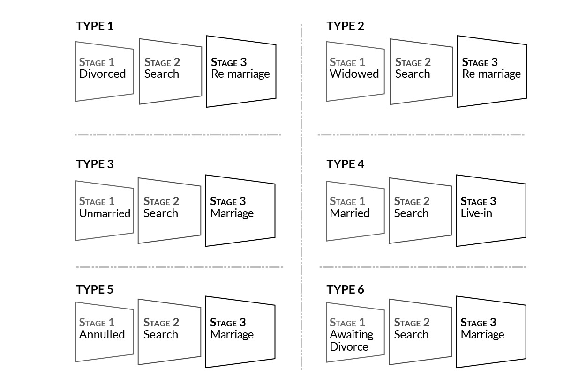
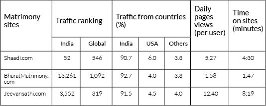
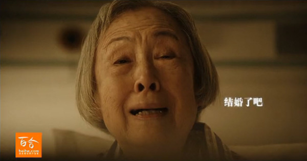
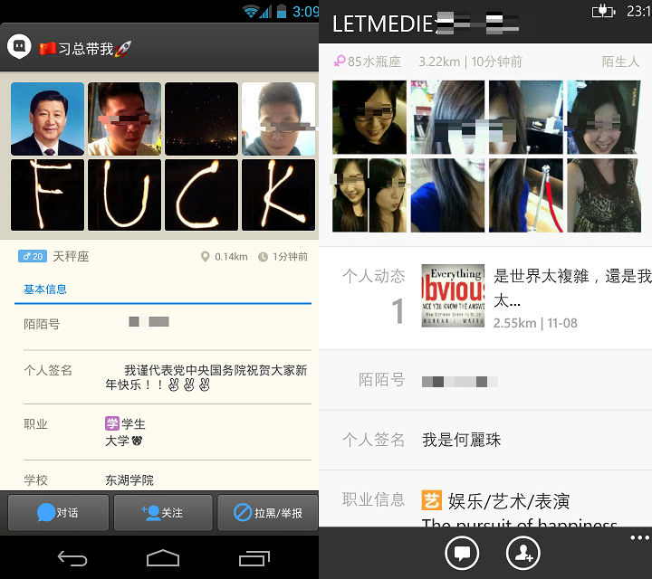

# Introduction

### I. Alev Degim and James Johnson

>*“Matchmaking and introductory intermediaries, particularly for the
purpose of facilitating marriage, have been a component of the
marriage-courtship market long before the emergence of online dating. In
addition, computers have been used for romantic matching, both
commercially and in university settings, for over 60 years.”*[^test]

This book aims to bring together articles across the world on online
dating exercises as a social, economical and political phenomenon and
define online dating as an important experience that should be
considered as a ground for research. As the Internet’s influence on
social life and behaviors increase [^2],[^3]. The virtual realm is
becoming our daily reality [^4],[^5]. So much so that dating digitally
has permeated social networking territories from the very beginning
stages. Looking at the changes and similarities between old and new
behaviors adopted online and offline, this book aims to find
commonalities and discrepancies between cultures and nations on online
dating preferences, shedding light on the influences of new media on
personal and interpersonal levels. This book aims to highlight the
importance of online dating as a site for analysis, as well as
establishing the boundaries for such research. The articles show that
online dating can be studied both qualitatively and quantitatively,
using existing methodologies as venues to understand and adopt this new
way of social engagement.

Online dating and online courtship have been prominent parts of the
daily experience of most users over the years that followed the
proliferation of Internet and Web 2.0.[^6]. Courtship is not a new
phenomenon, dating is a part of the social structure of many cultural
systems. The introduction of new technologies has changed the way we
interact with others, despite early negative stigmatization; forms of
online dating have been integrated into the social structure of various
cultural spheres fairly quickly. The anonymity aspect that had been
prevalent in the early days of blogs and forums slowly lead the way to a
shift from this dualistic representation model of a fake online self to
an overlapping of the online and real identities. This shift can visibly
be seen in the examples of online dating and courtship websites as in
the recent years companies specifically created for this purpose
required real information from their users. The way media in general
represented online dating, especially TV shows, labeled it as “unsafe”
and “sketchy”: an article on Huffington Post sheds light on the dangers
of online dating especially for women[^7], this stigma for online dating
has slowly declined in media. This portrayal of online dating produced a
stigma for the users over the years, the TV shows and other media often
labeled users as “anti-social”: according to a 2013 report from the Pew
Research Center, 21 percent of polled Internet users agree that “People
who use online dating sites are desperate.”[^8]. This type of atmosphere
however, is changing rapidly as the Social Networking Sites (that are
defined as “... web-based services that allow individuals to (1)
construct a public or semi-public profile within a bounded system, (2)
articulate a list of other users with whom they share a connection, and
(3) view and traverse their list of connections and those made by others
within the system.“) [^9] are becoming an eminent part of our daily
lives, since they provide an online social experience that is not
“dangerous”. The increase in these and other online social
experiences[^10] began to change the nature of daily interpersonal
interactions. This change has allowed the users to seek intimate
relationships online more often. “According to a recent estimate based
on ComScore Networks’ analysis of Internet users’ browsing behavior, 40
million Americans visited online dating sites in 2003, generating \$214
million in revenues, making online dating the most important
subscription-based business on the Internet.”[^11].

## Defining Online Courtship/Dating:

*Courtship* typically refers to the stage where two people interact with
one another in an effort to get to know each other romantically; this
stage typically precedes the traditional engagement and marriage stages.
Digital courtship refers to the mixed-mode relationships that begin with
online communication with the expectation of an offline romantic
encounter. We define Online Courtship, as the romantic relationships
founded on online environments - be it on Social Networking Sites (SNS)
or forums or on online dating websites, blogs, mobile apps or even the
comment section of a post on a Youtube video- that leads to an
experience of sharing intimate or romantic thoughts, ideas and emotions
via the offered features of the medium that has the potential to lead to
an offline interaction.

A typical definition for online dating would only encompass the online
dating sites and exclude all other online platforms[^12]. This type of
definition leads to a problem as it is only focusing on the websites
tailored for the purpose of online dating and excluding a vast majority
of online courtship. The previous definitions fail to acknowledge other online venues and limit the boundaries of the field for research.
Hence a broader definition is needed along with identifying the
boundaries of the specific study to insure a better perspective on
online courtship.

As we are becoming increasingly connected to the online world, social
interactions of any kind also comes into the realm with us. Online
studies in general have focused thus far on a variety of different
issues and subjects such as online bullying[^13], self-efficacy and
motivation effects in online environments[^14], YouTube studies[^15],
video spheres[^16] and alternative social media institutions[^17]. The
venue for studying online dating is fairly new to the field and previous
studies on online dating focus on topics such as self-presentation and
deception of online profiles[^18],[^19],[^20], the match-making
algorithm and process[^21], homophily on online dating sites[^22] and
profile creation[^23]. These various studies help define online
courtship as a field of research and acknowledge online courtship as an
important part of online studies.

The site of study then becomes the defining feature of the specific
research. A good and functional definition of online dating sites is
provided by Rosen et. al. as follows: “Online dating sites are all
similarly structured. Participants provide a photograph and answer an
array of questions including geographic location, age, weight or body
type, education level, income, and other relevant demographics...”[^24].
The system is dependent on statistical codes running in the background
that provide the “perfect match” for the user by looking at the
variables. As the sites rely on technology and the social context, the
experience of one user will be rather different than the other (in a
scenario where the person who uses these websites is located in a remote
place that has few participants, the odds are not in their favor and
hence the whole experience would be different from another user); as in
the examples in this volume (see Aras, Levin, Wen, DeSeta), it can have
different connotations for different cultures and contexts and hence a
fixed experience is almost impossible to achieve. In more traditional
societies, online courtship can take on the meaning of finding a partner
in marriage (China, Turkey and India are good examples of this, see
Vikram, Ozgun and Fu) whereas in other cultures it can become a place to
seek one-night stands or webcam sex or to seek company to pass time.
These different examples show the fluid nature of the experience of
online “courtship” or “dating” within the globalizing world, as the
local and global definitions amalgamate in virtual environments.

Digital intimacy has become a normative mode of social interaction
within other mediums online, such as SNS and mobile applications. Rosen
et al. gives examples of studies that have found the increase in such
online environments: an early study shows that 75% of online-formed
relationships became “proper relationships” [^25]. As online dating
becomes a prominent part of social life, it is even more crucial for
social studies to research and analyze this phenomenon.

The way we define Online Courtship helps link different parts of the
phenomenon and give a clear picture of a new approach. We establish
through the articles in this volume that the multifaceted structure of
the online dating environment enables its study with different
methodologies. However it is important to define boundaries for
research; ethical concerns should be addressed before the study is
conducted (which was done in all studies in this volume) and draw the
limits for the specific study as the lines between websites and SNS or
apps can be blurred at times.

Online dating sites may alleviate some of the spatial constraints
experienced when participating in traditional face-to-face courtship,
but contemporary scholarship interrogates the constraints of this
socio-technological space as an environment of existing beliefs and
behaviors that, at times, maintain a hetero-normative hierarchy.
Identity construction in online dating environments is impacted by
social norms offline. Within the digital dating realm self-presentation
and self-disclosure strategies are adapted to gain the attention of
potential online daters[^26]. Singles utilize online dating interfaces
with preset attributes, creating their online identity with identity
markers provided by the site. Online personal ads are user-generated
dossiers aimed to construct online daters’ identity. This scholarship
examines online dating sites as social sites where technology sustains
and reproduces existing gender roles. Recent online dating research also
highlights the limitations of gender construction and the
marginalization that occurs within hetero-normative dating spaces[^27].

Early Internet and gender identity research analyzed men and women
experimenting with the gender roles of gaming avatars[^28]. Online
daters have substituted avatars with profile pictures and personal
summaries. Internet scholars are examining gender constructions in
online spaces, more specifically within online dating environments.
Explorative research analyzes self-presentation and self-disclosure
strategies that reproduce hetero-normative hierarchies in online spaces.
Gender equality continues to be a topic of interests in many spaces
across the world. Computer-mediated-communication within the Online
dating context is another environment investigated to determine whether
or not these are safe spaces for LGBTQ online identities. Literature on
online dating has not focused on different parts of the world. Dating
practices vary from one cultural context to the next, different cultures
view romance through different religious, political, and gendered
lenses. This volume contributes to the existing body of study that
exists on online dating and expands upon the different dynamics within
the World Wide Web by asking questions of different identities and
nationalities. Previous research has not answered the following question
adequately as of yet: If online dating sites are socio-technological
spaces, what happens when the space is geared towards a particular
demographic? Who is left out? What are the social implications of these
online spaces of desire?

This volume includes different methodologies and approaches to examine
online courtship. Murat Akser looks at the history of online dating and
identifies how the research field has dealt with this phenomenon. It is
through his analysis that we see the various fields of research and the
ways they dealt with specific cases. He predicts the future of the
research field to move forward with the introduction of social
networking sites and other technology.

Gabriele de Seta and Ge Zhang’s *Stranger Stranger or Lonely Lonely?
Young Chinese and Dating Apps between the Locational, the Mobile and the
Social* is an ethnographic study about a location-based social app –
Momo, and the floating population who use it. Rather than ‘a one-night
stand mythical device’ as portrayed in media narratives, Momo users’ use
of the mobile app emanates the immobility of “strangers” in populated
metropolises. Studying apps specifically on online dating is a new
approach and is a crucial part of the discussion of the contemporary
social context of online dating.

Unlike in the West, courtship and marriage convey more social pressures
to Chinese in the dating age. Dating websites and broadcasting media
reap millions in this gold mine. Caiyun Wen’s case study of three
leading Chinese dating websites – Baihe, Jiayuan and Zhenai – brought us
to see their “secrets” of profit making with a Chinese touch. Yann L.
Chin examined how *wanglian*, or online romance, is conceptualized by
Chinese Internet users based on two key constructs: ‘Platonic emotional
love’ and ‘play’. Her categorization of online daters as pragmatist
fantasists, skeptics and romantic realists is more than a fun of
oxymoron’s but an in-depth analysis of the dichotomous and
interconnected reality and virtuality and a modern Chinese society where
materialistic prosperity and spiritual emptiness co-exist. Sheena Raja
and Bryce J. Renninger’s in-depth interviews scrutinized the interplay
of people, technology and media brought by globalization and its
influence to South Asian diasporas in the New York City metro area in
their pursuit of courtship. Computer-mediated communication remediates
matchmaking, biodata of online daters and the subjectivity of diasporas.
Amitabh Vikram Dwivedi delineated how married, divorced, unmarried,
widowed, awaiting divorce, and annulled Indians seek partners at three
online matrimonial sites – Shaadi, BharatMatrimony and Jeevansathi.
Through this lens, the dynamics between online and offline dating
activities, technology and individuals, and tradition and modernity in
Indian society is presented to us.

The ubiquitous nature of technology often blurs the lines, in some cases
completely rewrite, society’s popular social norms. This holds true in
online courtship. The emergence of online courtship has gained attention
from media as well as new sociological and behavioral studies examining
humans’ participation and practices in mixed mode relationships
(relationships that begin online with the expectation of an intimate
offline encounter). This section consists of case studies examining the
social and legal boundaries that helped shape the business of personal
ads, dating sites as doorways, Facebook as an adolescent dating scene,
and mapping dating culture within digital communities.

This volume explores digital courtship across mediums. Harry Cocks
provides a historical trajectory of mediated courtship in Western
Europe, exploring third party involvement in courtship, which is not a
modern phenomenon. Western Europe has a history of third party
involvement with courtship ranging from arranged marriages, via parents
and kin, and through professional matchmakers. Web 2.0 has turned
Internet consumers into producers by allowing users to generate content.
The Internet has created a communication culture of mutual and permanent
evaluation. Ramón Reichert discusses dating maps as a way to analyze
dating cultures as digital communities consisting of user-generated
content creating a feedback loop that results in media-specific forms of
subjectification. Looking at virtual realms as venues, Facebook is
analyzed as an Argentinian nightclub for adolescence, as Basil and Linne
examine adolescent impression management strategies when romantically
pursuing relationships via Facebook. The Internet has become a social
tool for many Internet users. Casmiro examines the influence that gender
has on self-presentation practices in Portuguese online dating profiles.
This research highlights how gender roles influence self-presentation
constructions within the Portuguese dating context. Dating practices
reveal that dating sites serve as a door to other regions. Cuba’s
Internet access is one of the lowest in Latin America, inhibiting
private use of the World Wide Web. Pino uses online dating profiles in
conjunction with interviews, analyzing the dating practices of singles
seeking singles in Cuba and Cuban singles seeking intimacy outside of
Cuba. These researchers open up and extend insight on how digital dating
practices utilize different mediums to alleviate spatial boundaries and
cultural constraints.

This section explores courtship across mediums. Harry Cocks provides a
historical trajectory of mediated courtship in Western Europe, exploring
third party involvement in courtship, which is not a modern phenomenon.
Western Europe has a history of third party involvement with courtship
ranging from arranged marriages, via parents and kin, and through
professional matchmakers. Basil and Linne examine adolescents in Buenos
Aires, Argentina use of Facebook as a venue for Internet dating.
Researchers examine adolescent impression management strategies when
romantically pursuing relationships via Facebook. Virtual Nightclub
references this social network as a venue for adolescent matchmaking.
Pino’s study explores the social implications of poor Internet access
and online dating in Cuba.
Discourse analysis is conducted on online dating profiles, in
conjunction with interviews, analyzing the dating practices of singles
seeking singles in Cuba and Cuban singles seeking intimacy outside of
Cuba. Dating practices reveal that dating sites serve as a door spaces
outside of Cuba. The corollary of this study correlates politics,
technological and financial reasons to the current formation of Cuban
online dating practices.

The Internet has become a social tool for many online users. This
chapter examines the influence that gender has on self-presentation
practices in Portuguese online dating profiles. Data is analyzed via
content analysis and grounded theory. This research highlights how modern
gender roles influence self-presentation constructions within the
Portuguese dating context.

Web 2.0 has turned Internet consumers into producers by allowing users
to generate content. The Internet has created a communication culture of
mutual and permanent evaluation. This study discusses dating maps as a
way to analyze dating cultures of digital communities. User generated
content creates a feedback loop that results in media-specific forms of
subjectification.

The tension between the global experience that the Internet provides and
the physical restrictions of one's geographical location is an
interesting asymmetry when forming online intimate relationships. David
Levin invokes the speech theory to examine the Israeli online dating
experience that he characterizes as a cultural construct that follows
the traditional paths for marriage. The local-global tension becomes
apparent with the analysis, as the particular vocabulary and language
the users adopt on these sites reveal a diasporic mode of identity
construction. Being closely tied with social norms and traditions,
societies face a shift in the experiences of identities and national,
ethnic selfhood descriptions. Aras Ozgun identifies an interesting
example of Webcam channels, where the participants can perform
erotic/sexual performances for strangers and how this relates to
national identity politics. By introducing the identity formation angle,
Ozgun draws unique features of the semi-secular culture of Turkish
identity and the male-female gender constructs that play into these
relationships. Enver Ozustun identifies a case study of the Turkish
marriage programs that became a benchmark for the online dating
experience. It is through these channels that the vocabulary of the
online dating sites are built upon in Turkey and these programs
determined what the individuals are to expect from a relationship.

Defining the self in an online environment is a crucial point in finding
a potential romantic partner on the web. Analyzing the relations of
users from an inside perspective (with ethical considerations) Megan
Lindsay explores the online dating sites by participant observation and
auto-ethnography methods. Her experiences reflect the socio-cultural
environment of OkCupid and Match.com websites. Attracting an audience,
building an image for a specific target audience and expectations from
other parties compose the major framework of her analysis.

The industry behind the online dating phenomenon is a large one. The online
dating market has become a \$2 billion industry [^29]. Pascal Lardellier
explores the political economy of dating sites in France and analyzes
the underlying structures that are at play. The commodification of love
now assisted by the computerized technology also takes away from the
intimate experience, monetizing the relationship. Also Reichert’s
analysis examines the cartographic visualizations and the underlying
structures within this system. The changing role of digital intimacy
within the market is affecting the way we perceive relationships,
especially considering that Google, Facebook and Twitter form the
largest shares in the market.

This book attempts to shed light on the online dating phenomenon through
various methodologies with an eclectic approach. If we think about the
data and analysis of the use of these websites and other platforms
employed for online dating purposes, it is easy to see that online
courtship will become an increasingly embedded social norm for
communities around the world. The philosophical, socio-political and
social network analysis (SNA) approaches to the discussion of online
courtship will enhance existing knowledge and broaden our understanding
of the subject in further studies.

## References:

Barraket, Jo, and Millsom S. Henry-Waring. ‘Getting it on (line)
Sociological perspectives on e-dating.’ *Journal of Sociology* 44.2
(2008): 149-165.

J. A. Bargh and K. Y. McKenna, ‘The Internet and social life.’ *Annu.
Rev. Psychol.*, 55, (2004): 573-590.

Bauman, Z. 'Liquid Modernity, Cambridge (Reino Unido), Polity Press,
2000; Liquid Love: On the Frailty of Human Bonds, Cambridge (Reino
Unido), Polity Press, 2003, por Jesus M. de Miguel y Jara D. Sanchez.'
*Revista Espanola De Investiagiones Sociologicas – Spanish Edition*.
(110), (2005): 239-256.

A. Beaulieu, ‘Mediating ethnography: objectivity and the making of
ethnographies of the internet.’ *Social Epistemology*, 18(2-3), (2004):
139-163.

Ellison, Nicole B. ‘Social network sites: Definition, history, and
scholarship.’ *Journal of Computer‐Mediated Communication* 13.1 (2007):
210-230.

Ellison, Nicole, Rebecca Heino, and Jennifer Gibbs. ‘Managing
impressions online: Self‐presentation processes in the online dating
environment.’ *Journal of Computer‐Mediated Communication* 11.2 (2006):
415-441.

E. J. Finkel, P. W. Eastwick, B. R. Karney, H. T. Reis and S. Sprecher,
‘Online Dating A Critical Analysis From the Perspective of Psychological
Science.’ *Psychological Science in the Public Interest*, 13(1), (2012):
3-66.

Fiore, Andrew T., and Judith S. Donath. ‘Homophily in online dating:
when do you like someone like yourself?.’ *CHI'05 Extended Abstracts on
Human Factors in Computing Systems*. ACM, 2005.

Lovink, Geert, and Sabine Niederer. *Video vortex reader: Responses to
YouTube*. Amsterdam: Institute of Network Cultures, 2008.

Lovink, Geert, and Miriam Rasch. Unlike us reader: social media
monopolies and their alternatives. No. 8. *Institute of Network Cultures*,
2013.

J. A. Hall, N. Park, H. Song and M. J. Cody, ‘Strategic
misrepresentation in online dating: The effects of gender,
self-monitoring, and personality traits.’ Journal of Social and Personal
Relationships, 27(1), (2010): 117-135.J. T. Hancock and C. L. Toma,
‘Putting your best face forward: The accuracy of online dating
photographs.’ *Journal of Communication*, 59(2), (2009): 367-386.

Hancock, Jeffrey T., Catalina Toma, and Nicole Ellison. ‘The truth about
lying in online dating profiles.’ *Proceedings of the SIGCHI conference
on Human factors in computing systems*. ACM, 2007.

G. J. Hitsch, A. Hortaçsu and D. Ariely, ‘What makes you click: An
empirical analysis of online dating.’ 2005 Meeting Papers (Vol. 207).
*Society for Economic Dynamics*. (2005).

Hitsch, Günter J., Ali Hortaçsu, and Dan Ariely. ‘Matching and sorting
in online dating.’ *The American Economic Review* (2010): 130-163.

C. L. Hsu, and J. C. C. Lin, ‘Acceptance of blog usage: The roles of
technology acceptance, social influence and knowledge sharing
motivation.’ *Information & Management*, 45(1), (2008): 65-74.

Irizarry, Robert. ‘Self-efficacy and motivation effects on online
psychology student retention.’ *Usdla Journal* 16.12 (2002): 55-64.

Juvonen, Jaana, and Elisheva F. Gross. ‘Extending the school
grounds?—Bullying experiences in cyberspace.’ *Journal of School health*
78.9 (2008): 496-505.

L. D. Rosen, N. A. Cheever, C. Cummings and J. Felt, ‘The impact of
emotionality and self-disclosure on online dating versus traditional
dating.’ *Computers in Human Behavior*, 24(5), (2008): 2124-2157.

Jessica M. Sautter, Rebecca M. Tippett and S. Philip Morgan. ‘The Social
Demography of Internet Dating in the United States.’ *Social Science
Quarterly* 91.2 (2010): 554-575.

A. Vasalou and A. N. Joinson, ‘Me, myself and I: The role of
interactional context on self-presentation through avatars.’ *Computers
in Human Behavior*, 25(2), (2009): 510-520.

Treske, Andreas. *The inner life of video sphere*. Amsterdam: Institute of Network
Cultures. 2013.

Toma, Catalina L., Jeffrey T. Hancock, and Nicole B. Ellison.
‘Separating fact from fiction: An examination of deceptive
self-presentation in online dating profiles.’ *Personality and Social
Psychology Bulletin* 34.8 (2008): 1023-1036.

S. Woolgar, (Ed.). *Virtual Society?: Technology, Cyberhole, Reality*.
Oxford: Oxford University Press. 2002.

Huffington Post. <http://www.huffingtonpost.com/damona-hoffman/mary-kay-beckman-online-dating_b_2561380.html>.

The Independent. <http://www.independent.co.uk/life-style/gadgets-and-tech/news/daily-internet-use-has-more-than-doubled-in-past-seven-years-8752987.html>.

The Fiscal Times. <http://www.thefiscaltimes.com/Articles/2014/02/14/Valentines-Day-2014-How-Online-Dating-Became-2-Billion-Industry>.

The Gazette. <http://thegazette.com/2014/03/16/online-dating-still-stigmatized-despite-popularity-sucess/>.

[^test]: E. J. Finkel, P. W. Eastwick, B. R. Karney, H. T. Reis and S.
    Sprecher, ‘Online Dating A Critical Analysis From the Perspective of
    Psychological Science.’ *Psychological Science in the Public
    Interest*, 13(1), (2012): 3-66.

[^2]: J. A. Bargh and K. Y. McKenna, ‘The Internet and social life.’
    *Annu. Rev. Psychol.*, 55, (2004): 573-590.

[^3]: C. L. Hsu, and J. C. C. Lin, ‘Acceptance of blog usage: The roles
    of technology acceptance, social influence and knowledge sharing
    motivation.’ *Information & Management*, 45(1), (2008): 65-74.

[^4]: S. Woolgar, (Ed.). Virtual Society?: Technology, Cyberhole,
    Reality. *Oxford University Press*. 2002.

[^5]: A. Beaulieu, ‘Mediating ethnography: objectivity and the making of
    ethnographies of the internet.’ *Social Epistemology*, 18(2-3),
    (2004): 139-163.

[^6]: Jessica M. Sautter, Rebecca M. Tippett and S. Philip Morgan. ‘The
    Social Demography of Internet Dating in the United States.’ *Social
    Science Quarterly* 91.2 (2010): 554-575.

[^7]: Huffington Post. [http://www.huffingtonpost.com/damona-hoffman/mary-kay-beckman-online-dating\\\_b\\\_2561380.html](http://www.huffingtonpost.com/damona-hoffman/mary-kay-beckman-online-dating\_b\_2561380.html).

[^8]: The Gazette. <http://thegazette.com/2014/03/16/online-dating-still-stigmatized-despite-popularity-sucess/>

[^9]: N. B. Ellison, ‘Social network sites: Definition, history, and
    scholarship.’ *Journal of Computer Mediated Communication*, 13(1),
    (2007): 210-230.

[^10]: The Independent. <http://www.independent.co.uk/life-style/gadgets-and-tech/news/daily-internet-use-has-more-than-doubled-in-past-seven-years-8752987.html>.

[^11]: G. J. Hitsch, A. Hortaçsu and D. Ariely, ‘What makes you click:
    An empirical analysis of online dating.’ 2005 Meeting Papers (Vol.
    207). *Society for Economic Dynamics*. (2005).

[^12]: It is defined functionally as “a purposeful form of meeting new
    people through specifically designed Internet sites,” Barraket, Jo,
    and Millsom S. Henry-Waring. ‘Getting it on (line) Sociological
    perspectives on e-dating.’ *Journal of Sociology* 44.2 (2008):
    149-165.

[^13]: Juvonen, Jaana, and Elisheva F. Gross. ‘Extending the school
    grounds?—Bullying experiences in cyberspace.’ *Journal of School
    Health* 78.9 (2008): 496-505.

[^14]: Irizarry, Robert. ‘Self-efficacy and motivation effects on online
    psychology student retention.’ *Usdla Journal* 16.12 (2002): 55-64.

[^15]: Lovink, Geert, and Sabine Niederer. *Video vortex reader:
    Responses to YouTube*. Amsterdam: Institute of Network Cultures,
    2008.

[^16]: Treske, Andreas. The inner life of video sphere. *Institute of
    Network Cultures*. 2013.

[^17]: Lovink, Geert, and Miriam Rasch. Unlike us reader: social media
    monopolies and their alternatives. No. 8. *Institute of Network
    Cultures*, 2013.

[^18]: Ellison, Nicole, Rebecca Heino, and Jennifer Gibbs. ‘Managing
    impressions online: Self‐presentation processes in the online dating
    environment.’ *Journal of Computer‐Mediated Communication* 11.2
    (2006): 415-441.

[^19]: Toma, Catalina L., Jeffrey T. Hancock, and Nicole B. Ellison.
    ‘Separating fact from fiction: An examination of deceptive
    self-presentation in online dating profiles.’ *Personality and
    Social Psychology Bulletin* 34.8 (2008): 1023-1036.

[^20]: Hancock, Jeffrey T., Catalina Toma, and Nicole Ellison. ‘The
    truth about lying in online dating profiles.’ *Proceedings of the
    SIGCHI conference on Human factors in computing systems*. ACM, 2007.

[^21]: Hitsch, Günter J., Ali Hortaçsu, and Dan Ariely. ‘Matching and
    sorting in online dating.’ *The American Economic Review* (2010):
    130-163.

[^22]: Fiore, Andrew T., and Judith S. Donath. ‘Homophily in online
    dating: when do you like someone like yourself?.’ *CHI'05 Extended
    Abstracts on Human Factors in Computing Systems*. ACM, 2005.

[^23]: Fiore, Andrew T., and Judith S. Donath. ‘Homophily in online
    dating: when do you like someone like yourself?.’ *CHI'05 Extended
    Abstracts on Human Factors in Computing Systems*. ACM, 2005.

[^24]: L. D. Rosen, N. A. Cheever, C. Cummings and J. Felt, ‘The impact
    of emotionality and self-disclosure on online dating versus
    traditional dating.’ *Computers in Human Behavior*, 24(5), (2008):
    2124-2157.

[^25]: Ibid. p. 2124-2157.

[^26]: J. T. Hancock and C. L. Toma, ‘Putting your best face forward:
    The accuracy of online dating photographs.’ *Journal of
    Communication*, 59(2), (2009): 367-386.

[^27]: J. A. Hall, N. Park, H. Song and M. J. Cody, ‘Strategic
    misrepresentation in online dating: The effects of gender,
    self-monitoring, and personality traits.’ *Journal of Social and
    Personal Relationships*, 27(1), (2010): 117-135.

[^28]: A. Vasalou and A. N. Joinson, ‘Me, myself and I: The role of
    interactional context on self-presentation through avatars.’
    *Computers in Human Behavior*, 25(2), (2009): 510-520.

[^29]: S. Yoder, How Online Dating Became a $2 Billion Industry, Fiscal Times, 2014. <http://www.thefiscaltimes.com/Articles/2014/02/14/Valentines-Day-2014-How-Online-Dating-Became-2-Billion-Industry>.

# The Pre-History of Print and Online Dating, c. 1690-1990

### H. G Cocks

It is often argued that the rise of online dating reflects the
increasing dominance of economic liberalism in western societies. This
is said to extend even into the personal sphere where modern courtship
is epitomised by the dating website which turns its customers into
self-marketing managers of their own emotional capital. In that sense
online dating is seen to represent a particular social constituency –
the urban, late-marrying type, perhaps a member of the new white-collar
“precariat” working in professional employment on short-term contracts,
settling down much later, and as a result on the dating market for a
correspondingly longer period.

Whatever the rights and wrongs of that argument, changing patterns of
courtship (and the rise of print and later digital media to arrange it)
do reflect changes in the organisation of marriage, employment and the
relationship of self and society. Although a successful market of this
kind requires a free press and thriving print culture, in historical
terms advertising for love has become popular in conjunction with three
things: first, a mostly urban population of insecure workers seeking to
break away from established courtship patterns; secondly, the idea of
marriage as a contract freely entered into by contracting parties, and
thirdly, some kind of announced “crisis” in marriage or romantic
intimacy. The latter is normally discovered by more conservative voices,
is often part of an attack on the contractual idea, and tends to see
“modern marriage” (or partnership) as an unromantic and mercenary
transaction.

Arranging courtship or marriage via a third party is not especially
modern. Many peasant or pre-industrial societies outside Western Europe
practiced systems of arranged marriage – either via parents and close
kin, or through the offices of a professional matchmaker and still do.
In societies where production is based on the home, arranged or brokered
marriages result from the importance of the marital couple as an
economic unit, and their significance to local economic relations
involving wider kin groups. The intervention of parents and community in
the process of courtship reflected the effort to ensure that property
would be transferred legitimately and that the new household would be
able to make an effective and sustainable contribution to the economic
life of the community. In the past historians have argued that the decay
of this communal model and its replacement by one in which courtship was
almost wholly determined by the wishes of the parties concerned
reflected the emergence of free labour and capitalism. While the former
model is characterised by the intervention of parents, kin and
community, the latter is said to have been marked by the rise of
romantic love, the personal choice of partners free from parental
interference, and the establishment of a separate marital household.
This transition, from the “arranged” system that belonged more to what
is known as the “stem family” defined by broad kinship among a wide
group of relatives, to one in which romantic love and free choice of
partners is allowed has been seen as a significant moment of transition
in Western history. Most famously, Lawrence Stone argued that the
emphasis on the self and its wants over and above the needs of kinship,
alliance, or economy, beginning in the late sixteenth century,
highlighted the gradual rise of affective individualism, the decay of
communality, and hence the coming of modernity. Critics of Stone were
quick to point out that even in late-medieval texts, especially legal
codes, individual choice and romantic love could be found as an element
of marriage among all classes, and hence had to predate Stone’s
chronology. Jack Goody and Alan Macfarlane see this individualistic
model not as the creation of modernity, but of late-medieval Europe
going back as far as the late thirteenth century. For them, the fact
that canon law in medieval Europe defined marriage as an agreement of
mutual consent between the parties concerned meant that the narrow
conjugal family based on the couple, in which romantic love and not
material interest is the prime motivation, was the norm in Western
European history. [^2_Cocks_Pre-History_1]

In that sense, Stone’s critics have discounted any evidence of
intermediaries, arrangements and closely-calculated marriage settlements
that might reflect communal interest in or control over the conjugal
couple as the exception rather than the rule. However, more recent work
on northern Europe has pointed out that freedoms asserted (or legally
codified) and freedoms practised are two different things and that in
reality, most couples even in the West European marriage system had to
deal with parental and community pressures. Actual courtship was a much
more complex affair than the desiccated calculations of
rationally-choosing subjects. Moreover, community interest was often at
stake, and intermediaries were employed, even if their roles were not
formalised or professional. As Diana O’Hara has pointed out,
sixteenth-century Britain was not unfamiliar with brokers, “utterers,”
“medlers” and “matrimonial bawds” who intervened in the process of
courtship, not to mention the many aristocrats anxious over the
destination of their estates. For instance, in 1664 it was said of the
Duchess of Newcastle that “women do fee her to get them husbands, and
men to get them rich wives, so as she is become the huckster, or broker
of males and females…indeed she is a matrimonial bawd.”[^2_Cocks_Pre-History_2] That the
influence of these third parties on the marriage bargain was more or
less informal did not make it less important.

In northern Europe at least, the older model of communally-organised
marriage gradually gave way from the late sixteenth century onwards. In
these areas couples were expected to establish a separate household and
so in order to marry they required access to property or an artisanal
trade that would support them. However, by 1600 or so it was
increasingly difficult to ensure that new couples could support
themselves in this way, and a new category of “masterless men” or
wage-earners began to emerge. John Gillis calculates that by 1600 around
one third of the population no longer had access to land or trades, and
that as a result they became increasingly detached from traditional
customs and institutions and more willing to indulge in “private
spousals.”[^2_Cocks_Pre-History_3] By the early eighteenth century, Gillis calculates,
perhaps one-third of marriages were outside the purview of communal
custom. This process went hand in hand with the rise of Puritanism,
which tended to narrow the courtship process to one that focussed
primarily on the family and not the wider community. Two marriage
practices reflected these changes: first, the custom of marriage by
licence, in which the couple could (if they could afford it) pay the
local bishop to marry them without publishing the banns and therefore
attracting the interest of parents and others; and secondly, clandestine
marriages conducted in mostly urban locales known as “liberties” in
which ecclesiastical authority did not apply.

This is the historical background against which we should see the rise
of advertising for husbands and wives. Although the involvement of third
parties in courtship did not necessarily mean that families or
communities were not involved in the process, in general, we might take
the development of advertising to reflect the rise of “private spousals”
free from familial or community pressure. Advertising of this kind
emerged in the 1680s or 1690s, about forty years after the appearance of
the first newspapers. Most of these early newspapers contained small
announcements about events, crimes or incidents. One of the first
references to matrimonial advertising was from the British weekly *The
Athenian Mercury*, which in 1692 responded to a series of questions
about marriage and love with a comment on the practice.[^2_Cocks_Pre-History_4] By the
mid-eighteenth century advertising for husbands, wives, and other less
conventional arrangements had a secure foothold in British print
culture.

Until the early twentieth century, the matrimonial advertisement
dominated the market. Stating an intent to marry was seen to provide at
least some guarantee of respectability. However, other less conventional
arrangements were also common in the 18th century, for instance, the
gentleman who in 1768 expressed a desire to meet a “young lady dressed
in a black nightgown, with a letter in her hand” whom he had followed
about the City the previous Friday. Others seemed to be advertising
openly for mistresses, such as the “Gentleman of independent fortune, in
possession, and very considerable expectations” who in 1770 announced an
intention to make a tour through France and Italy. He thought it would
be “a particular happiness could he meet with an agreeable young lady,
whose education and sentiments would engage his esteem and affections,
to accompany him on his travels.” Other men advertised for single women
to board with them possibly as a way of making an informal marriage.
Financial arrangements very much like prostitution were sometimes
offered by women advertisers. One 1769 ad, to “any real *gentleman*,
from a *lady* of character,” promised that in exchange for £100, a man
could have “an advantage, which cannot be named in a public newspaper.”
Another who was “at present so critically circumstanced as to want the
immediate friendship and assistance of a gentleman of honour and
benevolence,” offered in return to “render essential services.”[^2_Cocks_Pre-History_5]

While individual advertisements began to be common in a wide variety of
different papers, organised matrimonial agencies were also a feature of
eighteenth century society. One such agency, which presented itself as
the solution to the difficulties of modern marriage, was the
Imprejudicate Nuptial Society, or the Grand Matrimonial Intercourse
Institution, probably established in the mid-century. This organisation,
run by a clergyman from an address in the City of London, presented
itself as a philanthropic society which would enable more people to
marry, thereby saving British morals and preventing the increase of
“vagabond children.” The Rev. Watson, the proprietor, proposed to
recruit clergymen in every town who would give sermons on the benefits
of marriage, thereby collecting money which would be placed in a
communal fund for those who could not afford marriage expenses. There
would also be list of subscribers, divided into three classes according
to income and property, the estimation of which was at the heart of the
enterprise. Advertisers with the agency, such as the “Gentleman, 40 yrs
of age…a little corpulent, rather of a dark complexion, wears his own
hair,” were compelled to be honest about their status. He estimated his
wealth at £200 per annum, with £750 in the public funds, and “a small
Estate in Surry.” This method of proceeding, Rev Watson proclaimed,
avoided “the common way” which was for men to fall in love, “and then
disgracefully retreat, if there is not money enough.” In his scheme, as
in most other matrimonial ads of this period, “the circumstances are
first known, and nothing to prevent sincere love afterwards.”[^2_Cocks_Pre-History_6]

Allegations of fraud, which were to dog the matrimonial business for the
rest of its days, quickly followed the rise of formal marriage brokers.
In the early 1770s, a Mr R was supposed to have made a huge fortune in
London by acting as an agent for young, rich women looking to marry.
Every spring, he would place a series of ads in the press, offering to
arrange marriages for ladies with fortunes of £30,000. These wealthy
women would be installed at his house, while he again advertised for
potential suitors, who, it was said, paid him as much as £500 for the
privilege of paying court to his clients. He was then supposed to have
“touched several five hundreds without the candidates for matrimony
being successful,” and kept everybody dangling on a string while he
pocketed the proceeds.[^2_Cocks_Pre-History_7] However, rumours like this did not dent the
popularity of the medium, and by 1777, a young lady could aver that “the
mode of advertising is become too general.” However, she herself was not
deterred from seeking “a man of fashion, honour, and sentiment, blended
with good nature, and a noble spirit, such a one she would chuse for her
guardian and protector.”[^2_Cocks_Pre-History_8]

The feeling expressed by one advertiser in 1749 that “the mode of
advertising… may be looked upon with disdain and contempt by some,” was
not mitigated by its association with some unsavoury episodes.[^2_Cocks_Pre-History_9]
Suspicions about the type of man who might advertise were compounded by
one of the most famous crimes in British history, the murder of Maria
Marten by her sweetheart William Corder at the infamous Red Barn in the
village of Polstead in Suffolk in 1827. Part of the sensation that
surrounded the trial of Corder in 1828 was the revelation that he had
been a regular user of matrimonial columns. In that sense, the case
offers a rare glimpse into the style of advertising in this period. In
the winter of 1827, fleeing his crime which was still undetected, Corder
moved to a tavern in the City of London, from where he took out ads in
the *Morning Herald* and *Sunday Times*. His announcement, headed
“MATRIMONY,” described him as a “A Private Gentleman, aged 25, entirely
independent,” seeking “any female of respectability, who would study for
domestic comfort,” and who was willing “to confide her future happiness
in one every way qualified to render the marriage state desirable.” He
was, the ad said, a “sociable, tender, kind, and sympathising
companion,” and instructed correspondents to write to Mr Foster’s
stationer’s shop in the City, from where he would collect the letters.
More than fifty replies came in from women mostly in their late teens
and early twenties, and still more women came to Foster’s shop – later
luridly described in the press as a “*Love Depot*” – to inquire after
the advertiser’s character. The means of getting to know advertisers
like Corder varied widely. Some respondents offered to pair him with
their sisters, others did not want to meet him but preferred to get to
know him first by an extended correspondence, and some wanted to arrange
an interview at their homes. One reply instructed Corder to take a walk
on the south side of Northampton Square in the City of London, between
the hours of 12 and 1 on the following Monday, and to carry a white
pocket-handkerchief. “I shall be there and may perhaps have an interview
with you,” the writer promised.

Corder eventually made the acquaintance of one Mary Moore and, with his
past still completely unknown, offered the promise of marriage. Ms
Moore’s mother was set against such a proceeding, mainly because the
anonymity of the ad did not allow them to know or investigate Corder’s
family connections. Her brother was also suspicious of this man who had
appeared apparently from nowhere, and angrily denounced the whole
business. However, as Miss Moore pointed out to him, the matrimonial ad
was for financially independent individuals like herself who did not
have to put up with the interference of their families. Most of Corder’s
respondents were the same – they were young women who were distanced
from parental interference, either through the death of parents or
relatives, or through their own financial independence. Miss Moore, who
had inherited some of her father’s wealth, was one of many such women.
She told her brother “that she was fully satisfied in her own mind,”
about Corder’s connections, “and urged that as she was her own mistress,
she should use her own discretion, and in defiance of anything her
brother might urge to the contrary, she should marry him on the
morrow.”[^2_Cocks_Pre-History_10] She carried out her threat, and she and Corder moved to
Ealing in West London to open a girls’ boarding school, living in what
appeared to be marital bliss right up the moment when her husband was
arrested in the spring of 1828 for the murder of Maria Marten.

Most observers agreed that Corder’s career after the murder showed him
to be the exact epitome of a “cool, calculating, deliberate villain.”
One of the key lessons of the tale, played out in the countless shows,
songs and plays which followed the trial and played continuously
throughout the following century, was never to trust a man who
advertised for a wife. Mainly, though, it was suggested that the case
should act as a warning against the kind of independence shown by Mary
Moore.[^2_Cocks_Pre-History_11]

Cases like these may have put off respectable middle class readers and
helped to confine the appeal of matrimonial advertisements to the
working class. When a new craze for it reappeared in the new penny press
of London in the 1860s, in titles like the *London Journal*, *Family
Herald* or the *Halfpenny Paper*, it was certainly felt by most editors
that the practice belonged almost wholly to the less educated working
classes. However, although it was regarded as far from respectable, by
1900 the matrimonial press in Britain at least had developed into a
particular form of journalism. This was in marked contrast to the
European continent, where most mainstream newspapers like the
*Frankfurter Zeitung* included extensive sections of matrimonial
advertising as a means of financing their news coverage.[^2_Cocks_Pre-History_12] In
Britain, respectable papers like the *Times* or *Morning Chronicle*
refused to carry matrimonial ads, thereby encouraging the development of
a specialist press devoted solely to publishing them.

As a consequence of this ban a specialised matrimonial press began to
flourish in late-nineteenth century Britain. The British Library lists
twenty-two matrimonial papers established between 1870 and 1914, while
several other titles also contained matrimonial columns around this
time. Most of the dedicated matrimonial press was allied to a related
agency where advertisers could obtain the personal services of a
matrimonial agent.[^2_Cocks_Pre-History_13] Of these titles some were more long-lived than
others. Among them were the *Matrimonial News and Special Advertiser*
which claimed to date from 1848 (though wound up in 1895), the
*Internationale Matrimonial Gazette* of Sheffield, which in various
guises ran from 1909 to 1944, and the most venerable of the British
papers, the *Matrimonial Post and Fashionable Marriage Advertiser*,
published in Bristol, which claimed lineage from 1860 and was run by the
same man – R. Charlesworth – between 1894 and 1948. Some other titles
appear to have lasted only a few months. Most of the papers were based
in London, though several existed in provincial cities. The larger
papers carried between 200 and 600 ads, though several of these would
have been reinsertions over several issues. In addition to this
dedicated press, there were many others, ranging from W. T. Stead’s high
class matrimonial monthly the *Round About* (1898-1903), to the comic
paper *Ally Sloper’s Half Holiday*, or the fiction series *My Pocket
Novels* (1900-1934) that carried matrimonial ads or operated agencies by
post at various times in the same period.

These papers appealed to, and were mainly used, by two main social
groups: white collar workers such as clerks, and the upper working class
– tradesmen and domestic servants. Advertising rates were generally kept
low – in the 1890s matrimonial papers cost around 3d, while advertising
costs were around 1 shilling for between 20 and 50 words, depending on
the paper. Personal interviews with the editor/agent cost around 5
shillings. Further costs could be incurred on marriage. In 1893, for
instance, one advertiser was asked for £10 up front and then two and a
half per cent of any marriage settlement.[^2_Cocks_Pre-History_14]

These practices were revealed by the trial of the Skates brothers,
proprietors of the World’s Great Marriage Association (and the
*Matrimonial Herald*) in 1895. The case resulted from the fact that in
order to keep unsuccessful (and unappealing) male suitors on their books
they had sent out form letters to a few advertisers from ladies that did
not exist. The agency profited mainly from its personal services, for
instance, charging some clients between £2 and £17 for such assistance
in the marriage market, including personal interviews, advice and
introductions. The trial also revealed the social constituency of
matrimonial papers and agencies at this time. Its male clients were
mainly shopkeepers and skilled workers, such as tobacconists, tailors,
hairdressers, decorators, printers and other “well to do artisans,”
while its female ones were mostly domestic servants and some widows with
capital.[^2_Cocks_Pre-History_15]

It was widely held at the time that the matrimonial press provided a
useful service to the generally impoverished white collar worker, who,
uncertain of his income and status, could find respectability helpfully
quantified by the requirement of most papers for the advertiser to state
his or her income. Matrimonial ads were also seen as a response to the
“surplus woman” problem that emerged from a gender imbalance in
Britain’s population from the 1860s onwards. Another factor that
assisted the rise of the matrimonial press was the increasingly popular
idea of marriage as a type of negotiable contract. This view had emerged
in the mid-nineteenth century in Britain as part of the attempt to
reform the laws governing divorce and married women’s right to property.
By the end of the century marriage-as-contract had a number of powerful
feminist advocates including the writers Mona Caird and Cicely Hamilton,
the latter the author of the 1909 protest against *Marriage as a Trade*.
The contractual idea appealed to feminists as it seemed to allow women
to circumvent the suffocating restrictions of class, custom and family
that dictated who and how a woman should marry. It also appeared to
undermine the idea of patriarchal authority within marriage by
suggesting that both parties met on the basis of equality. These ideas
were accompanied by a widespread feeling that modern love had
degenerated into a merely pragmatic and often monetary relation.

Caird had become famous in 1888 when an article by her in the London
*Daily Telegraph* entitled “Is Marriage a Failure?” caused a national
sensation. In the years following, Caird promoted the idea that marriage
should evolve from primitive practices towards contractual agreement.
She argued that science, and especially Charles Darwin, had shown that
marriage had begun in savage practices like wife-capture, and the
problem was that it continued in much the same coercive form. To break
away from the “barbaric” elements of marital coercion, men and women
should, Caird argued, “*form their own contract*, and not be forced to
accept one whose terms they have had no voice in deciding.”[^2_Cocks_Pre-History_16] The
problem then was how to invent a place where such contractual ideas
could be put into practice. For an answer many progressive thinkers
turned to the matrimonial advertisement and agency. Advocates of
eugenically-influenced “rational reproduction” adopted it as a way round
the “dsygenic” courtship practices associated with the rituals of
respectability that prevented healthy men and women marrying across
class boundaries, while others, such as the pioneering editor W. T.
Stead established their own version of a social network. Stead’s idea,
which ran from 1898 to 1903, was called the Round-About, and was
modelled on a matrimonial agency but with the important difference that
clients did not have to state a “matrimonial intention,” and could
therefore interact without the anxiety thereby imposed. Men and women
would see their ads in the Round-About newspaper, and then write to each
other via a central office of the “Controller” where profiles of
themselves were also kept. If the profile took your fancy, a
correspondence would follow and if so inclined, marriage might result.
This, Stead argued, was a key solution to the problem of modern urban
alienation that especially afflicted the young white collar or
professional worker living in what he called “the City of Dreadful
Solitude.” Others also took up the matrimonial bureau as a philanthropic
idea and rational solution to modern problems, including the founder of
the Salvation Army, William Booth. He envisaged a “colony scheme” – a
gigantic programme for exporting Britain’s urban poor to Canada and
Australia, part of which would be a matrimonial agency ensuring that
healthy marriages were made.[^2_Cocks_Pre-History_17]

Even though all these efforts gained national attention, they were never
as commercially successful as the established matrimonial industry.
However, in 1913 a new form of advertising appeared on the British scene
in the literary periodical *T. P.’s Weekly*, named after its founder the
Irish politician Thomas Power O’Connor. In its “Friends in Council”
column, *T. P.’s Weekly* allowed advertisers to solve the problem of
modern solitude by searching for friends and “companions,” without
stating any matrimonial intent. The respectability of the column was –
at first at least – protected by the fact that all those seeking such
friends had to provide two letters of reference, one of which had to be
provided by a clergyman. Similarly, suggestive self-descriptions such as
“unconventional” or “bohemian” were banned. By 1915 Friends in Council
had processed over 8,000 ads at a rate of five to six hundred a week and
had started a national trend.

The origins of lonely hearts ads, as opposed to matrimonial ones, can be
found here, and also in the craze for advertising that sprung up during
World War One to cater for servicemen. From the outbreak of the war in
1914 it became something of a national duty to write to those serving in
the armed forces and several newspapers in Britain opened schemes that
organised the sending of parcels and care packages to the various
theatres of the war. In France this sort of correspondence was
officially sponsored, and French women could become “*marraines de
guerre*” (godmothers of war) in order to exchange letters with
*filleuls* (adopted sons) in need of epistolary companionship. In
Britain, this form of letter-writing operated in a less formal sense
through the columns of papers like *T. P.’s Weekly* and other
periodicals where “lonely soldiers” and their admirers of both sexes
could advertise for pen-pals or other types of companionship. The volume
of this correspondence could be readily estimated from the complaints
made by the British Army’s postal service about its size and potential
for disrupting military logistics. In February 1915 it was pointed out
that one ad, which ran for a few issues of the *Daily Chronicle*, and
had been placed by a driver in the artillery, had generated three sacks
of mail, one containing 3,000 letters, plus 98 parcels.[^2_Cocks_Pre-History_18] The lonely
soldier craze reached a peak in the summer of 1916 when the newspaper
*Pearson’s Weekly* ran a competition for servicemen, the prize for which
was a chance to woo the soldiers’ pin-up and theatre star Phyllis
Monkman. By that time though, the authorities had lost their patience
and after a while they forced the paper to abandon the scheme.[^2_Cocks_Pre-History_19]

The success of the lonely soldier movement encouraged others to enter
the wartime market, not least the *Link*, the first periodical in
Britain wholly devoted to the publication of “companionship” ads. The
*Link* (which was originally given the more enticing name *Cupid’s
Messenger*) was founded in 1915 by the career journalist and comic
novelist Alfred Barrett (a former editor of the *Family Circle* and
*Woman’s World*), and its masthead firmly stated that it was a “Great
Social Medium – Not Matrimonial.” The *Link* cost 8d, though advertising
was only 1d per word, and it sold around 5-6,000 per issue. However,
along with the contemporaneous lonely soldier movement and the other
papers such as the racy bachelor periodical *London Life*, which were
also opening their own “friendship” columns, the *Link* seemed to
represent to many commentators the leading edge of modernity, bad and
good. Before long, the *Link’s* announced non-matrimonial intent, not to
mention its clientele of “sporty” and “unconventional” female
advertisers, began to attract the attention of moral campaigners and the
police, who tended to view it as morally dangerous, if not a medium for
open prostitution. Stories of girls disappearing into white slavery
through its columns began to circulate in the more sensational
newspapers, and the police began to take a keener interest. Although
they discovered very little evidence of prostitution by women, the
authorities did uncover a series of ads that appeared to be arranging
contacts between gay men, and which were therefore more obviously
illegal. In their ads, these men commonly cited a canon of homosexual
heroes, from Hercules and Iolaus to Walt Whitman and Oscar Wilde,
declared themselves “theatrical,” “musical,” and “sincere,” before
announcing a willingness to meet a potential friend or chum, “own sex.”
In 1921, a police investigation of these ads, and a discovery of a cache
of intimate letters between two men who had met through the *Link*,
landed the paper, its proprietor Alfred Barrett, and three advertisers
in court. They were all charged with procuring and inciting “acts of
gross indecency” and all sentenced to two years imprisonment with hard
labour.

That episode put an end to the wartime craze for companions and friends,
and seemed to confirm once again the low reputation of such enterprises.
However, the matrimonial industry, which had generally held itself aloof
from the fashion for companionship, continued unperturbed through the
interwar period, though it was still associated with an unfashionable
lower-middle and working class clientele. The *Link* case contributed to
an atmosphere of distrust that prevented any more “lonely hearts” or
companionship ads appearing in the legitimate matrimonial press. Other
papers that had followed the *Link* and *T. P.’s Weekly* into the trend
dropped their columns after the trial. After 1921 the requirement to
state a matrimonial intent was restored to its dominance and it was not
really until the 1960s that the dubious status of the lonely hearts ad
ended. Correspondence clubs such as the longest-lasting one, the
Universal (established in 1916 and still in existence in the 1940s)
continued to exist, and others grew up at the end of World War Two to
cater for a newly-perceived epidemic of solitude and a short-lived
post-war boom in divorce (that peaked in 1948 and soon fell away to
almost nothing in the 1950s). However, these “friendship” organisations,
such as the Victory Correspondence Club or the Two-Ways Correspondence
Club, remained on a small scale and most were run by an odd collection
of ex-military men from their homes in provincial towns and seaside
resorts.[^2_Cocks_Pre-History_20] Marriage bureaux also enjoyed a new vogue in this climate,
some of which began to use psychological and psychoanalytical profiles
in order to match people.[^2_Cocks_Pre-History_21] Responding to the apparent crisis in
marriage that seemed to overcome British society in the 1940s, some
observers even argued that such organisations should be a
state-sponsored element of the new welfare state which grew up under the
post-war Labour government.

Even in the 1960s, when the matrimonial industry had produced new
“scientific” offshoots such as Dateline, founded in 1966 to match
partners using computer analysis, the authorities still suspected the
intentions of many advertisers and editors. This became obvious as part
of the backlash against the counterculture at the end of the 1960s when
the police repeatedly attempted to prosecute the hippy paper
*International Times* (more often known as *IT*) for “corrupting public
morals,” one of the crimes supposedly perpetrated by the *Link* in 1921.
This charge was a sort of legal catch-all usually directed against the
organisation of prostitution through advertising or publicity of various
kinds – it had also been used in 1960 against a list of call-girl
contacts known as the *Ladies’ Directory*. *IT* got into trouble for the
same reason as the *Link*: publishing gay contact ads. Even though
homosexuality between men was decriminalised in Britain in 1967 (as long
as it remained in private and only two people over 21 were present), the
police decided in 1969 that *IT* should be prosecuted and a
long-drawn-out series of trials and appeals began that lasted until the
paper was finally convicted in 1972. The whole process was part of a
pattern of prosecutions against countercultural magazines for obscenity
– the most famous being the case against *Oz* magazine in 1971, which
resulted in long prison terms (overturned on appeal) for its editors.

The *IT* trial ended up making the efforts of the police look rather
ridiculous however. Their attempts to clamp down on ads that sought to
facilitate a wholly legal activity (gay men over 21 meeting each other)
along with the lengthy process of appeal, ensured that the case (with
many others like it) was widely ridiculed.[^2_Cocks_Pre-History_22] The revelations that
followed a few years later of extensive police corruption in London’s
Obscene Publications Squad, the branch that masterminded the whole
operation, further dented the credibility of such efforts. Moreover, the
small ad (in its various forms) was a key technology of the
counterculture, which had popularised its use in freesheets and
magazines as a method of organising political and cultural groups. Its
widespread use in these forms, as well as to facilitate straight lonely
hearts and the contacts of gay men, made it unlikely that any further
attacks on the latter would be successful. This was especially true
since following the emergence of gay liberation at the end of the 1960s,
there was an explosion of gay magazines like *Jeffrey* (est. 1972) that
made extensive use of “Photo Pen Pals,” and “Jeffrey’s Beautiful Butch
Little Ads.”[^2_Cocks_Pre-History_23] Once these forms of contact had been pioneered, and
their legality tested by the gay press and the counterculture, it was
far safer in the 1970s for anyone to advertise in any way they wanted,
for partners, group sex, or even for old-fashioned relationships.

Advertising for love has made halting progress towards respectability in
the previous three centuries. Its rise in the 18^th^ century reflected
the long gradual breakdown of early-modern courtship rituals and marital
practices, and it has subsequently appealed to (among others) people
experiencing the “dreadful solitude” of the modern city, those
contesting traditional heterosexuality and its rituals, and those at the
edges of conventional morality like gay people and the counterculture.
For much of its history, advertising for love was usually done in the
context of a marital intention, and most advertising was contained in
papers strictly devoted to finding husbands and wives. The clientele of
these papers, which mainly came from the lower-middle or upper working
class, tended to ensure that matrimonial advertising remained on the
other side of respectability. It was only in the early 20^th^ century,
with the dislocations of war, that a new style of “companionship”
emerged, one that has since come to dominate digital technologies.

## References

‘Friendship Clubs’, Mass Observation Archive, University of Sussex, TC
12 Box 16 File E.

‘International Times’, National Archives UK, DPP 2/4338.

‘Lonely Soldier Correspondence’, National Archives UK, Kew, HO 139/32.

Berry, Helen. Gender, Society and Print Culture in Late-Stuart England:
The World of the Athenian Mercury, Aldershot, Scholar Press, 2003.

Booth, William, In Darkest England and the Way out, London, Salvation
Army 1890.

Curtis, J., An Authentic and Faithful History of the Mysterious Murder
of Maria Marten, London, Thomas Kelly, 1828.

Fuhrer, Karl-Christian, “Contradicting Nazi Propaganda: Classified
Advertisements as Documents of Jewish Life in Nazi Germany, 1933-1938”,
Media History 18, 1 (February 2012): 65-76.

Gillis, John, For Better, for Worse: British Marriages, 1600 to the
Present, Oxford, Oxford University Press, 1985.

Goody, Jack. The European Family: A Historico-Anthroplogical Essay,
Oxford, Blackwell, 2000.

Macfarlane, Alan. Marriage and Love in England, Modes of Reproduction
1300-1840, Oxford, Blackwell, 1986.

Matrimonial Advertisements, Private Collection, 1740-1859, British
Library.

McLaren, Angus. The *Trials of Masculinity: Policing Sexual Boundaries
1870-1930*, Chicago, University of Chicago Press, 1997.

O’Hara, Diana, Courtship and Constraint: Rethinking the Making of
Marriage in Tudor England, Manchester, Manchester University Press,
2000.

Quilter, Harry. (ed.) Is Marriage a Failure?, London, Swan Sonnenschein,
1888,

Stone, Lawrence. The Family, Sex and Marriage in England 1500-1800,
London, 1977.

Wrigley, E. A., and R. S. Schofield. The Population 1541-1871, London,
Edward Arnold, 1981.

Newspapers and Periodicals

Jeffrey

Pearson’s Weekly (London)

The Times (London)

Sun (London)

Sunday Pictorial (London)

[^2_Cocks_Pre-History_1]: Lawrence Stone, *The Family, Sex and Marriage in England 1500-1800*,
    London: Weidenfeld & Nicolson, 1977; Alan Macfarlane, *Marriage and Love in England, Modes
    of Reproduction 1300-1840*, Oxford: Blackwell, 1986; Jack Goody, *The
    European Family: A Historico-Anthroplogical Essay*, Oxford, Blackwell
    2000.

[^2_Cocks_Pre-History_2]: Diana O’Hara, *Courtship and Constraint: Rethinking the Making of
    Marriage in Tudor England*, Manchester: Manchester University Press,
    2000, ch 3; quoted in Macfarlane, Marriage and Love, 259. E. A.
    Wrigley and R. S. Schofield, The Population 1541-1871, London:
    Edward Arnold, 1981, pp. 257-6

[^2_Cocks_Pre-History_3]: John Gillis, *For Better, for Worse: British Marriages, 1600 to the
    Present*, Oxford: Oxford University Press, 1985, p.14.

[^2_Cocks_Pre-History_4]: See Helen Berry, *Gender, Society and Print Culture in Late-Stuart
    England: The World of the Athenian Mercury*, Aldershot: Scholar
    Press, 2003, p.189.

[^2_Cocks_Pre-History_5]: Oxford Magazine, December 1770, in Anon., *Matrimonial
    Advertisements*, Private Collection, 1740-1859, British Library.

[^2_Cocks_Pre-History_6]: Pamphlet of The Imprejudicate Nuptial Society, undated, in Anon.,
    *Matrimonial Advertisements*, Private Collection, BL.

[^2_Cocks_Pre-History_7]: *Town and Country Magazine*, March 1772, in Anon., *Matrimonial
    Advertisements*, Private Collection, BL.

[^2_Cocks_Pre-History_8]: Unattributed cutting, 1777, in Anon., *Matrimonial
    Advertisements*, BL.

[^2_Cocks_Pre-History_9]: Gazetteer, 5 August 1749, in *Matrimonial Advertisements*, Private
    Collection, BL.

[^2_Cocks_Pre-History_10]: J. Curtis, *An Authentic and Faithful History of the Mysterious
    Murder of Maria Marten*, London: Thomas Kelly, 1828, p. 92.

[^2_Cocks_Pre-History_11]: Curtis, *An Authentic and Faithful History of the Mysterious
    Murder of Maria Marten*, 400.

[^2_Cocks_Pre-History_12]: On the German press see Karl-Christian Fuhrer, *Contradicting
    Nazi Propaganda: Classified Advertisements as Documents of Jewish
    Life in Nazi Germany, 1933-1938*, Media History 18, 1 (February
    2012): pp. 65-76.

[^2_Cocks_Pre-History_13]: Twenty-two different papers are listed in the British Library
    catalogue but others are mentioned in different sources, so the
    total figure is probably higher.

[^2_Cocks_Pre-History_14]: See ‘Matrimonial Adlets’, *The Sun*, 31 July 1893, p. 4.

[^2_Cocks_Pre-History_15]: See ‘The Alleged Matrimonial Frauds’, *(London) Times*, 3 December
    1895, p. 12; 
    ‘Police’, Times, 1 January 1896, p. 14; Times,3, 18, 24 December 1895, 12; 8, 29, January; 29 February; 2 March 1896. On
    this case see Angus McLaren, The *Trials of Masculinity: Policing
    Sexual Boundaries 1870-1930* Chicago, University of Chicago Press,
    1997, ch. 2. The principals were sentenced to between three and five
    years penal servitude for fraud.

[^2_Cocks_Pre-History_16]: Mona Caird, untitled essay, in Harry Quilter, (ed.), *Is Marriage
    a Failure?*, London: Swan Sonnenschein 1888, pp. 41-2. Original emphasis.

[^2_Cocks_Pre-History_17]: William Booth, *In Darkest England and the Way out*, London:
    Salvation Army, 1890.

[^2_Cocks_Pre-History_18]: ‘Lonely Soldier Correspondence’, *National Archives UK*, Kew: HO
    139/32.

[^2_Cocks_Pre-History_19]: ‘Who Will Marry Phyllis Monkman, A Chance for Single Men’,
    *Pearson’s Weekly*, 8 July 1916, p. 67.

[^2_Cocks_Pre-History_20]: ‘Friendship Clubs’, Mass Observation Archive, University of
    Sussex, TC 12 Box 16 File E.

[^2_Cocks_Pre-History_21]: ‘The Answer to the Marriage Muddle,’ Sunday Pictorial, 18 April
    1948, 4.

[^2_Cocks_Pre-History_22]: For instance in articles by Bernard Levin, Times, 21 and 22 June
    1972. See also “International Times”, NA UK, DPP 2/4338.

[^2_Cocks_Pre-History_23]: *Jeffrey* no. 1 and no.2 (1973), p. 22.

# Old and New Methods for Online Research: The Case of Online Dating

### Murat Akser

The proverbial opening of the 2004 film *Closer* shows us a passionate
online chat message exchange between two people. Believing to be
courting a young woman Dan Woolf (Jude Law) makes advances with sexual
innuendos towards a woman or so he believes. The message exchange is
indeed a fake one, in fact, between two heterosexual men, one pretending
to be a woman Larry Gray (Clive Owen). This very virtual, gendered and
insecure nature of online intimacy makes it a complex phenomenon to
analyze. The psychological need for intimacy intertwines with the
corporate networked ad machine, which sells gendered images of men and
women to each other. Digital Technologies and mediated personal lives
overlap with the gendered nature of these digital landscapes.[^3_Akser_OldandNewMethodsforOnlineResearch-rev_1]

Today intimacy and networked individualism go hand in hand through
online dating sites and social networks such as Facebook. These new
spaces function as courting places for millions. Yet these spaces are
also flowing sites of information that present new practices and modes
of existence for couples. Today online dating is a 100 million US\$
industry operating worldwide, answering both general and niche demand
for singles. Match.com’s own statistics estimate that about 10 percent
of all paying users find a partner within a year.[^3_Akser_OldandNewMethodsforOnlineResearch-rev_2] Deborah Chambers
states ‘the fluidity and choice apparently offered by online dating fits
in neatly with today’s ethos of elective intimacy’.[^3_Akser_OldandNewMethodsforOnlineResearch-rev_3]

What is done through online dating is a reflexive and self-engaged
impression management. Singles using online dating services are
project-managing the outcomes of their mediated romantic encounters.
Dysfunctional behavior such as stalking is also encountered in this
space. Teenagers and young people are now: ‘reconfiguring their notions
of privacy and publicity and their concepts of personal and
intimate’.[^3_Akser_OldandNewMethodsforOnlineResearch-rev_4] Chambers is surprised how conventional intimacy remains
the same in new media. She states how the alienating pressures of work
life are countered by online dating that allows people to relive romance
in the most traditional way.[^3_Akser_OldandNewMethodsforOnlineResearch-rev_5]

## A Humanities or a Social Science Issue?

The gathering and use of data related to online courtship seem to be
within the domain of psychology since the inception of the World Wide
Web, as the first articles and books go back to 1997. From the early
articles on, the emphasis has always been to find out who uses these
services and on deceptive self-presentation. The users of online dating
services were assumed to be shy people who could not experience face to
face interaction, but instead resorted to a behind the computer
approach.

The second assumption of the early researchers was that the users who
misrepresented themselves through their profile photos and
age-weight-height information wanted to have their romance chances
higher, so they lied to get an advantage. This deception can take
various forms: physical (both as data and information), discursive
(false representation of self during online interaction). The personal
impact of false representation on an individual can be devastating. The
interest of psychologist in the area is understandable in terms of
prevention of mental health problems such as depression and breakdown
that could lead to suicide. Yet positive impact of online dating in
terms of having a dialogue, however virtual, has been appreciated by
such researchers. The online dating of widows after the death of their
loved ones proves to be a cure for life long misery on the bereaving
parties.[^3_Akser_OldandNewMethodsforOnlineResearch-rev_6]

## Who Dates Online?

The early studies focused on who uses online dating sites. Question of
what happened after the online couples met dominated the late 1990s.
Qualitative research by Andrea Baker between 1997-99 is a case in point.
Baker interviewed 43 couples to find out if they got along after they
met online. Baker analyzed email exchange between couples and did a
follow up interview with a small subsection of the people. The finding
can reflect the current status of online courtship after the arrival of
social networks today. The common similarities of online couples (circa
1997) were age (late thirties), marital status (were married), education
(at least a bachelor’s degree), offline meeting (4–7 months later),
distance (lived thousands of miles away), prior online relationships
(females none, males had experience). Online nicknames, modes and
content of communication, timing, and presentation of the photo have had
an impact on the research.[^3_Akser_OldandNewMethodsforOnlineResearch-rev_7]

Studies done a decade later to find who goes online for courting have
revealed more results. The methods used changed from email analysis to
online surveys. A study done on Dutch Internet users aged between 18-60
through online questionnaire reveals that online dating was unrelated to
income and educational level. The high activity age of the users
shifted. Respondents between 30 and 50 years old were the most active
online daters. People low in dating anxiety were found to be more active
online daters than people high in dating anxiety.[^3_Akser_OldandNewMethodsforOnlineResearch-rev_8] The measures for
the study were age, education, income, dating anxiety and frequency of
visit of dating sites. The study wanted to debunk the myth that only the
shy use online dating; in fact the less shy had more frequency in
attending these sites. The average age of the users was twenty-nine as
opposed to the Baker study’s 35 and over.[^3_Akser_OldandNewMethodsforOnlineResearch-rev_9]

By 2010, the social demographic of Internet dating had changed. Sautter,
Tippett and Morgan used a larger sample with quantitative methods.
Multivariate logistic regression was used to analyze 3,215 respondents a
nationally representative U.S. survey of Internet dating. The results
yielded that sociodemographic factors have strong effects on Internet
access and single status but weak effects on the use of Internet dating
services. The presence of computer literate users in social networks
increase the chances of Internet dating. The researchers found that
Internet dating is a ‘common mate selection strategy among the highly
selective subpopulation of single Internet users and may continue to
grow through social networks. Material and virtual elements of the
digital divide have direct and indirect effects on Internet
dating’.[^3_Akser_OldandNewMethodsforOnlineResearch-rev_10]

Case studies and qualitative analyses revealed that filtering process is
developed by online users when it comes to online dating. Danielle Couch
and Pranee Liamputtong used a qualitative approach with 15 people who
use online dating took part in in-depth, online chat interviews. The
results showed that nearly all participants used more than one dating
site to seek partners. They also made use of email, chat and webcam to
qualify their potential partners. They utilized a variety of filters and
filtering processes before progressing to a face-to-face meeting.
‘Participants filtered using the text, photographs, chat, and webcam
opportunities available online, and followed progressive personalized
steps in communication and engagement in the lead-up to meeting other
online daters in person’.[^3_Akser_OldandNewMethodsforOnlineResearch-rev_11]

Recent research reveals that online courtship has shifted to social
networks such as Facebook among youth. Craig and Wright found that
‘attitude similarity and social attraction may be important perceptions
that influence self-disclosure, and may eventually lead to
predictability and interdependence, both important outcomes in terms of
developing=maintaining relationships’.[^3_Akser_OldandNewMethodsforOnlineResearch-rev_12] Perceptions of similarity
and attraction are found to be influencing two relational maintenance
strategies (positivity and openness). They also found out that many
Facebook users supplement their Facebook communications with
face-to-face interactions. Through these encounters, the online couples
take care of any potential misunderstandings.

## Deceptive Self-Presentation: A Psychological or A Security Issue?

Misrepresentation has been, and it still is the most studied phenomenon
in online dating. Ellison et al explore how users conceptualize
misrepresentation (their own and others’) in a specific genre of online
self-presentation: the online dating profile. Using qualitative data
collected from 37 online dating participants, the researchers tried to
understand self-presentational practices ‘specifically how discrepancies
between one’s online profile and offline presentation are constructed,
assessed, and justified’.[^3_Akser_OldandNewMethodsforOnlineResearch-rev_13] New York City was chosen as the location
having access to a variety of online dating site users. Participants
were invited through the *Village Voice* and Craigslist.com
advertisements. Users of the most popular online dating sites (Yahoo!
Personals, Match.com/MSN Match.com, American Singles, and Webdate) were
included in the study. Overall eighty participants took part in the
study. The first thirty-seven were interviewed (12 men and 25 women)
ranging in age from 18 to 47. The near ethnographic field work yielded
interesting results:

> First, participants were presented with a printed copy of their online
> dating profile and asked to rate the accuracy of each profile element,
> as well as the general acceptability of lying on that topic. Profile
> elements included age, height, occupation, and religion. Participants
> then completed a survey and were interviewed by the third author.
> Finally, participants were asked to engage in measurement procedures
> and were thanked, debriefed, and given a \$30 incentive.[^3_Akser_OldandNewMethodsforOnlineResearch-rev_14]

The end result showed that online daters used their profile as a promise
when it came to creating their own online representation: The
participants gave themselves ‘a flexible sense of identity that drew
upon past, present, and future selves. The profile as promise framework
enables us to better understand these dynamics and to consider when a
misrepresentation is a lie and when it is merely a promise that may soon
be fulfilled’.[^3_Akser_OldandNewMethodsforOnlineResearch-rev_15]

Toma and Hancock (2010) examined the role of online daters’ deception in
physical attractiveness in their profiles. Sixty-nine online daters
identified the deceptions in their online dating profiles and had their
photograph taken in the lab. Independent judges rated the online daters’
physical attractiveness. Results showed that the online daters were to
change their profile photographs and lie about their physical
description (height, weight, age) when they had low self esteem. The
relationship between attractiveness and deception did not extend to
profile parts unrelated to their physical appearance such as income,
occupation, suggesting that their deceptions were limited and
strategic.[^3_Akser_OldandNewMethodsforOnlineResearch-rev_16]

Uncertainty plays a role in building trust in intimacy. Toma and
Hancock’s further study investigated whether deceptions in online dating
profiles match what daters write about themselves in the text part of
the profile. Computerized analyses found that deceptions showed
themselves through linguistic cues pertaining to liars’ emotions and
liars’ strategic efforts to manage their self-presentations. The
findings add to the research base on deception, media, and
self-presentation, and also show how writing style influences perceived
trustworthiness.[^3_Akser_OldandNewMethodsforOnlineResearch-rev_17]

Toma, Hancock and Ellison (2008: 1023) examined self-presentation in
online dating profiles using a novel cross-validation technique for
establishing accuracy. Eighty online daters rated the accuracy of their
online self-presentation. Information about participants’ physical
attributes was then collected (height, weight, and age) and compared
with their online profile, revealing that deviations tended to be
ubiquitous but small in magnitude. Men lied more about their height, and
women lied more about their weight, with participants farther from the
mean lying more. Participants’ self-ratings of accuracy were
significantly correlated with observed accuracy, suggesting that
inaccuracies were intentional rather than self-deceptive. Overall,
participants reported being the least accurate about their photographs
and the most accurate about their relationship information. This study
conflicts with previous studies that

On the other hand, Deandrea et al confirmed that online daters lied
about their weight and height not to create social desirability. The
study found that ‘height/weight misstatements are self-serving but do
not serve a social influence strategy to affect others’ impressions’.
The self-deception literature shows that distorted self-presentations
can represent simple ignorance about oneself, a strategic message to
deceive others, or a self-directed response to self-affirmation or the
avoidance of threats to self-esteem.[^3_Akser_OldandNewMethodsforOnlineResearch-rev_18]

Kraeger et al questioned the tendency for spouses to resemble each other
across a variety of valued social characteristics, such as income,
education, and health. The idea was to check if homogamy played an
important role in the creation of intergroup social distance, inequality
among families, and the intergenerational transmission of
(dis)advantage.[^3_Akser_OldandNewMethodsforOnlineResearch-rev_19] Hall et al examined factors found that seven
categories of misrepresentation exist: ‘personal assets, relationship
goals, personal interests, personal attributes, past relationships,
weight, and age’. The study found that men are more likely to
misrepresent personal assets, relationship goals, personal interests,
and personal attributes, whereas women are more likely to misrepresent
weight.[^3_Akser_OldandNewMethodsforOnlineResearch-rev_20]

## Conclusion

The research literature on online dating has mostly concentrated on two
strands of research: on who uses these services and why-how
misrepresentation of self happens. The early assumptions of who were the
shy people used online dating to their advantage. Yet further studies
revealed that more aggressive, and less shy people overly use these
services. As for the misrepresentation each study conflicted with
another. The physical qualities were thought to be determining
misrepresentation. Yet money and status were mist lied about by men. The
variety of research methods used such as questionnaire and online
surveys seem to be more reliable that computerized aggregate analyses.
The future of online dating studies is yet to be determined by a new
factor, the use of social networks. Such networks can change the
assumptions and the actual uses of these sites in unpredictable ways.
The online dating services are big, and the services they provide are on
demand. The next decade of online dating research will questions today’s
assumptions and give way to a better understanding of online romance.

## References:

Arvidsson, Adam. ‘‘Quality singles’: Internet Dating and the Work of
Fantasy’, *New Media & Society 8.4* (2006): 671-690.

Baker, Andrea. ‘Two by Two in Cyberspace: Getting Together and
Connecting Online’, *CyberPsychology and Behavior*, 3.2 (2000): 237-242.

Chambers, Deborah. *Social Media and Personal Relationships: Online
Intimacies and Networked Friendship*, Basingstoke: Palgrave Macmillan,
2013.

*Closer*. Mike Nichols. 2004. Film.

Couch, Danielle, and Liamputtong, Pranee. ‘Online Dating and Mating: The
Use of the Internet to Meet Sexual Partners’, *Qualitative Health
Research* 18.2 (2008): 268-279.

Craig, Elizabeth, and Wright, Kevin B. ‘Computer-mediated Relational
Development and Maintenance on Facebook®’, *Communication Research
Reports* 29.2 (2012): 119-129.

DeAndrea, David C., et al. ‘When Do People Misrepresent Themselves to
Others? The Effects of Social Desirability, Ground Truth, and
Accountability on Deceptive Self‐Presentations’, *Journal of
Communication* 62.3 (2012): 400-417.

Ellison, Nicole B., Hancock, Jeffrey T., and Toma, Catalina L. ‘Profile
as Promise: A Framework for Conceptualizing Veracity in Online Dating
Self-presentations’, *New Media & Society* 14.1 (2012): 45-62.

Ellison, Nicole, Heino, Rebecca and Gibbs, Jennifer. ‘Managing
Impressions Online: Self‐presentation Processes in the Online Dating
Environment’, *Journal of Computer-Mediated Communication* 11.2 (2006):
415-441.

Guadagno, Rosanna E., Okdie, Bradley M., and Kruse, Sara A. ‘Dating
Deception: Gender, Online Dating, and Exaggerated Self-presentation’,
*Computers in Human Behavior* 28.2 (2012): 642-647.

Hall, Jeffrey A., et al. ‘Strategic Misrepresentation in Online Dating:
The Effects of Gender, Self-monitoring, and Personality Traits’, *Journal
of Social and Personal Relationships* 27.1 (2010): 117-135.

Hitsch, Günter J., Hortaçsu, Ali and Ariely, Dan. ‘What Makes you Click?
Mate Preferences in Online Dating’, *Quantitative Marketing and Economics*
8.4 (2010): 393-427.

Kreager, Derek A., et al. ‘“Where Have All the Good Men Gone?” Gendered
Interactions in Online Dating’, *Journal of Marriage and Family* 76.2
(2014): 387-410.

Orton-Johnson, K. and Prior, Nick. (eds). *Digital Sociology: Critical
Perspectives*, Basingstoke: Palgrave Macmillan, 2013.

Sautter, Jessica M., Rebecca M. Tippett, and S. Philip Morgan. ‘The
Social Demography of Internet Dating in the United States’, *Social
Science Quarterly* 91.2 (2010): 554-575.

Toma, Catalina L., Hancock, Jeffrey T. and Ellison, Nicole B.
‘Separating Fact from Fiction: An Examination of Deceptive
Self-presentation in Online Dating Profiles’, *Personality and Social
Psychology Bulletin* 34.8 (2008): 1023-1036.

Toma, Catalina L., and Hancock, Jeffrey T. ‘Looks and Lies: The Role of
Physical Attractiveness in Online Dating Self-presentation and
Deception’, *Communication Research* 37.3 (2010): 335-351.

\_\_\_\_\_\_. ‘What Lies Beneath: The Linguistic Traces of Deception in
Online Dating Profiles’, *Journal of Communication* 62.1 (2012): 78-97.

Valkenburg, Patti M., and Peter, Jochen. ‘Who Visits Online Dating
Sites? Exploring Some Characteristics of Online Daters’, *CyberPsychology
& Behavior* 10.6 (2007): 849-852.

Whitty, Monica, and Gavin, Jeff. ‘Age/sex/location: Uncovering the
Social Cues in the Development of Online Relationships’, *CyberPsychology
& Behavior* 4.5 (2001): 623-630.

Whitty, Monica T., & Carr, Adrian N. Cyberspace *Romance: The Psychology
of Online Relationships*, Basingstoke: Palgrave Macmillan, 2010.

Young, Dannagal Goldthwaite, and Caplan, Scott E. ‘Online Dating and
Conjugal Bereavement’, *Death Studies* 34.7 (2010): 575-605.

[^3_Akser_OldandNewMethodsforOnlineResearch-rev_1]: K. Orton-Johnson and Nick Prior (eds) *Digital Sociology: Critical
    Perspectives*, Basingstoke: Palgrave Macmillan, 2013, p. 4.

[^3_Akser_OldandNewMethodsforOnlineResearch-rev_2]: Arvidsson, Adam. ‘‘Quality Singles’: Internet Dating and the Work
    of Fantasy’, *New Media & Society* 8.4 (2006): 686.

[^3_Akser_OldandNewMethodsforOnlineResearch-rev_3]: Deborah Chamber, *Social Media and Personal Relationships: Online
    Intimacies and Networked Friendship*, Basingstoke: Palgrave Macmillan, 2013, p. 139.

[^3_Akser_OldandNewMethodsforOnlineResearch-rev_4]: İbid., p. 140.

[^3_Akser_OldandNewMethodsforOnlineResearch-rev_5]: Ibid., p. 141.

[^3_Akser_OldandNewMethodsforOnlineResearch-rev_6]: Dannagal Goldthwaite Young and Scott E. Caplan, ‘Online Dating and
    Conjugal Bereavement’, *Death Studies* 34.7 (2010): 575.

[^3_Akser_OldandNewMethodsforOnlineResearch-rev_7]: Andrea Baker, ‘Two by Two in Cyberspace: Getting Together and
    Connecting online’, *CyberPsychology and Behavior*, 3.2 (2000):
    239-242.

[^3_Akser_OldandNewMethodsforOnlineResearch-rev_8]: Patti M. Valkenburg and Jochen Peter, ‘Who Visits Online Dating
    Sites? Exploring Some Characteristics of Online Daters’,
    *CyberPsychology & Behavior* 10.6 (2007): 849.

[^3_Akser_OldandNewMethodsforOnlineResearch-rev_9]: Ibid. p.850.

[^3_Akser_OldandNewMethodsforOnlineResearch-rev_10]: Jessica M. Sautter, Rebecca M. Tippett, and S. Philip Morgan.
    ‘The Social Demography of Internet Dating in the United States’,
    *Social Science Quarterly* 91.2 (2010): 554.

[^3_Akser_OldandNewMethodsforOnlineResearch-rev_11]: Danielle Couch and Pranee Liamputtong, ‘Online Dating and Mating:
    The Use of the Internet to Meet Sexual Partners’, *Qualitative Health
    Research* 18.2 (2008): 268.

[^3_Akser_OldandNewMethodsforOnlineResearch-rev_12]: Elizabeth Craig and Kevin B. Wright, ‘Computer-mediated
    Relational Development and Maintenance on Facebook®’, *Communication
    Research Reports* 29.2 (2012): 119.

[^3_Akser_OldandNewMethodsforOnlineResearch-rev_13]: Nicole B. Ellison, Jeffrey T. Hancock, and Catalina L. Toma.
    ‘Profile as Promise: A Framework for Conceptualizing Veracity in
    Online Dating Self-presentations’, *New Media & Society* 14.1 (2012):
    45.

[^3_Akser_OldandNewMethodsforOnlineResearch-rev_14]: Ibid. p.60

[^3_Akser_OldandNewMethodsforOnlineResearch-rev_15]: Ibid.

[^3_Akser_OldandNewMethodsforOnlineResearch-rev_16]: Catalina L.Toma and Jeffrey T. Hancock. ‘Looks and lies: The role
    of Physical Attractiveness in Online Dating Self-presentation and
    Deception’, *Communication Research* 37.3 (2010): 335.

[^3_Akser_OldandNewMethodsforOnlineResearch-rev_17]: Catalina L. Toma and Jeffrey T. Hancock. ‘What Lies Beneath: The
    Linguistic Traces of Deception in Online Dating Profiles’,*Journal
    of Communication* 62.1 (2012): 78.

[^3_Akser_OldandNewMethodsforOnlineResearch-rev_18]: David C. DeAndrea et al. ‘When Do People Misrepresent Themselves
    to Others? The Effects of Social Desirability, Ground Truth, and
    Accountability on Deceptive Self‐Presentations’, *Journal of
    Communication* 62.3 (2012): 415.

[^3_Akser_OldandNewMethodsforOnlineResearch-rev_19]: Derek A. Kreager et al. ‘“Where Have All the Good Men Gone?”
    Gendered Interactions in Online Dating’, *Journal of Marriage and
    Family* 76.2 (2014): 387.

[^3_Akser_OldandNewMethodsforOnlineResearch-rev_20]: Jeffrey A. Hall et al. ‘Strategic Misrepresentation in Online
    Dating: The Effects of Gender, Self-monitoring, and Personality
    Traits’, *Journal of Social and Personal Relationships* 27.1 (2010):
    117-118.

# Dating Maps. Mapping Love in Online Dating Communities

### Ramón Reichert

##Introduction

The development of the web into a living web, where a multitude of users
create their own content, led to consumers becoming the producers. With
this role reversal, the perception of network processes changed,
creating an altered need to view and systematically research one's own
network environment and certain areas from an overview perspective.
Before this background, visualization and mapping rose to become key
technologies of Web 2.0. This stands for the spatial data collection for
the creation of maps with computer-aided surveillance systems. One kind
of the quickest growing online communities in Web 2.0 is dating
communities. They not only considerably advanced the research and the
development, but also the possibilities and the empowerment of the
individual with their cognitive and visual remixes. Therefore, location
determination with satellite-aided orientation technologies is no longer
the monopoly of the most technologically advanced military equipment.
Interactive mapping technologies of social relationships in
computer-aided data banks can be placed at the interface between the
*individual mapping and the collaborative mapping*. From there, new
dimensions of a technology-aided orientation of social visibility can be
created.

The spatial mapping technologies for data recording of network workers
operate less as the access to uninteresting knowledge, but primarily as
device in the competition for economic advantages and power as part of
effective dating management. From a historical standpoint, the dating
maps of the social media in Web 2.0 also actively influenced the manner
in which cartography of the digital knowledge spaces of the Internet
generates the collective memory of date cultures and love organizations.
In that respect, they visually organize space pursuant to varying
criteria, in which the time and culture association of the perception
are tied to the discussions on: 1. Information (i.e. the availability of
finding, assessing, and managing information), 2. Identity (i.e. the
availability of presenting aspects of oneself on the Internet), and 3.
Relationships (i.e. the availability of establishing contact, nurture
contact, and form new combinations). Thus, dating maps can be understood
as Internet-based applications, supporting the management of
information, identity, and relations in specific public domains of
hyper- textual and social networks. When comprehended as historicizable
cultural techniques, the technologies, discussions, and practices of
dating maps also communicate certain spatial concepts, realization and
media cultures, iconic qualities, and political theories of the
representation. On one hand, cartographic visualizations by the dating
communities attempts to meet the growing needs of the computer-aided
representation of social networks on the Internet. On the other hand,
their navigation tools are advancing to a decisive tool in the medial
formatting of the dating cultures of digital communities.

## Love Organizations on Web 2.0

The new digital dating cultures are part of the E-commerce business.
Flirting and dating exchanges on Web 2.0 are popular entertainment,
connected to the commercial use of the net. This commercial framework
can be found in all areas of the love organization on the net.
Initially, mapping of the dating culture takes place in the bit-mapping
sector, at a level constitutively inaccessible to the female and male
users. Bit mapping principally differs from the cartographic mapping of
the interface architecture, and, according to Wolfgang Ernst, can be
understood as a technological and mathematical process, "topological
instead of geographical, non-narrative (data-based) instead of
narrative, connective instead of spatial in nature (...and) deals with
the code (software) instead of images, numbers instead of sensual
realization."[^4_Reichert_Dating_Maps_1] The spy technologies used in online dating exchanges
are learning programs, which study the habits of the users, create user
profiles, and offers by suitable partners. With the help of the cookies
on the user’s hard drive, the spy programs of commercial dating services
providers own an archive of the love customs of their users. They store
the preferences and options of its users, constantly learn their habits,
and attempt to increase the effectiveness and efficiency of the search
for partners. In that sense, the spy technologies and their cookies
superpose the dating and consumer culture.

The distinct difference between the "free" contact ads portals and the
Internet partner agencies “for a fee” is that singles of the
"fee-charging" dating agencies do not need to go search themselves. The
singles of the largest provider of online dating services, that is the
US competitor match.com, receive suggestions for possible partners with
the help of evaluations, expert assessments, and matching processes.
"Matching" is the English and new German term for the finding of partner
suggestions, based on search algorithms, comparing the profiles of
singles of an online dating site, releasing the hits with the mutual
largest concordance (match point score).

In 1987, the first-ever a computer-based dating agency offered its
services in Austin (Texas). The company operated under the name
Matchmaker, and developed a personality questionnaire with 50 questions,
including questions concerning one's own person and the desired partner,
aside from the usual social-statistical data such as sex, age, height,
and weight. The order "Make me a match" had to conclude the data
inquiry. Through changing the desired characteristics based on the
respective supply situation on the relationship market, the number of
suggestions could either be increased or reduced. This basic structure
of the search still is used today in data banks as a selection
criterion. As a whole, the matching procedures suggest codifiable and
self-programming social relationships.

Differing from contact exchanges, the so-called "serious" platforms like
*match.com, eharmony.com, or parship.com*, operate with a software
program based on the mathematical search algorithms of key matching.
This procedure determines within limited time, whether a respective
search value is in concordance with a key value within a limited search
area. Contrary to pattern recognition (the finding of patterns in
signals), the search procedure for the best matching units depends on
words entered.

Like the Assessment Center, the online dating agencies use psychological
tests, in particular personality tests, for documenting the self-image
of the candidates in search and evaluation procedures.[^4_Reichert_Dating_Maps_2] Like the
Assessment Center, partner agencies consist of complex processes of self
and second-party evaluation, combining self-techniques in the form of
self-evaluation and feedback with disciplinary techniques.[^4_Reichert_Dating_Maps_3] Diverse
versions of the feedback software offer all members on the community
sites the opportunity of mutual evaluation and assessment. Feedback
records provide extensive and flexible information on the persons, and
create comparisons between supply and demand by statistical evaluation
of the respective preferences and capabilities, and offering couples'
psychological coaching on that basis.

The monitoring and control knowledge collected then is listed in various
manners in graphic overview maps, lists, or quantitatively assessed
diagrams. In order of successfully placing in dating communities, the
users must develop certain *mapping and monitoring* capacities in the
area of everyday and relationship management. The mapping technologies
of most dating forums promise to render social relationships and social
behavior storable in spatial orders and knowledge recording
technologies, manageable, and assessable, that is basically controllable
and directable.

The software architecture and the screen design of the flirt and love
culture on Web 2.0 not only represents the technological processes for
the mapping of social networks, but can also be placed generally with
*social monitoring*, based on its discourses. Monitoring is a collective
term for all types of systematic recording, observing and monitoring of
a process with the aid of technical devices or other monitoring systems.
Social control, understood as monitoring, comprises a multitude of
knowledge technologies, which combine the safety, risk, care, and
monitoring discourses to the mapping of life conduct discourses.

## Geomapping I: Street Maps and Satellite Images

Social software-based networks like contact exchanges, dating agencies,
real-time chat services utilize geographical information services (GIS),
and the distance research by satellite photography, in order to
visualize their online databanks on clearly arranged world maps.[^4_Reichert_Dating_Maps_4] One
differentiating field of digital technologies among the field of web
mapping and web GIS comprises far spread offers of zoomable street,
land, and satellite maps with hyperlinks, plug-ins, viewers, micro maps,
cartographic animation technologies, and visually responsive terrain
overflights.

The cartographies of the online dating communities transform flirting
and dating into spatial information. Their visualization processes are
superposed with knowledge technologies, concerned with aspects of
topography, infrastructure, settlement geography, economic geography,
territory, social geography, politics, history, biology, geology,
tectonics, and others.

For visualizing the *exploration* of the digital space, the community
sites have used *street maps* and *satellite image* for some time. With
the adaptation of these two image traditions, they attempted to transfer
cartographic characteristics of the *oriented* space to the knowledge
representation of the love organization. In a further step, the dating
sites localize their players on the selected cartographic blueprint.
With the respective geographical coordinates determinable for certain,
the individuals can be entered as dots, nicknames, or profile photos
into a landscape, city, or building. Thus, geomapping concerns
translating the online dates into the physical action and living space
to enable a spatial orientation. The proximity to neighborhoods here is
determined by *proximity,* and participates in the logic of strong ties.
This suggests intensive relationships in the social space in particular
through *geographical proximity* or *neighboring* of players in the
physical space. This presentation superposes social and spatial
proximity without rendering them significant. Thus, the interpretation
of this spatial arrangement remains with the female and male users.

As a rule, at the map design level a selection can be made between
various map models and visualization processes - frequently, a choice
between schematic street map and photographic satellite image is given.
With the adaptation of the *street map*, attempts are made to display
social networks, contacts, and relationships as route planning and
geographical route-target orientation. Based on the model of
geographical maps, borders, traffic routes, main roads, centers, and
outlying zones simulate the dating topographies of potential partners.
Flirting and dating maps provide a visual abstraction, and record
distances and the relative position of the members to each other on
two-dimensional maps.

The street and city maps used in dating processes represent a
spatialized level of classificatory knowledge, and address the observer
as a subject, with an overview of all potential partners, adopting the
respective profiles as spatial-navigating. With simple geometrical
figures, decisive connotations are marked, presenting a clear,
uncomplicated world of order, targeting primarily quick understanding.
Dating maps synthesize from the original material (email addresses,
online status etc.) the respective actors and transform them into items
that can be clicked on, or clicked away. Interactive media technologies
are connected with aspects of older media types, but form tools for
structural, constructed identities. The possible interactions between
the members take place in a determined action space, provided by the
mapping software as so-called tech-tree.

In the era of Google Maps, *satellite images* represent a dominant
topographical model of knowledge. Satellite photography not only offers
realistic visual graphic quality, but also a kinesthetic sensation of
movement through the shown virtual spaces (zooming). Different from the
graphic schematizing of street maps, satellite images intensify the
impression of reality: on one hand, they give evidence and plausibility
to the social reality; on the other hand, they blur the
social-hegemonial conditions of the knowledge technologies of
visualization in their assumed creation of evidence. The satellite
images of the surface of the earth are medial products of the
military-technological knowledge complex, and always also represent the
demand for visual empowerment and the "complete" discovery of military
relevant knowledge objects.[^4_Reichert_Dating_Maps_5]

Most frequently, the community maps are based on a geographical pattern
of national belonging and identity. Their external appearance frequently
shows common characteristics with the route maps of online route
planners, and city map services. They offer on one hand a *selective
image* of what the respective services would like to emphasize, and, for
example, mark potential flirting partners with signal colors, arrows,
inserts, speech bubbles, or icons. On the other hand, they create
*imaginary pictures* of global availability and omnipresent world
dominance. They simulate a deistic view of the globe. As *image of
power*, maps always had been used for military strategic planning,
social monitoring, economic control, theoretical analysis and
structuring, the conquest of new territories, and the judicial
legalization of property. Therefore, it is not surprising that the
commercial providers on the net present their own community as knowledge
object, capable of testing, recording for planning purposes, and
mutually checking themselves. With the interactive maps, the
relationship networks themselves turn into location questions. Even in
the so-called real life, cities more and more turn into competing
enterprises, rivals for the investments from the high tech sector.
Online mapping passes on this aspect, assembling profiles as "critical
mass" in often-frequented places, thus garnering the respective
attention.

## Geomapping II: World Map and Globe

The knowledge representations of the street map and the satellite images
orients at the cartographic overview presentations, and operates with
the map design of the *world map* or the *globe*. Even though
cartography presents the attempt to reduce the meaning surplus of its
images to the essential as far as possible, it connects to a multitude
of imaginary relations between individual actions, and social meanings.
The *world maps* represent the life of the individual as a tangible and
presentable phenomenon, and provide the individual with the impression
that his own life is of social, political, and "world historic"
significance.

The knowledge representation of the *world atlas* familiar to most
people is easily created with GIS software, and is frequently used for
the mapping of member profiles. There, one-dimensional data are
projected onto nation-state contours before a geographical background.
For example, the sites *flickrvision.com* and *twittermap.com*,
visualize the real-time public chats of their communities onto a
political world map. The maps show at what location in the world an
online blog is being written. With the help of an operating menu, the
users can adapt their personal needs, for example restrict them to a
certain region. With a selection menu, the most varied map layers can be
hidden or shown and personal dot coordinates stored. A RSS feed
subscribing to the entries of a *certain geographical region* can be
created by entering location and radius. Interactive mapping
technologies such as the zoom function and geographical regionalization
via RSS feed serve the above referenced visual needs of complexity
reduction. Unlike the panorama map, they provide less of a comprehensive
overview, but depict limited sections of the social world as *framed
surfaces*. Their fragmentation corresponds to the changed architecture
of the world map as part of globalization: margins move more and more
into the center and the former power center as defining locations lose
more and more significance. However, this assessment may not be
generalized.

Paul Butler, who completed an internship with Facebook, created a
graphic representation of friendship relations on Facebook. He
visualized millions of friendships in relation to the respective city.
He used all the friendship relationships of more than 500 million
Facebook users as the basis. The continents are still well recognizable
on the social maps, sometimes even the political borders. This
statement, however, does not include the entire world. The map is as
dark in Russia as in China. This has different reasons. While Facebook
is blocked in China, Russia has its own social network with VContacts.

With the interactive use of the map, the views disperse, and the static
dots and lines dissolve into heterogenic and discontinued moments. The
numerous options for selection, generalization, and classification of
data, as well as the numerous selection criteria in the usage area of
map design integrate subjective decision processes in the creation of
maps. The multitude of complex interactive maps simulates the divine
ability of navigating on a virtual information globe. However, the
simulation of theological view constellations cannot disguise that the
interface channels the manipulation of the map by the actor, thereby
constitutively hiding the complexity of the sociotechnological order of
protocols, addresses, and hardware components.

Global navigation maps target the increase in physical immersion
experiences, the creation of movement illusion, and the interconnection
of subject and device. On the other hand, they enable an additional
semiotization of other members, who can be consumed as part of a map
storyline running in the background. The comprehensive narrative of the
overview map creates a mega-story of the world, and claims to comprise
the entity of what is happening in the world, and to connect it - from
the macro level to the micro level.

Who just made love around the world? A new website titled "I Just Made
Love!" by 26-year-old programmer Cyprian Ciećkiewicz from Warsaw uses
GPS and Google Map for integrating sexuality into a global tale. Users
around the globe may anonymously mark the locations where they are
sexually active right now. Nearly 80,000 respective experiences already
were listed on that Internet site. The site does not sink to the level
of pornography, but uses humor and playfulness to attract as many users
as possible: little bunnies serve as comic symbols for encoding the
details of sexual activities.

The world map developed by *Twittervision* shows a twofold inscription
of meaning. On one hand, the statement aspect of the world map supports
political-territorial hegemony with straight-line borders. On the other
hand, the map emphasizes a relational orientation through personalizing
inserts depicting the dynamic appropriation raster of the cartographic
space. The linear borderlines stabilize the canon of geopolitical maps
and the power relations. The micro blogs do not question the postulate
of the borderlines, and remain true to the idea of the national state as
associated territory. However, the reproduction of nation-state order
functions of borders and traffic networks discharges the technical
utopia of non-personifed and fleeting discussion groups - an idea once
significantly carrying the hype of the "spirit" of the cyberspace.

In the spatial distance of maps, the hectic world of social relations
appears as a unit withdrawn from temporality: what appears on the level
of the world map happens at the threshold of the visible. Since
distances are difficult to estimate in the depth of maps, distance
transforms into an aerial presentation. The panorama view of the social
always also refers to a panoptical projection attempting to overcome the
contradictions resulting from the confusion of the search questions and
search results. At
the same time, digital mapping technologies are a panoptical projection
relying on the power of overview, and operating with a fictive overview.

Mapping can be understood as a visualization process, able to summarize
and represent data and information on the operational state of complex
knowledge areas into a single visual image. The community maps drafted
approximately in 2005 reproduce the cartographic standards of
*planimetric map views*. The two-dimensional maps show a direct view,
and utilize a uniform reduction of the scale. The spatialization process
started where a map-like structure is applied to data collections is
intended to visualize extensive databanks of abstract information in
generalized and simplified images that reduce the research time and show
relations otherwise going unnoted. Today, these continuations of the
geographical-empirical space gradually are replaced by the information
visualization of the social network maps marking the recent changes in
the visualization culture of the social.

## Ego Networks

In the area of visualization of social networks, only a few prototypical
developments are still found today, such as the analysis software
Vizster,[^4_Reichert_Dating_Maps_6] Social Landscape[^4_Reichert_Dating_Maps_7] or Matrix Explorer.[^4_Reichert_Dating_Maps_8] Here, social
networks are represented in their formal relationship structures between
formal actors in an abstract "social space.” This abstraction allows
disassociation from all other relations and only shows the position of
the actors in a network of social connections and characteristics. The
design study *Vizster* by Danah Boyd and Jeffrey Heer visualizes the
friendship relations of the dating platform "Friendster"
(www.friendster.com) along the following order criteria:

”Friendster was designed to be an online dating site, complete with
profiles, demographic and interest driven search, and a private
messaging system. What made Friendster unique was its articulated social
networking component and testimonial feature. Users were asked to
declare "friends" on the system whose pictures would also appear on the
profile when the friends confirmed the relationship. [...] Yet, when the
early adopters began to use the service, they did not view it as a
dating service, but a site where they could gather and communicate with
their friends, surf for entertaining profiles and explore public
displays of identity and relationships.”[^4_Reichert_Dating_Maps_9]

With the mapping tool *Vizster*, Friendster users can explore their
social environment. With the mouse pointer, they can activate a focus
that displays profile data such as name, gender, number of friends,
interests, favorite movies, and other. In addition, by selecting certain
characteristics, certain players in the network with these
characteristics can be highlighted. Under that aspect, mutual friends
and communication carriers can be identified relevant for the connection
of specific (sub-) groups. Finally, partial networks can be filtered
which include a higher density of relations between the actors. For
easier recognition, these partial networks can have a colored
background. Vizster is designed as an analysis tool intended to
encourage laypeople to discover friendship relations and similarities
between networks. With its high-grade usability for network analysis,
Vizster provided the development direction for a number of additional
projects. Today, several versions are available for all important social
networking sites like MySpace, Facebook, and its German language clone
StudiVZ.

We want to introduce one of these network visualization tools as an
example, since it demonstrates in detail the interactive-explorative
network analysis. *Touchgraph,* the visualization software of search
hits developed in 2001 for the search engine Google, is among the most
favorite social mapping tools of today. The mapping tool *Touchgraph*
visualizes the following questions: with whom am I in direct contact,
and what is the connection between my contacts? Is there a definite
group formation, and if yes, what is it like? To whom else are the
contacts connected I have among the search results? Touchgraph is an
independent Java application, requiring an installed Java environment
that can be opened in the browser. The operation is interactive and easy
to understand. Individual relations can be hidden or expanded.
Relationship groups can be color-coded, thus rendering them more
distinguishable. The left side also displays a list of the relationships
including ranking. *Touchgraph* organizes the central relationships
pursuant to the model of ego networks. Friends are placed concentrically
around the ego point. The application *Touchgraph* is allowed as plug-in
software without installation on Facebook, and automatically shows all
Facebook contacts as animated cluster. This structure of presentation
helps to view the structures in hundreds of contacts in one image, and
helps to detect who knows whom via which person. Another mode of
presentation of this actor mapping hides the profile photo on Facebook,
and concentrates on the relational relationships. This spatial embedding
of the individual actors, however, exposes the classical information
deficit of social network analysis. As in most social networks, the
actors are shown as uniform dots that do not allow conclusions
concerning individual characteristics, except for the relational
position. This visualization does not communicate any information
relating to demographical or biographical differences, or individual
forms of knowledge, responsibility, or diverse competences.

*Vizster* and the *Touchgraph Facebook browser* are so-called ego
networks. These exclusively show network members directly connected to
the central actor ("ego"), or at least in close relationship. More
distant network members are hidden. However, spatial order in ego
networks must first be interpreted. Other than the presentation form of
the social circle where all actors are placed on a circle, focusing, for
example, on those actors, whose mails receive a particularly large
quantity of responses, Vizster focuses on a certain actor around who
clusters form, where friends show particularly many connections amongst
them. Since the social network is determined based on the ego, the
central focus in such presentations appears over proportionately well
connected - which does not need to correspond to the actual conditions.
In order to remove this distortion, the *Touchgraph Facebook browser*
offers the opportunity to hide the ego function, with a new order of the
graph ensuing, forming a socio-centered network.

This free-floating item of the relationship cloud shows that the ego
floats in the center of connections, but no longer is able to stabilize
the social order. Thus, the ego primarily appears as secondary observer
of social networks letting the structural position of the ego seem
permanently changeable and fluid. The computer-aided medialization of a
permanent fluid and volatile social presence radically breaks away from
the classical forms of social legitimization conditions, for example the
ancestry tree or the family portrait. In that sense, the ego no longer
acts as the statistic nucleus itself, but is subject to the aggregate
state of the network structure. Concomitant, the ego loses the aura of
the confirmed, universal, and important. The graphic design of the
social relationship cloud suggests that the social localization of the
ego is a collaborative process, and that the ego cannot escape the
aggregate-like state of the entire system.

## Conclusion

In liberal democratic societies, inspection procedures constitute a
dominant form and practice of knowledge.[^4_Reichert_Dating_Maps_10] Inspection procedures are
widely recognised and usually referred to by the collective term
‘evaluation’. Evaluation is believed to be the predominant vehicle to
measure the impact of emancipation, democratisation and social equity.
Vast areas of everyday and popular culture are surrounded by a variety
of evaluation practices. In this context, not only has a new control
instrument emerged, but new forms of managing oneself and others have
arisen as well. The term ‘evaluation’ is on everyone’s lips because it
is aptly malleable and expansible and colloquially used in a meaning
somewhere along the way between ‘assessing’ and ‘grading’. The social
media of web 2.0 play an important role in the current boom of
evaluation.[^4_Reichert_Dating_Maps_11] In other words, the Internet has born a communication
culture of mutual and permanent evaluation, which takes hold of the
entire social and cultural space and often adopts the form of
entrepreneurial practices.

Everyday and popular culture is flooded to a large extent by a multitude
of performance determination methods, verification procedures,
diagnostic methods and personality tests.[^4_Reichert_Dating_Maps_12] Evaluations, testing
procedures, questionnaires and statistics have become the norm on the
Internet as well, where they influence how we think, perceive, work,
remember and communicate. Feedback systems, performance comparisons,
quality rankings, monitoring, matching, benchmarking, statistical
controls, flexible process control, self-awareness catalysts,
satisfaction surveys – all of these systemic-cybernetic control
functions and observatory connections of mutual assessment and judgement
are functional elements of media technology in web 2.0. Applications of
post-disciplinary web 2.0 technologies are based on a cybernetic model
which presupposes the individual as a system that processes information
and adapts as flexibly as possible to existing standards set by its
environment as long as it continues to be ‘informed’ by responses
(feedback).[^4_Reichert_Dating_Maps_13] The ‘informational control’ of vast parts of society by
means of search and analysis engines is a power mode of its own, which
is based on the logic of self-organisation, interconnectedness and
feedback, and results in media-specific forms of subjectification:
Instead of regulating individuals directly, which would bring about vast
amounts of overhead, feedback loops are installed to signal to the
individual when aberrations of the norm occur. In the field of online
media, the “conduct of conduct” as identified by Michel Foucault[^4_Reichert_Dating_Maps_14] as
the key formula for the exercise of power takes the shape of control via
feedback-driven self-control.

When an individual observes themselves or others, continuous feedback
creates a cycle of mutual observation, on the basis of which adaptations
are possible and interventions can be planned.[^4_Reichert_Dating_Maps_15] In this context, the
individual is supposed to be able to perceive specific effects and, at
the same time, the causes of these effects. This indicates a
characteristic understanding of causality, i.e. a systemic-cybernetic
observatory connection constituted by creating control cycles in the
form of feedback loops, which can be used to regulate either oneself or
others, depending on the direction the observation takes. Expanding
systemic-cybernetic control functions in web 2.0 raises issues
concerning systems and models, regulation, circular causality, feedback,
equilibrium, adaptation and control. The required adaptations do not
suggest to those controlled to achieve a certain ideal value. The
control technology of ‘gentle adaptation’ attempts to set an
interminable dynamic of self-optimisation in motion, which is supposed
to be produced by the subject him- or herself within the boundaries of
his or her own individual initiative and self-responsibility.

Accordingly, a new kind of dynamic of informatisation of self-practices
begins to emerge against the backdrop of global distribution of
web-based applications and of administrative institutions strategically
opening up towards systems of open knowledge. Not unlike scientific
evaluation, everyday evaluation presupposes the option of changing and
controlling the behaviour of the subjects involved. Response systems and
feedback loops suggest that the subjects be shaped to a certain extent
in order to become socially effective. Their technological scheme aims
to assert knowledge on the level of everyday practices. Response systems
will turn ‘general everyday perception’ into ‘structural monitoring’
used to systematically observe, score, judge and successfully change a
certain kind of behaviour. Feedback systems can substantially help
activate practices of evaluative self-observation. However, manifold
codes of observatory knowledge based on ‘objectifying’ and
‘neutralising’ knowledge technologies cannot belie the fact that every
kind of knowledge has inherent social and normative concepts and is
fundamentally dependent on political and economic contexts.

## References

Agamben, Giorgio. *The Coming Community*. Minneapolis: University of
Minnesota Press, 1993.

Andrejevic, Mark. ‘Surveillance and Alienation in the Online Economy’,
*Surveillance & Society*, 8/3 (2011): 278-287.

Causey, Matthew. *Theatre and Performance in Digital Culture: From
Simulation to Embeddedness*, London/New York: Routledge, 2006.

Christensen, Christian. ‘Discourses of Technology and Liberation: State
Aid to Net Activists in an Era of ‘Twitter Revolutions’, *The
Communication Review* 14 (2011): 233-253.

Dodge, Martin and Kitchin, Rob. *Mapping Cyberspace*, London: Routledge,
2000.

Foucault, Michel. *Dits et écrits IV*, Paris: Gallimard, 1994.

Gartner, Georg. ‘Internet Cartography and Web Mapping’. *International
Handbook Military Geography* 41.7 (2006): 416-432.

Heer, Jeffrey and boyd, danah. ‘Vizster: Visualizing Online Social
Networks’, IEEE Symposium on Information Visualization. Minneapolis,
Minnesota, October 23-25, 2005.

Henry, Nathalie and Fekete, Jean-Daniel. ‘Visualization and Computer
Graphics’, IEEE Transactions 12.5 (2006): 677-684.

Nomata, Yuya and Hoshino, Junichi. ‘Social Landscapes: Visual Interface
to Improve Awareness in Human Relationships on Social Networking Sites’.
ICEC, Volume 4161, Lecture Notes in Computer Science. Ed. Richard
Harper, Matthias Rauterberg, Marco Combetto, New York, Springer, 2006,
pp.350-353.

Reichert, Ramón. *Amateure im Netz. Selbstmanagement und Wissenstechnik
im Web 2.0*, Bielefeld: transcript, 2008.

Reichert, Ramón. ‘Social Media Storytelling’, in: Bernd Kracke, Marc
Ries (eds.): *Expanded Narration*, Bielefeld: transcript, 2013, pp.
341-358.

Strathern, Marilyn. *Audit Cultures: Anthropological Studies in
Accountability, Ethics and the Academy*, London: Routledge, 2000.

Wolfgang, Ernst. Jenseits des Archivs: Bit Mapping. 2007. Web 15 April
2014.
<http://www.medienkunstnetz.de/themen/mapping_und_text/jenseits-des-archivs/>

[^4_Reichert_Dating_Maps_1]: Wolfgang Ernst. Jenseits des Archivs: Bit Mapping.
    <http://www.medienkunstnetz.de/themen/mapping\_und\_text/jenseits-des-archivs/>
    2007

[^4_Reichert_Dating_Maps_2]: Ramón Reichert, *Amateure im Netz. Selbstmanagement und
    Wissenstechnik im Web 2.0*, Bielefeld: transcript, 2008, pp. 124-129.

[^4_Reichert_Dating_Maps_3]: Marilyn Strathern, *Audit Cultures: Anthropological Studies in
    Accountability, Ethics and the Academy*, London: Routledge, 2000, p.
    15f.

[^4_Reichert_Dating_Maps_4]: Martin Dodge and Rob Kitchin, *Mapping Cyberspace*, London:
    Routledge, 2000, p. 22.

[^4_Reichert_Dating_Maps_5]: Georg Gartner, ‘Internet Cartography and Web Mapping’,
    *International Handbook Military Geography* 41.7 (2006): 416-432.

[^4_Reichert_Dating_Maps_6]: Jeffrey Heer and danah boyd, ‘Vizster: Visualizing Online Social
    Networks.’ IEEE Symposium on Information Visualization. Minneapolis,
    Minnesota, October 23-25, 2005.

[^4_Reichert_Dating_Maps_7]: Yuya Nomata and Junichi Hoshino. ‘Social Landscapes: Visual
    Interface to Improve Awareness in Human Relationships on Social
    Networking Sites’. ICEC, Volume 4161, Lecture Notes in Computer
    Science. Ed. Richard Harper, Matthias Rauterberg, Marco Combetto,
    New York, Springer, 2006, pp. 350-353.

[^4_Reichert_Dating_Maps_8]: Nathalie Henry and Jean-Daniel Fekete, ‘Visualization and Computer
    Graphics’, IEEE Transactions 12.5 (2006): 677-684.

[^4_Reichert_Dating_Maps_9]: Jeffrey Heer and danah boyd, ‘Vizster: Visualizing Online Social
    Networks.’ IEEE Symposium on Information Visualization. Minneapolis,
    Minnesota, October 23-25, 2005, p.2.

[^4_Reichert_Dating_Maps_10]: Giorgio Agamben, *The Coming Community*, Minneapolis: University of
    Minnesota Press, 1993.

[^4_Reichert_Dating_Maps_11]: Mark Andrejevic. ‘Surveillance and alienation in the online
    economy’, *Surveillance & Society* 8/3 (2011): 278-287.

[^4_Reichert_Dating_Maps_12]: Christian Christensen ‘Discourses of Technology and Liberation:
    State Aid to Net Activists in an Era of ‘Twitter Revolutions’, *The
    Communication Review* 14 (2011): 233-253.

[^4_Reichert_Dating_Maps_13]: Ramón Reichert, ‘Social Media Storytelling’. Expanded Narration.
    Ed. Bernd Kracke, Marc Ries, Bielefeld: transcript, 2013,
    pp.341-358.

[^4_Reichert_Dating_Maps_14]: Michel Foucault,*Dits et écrits IV*, Paris: Gallimard, 1994,
    p.237.

[^4_Reichert_Dating_Maps_15]: Matthew Causey, *Theatre and Performance in Digital Culture: From
    Simulation to Embeddedness*, London/New York: Routledge, 2006.

# The Virtual Nightclub: Adolescents from Low-Income Sectors Search for Their Couples through Facebook

### Diego Basile and Joaquín Linne

## Introduction

Along with the popularization of Internet produced in the first decade
of the century, the ways of obtaining knowledge and youth socialization
has changed. As Manuel Castells argued, this social-computer revolution
has also changed the way we think about love and sexuality and has
contributed in the transformation expressed in the ways we relate with
others and the imaginaries believed regarding dating. This is why we
understand the multiple strategies that adolescents carry on to appear
attractive compared to others, trying to seduce, conquer and establish
emotional, romantic and sexual relationships. That is why in this
qualitative study we explore the online matchmaking practices performed
by adolescents from low-income sectors (from here on LIS) of the City of
Buenos Aires. We have investigated these practices and their
representations about love and sexuality following these questions: what
seduction strategies are deployed through the Internet? What
relationship exists between images and texts of self-presentation with
the construction of gender? What data is provided in virtual social
networks? What are the advantages and disadvantages of meeting a partner
through Internet? What are the expectations while searching for a couple
through Internet?

Among the more than one hundred million active users that Facebook (FB)
has, Argentines are in twelfth place with over twenty-two million
users.[^5_Basile_Linne_1] In this multi-platform, adolescents are more numerous and
active regarding the publication of personal photos. This can be
explained to some extent by their elevated free time, their digital
native condition[^5_Basile_Linne_2] and, also, because they are living a stage of
experimentation and identity construction in which they find this
platform especially useful and satisfactory. Unlike the “Kodak
culture”,[^5_Basile_Linne_3] mobile digital technologies allow photographic exploration
and visual-identity configuration to be recorded and tested by the
community.

On the other hand, we find that one of the justifications for this
research is that the pioneering concepts used to describe adolescents
have begun to lose sense. A more complex analysis from a sociological
perspective is necessary to analyze the ways in which society makes use
of ICT. With this intention, our work focuses on the LIS, and their
gender differences. While we use these categories in a general way, we
note that the uses of the Internet in the LIS have specific differences
that the concepts of digital natives and digital immigrants (Prensky,
2001) cannot distinguish them satisfactorily.

We also find it necessary to contribute in the research of LIS
adolescents because they are one of the populations with more
difficulties: the economic, social, educational and housing difficulties
are often shared with other problems such as social stigma, gender
violence, addictions and early pregnancy. Apart from the difficulties
often faced, their daily lives include various activities: going to
school, having jobs in poor labor conditions (temporally, not
registered), taking care of the children of the family, and, in some
cases, work and participate in art, sports, crafts and computers
workshops. In their free time they get together with friends, chat on
Whatsapp and send text messages over the cell phone, entertain
themselves with the “Play”,[^5_Basile_Linne_4] they watch audiovisual content online,
display, take and edit photos, and use social network sites. In this
context, FB appears as their main entertainment and communication media.

## Methodology

Fieldwork consisted of observations and twenty in-depth interviews to
adolescents of LIS in schools, commercial *spots* with Internet and
community centers, as well as virtual observations through FB. We define
LIS adolescents as adolescents who are between 12 and 18 years old,
whose parents have not finish high school and lack in their homes of at
least one basic social service (such as water or gas).

A significant part of the fieldwork was possible due to our performance
as volunteer teachers in the computer workshop *Conviven*, located in
the streets *Murgiondo* and *Avenida Eva Perón* (neighborhood called
*Lugano*, South Zone of the City). During 2011 and 2012 we went to this
workshop where we made participant observations and interviews to
adolescents from LIS. By doing so we were able to approach in their
daily communication and self-presentation practices through their
technological environments.

Finally, using the “snowball” method implemented by our key informants
of the community center, we created an ad hoc profile on FB that
currently has more than 2,500 contacts (mostly adolescents of the LIS of
City of Buenos Aires). These virtual observations that we develop during
two years (2012-2013), allowed us to investigate the practices of
sociability and the strategies that adolescents display while searching
for a couple and seducing others by publishing text and personal images
on the network.

## Adolescents, digital natives and multitasking

Studies about new technologies and the Internet have elaborated
​​categories that contributed in fighting against conservative positions
in various areas –such as academic, educational and intellectual– that
opposed strong resistance to such innovations and did not allow them to
display their potentials. Following this line of thought, the category
“natives and digital immigrants” was useful to start talking about this
new way of communication.

The simplicity, easiness and 'naturalness' that adolescents have in
managing Internet clearly define them as digital natives. They were born
after 1990, being raised along with multimedia tools, but especially
“breathing the Internet atmosphere”[^5_Basile_Linne_5]. This new generation is
considered a “native” speaker of the language of computers, video games
and the Internet. The “digital natives” are also defined as “Generation
@”[^5_Basile_Linne_6] or “multi-media generation”.[^5_Basile_Linne_7]

Multitasking category, definition shared by most adolescents, refers to
the ability to perform multiple tasks at the same time on different
screens or interfaces within a single screen. This concept serves to
exemplify the use of dichotomous categories, since it is an actual
practice of digital natives, which is absent in immigrants.

> The computer has over passed television in its capacity as totem, but
> with the difference that the “digital natives” project on this device
> a lot of expectations, tied to entertainment such as games,
> experimentation, learning and sociality, to the point that they
> consider the computer as part of their identity.[^5_Basile_Linne_8]

These categories of digital natives are starting to lose their
explanatory potential, but we still find them useful to frame some
characteristics shared by the contemporary generation of adolescents.
Let’s focus now on our specific topic for this research, practices and
representations of adolescents of LIS of the City of Buenos Aires while
searching for a date online.

## Results

### Searching for a couple on Facebook

In a way FB has helped to create millions of couples but has also
contributed to the dissolution of many others. Since the platform keeps
track of all actions that create users (and this record is often
available to the public), users can, easily, monitor the actions of
others. This ability to monitor or control, as well as the simplicity in
tracking down ex lovers, affairs or potential couples, becomes a sort of
multilateral surveillance, at least in part, it is symptomatic to what
Bauman[^5_Basile_Linne_9] calls “ liquid relationships “, in the sense that adolescents
tend to have relationships with high levels of mobility and instability.
However, this does not imply that future generations live in a spirality
of sex and extreme experiences. In this respect, Lipovetsky states:

In mass culture eroticism is widespread and all the love “positions” are
legitimate, but actual sexual practices are usually not risky, nor
diversified: multiple sex, exchange, sodomy, homosexuality, sexual
intercourse with someone you just met are still minority
experiences.[^5_Basile_Linne_10]

We have observed in our fieldwork that while there is greater visibility
of new practices and new ways of presenting the bodies through images,
as well as increased exhibitionism stories and visual esthetics,
attitudes prevalent in most adolescents through FB usually show that
they take care of themselves by controlling what is visible and the
selection of significant contacts.

Adolescent interactions are conducted in a daily life continually
related to social networks, where the practices are multitasking: while
performing simultaneous tasks around screens, also in many cases –both
male and women– activate searches for couples in parallel or explore
different emotional erotic relationships. In this new practice, while
men tend to be popular and successful in and out of FB, women tend to be
more challenged by their gender, who accuses them of “easy girls “ or “
boyfriend stealers.”

> In the computer workshop, a girl of Bolivian nationality watches
> videos of hip hop that ​​her boyfriend made for her. Her other
> colleagues are envious and tell her to never leave him, another
> adolescent is chatting on FB in a passionate way with her boyfriend
> (because the mother discovered the relationship and forbade her to see
> him, so now they only communicate by chat and text messages), another
> girl adds digital effects like stars and glitter to her photo album on
> FB, a teenage male sees photos and profiles of girls and sends them
> friend requests, another one watches goals from Messi on Youtube.[^5_Basile_Linne_11]

Adolescents perform all these activities as they check all the time
their profile on the social network. This combined use of networks,
sociability and everyday life, for example in an educational
environment, is often more “natural” for teens than for adults. They are
who prefer FB as a platform for convergence of communication and
entertainment, while adults prefer –even when they use Internet– to
separate their places of recreation and erotic-emotional sociality.
While adults over forty tend to search for a couple through dating sites
and contacts (where they feel it is easier to refine the search for the
other), youth and adolescents have FB as their main matchmaker.

### Strategies

In a context where social networks, communication, and entertainment
with friends and classmates are part of daily activity, adolescents use
FB when searching for a couple. To do so, they develop presentation
strategies towards others. In the presentation they display of
themselves in FB, both central elements that can be viewed first in
their profile are the cover photo and the profile picture. In most
cases, they are personal pictures, of themselves, either alone, with
intimate friends or with their family members.

Pictures posted about their bodies – usually ‘selfies’ – are central in
the configuration of their online ID. With these pictures they show
themselves to others exposing photos they consider the most attractive,
in hope for feedback from their peers’ community. Through comments that
they write and receive from others, the daily sociability is displayed.
In certain cases, this dynamic is explicit, for example in pictures of
esthetic duels between two friends. These sets of personal pictures
specifically search for the approval of adolescents as desired bodies
and “legitimate bodies”[^5_Basile_Linne_12]. A ludic strategy regarding this issue is
holding an esthetic duel between intimate friends. A few hours after the
post, feedback of their peers’ community will give their verdict
expressing them in how many “likes” and quality and quantity of
comments. Both images and personal texts can be commented. Through
“likes”, and “signatures” of timelines and emoticons, they give sense to
personal posts, assigning them as attractive or desired, or indifferent
and ignored inside their community. For example, a girl asks her
audience (the network), as if she was in a beauty contest, to qualify
her: “From 1 to 10, what’s my rating?”

Regarding the written discourse, information is provided related to the
place of residence, age, where you study or work and relationship
status, which complement the ID configuration of adolescents in their
respective profiles. FB defines certain characteristics to describe a
relationship status (in this order: single, in a relationship, engaged,
married, it’s complicated, in an open relationship). When the
relationship status is modified by the user, it is posted as a novelty
in the wall of their contacts. These status updates work as a public
manifestation of the starting point or dissolution of a relationship,
and being or not available for seduction and dating. Posting these
“relationship status” helps multilateral surveillance and horizontal
monitoring between themselves. When someone posts that a friend has
started or ended a relationship, it usually brings out many comments
which express the sociability inside their friendship groups.

What is new regarding the ways adolescents present themselves? Unlike
previous generations, they display, through textual and audiovisual
fragments of their daily life, a “visual autobiography”[^5_Basile_Linne_13] in their FB
profile. From the daily practice of personal pictures, posting and
commentating on them, they choose what to show and monitor their
profiles and their group of peers in search of creating their best
presentation possible. This skill is not spontaneous since it is the
result of the experience in the use of a social network and what they
learn with other adolescents. By having much more control over the
impressions they choose to expose in front of others,[^5_Basile_Linne_14] the sites of
social networks like FB allow them to present a very selective version
of themselves. Therefore, they often expose positive aspects of their
intimacy on the network. In LIS, personal photos of adolescents with
their son or daughter are frequent. At the same time that they expose
their condition of parents, they take care of their image and are still
active in the game of seduction. For example, they put make up on, comb
themselves with dedication and pick out carefully their wardrobe and the
angle of the camera, and at the same time present their baby “in
society” (in the net).

There are certain differences in the forms of presentation of women and
men in this daily practice. Women adolescents concentrate, on one side,
in the search of a boy that satisfies with the expectancies of
commitment, activities, projects and attraction, and on the other hand,
in becoming *femme fatales* with a high grade of autonomy regarding the
exclusivity that a monogamous couple demands. While this poses a high
rhetorical component, because it’s a performance that both boys and
girls want to represent, and at the same time celebrate in posts of
others, this ambivalent posture regarding traditional representations of
gender is usually a constant in most profiles and walls of adolescents.

At the same time, boys concentrate in the search and seduction of
feminine contacts with whom to explore their sexuality, but also aspire
in having a stable couple, a girl that is “faithful, loving, romantic
and a family person”. Even though this also forms part of a personal
marketing, it also has an honest message and an expression of desire.
These messages are inserted inside an environment where their main idea
is to seduce others by showing what they consider is their best image.
By multimedia, chat, private messages and posts of others and their own
ones, they generate ingenious or romantic messages under the format of
texts, pictures, memes, video clips and animations.

### Advantages

From the adolescent’s point of view, the search of a couple in FB has
both advantages and disadvantages. When we asked the adolescents we
interviewed about what they consider are the advantages of meeting a
couple on FB, they responded in diverse ways. On one side, adolescents
value the possibility of knowing aspects of the other person before
deciding to meet (“you can get to know him-her and see him-her before
meeting in person”; “you know all about them”; “FB shows everything you
like and you get to know each other better”). On the other side, they
are aware that the Net helps them build their own image (“you can show
yourself different to others”).

Nevertheless, they point out that it is “easier” meeting people this
way; that it generates a lower grade of inhibition to communicate and
establish bonds (“maybe you get to meet him/her better”; “while you’re
getting to know him-her you can have a better communication”; “perhaps
you can say things that if he/she were in front of you, you wouldn’t
dare say”); that they can meet people from different neighborhoods and
cities (“the possibility to meet people from a remote location”); for
them to learn communicating and observing the communication of others
(“they teach you strategies and give you tips to speak to others”). As a
result, the social network operates as a location and an instance of
socialization, since adolescents socialise with their peers meanwhile
they learn from observing the most popular posts which are the code
lines and models to follow in search of a couple.

*Disadvantages*

When asked about the disadvantages of meeting a couple on FB, women
responses present more concern than men. In social networks, the “other”
–primarily the other unknown– can lie about some important aspects of
his/her identity. In regard of the place of residence, there are two
attitudes towards this. On one hand, the concealment, because this
information is a strong reference that may be seen as an obstacle
regarding the possibilities of building a relationship; stigmatized
neighborhoods with low resources, those who port a negative sense,
usually are not present in adolescents “profiles”, which provokes a
great deal of confusion in the expectancies of others. But this
concealment of their place of residence is not an exclusive
characteristic in the use of networks, since is also a generalized
practice in which LIS evaluate the costs and benefits that carry on the
presentation of such stigmatised information.

On the other hand, it is necessary to qualify the stigma of being
“villero” or living in a humble neighborhood, because the same
adolescents, in different cases, defend the culture of the ghetto, or
their neighborhood. Both boys as girls add “ghetto”, “villera” or
another neighborhood identity reference next to their names or nicknames
in FB. They also add a reference to their neighborhood with their name
(for example, “Mtd” is a contraction for the neighborhood *Mataderos*,
or “Lgn” contraction of the neighborhood *Lugano*). This territorial
reference that they include in their profile name operates in a way that
anchors their identity and sociability inside the website. Even though
any user can interact with anyone and there are inter-neighborhoods and
inter-classist contacts, most of the contacts are between users of
close, if not the same territory and the same or similar social
class-sector.

For adolescents from LIS the neighborhood is a strong identity mark from
which they build their online profile. In a way of territorial and
culture claim, they redeem their place of belonging and the values that
they associate to it, as for example “bravery”, “loyalty”,
“perseverance”, “resistance” and “history”. Sociability in Internet is
not generated in an ubiquitous way, since it is produced, in most cases,
between equals that live in the same territory, and claim the same
neighborhood and share similar social conditions.[^5_Basile_Linne_15]

On the other hand, meanwhile teenage girls of LIS have fears related to
their psychical integrity (“he can be a rapist”; “he can rob you”), boys
have fears related to the loss of autonomy (“if you have a girlfriend
she controls everything you do in FB”; “you lose your liberty because
they’re controlling all your posts”). This fear has started to appear
also in a recurring way in the timelines of teenage LIS girls.

Both boys as girls of our research agree on the inconvenient of meeting
people through FB: in first place, they point out that you’re always
going to have a superficial and selective knowledge of the other person;
in second place, the person can fail you on the date, or being someone
very different from the identity built in the social network. The
testimonies show that, even though the platform is an essential tool to
search for a couple, it also possess its risks and disadvantages,
because a performance is built up that not always meets the identity in
person. These gaps between virtual and physical performance generate
diverse daily problems in adolescents: from a couple that finds very
difficult to trespass the fluidity of their virtual communication to the
physical terrain, to the jealousy because one acts like he/she is single
on FB, or the sensation of not being valued or acknowledged by the other
person in any level. For example, an adolescent of 15 years old from
*Lugano* told us about her relationship: “when we were online everything
was fine and on weekends too, but later in the week he didn’t pay
attention to me, never calls, he is an idiot.”

### The Virtual Nightclub

Considering all these aspects, we can think of the social network as a
virtual nightclub. There is a difference between the traditional modes
of searching for a couple, and the new forms develop from the
interactions in the net. In this sense, we shall emphasize some of the
characteristics of the virtual nightclub:

-   It is open 24 hours: the platform works in a never ending way,
    without interruptions, it is a space where you can leave messages to
    a specific user or to a set of contacts. Since communication is
    mostly delayed, it is not necessary that both emissary and receptor
    be active. This way, whoever wants to start a conversation, makes a
    comment or sends a private message or “like” during any part of the
    day.

-   Access is free: Anyone who has Internet and is willing to give
    certain personal information can interact with another sending and
    accepting “friend requests”. The access is free because nobody
    controls the admission to the Internet; no one is “kicked out” of a
    place due to his-her appearance, manner of dressing or footwear. In
    this sense, adolescents prefer the security and the free-of-charge
    net communication from those in a private club or store where there
    is usually an entrance fee, a dressing way is required and sometimes
    disputes between peer groups are displayed.

-   The presentation in front of others: it doesn’t require the ability
    that demands the face to face protocol, neither the management of
    gestures or body-language on scene. For example, knowing or not
    knowing how to dance will not affect the possibilities of the
    candidates. Or being nervous in front of the presence of others will
    not affect the performance of the virtual seduction that every user
    displays. On the contrary, practice of showing oneself to others
    counts with the possibility of making a slow, meditated and
    selective work in the elaboration and sharing of pictures as well as
    in the comments. In this way, the ability that the user has to
    express himself in FB, is exercised and consolidated with the use of
    the net.

-   The approaching of strangers: is one of the newest aspects, because
    by sharing the contacts of “friends of friends” (concept in FB) it’s
    much easier to approach others that rapidly can contact themselves.
    Once the friend request is accepted, it is possible to elaborate an
    idea of the tastes and preferences of that person, see their group
    of friends and their families. The chat works as an intermediate
    instance between delayed communication and face-to-face encounters.
    Within the chat there is a sense of uncertainty expressed in
    spontaneous communication. Rapidly, a user can obtain a general
    scope of the tastes and preferences of a stranger from a distance.

Especially for shy people, the possibility of previous communication is
an advantage. The sociability in the social network eases the trial and
error without the pressure of a face-to-face situation. Said in another
way, it generates less inhibition because of the “semi-anonymity”
(acquaintances of acquaintances that haven’t met in person) or because
interactions are not “one to one”. At the same time, a great advantage
for adolescents, which usually are less experimented in interpersonal
erotic-affective relationships, is the possibility of learning through
the observation of others attitudes, posts and comments. In this way, FB
operates as an instance of loving socialization, since it provides
contacts to interact and learn from: they are the profiles, walls and
posts of their most exhibitionist, effective, popular and self-confident
peers whom operate as “style manual” and provide a guide of instructions
for seduction, presentation and affective expressions, of what is liked
and disliked, pictures or images and words that “fall in love” or those
that produce indifference.

To be an outstanding person in the “virtual nightclub” one must have a
high level of visibility. Adolescents know how to accomplish this:
“signing” dozens, hundreds and even thousands of timelines/walls, but
above all having a lot of “signatures” (comments), likes, subscriptions
and mentions of others. This is why there is a permanent search in
accomplishing this visibility, and for that they gather their peers to
leave their signatures in their own timeline. This usually occurs as an
interchange: you sign my wall and I’ll sign yours, as observed in the
following example:

The step towards a face-to-face encounter: this step usually implicates
a high risk. When they meet face to face, it’s much more difficult to
conceal nerves, anxiety, desires and fear of rejection. Besides the fear
of deception through false identities and the possibility of concrete
danger by thefts and physical assaults, adolescents also fear that the
person won’t fulfill their expectancy generated online. In this sense, a
great performance capacity is possible thanks to the network, ability
that adolescents value and exploit to the maximum, comes with an
important setback: the possibility of deception when they meet face to
face. In other words, FB facilitates enormously the “first approach”
but, at the same time, makes it much more difficult the rupture of the
tension in a face to face encounter, which adolescents declare when they
express their fear of “not knowing who the other really is”.

## Conclusions

Just like before the massification of Internet, girls try to decode what
message\
– and which candidates – are most suitable for dating, and the boys do
their best to show them that they are the best choice. But what has
changed with the popular use of 2.0 technologies and in particular with
the existence of different online communities regarding neighborhood,
age-based and cultural affinities? One change we observe about Internet
is linked to the proliferation of desire and the variety of images of
possible partners. Like a virtual nightclub (without a define body or
territory), adolescents start out chatting trying to lead the
relationship to a higher stage of intimacy. Therefore, social spaces
such as school, parks, bars and nightclub spaces are overlap with a
virtual sociability regarding FB, chat channels and instant messaging
services.

We have made an exploratory journey about the seduction and matchmaking
strategies carried out by LIS adolescents of the City of Buenos Aires
regarding FB. We point out here the importance of digital photography
used for their presentation, as well as for the sociability expressed
through the comments of the pictures. We also note that the statements
of “relationship status” are central regarding relationships. We focused
on the importance that adolescents give to their profiles trying to make
them have high visibility and the ways they carry out this objective.

Finally, we have described the main advantages and disadvantages
mentioned by LIS adolescents about meeting a couple in FB. We note here
the importance of knowledge of their tastes and preferences as well as
how to anticipate a first approach. We also identify the fear of meeting
face to face and the lack of trust regarding what is presented as “true”
in the profiles. In conclusion, we define the social network as a
“virtual nightclub”, to highlight the changes that have occurred in the
ways of social interaction between adolescents regarding matchmaking.

## References

Albarello, Francisco. *Leer y navegar en Internet*, Buenos Aires: La
Crujía, 2011.

Bauman, Zigmunt. *Liquid Modernity*, Cambridge: Polity, 2000.

Beck, Ulrich. *Risk Society: Towards a New Modernity*, London: Sage, 1992.

Bouille, Julieta. ‘Cibercafés o la nueva esquina. Usos y apropiaciones
de Internet en jóvenes de sectores populares’, in Urresti, M. (ed.),
*Ciberculturas juveniles*, Buenos Aires: La Crujía, 2008, pp. 105-120.

Butler, Judith. *Bodies that Matter: On the Discursive Limits of “Sex”*, Cambridge: Psychology Press, 1993.

Castells, Manuel. *Communication Power*, Oxford: Oxford University Press,
2009.

Chalfen, Richard. *Snapshots Versions of Life*, Ohio: University Popular
Press, 1987.

Goffman, Erving. *The Presentation of Self in Everyday Life*, New York:
Anchor Books, 1959.

Igarza, Roberto. *Burbujas de Ocio*, Buenos Aires: La Crujía, 2009.

Internet World Stats, <http://www.Internetworldstats.com>

Linne, Joaquín. Adolescentes y redes sociales. Usos y apropiaciones de
Facebook en sectores populares de la Ciudad de Buenos Aires (Adolescents
& social networking. *Uses and appropiations of Facebook in low-income
sectors of the City of Buenos Aires)*, Master thesis unpublished, Faculty
of Social Sciences, University of Buenos Aires, Buenos Aires, 2013.

Lipovetsky, Gilles. *El crepúsculo del deber, trans. Juana Bignozzi*,
Barcelona: Anagrama, 1994.

Mendelson, Andrew & Papacharissi, Zizi. ‘Look at us: Collective
Narcissism in College Student Facebook PhotoGalleries’, in Papacharissi,
Z. (ed.), *The Networked Self: Identity, Community and Culture on Social
Network Sites*. Illinois: Routledge, 2010.

Morduchowicz, Roxana. *La generación multimedia. Significados, consumos y
prácticas culturales de los jóvenes*, Buenos Aires: Paidós, 2008.

Piscitelli, Alejandro. *Nativos Digitales*, Buenos Aires: Santillana,
2009.

Prensky, Marc, ‘Digital Natives, Digital Inmigrants’, *On the Horizon*,
9.5 (2001): 1-6.

Social Bakers,
[socialbakers.com](http://www.socialbakers.com/)

Urresti, Marcelo. ‘Ciberculturas juveniles: vida cotidiana, subjetividad
y pertenencia entre los jóvenes ante el impacto de las nuevas
tecnologías de la comunicación y la información’, in Urresti, Marcelo
(ed.), *Ciberculturas juveniles* (pp. 18-49). Buenos Aires: La Crujía,
2008.

[^5_Basile_Linne_1]: Internet World Stats,
    <http://www.internetworldstats.com>.

[^5_Basile_Linne_2]: Marc Prensky, ‘Digital Natives, Digital Inmigrants’, *On the
    Horizon* 9.5 (2001): 1-6.

[^5_Basile_Linne_3]: Richard Chalfen, *Snapshots Versions of Life*, Ohio: University
    Popular Press, 1987.

[^5_Basile_Linne_4]: Meaning Playstation, a well-known brand of videogames.

[^5_Basile_Linne_5]: Manuel Castells, *Communication Power*, Oxford: Oxford University
    Press, 2009.

[^5_Basile_Linne_6]: Alejandro Piscitelli, *Nativos digitales*, Buenos Aires: Santillana,
    2009.

[^5_Basile_Linne_7]: Roxana Morduchowicz, *La generación multimedia. Significados,
    consumos y prácticas culturales de los jóvenes*, Buenos Aires:
    Paidós, 2008.

[^5_Basile_Linne_8]: Francisco Albarello, *Leer y navegar en Internet*, Buenos Aires: La
    Crujía, 2011.

[^5_Basile_Linne_9]: Zigmunt Bauman, *Liquid Modernity*, Cambridge: Polity, 2000.

[^5_Basile_Linne_10]: Gilles Lipovetsky, *El crepúsculo del deber*, Barcelona: Anagrama,
    1994.

[^5_Basile_Linne_11]: Joaquín Linne, Adolescentes y redes sociales. Usos y
    apropiaciones de Facebook en sectores populares de la Ciudad de
    Buenos Aires (Adolescents & social networking. *Uses and appropiations of Facebook in low-income sectors of the City of Buenos Aires)*, Master thesis unpublished, Faculty of Social
    Sciences, University of Buenos Aires, Buenos Aires, 2013.

[^5_Basile_Linne_12]: Judith Butler, *Bodies that Matter: On the Discursive Limits of
    “Sex”*, Psychology Press: Cambridge, 1993.

[^5_Basile_Linne_13]: Andrew Mendelson and Zizi Papacharissi, ‘Look at Us: Collective
    Narcissism in College Student Facebook PhotoGalleries’, in
    Papacharissi, Z. (ed.), *The Networked Self: Identity, Community and
    Culture on Social Network Sites*. Illinois: Routledge, 2010.

[^5_Basile_Linne_14]: Erving Goffman, *The Presentation of Self in Everyday Life*, New
    York: Anchor Books, 1959.

[^5_Basile_Linne_15]: Joaquín Linne, Adolescentes y redes sociales. Usos y
    apropiaciones de Facebook en sectores populares de la Ciudad de
    Buenos Aires.

# “Dating” or “Escaping”? Cuban Profiles in Dating Websites

### Lázaro M. Bacallao Pino

## Introduction

Cuba has one of the lowest Internet access rates in Latin America.
Despite the uncertainty in the available statistics of Internet
access,[^6_Pino_Dating_or_Escaping_1] most sources agree in placing the island among the countries
with the lowest rate of access in the Western Hemisphere.

For instance, according to the [World Bank](http://www.worldbank.org/),
14.3 of every 100 Cubans were users of the Internet in 1999. This figure
rose to 15.9 in 2010, reaching 23.2 per 100 inhabitants in 2011 and 25.6
in 2012.[^6_Pino_Dating_or_Escaping_2] The [International Telecommunication
Union](http://www.itu.int/es/Pages/default.aspx) (ITU), based on 2010
data, showed that there were 40,097 fixed Internet subscriptions in
Cuba; it means, 0.36 fixed Internet subscriptions per 100
inhabitants.[^6_Pino_Dating_or_Escaping_3] Meanwhile, according [United
Nations](http://www.un.org/en/) (UN), based on July 2013 data, there
were 9.76 Cuban users of Internet per 100 inhabitants in 2005, 11.16 in
2006, 11.69 in 2007, 12.94 in 2008, 14.33 in 2009, 15.9 in 2010, 23.23
in 2011 and 25.64 in 2012, but the UN clarifies that, for example, in
2010, only 2.9 % of the 1,702, 206 users had Internet access.[^6_Pino_Dating_or_Escaping_4]
Officially, according to the Cuban government, there were 724,000
personal computers in Cuba in 2011, and the 65% of them were connected
to networks of data with Internet access.[^6_Pino_Dating_or_Escaping_5]

Besides this, the prices of Internet access are extraordinarily high.
For example, in June 2013, the government opened 118 public centers for
Internet access that offers three kind of services at three different
prices: 4.50 USD per hour of full Internet access; 1.50 USD per hour of
access to the national intranet network, plus international email
access; and 0.60 USD per hour of access to the national intranet
network. As a Cuban blogger explained to the Spanish newspaper [El
País](http://www.elpais.com/), the price of an hour of Internet access
“is roughly equivalent to what I spend in a week on eating”.[^6_Pino_Dating_or_Escaping_6]

In such a scenario, where Internet access is not only a real privilege
but almost an impossible action for most people, does it make sense to
have a profile on a dating website? Moreover, what would be the purpose
of a profile of this type and how does the context of accessibility
influence their characteristics and dynamics? But, besides that specific
digital context, there is a particular Cuban socio-political environment
regarding the Internet access, characterized by the official emphasis on
a “social use” of the World Wide Web, providing Internet access mainly
from universities, official media and other governmental institutions,
it is, from institutions and activities related to education, research,
governmental politics and media. Then, another relevant question would
be: does such an over politicization of the use of Internet and that
“social” perspective of it mediate its private uses in the case of Cuban
profiles in online dating sites? If yes, how does it mediate the
discourses and practices of the users?

These issues are added to the existing debates on dating websites,
particularly those related to the user behaviour, the presentation of
the self on Internet dating sites, the narratives and attractiveness of
the profiles, the veracity in online dating self-representations and the
interrelationships between truth and lie on it, or the comparisons
between online dating and conventional offline dating. For instance,
whether online dating dynamics are fundamentally different from offline
ones, or if it promotes better romantic outcomes. All those issues are,
in the Cuban case, mediated by the above mentioned specificities of the
context. We aim to analyze that mediation: how does it influence the
configuration of the profiles, to what extend that mediation plays a
central role in the dynamics of online courtship, or its presence in the
narratives and representations mobilized on the profiles.

## Methods and Techniques of Research

The analysis of online dating websites sets a number of methodological
challenges. The complexity of the issue recommends a qualitative
approach, mainly based on the discourse analysis of the profiles and,
when possible, email interviews with the users.[^6_Pino_Dating_or_Escaping_7] A qualitative
perspective is appropriate for the proposed analysis, since it offers an
insider's view of the subject of research and descriptions that suggest
possible interrelationships, explain causes and effects and describe
dynamic processes.[^6_Pino_Dating_or_Escaping_8] The importance of the context for qualitative
research and its holistic perspective[^6_Pino_Dating_or_Escaping_9] -seeing the experience as a
whole-, and its interpretative approach[^6_Pino_Dating_or_Escaping_10] are also significant for
the theme to be examined, due to the singularities of the scenario of
research, both digital and sociopolitical ones. At the same time, the
flexibility and contextualized way in which should be conducted
qualitative research, as well as its critical enquiry approach,[^6_Pino_Dating_or_Escaping_11]
will permit to deal with the inherent complexity of the topic of
research.

Since there are no specifically Cuban websites for online dating, we
will analyze Cuban profiles at two international dating websites:
[Connectingsingles.com](http://www.connectingsingles.com/) and
[Datehookup.com](http://www.datehookup.com/). We will also include the
only Cuban classified ads site, called
[Revolico.com](http://www.revolico.com/).[^6_Pino_Dating_or_Escaping_12] As we will see, although
it is not a dating website, and it does not have a particular section of
dating or contacts, we can find a few announcements of that kind. Its
inclusion will allow us to have a case to compare Cuban profiles in
dating websites with listings of contact with a more explicit sexual
purpose, which is relevant for the analysis of the first.

## Mediation of “the Cuban condition” in Profiles from Cuba in Dating Websites

Relationships between real and virtual worlds -or, better, between the
social, cultural, economic and political context of individuals and
their behaviours in digital scenarios- have been a critical topic of
research in the field of the appropriations of information and
communication technologies (ICTs). From the distinction among “virtual
reality” and “real virtuality on its complex interrelationships and the
proposal of “real virtuality” as the specificity of ICTs,[^6_Pino_Dating_or_Escaping_13] to the
exam of the implications of mapping the social onto the digital and vice
versa, or the study of the efficacy of digital connectivity on some
specific social practices and its articulation with other social
networks,[^6_Pino_Dating_or_Escaping_14] there is a really extensive and multidimensional field of
research on these relationships.

In this study, the analysis of the context is a relevant dimension,
given the scenario from which Cuban profiles in dating websites are
generated. This Cuban condition has both a specific technological
dimension – previously described on its general aspects-, and a
socio-economic and political one.

Since the 90s, Cuban society is experiencing a deep crisis whose origin
is in the fall of socialism in the Soviet Union and the important
consequences it had on special for the Cuban economy, beginning what was
named the “Special Period”, characterized by serious real-life economic
problems, especially a significant scarcity of products, increasing
prices and a loss of the real value of the national currency. In
macro-economic terms,

> the end of economic aid and drastic reduction in commerce with the
> vanished socialist camp, preceded by errors and frequent changes in
> domestic economic policies, caused a 35% drop in GDP between 1989 and
> 1993, a 78% decrease in real social expenditures per capita, an
> increase in unemployment to 8%, and a deterioration in social
> indicators.[^6_Pino_Dating_or_Escaping_15]

Although according to some economic analyses there was a period of
economic upturn between 2011 and 2008, internal factors and the global
economic crisis have hit Cuban economy, affecting macro-economic
indicators, such as a severe slowdown in growth and the contraction of
external financing. As a result, Cuba's social assistance programme has
deteriorated, in a process reinforced by the key weaknesses in the
provision of social services. The new scenario has had the adverse
social effects and there is a consensus on the governmental incapacity
to sustain the growing cost of social services in the future.[^6_Pino_Dating_or_Escaping_16]

That economic climate generates a number of social phenomena, such as
the low labour motivation in those jobs with no access to incomes in
Cuban Convertible Peso (CUC),[^6_Pino_Dating_or_Escaping_17] an important activity in the
underground economy, a significant migration of skilled and university
professionals who also shifted their state occupations to low skill jobs
in enterprises with foreign capital or in tourism that provide formal or
informal access to CUC, a decrease interest of the younger generation in
higher education, or the increase of tourist-based dollar prostitution,
practised even by university educated women and men.[^6_Pino_Dating_or_Escaping_18]

Besides that economic context and its social consequences, the Cuban
scenario is also characterized by a singular political climate -just one
legal party system, the governing Communist Cuban Party, the lack of
legal recognition to the political opposition, or the state ownership of
the media-, and, what is more relevant to the analysis, an extensive and
permanent state intervention and impediment on social practices. Even
the Cuban highest rulers have recognized that “the State does not have
to get into anything that is attempting to regulate the relationships
between individuals”.[^6_Pino_Dating_or_Escaping_19]

However, in Cuba there were a number of prohibitions as the buying and
selling of homes or private cars, or the need of an official permission
to travel abroad, which are being gradually eliminated and which are
clear examples of the excessive state intervention in the private lives
of individuals. But, instead of a total regime of social control, some
authors have argued that the system's effectiveness is based on formal
and informal social control mechanisms that “simultaneously emphasize
openness and rigidity”,[^6_Pino_Dating_or_Escaping_20] combining both freedom and restraint.

In this technological, economic and sociopolitical context, it is not
surprising that there are really few Cuban profiles on dating websites.
Difficulties on access to Internet -due to the low level of Internet
penetration, as well as the high prices- become, at first instance, a
barrier that impedes the regular Internet access of individuals. But,
precisely because of this circumstance, the presence of those few
profiles is a significant symptom of the resistance to those obstacles
and the great interest of the users to access this type of websites. In
a context signed by the (ghost of a) permanent and ubiquitous social
surveillance -and, consequently, also a digital one-, the act of having
a profile in a dating website becomes an explicit defiance to any
control. But, unlike the public and more explicitly political defiance
set for instance by the blogs created by independent journalists-, this
is a defiance from the individual and private dimension. There are no
direct references to political issues in Cuban profiles in online dating
websites.

A total of 135 Cuban profiles were found in the online dating websites
analysed. Of this total, 59.26% are profiles of men (looking for a woman
or another man) and 40.74% are women (looking for a man). These low
figures and the low frequency of connecting users confirm the
difficulties in accessing the Internet. In the case of women, only 9.09%
were active within the last 24 hours, 29.09% were active within four
weeks and the rest (61.82%) were active over one month ago. Meanwhile,
in the case of men’s profiles, 6.25% were active within the last 24
hours, 28.75% of them were active within four weeks and the rest (65%)
were active over one month ago.

To this low frequency of access, another fact is added: the Cuban
profiles are found only in those dating websites that offer a completely
free service. Here the economic dimension has an explicit influence on
that trend, coherently with the before described economic scenario and
the high prices of Internet access. The economic dimension has then a
direct effect on one of the most important aspects linked to the uses of
ICTs: the immediacy and even the permanent connectivity, increased
worldwide by the Internet access from smartphones.[^6_Pino_Dating_or_Escaping_21] Aware of the
necessity of that continuity, Cuban users with profiles in online dating
sites include in some cases other contact information –such as email
addresses or even telephone numbers-, maybe foreseeing the possibility
of losing temporarily -or even permanently- their Internet access.

Privacy has been one of the most important concerns of Internet users
from the first moments of the World Wide Web to current social
networks.[^6_Pino_Dating_or_Escaping_22]Then, it is particularly relevant that some users provide
private data such as email or telephone, especially because the open and
free nature of the websites they select. This allows anyone, even
without being a member of the site, to access that information. Here,
the Cuban condition becomes, at the same, the cause of the need to
provide private data publicly, but also, according to the subjects, a
certain source of protection against this situation. Asked about it, a
Cuban woman with a profile in one of those sites considers that since
“almost no one in Cuba has access to the Internet, it is difficult for
me to be bothered by Cubans. Besides, nobody will call to Cuba from
abroad if he has no real interest, because phone calls are very
expensive”.[^6_Pino_Dating_or_Escaping_23]

The Cuban condition -mainly its technological dimension and the
difficult Internet access- becomes this way a source of safety, at least
in the opinion of the subjects. But, while some individuals make public
their private data, other ones even prefer not to publish his/her
pictures. Among woman, 21.82% of them does not include a picture on
their profiles, while 23.75% of men's profiles does not have photos.
None of the users without picture answered the question about why they
not include it in their profiles, however, it could be deduced that this
decision is related to the preservation of privacy and personal
identity.

Profiles photographs are “a central component of online
self-presentation, and one that is critical for relational
success”.[^6_Pino_Dating_or_Escaping_24] As previous studies have demonstrated, users prefer to
look at a profile that contains a picture, that also are contacted about
seven times more often than those that do not have it.[^6_Pino_Dating_or_Escaping_25] Cubans
profiles in the analysed dating websites confirm this importance, since
none of the profiles without photos have friends and either comments,
that are possible only if associated to pictures in the case of
[Connectingsingles.com](http://www.connectingsingles.com/).

While the absence of pictures in some profiles could be understood as a
strategy against social control “inside” Cuba, the fact that the
majority of Cuban profiles are in English -only five of them are in
Spanish-, confirms there is an explicit “outside” projection and it
proves that they are mainly looking for a relationship with a foreigner.
In some cases, there is an explicit call for “some person” who can be
“interested in come to Cuba”[^6_Pino_Dating_or_Escaping_26] to meet singles; in other cases, it
says that there is a particular special interest in a certain country so
the person have interest in meeting people from that country: “I am
searching for friendship and something else, I love Finland and I want
to meet people there”.[^6_Pino_Dating_or_Escaping_27] Here the inside/outside divide does not have
(only) a technological nature but a socio-economic and even geographical
one. In fact, that orientation towards daters located outside Cuba shows
the strength of that divide, bringing to our minds the -poetically
speaking-, “damned circumstance of water everywhere”.[^6_Pino_Dating_or_Escaping_28]

But beyond that poetic image, the relationship of Cuban people with the
“outside” has been complex since 1959. The triumph of the Cuban
Revolution marks a different and rich pattern for studying external
migration processes and their relationships with political and social
conflicts. The main destination of Cuban emigration after 1959 has been
the United States and the phenomenon has been characterized by different
migration crisis (1959-60, 1980, 1994). Some authors have argued that
Cuban emigration, usually interpreted as a political exile, has moved
towards a process of economic nature and associate to family
reunification.[^6_Pino_Dating_or_Escaping_29] An analysis of the socio-demographic characteristics
of Cuban migrant shows that, in the case of legal migration, there is a
balanced ratio between males and females (53% and 47% respectively),
while in the case of illegal departures, about 80 % are men. Other
important tendencies are the predominance of young people between
illegal Cuban migrants as well as the increasing educational level of
migrating people.[^6_Pino_Dating_or_Escaping_30]

Besides the geographical condition -an island, isolated, that naturally
marks the difference between inside and outside spaces- and the peculiar
relevance of the migratory process after 1959, there are other
circumstances that reinforce that inside/outside differentiation. For
instance, the restrictions on travel abroad for Cuban citizens, slightly
flexibilized by the reform of immigration policy in January 2013. Cubans
are located -at least in the official discourse- outside capitalism. In
such a context, the inside/outside divide becomes a matter of real and
practical sense, expressed -in the case of profiles in dating websites-
in the clear and even explicit orientation towards foreigners as
potential partners.

Given the difficulties of access to the Internet, it does not seem to
make sense that Cuban people use these kind of websites for dating
between them. As a woman confesses, “it makes no sense to seek Cuban
partner through these sites. Very few of us have access to Internet. […]
I will not spend money on Internet access to find a Cuban man”.[^6_Pino_Dating_or_Escaping_31] In
conclusion, both the economic dimension and the technological one play a
central role in the perspective from which the Cubans become members of
dating websites. Internet access limitations and economic difficulties
restrict the possibilities of having a profile in that kind of sites,
focusing -when it is possible to access it- in foreigners as main target
group. Having a profile in dating websites could be seen, then, as a
certain kind of investment.

That outside or foreigner-oriented tendency is confirmed or reinforced
by the presence of a number of profiles of women or men who declare to
work at the sector of tourism. That is, they are people who are in
regular contact with foreigners, as part of their daily work. This
circumstance explains, on one hand, that these people have income levels
that would allow them to access the Internet and, in the other hand,
that they have perhaps more real chances to aspire to find a foreign
partner. A person who works in that sector would have, probably, a more
foreigner-oriented attitude, so having a profile in a dating website
would be a complementary way for meeting people from abroad.

At some point, the interrelationships between personal and commercial
interests even become absolute. We can find a profile that belongs not
to a person, but to an enterprise: a private tourist agency called Club
Friendship Cuba. The profile includes a full physical description (age,
height, body type, ethnicity, religious or marital status), since these
data are required to create a profile, but in fact the profile is used
for advertising the services offered by a private company, in a context
where there is no access to that resources for this kind of enterprises,
given the state monopoly in the sector. Something unimaginable in
another context -the creation of a profile on a dating site by a company
to advertise it-, it shows, in an extreme way, the uniqueness of the
appropriation that Cubans do of this kind of websites and its clearly
external orientation, as part of an inside/outside divide.

## Self-representation of Cuban Profiles in Dating Websites

Self-representation is a critical issue for profiles in online dating,
as previous studies have demonstrated.[^6_Pino_Dating_or_Escaping_32] That authors have noted, for
instance, the complex interrelationships between the individuals'
concerns with a favourable self-representation as well as a good
impression, and a less honest behaviour in configuring their profiles,
controlling their self-disclosure by presenting themselves in a more
positive way and being less inclined to reveal what could be considered
a negative aspect. With this being said, there is an intentional process
of construction of a profile based on a more deliberate, controlled, and
perhaps idealized self-presentation, taking advantage of the reduced
cues and asynchronous nature of computer-mediated communication
(CMC).[^6_Pino_Dating_or_Escaping_33]

This intentional construction of the self is associated to a tendency
towards having more strategic success, benefiting those users whose
profiles are more attractive, desirable, and even idealized as a result
of their process of configuration. This behaviour leads us to a
particularly relevant issue: the relationships between truth and
falsehood in building profiles on dating websites or, in other terms,
the deception of the process, defining it from a broad point of view, as
“the intentional misrepresentation of information”, that “can take a
variety of forms, from outright lying to exaggeration”.[^6_Pino_Dating_or_Escaping_34] In fact, as
the study conducted by those authors points out, deception is a frequent
trend in users of dating websites, since about 81% of them lied on at
least one of the assessed variables (height, weight and age). However,
with few exceptions, most of the subjects altered the information in a
very slight way, as if it were acceptable to do so only to a certain
point.

Certainly, the aforementioned characteristics of the CMC facilitate, to
some point, the deception, since individuals are aware of it and, at the
same time, they want to create attractive self-presentations since they
are trying to manage the impressions they create in the other users
through the profiles they construct.[^6_Pino_Dating_or_Escaping_35] But, in reality, certain level
of deception crosses all social interactions, as a practice of package
and edition of the self in order to favourably impress the others.[^6_Pino_Dating_or_Escaping_36]
It becomes, this way, an everyday praxis and, therefore, the other
individuals are prevented about it (since, probably, they follow the
same scheme of quotidian action).

Given that general (theoretical) scenario, it is relevant to examine the
narratives mobilized by -and the specificities of- Cuban profiles in
dating websites: descriptions presented, topics underlined, values
declared, dimensions highlighted, or issues not revealed. The
foreigners-oriented nature of the Cuban profiles in dating websites
would become a core mediation in the narratives used for the
construction of profiles and, consequently, in the self-presentation
they do.

It seems that users are aware of the possible image that people from
abroad can have about intentions linked to prostitution or, at least, to
certain economic interest in those Cubans who create profiles in dating
websites. Given the articulation between economic scarcity, the raise of
tourism as activity during the 90s, and the increase of prostitution,
one of the most important issues faced by the subjects would be to
create a profile that moves away from any suspicion of prostitution or
economic interest, especially since they are profiles created with a
clear orientation towards foreigners as possible partners to meet.

While this is the tendency in sites such as
[Connectingsingles.com](http://www.connectingsingles.com/), in the case
of the announcements of contacts published in
[Revolico.com](http://www.revolico.com/), there are more direct and
explicit references to be looking for some kind of sexual service by
tourists or foreign residents in Cuba, or to be offering the service by
Cubans. Also in the case of this website there are very few ads of this
type but a higher percentage of them makes reference to that purpose.
Between January 1^st^ and February 28, 2014, a total of 2,786 ads were
published in the section “others”,[^6_Pino_Dating_or_Escaping_37] at
[Revolico.com](http://www.revolico.com/), and only 14 of them were
related to searching for contacts or dating. Seven of those ads were
published by foreigners -tourists or residents in Cuba- who were looking
either for some “temporal companion” or escort during their travel to
Cuba. The other 50% of those announcements were published by Cuban
people looking for sexual encounters or offering their service as
escorts; any of them was looking for a formal relationship.

Since here the economic interest is explicit, then the self-presentation
of both the “costumers” and the “provider” of the services are direct in
those announcements: there is no need of hiding the existence of an
interest. Foreigners looking for escorts or a temporary companion then
emphasize aspects such as the age and physical characteristics of the
persons they are looking for, ask for the possibility of sending
pictures and underline their economic solvency. In turn, those who offer
themselves as escorts, not only highlight their attractiveness but also
they present themselves as nice, funny, serious people.

Contrary to this explicit statement of economic interest present in
announcements published at [Revolico.com](http://www.revolico.com/), in
the case of profiles on dating websites such as
[Connectingsingles.com](http://www.connectingsingles.com/), users try
precisely to avoid being seen as “interested” persons who are trying to
use some foreigner for “escaping” from Cuba by the way of marriage. In
that sense, they develop some narrative strategies and underline certain
aspects on their self-presentations that could be considered as common
scripts for creating an adequate image of the self.

Most of the Cuban profiles frequently highlight on their description a
number of personal human values, such as honesty, sincerity, generosity,
optimism, loyalty, happiness, modesty, seriousness and sensibility. This
long inventory of values also includes being studious, romantic, loving
and passionate. But, similarly to the self-presentation, those
characteristics are used also to describe the person they are looking
for: an affectionate one, a wonderful, genuine, working, true-hearted,
responsible, sweet, graceful, hopeful and good person. Definition of the
self can also be stated in terms of a confrontation between those things
that one loves -“altruism, comprehension, truth, smile to everybody, to
work and to be (in the future) good father and husband”- and the ones
hated -“injustice, hypocrisy, lies, treason, inequality, egoism,
dishonesty, vanity, lack of understanding and all kind of vices”.[^6_Pino_Dating_or_Escaping_38]
The image of perfection, in the case of men, reaches even to the point
of trying to avoid seeming a male chauvinist, saying that he is “able to
make any woman happy, [since] especially I like to cook and help my
partner”.[^6_Pino_Dating_or_Escaping_39]

There is a certain continuity between the description of the self and
the description of the person wanted to de found: “I am an honest man
and I am looking for an special woman like me”.[^6_Pino_Dating_or_Escaping_40] Consistently, an
almost perfect person -according to her/his self-presentation- then will
desire to meet the perfect man/woman, “a person who also wants to find
the perfect match”.[^6_Pino_Dating_or_Escaping_41] Here the self and the otherness go together as
part of that narrative strategy in the construction of profiles.

Coherently with those descriptions, there are a number of themes that recurs in the
Cuban profiles. One theme is romanticism: most profiles state their
desire of finding the true love: “I am here waiting to find my love, I
know that is so difficult but not impossible, in somewhere there is this
special love”.[^6_Pino_Dating_or_Escaping_42] Usually, profiles include some romantic scenes on
their characterisation, such as the commonplace of "to watch the sunset"
or “to see the Moon together”, or “to take nice walks together”,[^6_Pino_Dating_or_Escaping_43]
“the stars shining, the birds flying, the sea, the mountains, a blue
sky, fresh air […] we must take advantage from these pleasant things
everyday as a last time”.[^6_Pino_Dating_or_Escaping_44]

At the same time, they usually underline the seriousness of their
purpose, highlighting that they are looking for “a serious
relationship”. There are explicit mentions of the possibility of
marriage and future plans, including to have a family, as well as
references to not being on the dating website “to play bad games or help
scammers to do their work”.[^6_Pino_Dating_or_Escaping_45] “I am looking for a man to build a
stable relationship and give him all of me. Please I would like to
receive messages only from people who are interested in looking for a
serious relationship in a long term”,[^6_Pino_Dating_or_Escaping_46] states a profile, while other
says that his plans is “to be a good father a a good husband in the
future”.[^6_Pino_Dating_or_Escaping_47] In that sense, someone confesses -underlining his
intention to find a longterm relationship as well as the importance of
feelings-, that currently he has no girlfriend because is “tired of
meaningless, just physical, short relationships”.[^6_Pino_Dating_or_Escaping_48]

Another frequent issue included in self-presentations is the
incorporation of elements for making the profiles more “human”. This
way, some profiles include personal details such as the sons and
daughters the person has, or mention that his/her parents have passed
away and s/he is “alone in my country”.[^6_Pino_Dating_or_Escaping_49] In other cases, when
explaining the reasons for creating a profile, there are references to
certain personal situation involving precisely a previous painful
relationship: “I am in this site because I am going through a very
difficult step of my relationship, the broke-up”.[^6_Pino_Dating_or_Escaping_50] This way,
self-presentations include touching stories that not only would humanize
profiles, but could also generate compassion and a desire to help in
those people reading it. In that sense, a woman describe the person she
is looking for as “someone that enjoys a good joke as well as sharing
the problems in life”,[^6_Pino_Dating_or_Escaping_51] in a clear reference to the well-known
phrase of the marriage ceremony: “in good times, in bad, for richer, for poorer, in
sickness and in health”.

Communicational dimension is another question included in some profiles,
both in self-presentation and in the description of the person looking
to meet. Thus, individuals
are described as talkative persons, wanting to “meet people that love to
have a conversation, by email, phone or whatever”,[^6_Pino_Dating_or_Escaping_52] “someone
friendly that enjoys communication”[^6_Pino_Dating_or_Escaping_53] or “a sincere person, easy to
talk to, [who] takes as well as gives from a relation”.[^6_Pino_Dating_or_Escaping_54] Also men include that
dimension on their description, considering that one of the most
important thing in a couple “must be communication for all agreement,
plans, preferences, and ways to go, all in all…to be as a same
person”.[^6_Pino_Dating_or_Escaping_55] This is not surprising, since those websites are,
precisely, a space of communicative nature where, in the first instance,
a communicative relationship will be established between subjects. Then,
that dimension would be central for the relations by these ICTs-based
resources.

All those aspects -romanticism, serious purposes, future plans, and so
on- are elements of a narrative strategy for avoiding any possible
association to prostitution, a likely trend since Cubans profiles focus
specifically towards foreigners as potential partners. As part of that
effort, it is also relevant that only two profiles answer the question
about incomes, included in the data to be completed as part of the
profile, and just one profile refers to the well-established position of
the person on her career and her position of financial security, “with a
job I enjoy”.[^6_Pino_Dating_or_Escaping_56] On the other side, in some case, there is an explicit
reference to the economic dimension, but denying any interest: “I don't
have money and I am not here looking for money”.[^6_Pino_Dating_or_Escaping_57] Although some
authors have suggested that those persons involved in prostitution in
Cuba -called *jineteras* and *jineteros*- do not identify themselves as
prostitutes but “as being *en la lucha* (being in the struggle of daily
survival to procure essential food and goods) or simply *resolviendo*
(taking care of daily basic needs due to the scarcity of consumer goods
in the island)”, there is a consistent strategy and a narrative effort
in Cuban profiles at dating websites for avoiding any association with
prostitution or economic interest.

Besides the mediation of that dimension in the self-presentation of Cuba
profiles, the other aspect that is explicit mentioned by a number of
users is the technological one. It is also used as an argument for
reinforcing the seriousness of the profile's purposes. For instance, the
difficulties for accessing Internet are mentioned, explaining that “we
have not time on-line for a game”,[^6_Pino_Dating_or_Escaping_58] telling this way that s/he is
looking for something “real” and serios. Another profile explains that
“I also have troubles in the Internet connection. I am not all the time
online, and it’s difficult for me to chat online, due to the limited
economic resources of my country as well. For Cubans it’s forbidden
Skype or webcam chat”.[^6_Pino_Dating_or_Escaping_59] This way, the technological aspect is
included as part of the self-presentation, both for underlining the
limitations of the CMC in the case of Cubans profiles -an important
issue, since average users expect to pass from the exchange of messages
by those websites to some more multimedia communication, such as chat or
Skype, before definitely passing to a face-to-face scenario-, and for
insisting in the seriousness of the individual's purposes.

## Conclusions

Self-presentation in Cuban profiles on dating websites are mediated by
the Cuban condition, particularly its technological and socio-economical
and political dimensions. Given the difficulties for Internet access and
the economic situation, the are few Cuban profiles in those kind of
websites and they are present mainly in those ones that offer a complete
free service. This circumstance sets a particularly challenge to them,
since all the information is available even for those persons who do not
have a profile on these websites, creating a dilemma regarding privacy.
This dilemma, however, is only explicit in a few profiles that prevent
to post pictures, while most of them even include information such as
mobile numbers, in order to facilitate communication in a context where
losing the Internet connection is a permanent possibility.

There is a clear and significant difference between those announcements
offering or demanding sexual services that recognize it, and those
profiles in dating websites that, to the contrary, try to avoid any
suspicion of economic interest or link with prostitution, as well as
avoid any possible perception that their intention is to use a foreign
persons to “escape” from the island. Given that the majority of Cuban
profiles in dating websites have a clear orientation towards foreigners
as potential partners; this outside-direction can easily be associated
to some economic interest or association with prostitution practices.
That is why the economic dimension is carefully avoided or explicitly
denied by some profiles.

All narrative strategies in self-presentation aim to avoid that
association, building an ideal, almost perfect image of both the self
and the other that is being sought. Precisely, one of the arguments used
to underline the serious purposes of the person behind the profile, is
the difficulty for accessing the Internet; it is, the technological
dimension. It also limits the possibilities of passing from the exchange
of messages by the dating website to other ICTs-based channels of
multimedia communication, such as Skype. That limitation could probably
be associated also to the effort made for building a more convincing
self-presentation.

Human values included in the description, the emphasis on feelings or
the recurring romantic images, all of it are elements of the narrative
strategy developed for an ideal presentation of the self in Cuban
profiles, to the point that sometimes there could be a certain suspicion
about some exaggerations or even lies in the image of the self
presented. It is relevant that such a private use of Internet does not
include any reference to the context of social control and hegemonic
perspective of a social use of Internet. Here the overpoliticization of
Internet, a permanent issue in other communicative spaces from Cuba such
as independent blogs, is silenced.

Instead of references to political issues in the presentation of self,
it is preferred to present a description that explains why Cubans do not
consider dating websites as resources for looking for a relationship
with other inhabitants of the island and they focus their profiles
towards foreigners as potential partners. In that sense, as we have
seen, the technological dimension -articulated with the economic issue-
becomes the core mediation in the presentation of the self by Cubans in
dating websites, both on its content and its dynamics.

## References

Aguirre, Benigno E. 'Social Control in Cuba', *Latin American Politics
and Society* 44(2) (Summer, 2002): 67-98.

Burns, Robert B. *Introduction to Research Methods*, London: Sage, 2000.

Castells, Manuel. *The Rise of the Network Society*, Cambridge, MA, USA:
Blackwell Publishers, Inc., 1996.

Castro Ruz, Raúl. 'Speech at the Sixth Ordinary Session of the Seventh
Legislature of the National Assembly of People's Power', December 18,
2010, <http://bvs.sld.cu/revistas/infd/n1311/infd1213.htm>.

Eckstein, Susan. 'Dollarization and Its Discontents: Remittances and the
Remaking of Cuba in the Post-Soviet', *Comparative Politics* 36(3) (April,
2004): 313-330.

Ely, Margaret, Anzul, Margot, Friedman, Teri, Garner, Diane and
Mccormack-Steinmetz, Ann. *Doing Qualitative Research: Circles within
Circles*, London: Falmer, 1991.

Fogela, Joshua and Nehmad, Elham. 'Internet social network communities:
Risk taking, trust, and privacy concerns', *Computers in Human Behavior*
25 (January, 2009): 153-160.

Geismar, Haidy and Mohns, William. 'Social Relationships and Digital
Relationships: Rethinking the Database at the Vanuatu Cultural Centre',
*Journal of the Royal Anthropological Institute* 17, Issue Supplement s1
(May, 2011):133–155. DOI: 10.1111/j.1467-9655.2011.01693.x.

Gibbs, Jennifer L., Ellison, Nicole B. and Heino, Rebecca D.
'Self-Presentation in Online Personals: The Role of Anticipated Future
Interaction, Self-Disclosure, and Perceived Success in Internet Dating',
*Communication Research* 33 (2006):152-177 DOI: 10.1177/0093650205285368.

Goffman, Erving. *The Presentation of Self in Everyday Life*, New York:
Anchor, 1959.

Hancock, Jeffrey T. and Toma, Catalina L. 'Putting Your Best Face
Forward: The Accuracy of Online Dating Photographs', *Journal of
Communication* 59 (2009): 367–386.

Hancock, Jeffrey T., Toma, Catalina and Ellison, Nicole. 'The Truth
about Lying in Online Dating Profiles', *CHI 2007 Proceedings Online
Representation of Self*, San Jose, CA, USA April 28-May 3, 2007: 449-452.

Humphreys, Lee. 'Photographs and the Presentation of Self through Online
Dating Services', Paper presented at the National Communication
Association, Chicago, IL, 2004.

International Telecommunication Union, ‘Fixed Internet subscriptions’,
Geneva 2011,
<http://www.itu.int/ITU-D/ict/statistics/material/excel/2010/FixedInternetSubscriptions_00-10.xls>.

Mason, Jennifer. *Qualitative Researching*, London: Sage, 1996.

Mesa-Lago, Carmelo and Vidal-Alejandro, Pavel. ‘The Impact of the Global
Crisis on Cuba's Economy and Social Welfare’, *Journal of Latin American
Studies* 42 (2010): 689-717. doi:10.1017/S0022216X10001331

Norman K. Denzin and Yvonna S. Lincoln, *Handbook of Qualitative
Research*, Thousand Oaks, CA: Sage, 1994.

Oliva, Pedro. ‘International Internet Connectivity (IIC) - Individual
Country and Organization Experiences’, Geneva, January 23-24, 2012,
<http://www.itu.int/ITU-D/finance/work-cost-tariffs/events/tariff-seminars/Geneva-IIC/pdf/Session4_P3_Oliva-sp.pdf>

Piñera, Virgilio. 'La Isla en peso', in Antón Arrufat (comp.) Virgilio
Piñera. *Poesía y crítica, México, Cien del Mundo, Consejo Nacional para
la Cultura y las Artes*, 1980, pp. 45-57.

Primera, Maye. ‘Internet cubano a precios del “imperio”’, *El País,*
June 5, 2013,
<http://internacional.elpais.com/internacional/2013/06/05/actualidad/1370398720_289648.html>

Suárez Sian, Michel D. ‘Cuba: Internet, acceso y sociedad del
conocimiento’, *Razón y Palabra* 81 (December 2013, January 2013),
[http://www.razonypalabra.org.mx/N/N81/M81/07\_Suarez\_M81.pdf.](http://www.razonypalabra.org.mx/N/N81/M81/07_Suarez_M81.pdf)

The World Bank, Internet users (per 100 people),
[data.worldbank.org](http://data.worldbank.org/indicator/IT.NET.USER.P2)

United Nations, Indicators of the Millennium Development Goals, 2013,
<http://unstats.un.org/unsd/mdg/Data.aspx>.

Urrutia Barroso, Lourdes de. 'Aproximación a un análisis del proceso
migratorio cubano', *Papers* 52 (1997): 49-56.

Walther, Joseph B. 'Computer-mediated communication: Impersonal,
interpersonal, and hyperpersonal interaction', *Communication Research* 23
(1996): 3-44.

[^6_Pino_Dating_or_Escaping_1]: Michel D. Suárez Sian, ‘Cuba: Internet, acceso y sociedad del
    conocimiento’, *Razón y Palabra* 81 (December 2013, January 2013),<http://www.razonypalabra.org.mx/N/N81/M81/07_Suarez_M81.pdf>.

[^6_Pino_Dating_or_Escaping_2]: The World Bank, Internet users (per 100 people),
    <http://data.worldbank.org/indicator/IT.NET.USER.P2.>.

[^6_Pino_Dating_or_Escaping_3]: International Telecommunication Union, ‘Fixed Internet
    subscriptions’, Geneva 2011,
     <http://www.itu.int/en/ITU-D/Statistics/Documents/statistics/2014/Fixed_broadband_2000-2013.xls>.

[^6_Pino_Dating_or_Escaping_4]: United Nations, Indicators of the Millennium Development Goals,
    2013, <http://unstats.un.org/unsd/mdg/Data.aspx>

[^6_Pino_Dating_or_Escaping_5]: Pedro Oliva, *‘International Internet Connectivity (IIC) -
    Individual Country and Organization Experiences’*, Geneva, January
    23-24, 2012,
    <http://www.itu.int/ITU-D/finance/work-cost-tariffs/events/tariff-seminars/Geneva-IIC/pdf/Session4_P3_Oliva-sp.pdf>

[^6_Pino_Dating_or_Escaping_6]: Maye Primera, ‘Internet cubano a precios del “imperio”’, *El
    País*, June 5, 2013,
    <http://internacional.elpais.com/internacional/2013/06/05/actualidad/1370398720_289648.html>.

[^6_Pino_Dating_or_Escaping_7]: There was a really low response rate (20%). Only two users replied
    to messages from the author.

[^6_Pino_Dating_or_Escaping_8]: Robert B. Burns, *Introduction to Research Methods*, London: Sage,
    2000.

[^6_Pino_Dating_or_Escaping_9]: Margaret Ely, Margot Anzul, Teri Friedman, Diane Garner and Ann
    Mccormack-Steinmetz, *Doing Qualitative Research: Circles within
    Circles*, London: Falmer, 1991.

[^6_Pino_Dating_or_Escaping_10]: Norman K. Denzin and Yvonna S. Lincoln, *Handbook of Qualitative
    Research*, Thousand Oaks, CA: Sage, 1994.

[^6_Pino_Dating_or_Escaping_11]: Jennifer Mason, *Qualitative Researching*, London: Sage, 1996.

[^6_Pino_Dating_or_Escaping_12]: In Cuba, the word *revolico* means “confusion”, “hubbub” or
    “disorder”. It is often used to refer to a group of things that are
    put together, but without an explicit or obvious order.

[^6_Pino_Dating_or_Escaping_13]: Manuel Castells, *The Rise of the Network Society*, Cambridge, MA,
    USA: Blackwell Publishers Inc., 1996.

[^6_Pino_Dating_or_Escaping_14]: Haidy Geismar and William Mohns, 'Social Relationships and
    Digital Relationships: Rethinking the Database at the Vanuatu
    Cultural Centre', *Journal of the Royal Anthropological Institute* 17,
    Issue Supplement s1 (May, 2011):133–155.

[^6_Pino_Dating_or_Escaping_15]: Carmelo Mesa-Lago and Pavel Vidal-Alejandro, ‘The Impact of the
    Global Crisis on Cuba's Economy and Social Welfare’, *Journal of
    Latin American Studies* 42 (2010), p. 692.

[^6_Pino_Dating_or_Escaping_16]: Mesa-Lago and Vidal-Alejandro, ‘The Impact of the Global Crisis
    on Cuba's Economy and Social Welfare’.

[^6_Pino_Dating_or_Escaping_17]: In Cuba, there are two local currencies: the Cuban Peso (CUP) and
    the Cuban Convertible Peso (CUC). There is an official exchange rate
    of 25 CUP for 1 CUC, which has parity with the U.S. dollar.

[^6_Pino_Dating_or_Escaping_18]: Susan Eckstein, 'Dollarization and Its Discontents: Remittances
    and the Remaking of Cuba in the Post-Soviet', *Comparative Politics*
    36(3) (April, 2004): 313-330.

[^6_Pino_Dating_or_Escaping_19]: Raúl Castro Ruz, 'Speech at the Sixth Ordinary Session of the
    Seventh Legislature of the National Assembly of People's Power',
    18 December 2010,
    <http://bvs.sld.cu/revistas/infd/n1311/infd1213.htm>.

[^6_Pino_Dating_or_Escaping_20]: Benigno E. Aguirre, 'Social Control in Cuba', *Latin American
    Politics and Society* 44(2) (Summer, 2002): 67-98.

[^6_Pino_Dating_or_Escaping_21]: From Mach 8^th^, 2014, Cuban users can access to their email
    accounts (only to those at the domain nauta.cu) from their mobile
    phones. There is no access to the Internet from mobile phones. See
    *El País,*
    <http://economia.elpais.com/economia/2014/03/08/agencias/1394298476_945195.html>.

[^6_Pino_Dating_or_Escaping_22]: Joshua Fogela and Elham Nehmad, 'Internet social network
    communities: Risk taking, trust, and privacy concerns', *Computers in
    Human Behavior* 25 (January, 2009): 153-160,
    10.1016/j.chb.2008.08.006

[^6_Pino_Dating_or_Escaping_23]: Interview by email with Cuban woman with a profile in
    <http://www.connectingsingles.com>. Translation by the
    author.

[^6_Pino_Dating_or_Escaping_24]: Jeffrey T. Hancock and Catalina L. Toma, 'Putting Your Best Face
    Forward: The Accuracy of Online Dating Photographs', *Journal of
    Communication* 59 (2009), p. 368

[^6_Pino_Dating_or_Escaping_25]: Lee Humphreys, 'Photographs and the Presentation of Self through
    Online Dating Services', Paper presented at the National
    Communication Association, Chicago, IL, 2004.

[^6_Pino_Dating_or_Escaping_26]: Cuban woman profile from
    <http://www.connectingsingles.com>.

[^6_Pino_Dating_or_Escaping_27]: Cuban woman profile from
    <http://www.connectingsingles.com>.

[^6_Pino_Dating_or_Escaping_28]: Virgilio Piñera, 'La Isla en peso', in Antón Arrufat (comp.)
    Virgilio Piñera. *Poesía y crítica, México, Cien del Mundo, Consejo
    Nacional para la Cultura y las Artes*, 1980, p. 45.

[^6_Pino_Dating_or_Escaping_29]: Lourdes de Urrutia Barroso, 'Aproximación a un análisis del
    proceso migratorio cubano', *Papers* 52 (1997): 49-56.

[^6_Pino_Dating_or_Escaping_30]: Urrutia Barroso, 'Aproximación a un análisis del proceso
    migratorio cubano'.

[^6_Pino_Dating_or_Escaping_31]: Interview by email with Cuban woman with a profile in
    <http://www.connectingsingles.com>. Translation by
    the author.

[^6_Pino_Dating_or_Escaping_32]: Jennifer L. Gibbs, Nicole B. Ellison and Rebecca D. Heino,
    'Self-Presentation in Online Personals: The Role of Anticipated
    Future Interaction, Self-Disclosure, and Perceived Success in
    Internet Dating', *Communication Research* 33 (2006):152-177 DOI:
    10.1177/0093650205285368.

[^6_Pino_Dating_or_Escaping_33]: Joseph B. Walther, 'Computer-mediated communication: Impersonal,
    interpersonal, and hyperpersonal interaction', *Communication
    Research* 23 (1996): 3-44.

[^6_Pino_Dating_or_Escaping_34]: Jeffrey T. Hancock, Catalina Toma and Nicole Ellison, 'The Truth
    about Lying in Online Dating Profiles', *CHI 2007 Proceedings Online
    Representation of Self*, San Jose, CA, USA April 28-May 3, 2007, p.
    452.

[^6_Pino_Dating_or_Escaping_35]: Jeffrey T. Hancock, Catalina Toma and Nicole Ellison, 'The Truth
    about Lying in Online Dating Profiles'.

[^6_Pino_Dating_or_Escaping_36]: Erving Goffman, *The Presentation of Self in Everyday Life*, New
    York: Anchor, 1959.

[^6_Pino_Dating_or_Escaping_37]: There is no specific contact section on this website.

[^6_Pino_Dating_or_Escaping_38]: Cuban man profile from
    <http://www.connectingsingles.com>.

[^6_Pino_Dating_or_Escaping_39]: Cuban man profile from
    <http://www.connectingsingles.com>.

[^6_Pino_Dating_or_Escaping_40]: Cuban man profile from
    [Connectingsingles.com](http://www.connectingsingles.com/).

[^6_Pino_Dating_or_Escaping_41]: Cuban woman profile from
    [Connectingsingles.com](http://www.connectingsingles.com/).

[^6_Pino_Dating_or_Escaping_42]: Cuban man profile from
    [Connectingsingles.com](http://www.connectingsingles.com/).

[^6_Pino_Dating_or_Escaping_43]: Cuban woman profile from
    [Connectingsingles.com](http://www.connectingsingles.com/).

[^6_Pino_Dating_or_Escaping_44]: Cuban man profile from
    [Connectingsingles.com](http://www.connectingsingles.com/).

[^6_Pino_Dating_or_Escaping_45]: Cuban woman profile from
    [Connectingsingles.com](http://www.connectingsingles.com/).

[^6_Pino_Dating_or_Escaping_46]: Cuban man profile from
    [Connectingsingles.com](http://www.connectingsingles.com/).

[^6_Pino_Dating_or_Escaping_47]: Cuban man profile from
    [Connectingsingles.com](http://www.connectingsingles.com/).

[^6_Pino_Dating_or_Escaping_48]: Cuban man profile from
    [Connectingsingles.com](http://www.connectingsingles.com/).

[^6_Pino_Dating_or_Escaping_49]: Cuban woman profile from
    [Connectingsingles.com](http://www.connectingsingles.com/).

[^6_Pino_Dating_or_Escaping_50]: Cuban woman profile from
    [Connectingsingles.com](http://www.connectingsingles.com/).

[^6_Pino_Dating_or_Escaping_51]: Cuban woman profile from
    [Connectingsingles.com](http://www.connectingsingles.com/).

[^6_Pino_Dating_or_Escaping_52]: Cuban woman profile from [Connectingsingles.com](http://www.connectingsingles.com/).

[^6_Pino_Dating_or_Escaping_53]: Cuban woman profile from
    [Connectingsingles.com](http://www.connectingsingles.com/).

[^6_Pino_Dating_or_Escaping_54]: Cuban woman profile from
    [Connectingsingles.com](http://www.connectingsingles.com/).

[^6_Pino_Dating_or_Escaping_55]: Cuban man profile from
    [Connectingsingles.com](http://www.connectingsingles.com/).

[^6_Pino_Dating_or_Escaping_56]: Cuban woman profile from
    [Connectingsingles.com](http://www.connectingsingles.com/).

[^6_Pino_Dating_or_Escaping_57]: Cuban woman profile from
    [Datehookup.com](http://www.datehookup.com/).

[^6_Pino_Dating_or_Escaping_58]: Cuban woman profile from
    [Connectingsingles.com](http://www.connectingsingles.com/).

[^6_Pino_Dating_or_Escaping_59]: Cuban woman profile from
    [Connectingsingles.com](http://www.connectingsingles.com/).

# Self-presentation in the Portuguese Online Dating Scene: Does Gender Matter?

### Cláudia Casimiro

>*Man is least himself when he talks in his own person. 
>Give him a mask, and he will tell you the truth.*

Oscar Wilde

##Introduction

Two decades ago, *Time* magazine, in an issue entitled "The strange new
world of the Internet", pointed out why the Internet would never go
mainstream: "It was not designed for doing commerce, and it does not
gracefully accommodate new arrivals."[^7_Casimiro_1] The prediction could not have
been more wrong. As argued by numerous authors, the reality shows that
not only the Internet became very popular but it also represents a
tremendous change in society. It could be argued that the Internet has
brought about societal implications to the magnitude of the industrial
revolution or the printing press.[^7_Casimiro_2] Not only does the Internet pursue
organizational and commercial purposes, but its sociability and
communication features - “the *relational* Internet”: practices in which
people engage to interact and share information and meaning[^7_Casimiro_3] - are
high and will likely increase.[^7_Casimiro_4]

Computer-mediated communication (CMC) through email, audio and video,
has become a commonplace tool in the industrialized countries, allowing
for the contact between more people, more often and through increasingly
diversified channels, giving rise to a new form of social organization:
the *network society*.[^7_Casimiro_5] "A network of relationships, weak ties or
intimate that occurs in [different] environments (...) the constant
interaction between online and offline spaces".[^7_Casimiro_6] Among these, online
dating sites claim a prominent role in the social and love life of
millions of individuals in many different countries.

Over the past few years, networking sites and particularly cyberdating,
“the process of getting to know someone online via the Internet before
transferring the relationship to offline or face-to-face
interaction”,[^7_Casimiro_7] have been a growing area of research. Scholars from a
variety of academic disciplines such as communication studies,
psychology and sociology, making use of distinct approaches, models and
theories, have shown interest for the analysis of a myriad of issues
linked with: self-presentation strategies and mate preferences; online
communication and attraction; sincerity and deception; trust and
privacy; self-disclosure; identity; sexuality; infidelity; and gender
differences in online dating.[^7_Casimiro_8] Previous studies have mainly dealt
with the textual parts of online dating Profiles and only recently
researchers started to use images and photographs as a data source.[^7_Casimiro_9]

This paper opens with a general account of the role of the Internet as a
matchmaker, discussing primarily the strategies employed by users when
constructing their online dating Profiles. It then focuses on social
representations of gender, sex roles stereotypes, and in the differences
between male and female dating advertisements. The goal of the paper is
to explain the gender dynamics characterizing the process of online
dating self-presentation, particularly in the cultural context of
Portugal. The main research question which guided the study was: to what
extent do Portuguese men and women adhere to established traditional
gender roles in the composition of their online dating Profiles? To gain
new knowledge about the subject, sub-questions emerged: to what extent
do users self-disclose and what kind of information do they show in
their presentation messages? Which options do male and female daters
choose for self-characterization regarding physical appearance,
personality traits and socioeconomic status and social capital? What do
portraits and images uploaded reveal? The paper concludes with the idea
of the persistence versus change of gender stereotypes and lastly
presents considerations for a future research agenda.

##Cupid Lurking Online

Millions of people across the globe know, by personal experience,
something that the literature confirms: the Internet is a valid mean of
initiating intimate, romantic and personally fulfilling
relationships.[^7_Casimiro_10] In fact, online dating, more particularly in the
U.S. but in the future, possibly, in the rest of the Western world as
well, is becoming one of the most common ways of meeting potential love
partners. The Internet has been gaining ground on more traditional forms
of meeting romantic partners such as friends, family, school or
neighborhood. Rosenfeld and Thomas, have found that “for heterosexual
couples who met in 2009, the Internet was the third most likely way of
meeting.”[^7_Casimiro_11] Also in the U.S. context, the study of Cacioppo et
al.[^7_Casimiro_12], using a representative sample of 19,131 respondents, married
between the years 2005 and 2012, concluded that more than one third of
North American marriages start now online.

Virtual spaces where individuals can meet include, but are not limited
to, online dating sites; internet classifieds; chat rooms; instant
messaging; online games; and social networking websites. Forms of
finding romantic or sexual partners, beyond the traditional ways,
namely, the use of matrimonial advertisements, date back to the end of
the 17^th^ century. “By the early eighteen century, matrimonial
advertising was booming, along with the expansion of print and the
proliferation of newspapers, pamphlets and periodicals.”[^7_Casimiro_13] And around
the 19^th^ century there are records of the phenomenon of mail-order
brides and matchmaker services among certain religious groups in the
Northwest of the U.S.[^7_Casimiro_14]

It may be said that love has no price. However, it can - and it was -
transformed and developed into a highly profitable business: dating
sites are a million dollar industry. The number of unmarried people has
been increasing for the last decades in the Western society, but the
social pressure for a conjugal life persists. Thus, although differently
from the way partners met through matrimonial ads posted in newspapers
and magazines in old times, the internet became from the outset a way
for people to browse hundreds of databases with millions of users,
filtering them by age, location, physical attractiveness, income, etc.
They did it in the search for “Mr. or Ms. Right”.[^7_Casimiro_15] Then, in the
beginning of the 21^st^ century, with the advent of more sophisticated
computer software, began the age of the algorithm, allowing partners to
find more compatible matches. The popularity of online dating sites
seems to represent an unexpected and truly magical instrument to open up
new venues in the world of date and romance. Nowadays, according to a
recent article from Forbes Magazine:

> The pool has deepened such that around half of all single people use
> online dating services at some point, and the algorithms that power
> them have gotten about as smart as they’re going to get for the time
> being. What users want isn’t more or better matches on the screen (…).
> What they want is an easier and faster way to meet them IRL - in real
> life. “The big thing now is offline”[^7_Casimiro_16]

##Possible selves: managing online presentations

Over the years, personal presentations on the Internet have been
changing significantly. In its early days, the Internet was seen as a
space where, thanks to anonymity, individuals were able to create and
recreate their identities, composing fictional characters and playing
roles of people different from their own self. Gender switching
practices were common in chat rooms, online games, forums and other
virtual spaces.

Currently, the Internet evolved in the creation of personalized
environments where users build realistic presentations of
themselves.[^7_Casimiro_17] The aim is to achieve inter-personal objectives: bond
with the family and real friends, establish new friendships, create
virtual communities of mutual interests, find sexual and romantic
partners or set (future) professional contacts. On the contrary of their
predecessors, nowadays, self-presentations tend to be carefully
constructed in order to allow personal agendas in the offline
environment. Thus, self-presentation on dating sites, according to
literature, follows rational choices about what to write on Profiles and
what images to show.[^7_Casimiro_18] Self-presentation strategies, and the way
individuals (re)create their online identities, are important in
relationship initiation and self-disclosure plays an important role. For
this reason, as it occurs in circumstances others than online
dating,[^7_Casimiro_19] daters feel the need to please and attract others. They
seek to create a good impression on others by stressing and bringing out
the attributes and personal characteristics deemed most valuable.

Occasionally, in order to attract others, daters lie about themselves.
Those lies, usually, are not perceived as factual lies. More than having
to do with intrinsic personal features, they have to do with external
ones (e.g. age, height – normally men lie more about this item then
women –, weight – women tend to lie more about this characteristic -,
smoking habits, or number of children). Hence, deviations tend “to be
ubiquitous but small in magnitude”.[^7_Casimiro_20] As Ellison et al. argue “the
notion that people frequently, explicitly, and intentionally ‘lie’
online is simplistic and inaccurate”.[^7_Casimiro_21] Self-presentation and the
construction of an online Profile can be a complex process mixing
different domains: “Real-I”, “Social-I” and “Ideal-I”.[^7_Casimiro_22] That is not
necessarily bad, since “possible selves”[^7_Casimiro_23] may act as an important
element of one’s self-knowledge.

> Giddens (1990) argues that one important aspect of identity in
> modernity is the ability to self-narrate (….). Those who actively
> engage in the ‘reflexive project of the self’ (…) that is, rewriting
> the personal narrative as identity construction, can presumably
> function well in the modern world, and as a corollary through online
> spheres that cater for these narrative constructions of self.[^7_Casimiro_24]

##Social Representations of Gender and Stereotypes

Social representations can be understood as a way of interpreting and
thinking about everyday reality, a form of social knowledge that, in
opposition to the scientific knowledge, is entitled as common sense.
Bearing in mind the central purpose of this paper and to the extent that
sexual belonging is related to specific ways in which one learns to be,
feel, think, act and see the world, gender is a conceptual category that
deserves to be explored. The same for gender stereotypes that are
socially constructed around it - that is, broadly accepted judgments
about men and women regarding personality traits, physical appearance,
behaviors, occupations, and so on.

To understand the processes involved in the construction of gender, it
is worth noting that being a man or a woman is to act accordingly to
what people in society evaluate as masculine and feminine. This has
little or nothing to do with the biological nature and physiology of
each body. Nonetheless, it is on that body, with a biologically defined
sex, that gender attributes are fixed. Attributes or traits are socially
constructed and internalized, and may vary greatly in time and from one
culture to the next. They are often perceived as part of the nature of
the individuals. Gender roles and stereotypes are not natural, yet they
are naturalized.

In recent decades, in most Western countries and Portugal is no
exception, profound changes occurred in the ways men and women construct
their gender identity and maintain interpersonal relationships. At this
level we found a gradual abandonment of the traditional gender roles,
considered complementary and asymmetric: women taking the expressive,
emotionally supportive role of maintaining a balanced family structure
and devoted to the household management, and men occupied with the work
outside the home, carrying the instrumental and practical role of family
subsistence, authority and leadership.[^7_Casimiro_25]

> We have been witnessing a growing sentimentalisation, privatisation,
> secularisation and individualisation of families that transformed
> people’s family lives into more plural and diverse combinations,
> particularly when compared with much more homogeneous models from the
> past. Nowadays, in family context, there’s a greater importance given
> to gender equality but also to the sentimental aspect of
> relationships, in so far it carries the sense of greater
> accomplishment and personal well-being.[^7_Casimiro_26]

Multiple Portuguese sociological studies, mainly in the field of family
research, show that these gradual changes stimulated and incremented new
normative guidance on forms of experiencing dating, romance, and
partnership, intimacy and family life. The Carnation Revolution, in
1974, liberalized the Portuguese nation, and changed it into a
democratic, fairer, and egalitarian society. This political and social
transformation led and contributed to changes, also, in moral values and
privacy practices supported, in their turn, by adjustments and
innovations in the law occurring in terms of rights then conquered.
Gender inequalities gradually fade; the perspective of an active woman,
equal to man in rights and duties was progressively implemented; male
domination loses legal legitimacy and the traditional and patriarchal
order that ruled family life and intimate relationships shifts.
Regarding the romantic, emotional and intimate biographies of Portuguese
recent generations it is possible to detect an evolution in the gender
based double standard, which suggests a gradual harmonization between
the experiences of women and men. They seem to adhere to more
egalitarian discourses showing a less distinctive pattern of female and
male standards.

However, as Kimmel[^7_Casimiro_27] argues, gender still remains an organizing
principle around which individuals build their identities and social
representations of gender role relationships. That is, partly, what
explains why the accelerated transition to the dominant model of the
dual earner, in which both spouses pursue careers, did not erase the
traces of inequality between men and women in most Western societies,
and especially in the Portuguese one. At the turn of the century,
Portugal, a nation still with a conservative dimension, was regarded as
one of the countries where gender stereotypes were more
accentuated.[^7_Casimiro_28] Traditionalist patterns of male dominance over women,
especially regarding the division of housework and child care, are still
felt in Portugal. Those patterns influence men’s and women’s behavior.
Women, in particular, activate "dispositions they have been inculcated
with" and continue to respond to the "traditionalist expectations for
the performance of roles in our society."[^7_Casimiro_29]

It is, thus, noticeable the maintenance of gender representations that
lead to the (re)production of stereotypes and gender roles. Gender
stereotypes transmitted by the family, at the school and in the media,
continue to follow traditional clichés. Men are perceived as strong,
courageous, assertive, domineering, aggressive and depicted as
uninhibited, rational, independent, resistant, ambitious, confident and
geared for action; while female occur more frequently in the
conciliatory role – the peacemaker that does not foster conflict – and
they are also portrayed as good-looking; soft, delicate, calm,
dependent, caring, loving, emotional, affable and sensitive.[^7_Casimiro_30]

Notwithstanding the transformations in Portuguese society that have
occurred, there are two main social indicators that point to a stability
in, at least, two dimensions of the feminine stereotype, namely: the
sexualization and the role played in the family. In the first case it is
notorious that images of sexualized women are still common in
advertising and marketing material[^7_Casimiro_31], in the second case, numerous
studies show the persistence of a very traditional division of labor in
the Portuguese families, compared with other countries.[^7_Casimiro_32]

As Bourdieu suggests, the fact that male domination is no longer imposed
in all contexts is far from meaning, with obvious evidence, its
eradication. For the author, the principles of the dominant view - those
of male domination - remain active even if they are embedded "in the
form of schemes of perception and appreciation hardly accessible to
consciousness.”[^7_Casimiro_33] Still, along with the reproduction of gender
stereotypes the issue of the equalization of gender also emerges.
Tradition and modernity coexist. To state it in a simplified way, in
this matter of gender, change does not occur as it is expected, change,
as Bourdieu explains, occurs in the permanence.

##Gender Differences in Dating Advertisements

Online or offline, it is important to remember that all subjects
construct their identity and try to convey a certain image of
themselves. Literature concerning personal advertisements, primarily in
newspapers and magazines, and more recently also on the Internet, namely
in dating sites, indicates that gender stereotypes influence the way men
and women describe the ideal partner and also the way they define
themselves in order to attract potential partners. Gender does influence
self-presentation characteristics: men’s personal Profiles are more
likely to offer instrumental traits (education, career, financial
status, socioeconomic position), and to request expressive qualities in
women; whereas women offer physical attractiveness, personality
characteristics, and expressive features more often while seeking status
in the form of occupation and requesting for instrumental traits in
males.[^7_Casimiro_34]

Though a vast majority of the literature indicates that men and women
ads complement each other, there are studies challenging this assumption
with some puzzling results. Men may also be looking for financially
independent, successful and ambitious women[^7_Casimiro_35]; and women, on their
hand, relative to the opposite sex, are starting to emphasize
commitment, communication and the ability to express feelings. Also they
appear to be looking in male Profiles for “characteristics like warmth
and kindness, and attractiveness”.[^7_Casimiro_36] In sum, research may be pointing
to a “gender-specific decline in mate value”.[^7_Casimiro_37]

The construction of online dating Profiles tries to fit with what is
considered socially acceptable in the dominant culture. Therefore, it is
plausible to assume that Portuguese online self-presentations may
generate significant and important materials that contribute to address
concerns with the theoretical interpretation of continuity and social
and cultural change (innovation and tradition) in what gender roles are
concerned in the Portuguese context.

##Self-presentation on the Internet: the Portuguese Case

In Portugal, printed dating ads have been studied, namely from a major
daily Portuguese newspaper,[^7_Casimiro_38] but online dating is severely lacking
academic research. In 2002, Cardoso showed that, in the context of
Portuguese Internet mediated communication (IMC) users, it was possible
to see “the formation of stable environments of intimate ties,
prolonging themselves outside the environment of IMC towards the offline
spaces”.[^7_Casimiro_39] These intimate ties, concerned, among others, friendship
(30,2%) and friendship and love (2,3%), and in a recent report that
explores the relation of Portuguese people with the internet, the same
author mentions that 78,7% of internet users adhere to social networking
in order to meet new people.[^7_Casimiro_40] Who are these users, what motivates
them to meet new people, who do they meet and what kind of relationships
are established, that is still unknown.

Digital literacy in Portugal grew exponentially from the late 1990’s to
the end of the last decade and the Internet gradually emerged as a
“community of chronic communicators.”[^7_Casimiro_41] By the end of the 1990’s the
use of the Internet as a ‘social technology’ for communication among
individuals was still the object of some apprehension[^7_Casimiro_42] but in 2009,
Portugal was already the European country with the third highest number
of users accessing social networking sites – after the UK and
Spain.[^7_Casimiro_43]

Scattered studies, in Portugal, have looked at the construction of
identities through CMC;[^7_Casimiro_44] at the dichotomy of online/offline
environments contributing to the debate on the connections between these
two worlds;[^7_Casimiro_45] at the subject of cybersex;[^7_Casimiro_46] and at the
presentation of self in Facebook.[^7_Casimiro_47] However, apart from this very few
studies, the review of the literature reveals no research so far on the
potential of the Internet, particularly of dating sites, to foster
romantic relationships.

##Falling in Line with Traditional Gender Representations?

Prior international studies have documented that dating sites are
important venues to find romantic partners, and that female and male
users pursue distinct self-presentation strategies to attract others
online. In recent years, there has been a tremendous increase in the
number of Internet users in Portugal but, as previously mentioned, there
is a gap in the scientific literature on how the Portuguese use
cyberspace, and specifically dating sites, to initiate romantic
relationships.

In this research, the main goal was to understand if Portuguese men and
women adhere to established traditional gender roles in the composition
of their online dating Profiles. To gain new insight on the subject,
sub-questions emerged: what does the content of the presentation
messages reveal? Which options do male and female daters choose for
self-characterization regarding physical appearance, personality traits
and socioeconomic status and social capital? What do portraits and
images uploaded reveal?

The final sample for this study included 200 Profiles - 100 men and 100
women - and 1006 photographs - 485 of men and 521 of women -, all
gathered from one particular Internet dating site (Meetic.pt), during
2011. Meetic was chosen for three reasons: firstly, it is the top dating
site in Europe; secondly, it was the first dating site to appear in
Portugal (in 2005); and, thirdly, it is relatively widespread, recording
the most registered users.

The user’s Profiles were selected according to 5 criteria: firstly,
there was a photograph and a self-presentation ad; secondly, they were
between 25 and 60 years old; thirdly, they lived in Portugal; fourth,
they lived in Lisbon; and finally, they lived within a 30km radius of
Lisbon.[^7_Casimiro_48] For the rest (e.g. education, income, profession physical
appearance, marital status, etc.) the random effect was maintained. The
sample was limited to heterosexuals (women seeking men and men seeking
women). The 200 Profiles were proportionally selected among these age
groups with most registered users in the site, according to the above-
mentioned criteria (men: 17 aged 25–30 years; 39 aged 31-40 years; 30
aged 41-50 years; 14 aged 51-60 / women: 13 aged 25–30 years; 30 aged
31-40 years; 36 aged 41-50 years; 21 aged 51-60).

The Profiles in the dating site Meetic.pt include several items: a space
to upload images; a space where users are encouraged to write a
self-presentation message; a closed-ended questionnaire about personal
data, traits and tastes; habits, religion, income, eye-color; type of
preferred food; partner-preferences, and a set of other characteristics
(to be answered with a drop-down menu); and also a questionnaire with
pre-defined yes/no questions to be selected by the users, who can choose
to post it in their Profiles so that visitors may respond.

The first step in this study was to select and save the Profiles to
individual files in the computer and then analyze all the items with the
exception of the fourth - the questionnaire with pre-defined yes/no
questions. Regarding the third item, only some specific elements of the
self-questionnaire with pre-defined questions were studied: physical
attributes (“aspect”, “silhouette” and “the most attractive in me”);
socioeconomic traits (“qualifications”, “profession” and “income”); and
personality/psychological characteristics.

Self-presentation messages and the selected items of the
self-questionnaire with pre-defined questions were analyzed using a
thematic and summative content analysis methodology[^7_Casimiro_49] and employing
techniques of the grounded theory that Larossa defines as a “valuable
set of procedures for thinking about theoretically textual
materials”.[^7_Casimiro_50] A semi-inductive approach, qualitative and
interpretative, was followed in the search for unexpected data that
would contribute substantially to the construction of hypotheses in a
dialectical relationship between theoretical reflection and
reality.[^7_Casimiro_51] From an analysis of the 200 presentation messages of both
males and females, "thematic files" or "category files"[^7_Casimiro_52] were
created for both sexes. In each of these files, excerpts of the user’s
most significant descriptions were labeled and the words most often used
counted. The content analysis of the messages was guided by the main
research question and required an observation grid containing some
possible male and female stereotypes. The grid was built based on a set
of studies mainly centered in the Portuguese culture that in recent
years have been discussing the topic of stereotypes and presenting lists
of traits and attributes commonly considered typically masculine or
feminine.

For the study of Profile photographs Bell’s methodology - content
analysis of visual images - was followed: “an empirical (observational)
and objective procedure for quantifying recorded ‘audio-visual’ (…)
representation using reliable, explicitly defined categories”.[^7_Casimiro_53]
Bearing in mind the research questions, the first goal was to discover
the categories, common themes and subthemes emerging across the male and
female Profile photos, and also to note the different or unique pictures
appearing in the Profiles. In the content analysis of visual images “the
researcher is usually interested in whether, say, women are depicted
more or less frequently than men in relation to some variable or
quality”.[^7_Casimiro_54] Thus, each Profile was coded for the number of photos
uploaded, number of photos with face shots, and number of photos showing
things other than the user (for instance, animals, places, cities, and
objects) and the circumstances in which they appear. The number of
photos where users exhibited parts of their body (what parts, in which
positions), and the clothing they were wearing (clothing, for example,
was coded on the dimensions of color and kind of clothing – sportswear,
formal wear, casual wear, etc.) were also taken into account. A close
reading of the images, in-depth scrutiny and “treating the visual as
problematic”[^7_Casimiro_55] was the next step.

##Are Men from Mars and Women from Venus?

The idea that men and women belong to “distinct planets” and that the
differences between them are a consequence of inner psychological
differences between the genders has long been widespread. There is a
belief that each gender can be understood in terms of distinct ways of
being, feeling, and thinking, as if there were gender specific
worldviews. In fact, there are gender differences, but what sociological
research, and this study in particular, show is that gender specific
frameworks are largely, if not entirely, social constructions reproduced
over time.

> Discourses are conceptualized as instances of continuous production of
> gender. This means that it is recognized that individual discourses
> are structured largely by relatively stable symbolic systems that give
> (asymmetric) meanings to the categories of femininity and masculinity
> (...). Discourses on gender do not merely reflect a pre-existing
> differentiation, they actively contribute to the construction of this
> differentiation and, thus, they "do gender".[^7_Casimiro_56]

In this context, what does the analysis of the Profile ads reveal? Focus
will be placed firstly on the presentation messages and the
self-characterization online daters create. Secondly, the analysis will
focus on the photographs uploaded by the female and male users. Taking
into consideration the amount of data gathered and analyzed, only the
aspects considered most relevant to answer the research questions will
be highlighted.

Data obtained in previous studies indicates that online daters follow
rational choices when presenting themselves to potential romantic
partners.[^7_Casimiro_57] Although more research should be carried to broadly and
firmly sustain this claim, in this study it was possible to confirm that
this seems true, also, for Portuguese online daters. Men and women try
to present themselves as acceptable people to others. Both want to
please and attract, and they underline and show up the attributes or
characteristics considered most valuable for themselves and/or possibly
for others. From the analysis of the presentation messages and the items
previously mentioned, five aspects of the users Profiles stand out:
physical attributes; socioeconomic capital; life styles and preferred
activities; psychological, relational and behavioral traits; and,
finally, age preferences of the potencial partner.

##Physical Attributes

Comparing to men, women fill out more the physical traits of the
closed-ended questionnaire that characterizes users. By physical traits,
it is meant: “aspect”, “silhouette” and what is considered “the most
attractive in me”. But the difference is not astonishing: 69% of the 100
men fill out these items against a little bit more of women: 74%. What
is more notable is that 47% of women, when filling the item “aspect”, by
choosing options like “not bad”, “attractive”, “very attractive” and “an
authentic model” stress much more than men (only 26% choosing these
elements), their presumable beautiful and charming look. The least
filled in of all items of the questionnaire, included in this major item
of the “Physical attributes”, is “the most attractive in me” - perhaps
because it is the third on the list of all the items to be filled in by
the users when completing their online profile. It is curious, though,
that regarding the “silhouette” item, the second one, there are 18% of
women choosing the option “with graceful curves” and only two percent of
men choosing this option.

Women have managed to free themselves from the stereotype of woman and
wife. However, despite all the battle, what these results may indicate
is that Portuguese women still have internalized the stereotypes from 50
years ago, but now also carrying the “heightened sexuality, one of the
burdens of the post sexual revolution society that freed the chains that
bound the women’s desires, but brought to the spotlight the female body
in advertising and on the media in general”[^7_Casimiro_58], thus contributing for
the reproduction of the female stereotype as a sex symbol.

##Socioeconomic Capital

The most salient result that emerges when analyzing the data relating
the socioeconomic capital of the individuals that compose the sample of
this research is that neither men nor women seem to feel very
comfortable with the filling of these aspects. The percentage of users
that do not fill in the items of “qualifications”, “profession” and
“income” are high, particularly when compared to other elements of the
closed-ended questionnaire. Nonetheless, there are a few more men (67%)
than women (51%) doing it. Furthermore, it can be stressed that,
although the numbers are not high, still, 19% of men disclose
information about their “income” whereas only six percent of women fill
in this element.

Although the recent literature on the European family lives, notably,
the gender order within the family context, suggests that the old
breadwinner model, at least concerning attitudes, is outdated[^7_Casimiro_59], such
detail may suggest a certain persistence of the notion of this man
breadwinner model in the Portuguese society. If not in attitudes, at
least, as an ideal model, particularly if we take into account that the
distribution of male users that indicate this bit of information goes
from men with 26 years old to men with 56 years old.

##Life Styles and Preferred Activities

This is perhaps the aspect, of all those who are referred by users, in
which gender does not seem to influence the responses. It is relatively
accepted and widespread that both women and men appreciate traveling;
going for a walk; going to the cinema; listening to music; going to
concerts; enjoying the beach; watching the sea; appreciating the sunset,
the moon, the stars, the countryside, or the nature; being with the
family; reading; writing; laughing; having a drink; cooking; being with
friends; practicing sports; dancing; shopping and breaking out of
routines. Yet, the analysis of the relational and behavioral traits
reveals that gender stereotypes have not been vanished. On the contrary,
they are part of the scenario of how male and female online daters
present themselves to others on the context of finding romantic partners
in the Internet. We shall see it in the next point to be discussed.

##Psychological, Relational and Behavioral Traits

The personality traits of male and female users, gathered from their
written self-presentation messages and from the
personality/psychological characteristics selected by them in the
closed-ended questionnaire, were analyzed accordingly to the grid of
male and female stereotypes previously mentioned. The main results
demonstrate that women gender role stereotypes are the ones extensively
more (re)produced by female online daters (see Figure 1.).

**Figure 1. Female stereotypes**

As figure 1 show, it is quite significant the number of women choosing
words such as: affable, instinctive, caring, sensitive, dreamy,
conciliatory, and generous for their self-presentations. Also, it can be
underlined that some words are exclusively used by women: feminine,
maternal, selfless and soft. As for the male stereotypes they do not
appear so markedly, but still, it is interesting to note that in
contrast to women, there are more men emphasizing traits such as:
adventurous, active, hard-worker, independent, self-confident and, above
all, courteous (see Figure 2).

**Figure 2. Male stereotypes**

> The traditional courtesies that have served to differentiate gentlemen
> from ladies, such as men opening doors for women (…), may also serve
> to communicate and perpetuate the expectation that men are stronger
> than, dominant over, and more powerful than women (…). Thus, an act of
> common courtesy may be viewed by some as a political statement
> designed to perpetuate traditional views of masculinity and femininity
> (…) and may sometimes serve as ‘a way of preserving the inequities
> between the sexes’ (…).[^7_Casimiro_60]

Also, it is possible to detect words solely employed by men, such as:
perseverant, prudent, responsible, ambitious, rational and mature.

Four basic aspects can, thusly, be highlighted. Firstly, Portuguese
online daters tend to choose personal attributes and psychological
characteristics that fit the still prevailing and traditionally feminine
and masculine stereotypes in the Portuguese cultural context. Women give
much more weight to emotional, affective, and romantic attributes,
whereas, on their turn, men bring out characteristics related to work,
self-determination, rationality, and the practical side of life.

Secondly, despite a relatively marked division among men and women
options for, correspondingly, masculine and feminine stereotypes, there
are also some men stressing their sensitive, caring, instinctive, and
especially, their affable side, and a few women mentioning their active,
independent and self-confident facets.

Thirdly, there is a rather broad set of users that although reproducing
gender stereotypes, simultaneously use gender-neutral attributes in
their self-presentations like: honest, genuine, simple, cheerful and
optimistic.

Finally, and to avoid too simplistic and linear explanations about the
(re)production of gender role stereotypes, by Portuguese men and women,
it must be taken into consideration the context where these stereotypes
are being (re)produced: the online dating scene. Men and women are
describing themselves accordingly to what they imagine to be the
attributes and features others might be looking in a potential romantic
partner. In the scenario of dating sites, when individuals use certain
traits and categories they might be trying to meet what they consider to
be the most desired, respected or advantageous position in that given
context. Self-presentations can, thus, be interpreted as male and female
performances of certain masculinities and femininities.

For example, in the context of financial business or management and
administration, namely in Portugal, it is known that women employ
specific strategies that enable them to be accepted as leaders and
integrate teams.[^7_Casimiro_61] It is highly probable that if they had to fill out
a profile for an application to integrate a big company they would
rather opt to use self-descriptive words like “active”, “perseverant”,
“independent”, “responsible” and “mature”. Similarly, in the particular
situation of online dating, recent American literature has shown that in
the beginning of the 21^st^ century, contrary to prior researches, there
are women already describing themselves as financially independent,
successful and ambitious. Curiously, these female online advertisements
produce higher response rates comparing to those where women describe
themselves as lovely, very attractive and slim.[^7_Casimiro_62]

##Age Preferences of the Potential Partner

Love without social constraint is a myth. The Sociology of the family,
have shown, for decades, that couples tend to be homogamous, “that is,
individuals are attracted to persons who are similar on one or more
characteristics”.[^7_Casimiro_63] Homogamy is a social proximity that may be based
on culture, class, religion, economic status or age: the so-called age
homogamy. On the Internet the possibilities of meeting someone that
otherwise would never be met are high. This means that the chances of
getting to know someone from a geographically distinct zone, with
different socioeconomic and cultural capitals, religion or age are
immense. This is why some literature suggests that on the Internet
partners are chosen with greatest differences in age or level of
education though, apparently, with more similar interests and
values.[^7_Casimiro_64]

In this research, results point in the direction that the age
preferences of the potential partner go along the tendency that occurs
between Portuguese couples who met, and got married, in the offline
world. The criteria used for marital choice concerning the age of the
partner in the offline world is also visible in the choices male and
female online daters make when they indicate, in their profiles, the
preferred age of the partner they are looking for. Hence, what this
study reveals is that there is an age hypergamy (see Figures 3. and 4.).
In Portugal, six in ten marital unions imply an age difference favoring
men and, in most cases, the man is two to five years older than the
woman.[^7_Casimiro_65]

**Figure 3. Distribution of the preferred age of the partner - Men**

**Figure 4. Distribution of the preferred age of the partner - Women**

Over the decades, in Western countries, including Portugal, the age
difference between marriage partners has been decreasing. Among older
age groups, however, and depending of the marital status of individuals,
hypergamy persists and works differently depending on the gender (men
marry much younger women, and women marry not only much older man but
also much younger men). In this sense, it is important to note that yes,
gender does matter - not only in the strategies followed by men and
women in their self-presentations, but also in the choices they make
about the preferred age of the partner.

The results of this research indicate that age preferences, likewise in
the offline environment, shift with age (and presumably – like in the
Portuguese context happens - with the marital status). But these
preferences are not random: gender does in fact matter. As they age, men
prefer younger women, whereas women’s partners’ preferred age becomes
more diverse.

##And What about the Portraits?

The literature on online dating reveals that posting pictures increases
several times more the chances of matching. Meetic.pt encourages users
to do so. Of those who comply, many explicitly mention the importance of
a photograph in the Profile:

> “*Profiles with no photographs are like books without a cover*”
>
> [woman, single, 39 years]
>
> “*Profiles without photos, no thanks: if you go fishing you've got to
> get wet*”
>
> [man, separated, 41 years]
>
> "*Please, those of you that don’t show their image do not contact me.
> Although ‘what is essential is invisible to the eye’ I’m not
> interested in those who haven’t got the courage to show up! I will
> respect them but I will not answer. Thank you.*”
>
> [woman, divorced, 39 years]

Although the sample in this study was composed of Profiles with ads and
pictures (100 men from the 2,686 found in the dating site, and 100
women, gathered from the 959 that had an advertisement and photographs),
it should be mentioned that according to the criteria previously
mentioned there are much more users just with self-presentation messages
and without photos than users with both (8,793 men and 3,736 women
without photo). Among those who upload photographs, there are only 6% of
women doing it, comparing with 17% of men. However, in the sample used
(N=200), the number of photographs uploaded by women (521) surpassed the
number uploaded by men (485). Moreover, more women than men uploaded
between just 1 and 5 photos (19 men uploaded just one photo, whereas 34
women did so). On the other hand, there are a few more women than men
uploading more than 15 photos (the maximum number uploaded by a man was
23, whereas, by a woman, it was 25 – the maximum allowed). This suggests
that, although there are more female Profiles without photos, when women
decide to post them, they seem to upload more than men.

Three categories emerged from the content analysis of the uploaded users
photographs. They focus on different aspects: the physical - photos
relating to the body (body fit, body look, body presentation); the
symbolic - images that suggest or represent ideas, qualities, tastes,
emotions and states of mind or spirit; and the material - photos showing
or pointing to physical objects, money or possessions (the material
world). In these distinct categories, it is possible to find
similarities and differences in the photos uploaded by the two genders.

Regarding similarities, almost one third of the total sample of
photographs is composed of face shots, a number equally distributed over
both genders. Regarding the physical category, men and women portray
themselves in various poses and behaviors, showing physically fit bodies
or parts of them - strong arms, pectoral muscles, flat bellies - on the
beach, in the pool or at home, and in glamour photographs taken at
marriages, baptisms or other special/party events. These photos show
them from flattering angles wearing fancy, sometimes expensive clothes,
accessories, and make up. Both the men and the women post symbolic
photographs, or photos of non-personal identity nature trying to
represent something or express intentions or feeling: sunsets, beautiful
landscapes, restaurants, pets, or fine art photography.

The most notable gender effect found in the photographs in the physical
category relates to the fact that women not only appear in 96.5% of the
photographs, contrasting with the 85% of photographs where men portray
themselves, but also reveal far more physical details than men do. Women
show particular parts of their body: lips, legs, tongue and navel
piercings, feet, and tattoos – on the shoulder, wrist, and nape of the
neck, chest, lower back, hip, and ankles. It is interesting to consider
this result in the light of the studies being made about how the media
produces gender stereotypes that, on their turn, are then internalized
by social actors and, again, thus, continuously reproduced. Tuna and
Freitas, in a research that undertook the analysis of perfume magazine
ads concluded that:

> There seems to be an emphasis on themes such as sports and
> business/professions in men’s perfume ads, whereas women’s fragrances
> tend to be advertised through motifs such as love, eroticism, glamour
> and fashion. (…) The depiction of women models is still more frequent,
> and that nudity and the erotic depiction of women participants
> prevail, when compared to similar proportion of men depicted in more
> business-like poses.[^7_Casimiro_66]

In relation to the symbolic category of photos, it is very interesting
to observe that there is not even one photograph posted by a woman
representing her workplace or some scenario that could indicate her
professional occupation. By contrast, eleven photos of men, though a
residual number in the 485 uploaded by them, were nonetheless classified
as “workplace” in the thematic files created when analyzing photographs.
Those pictures show men working as architects at a drawing table, as
civil engineers inspecting works, with a helmet on, as aircraft pilots,
policemen or firemen, in uniform, or at the office, sitting at the
computer, amid papers and files. This result is consistent with what
Neto and Pinto found when analyzing gender stereotypes in Portuguese
television advertisements a few years ago: “significant differences,
with proportionally more females (35%) being portrayed in the home than
males (12.7%) and more males being portrayed in occupational settings
(37.7%) than females (22.0%).”[^7_Casimiro_67]

Still, one of the more significant and explicit gender difference, if
not the most, was found in the material category. In this case, men
upload far more photographs (23) than women (5). They post photos of
their cars (e.g. convertibles), motorbikes, and boats, and images
showing indoor spaces (e.g., presumably, their houses or parts of them –
the pool, the fireplace, the library, old furniture, china). Images of
capital cities visited, paradisiacal beaches, desert landscapes, and ski
resorts – an indirect way of showing a certain economic or financial
status – are also much more commonly uploaded by men (28) than women
(9). These results show that the users are pursuing strategies in their
self-presentations online not only when they write their
self-presentation messages, but also when they select the photographs
that are going to portray them and potentially attract dating partners.

## Conclusion

Daters do not present themselves randomly or carelessly. On the
contrary, there is a notable attempt to please potential partners. These
findings extend those of other researches confirming that by a
“selective self-presentation”[^7_Casimiro_68], Portuguese men and women registered
in the dating site Meetic.pt try to manage impressions and promote the
relationships desired.

Women and men pursue distinct self-presentation strategies to attract
others online. There are important gender differences in the
self-presentation procedure and gender role stereotypes tend to be
(re)produced. Men seem more inclined to underline their rational and
practical attributes as well as their socioeconomic status, whereas
women activating ancient dispositions that have been inculcated with,
value their emotional, and affective facets, and their inclination to
dream. Women also emphasize their physical attributes more than men. The
findings of the current study are consistent with others who found that
“when selling the self, men market their financial and occupational
resources, whereas women offer physical attractiveness and appealing
body shape”.[^7_Casimiro_69]

On one hand, it is possible to detect certain clues pointing toward
modern gender roles. Men describe their emotional and relationship
skills, their generosity and sensitivity, which reveals their
“orientation towards a sense of belonging and intimacy”[^7_Casimiro_70]. Some women
refer to their active and independent facets allied to some traits of
self-confidence mentioning, for instances, the importance of the hard
work. On the other hand, men and women tend to offer complementary
gender-based characteristics. Gender stereotypes perdure when male
daters reinforce the instrumental role and female daters accentuate the
expressive role. It seems, thus, that “rather than *being* modern, the
Portuguese like the *idea* of being modern.”[^7_Casimiro_71]

It also possible to conclude that the positive attributes men and women
project fall into social norms around what is considered feminine and
masculine and are consistent with the contemporary gender roles in the
Portuguese society. Online self-presentations reflect shared cultural
values about gender and they contribute to the predominance of online
stereotypical gender identities. The association of women to the world
of reproduction and of men to the world of production has not been
completely fractured, and important traits of conventional gender
relations still persist today.[^7_Casimiro_72] Or, at least, “traditionalist
expectations for the performance of roles in our society”[^7_Casimiro_73] seem to
be still present.

It is clear that gender stereotypes persist along with social changes in
the relationships among men and women and the way they conceive
masculinity and femininity. Stereotypes may be internalized in
individuals, however, that does not mean that men are from Mars and
women from Venus. Sociological research reveals that differences between
countries with regard to values ​​and issues of family, work and gender
roles are higher than the differences characterizing males and females
from those countries. There also studies about online self-presentations
that show that differences may be higher between countries than between
genders.[^7_Casimiro_74] Kisilevich and Last,[^7_Casimiro_75] for instance, demonstrated that
cultural and national differences impact the characteristics of user
Profiles even for people of the same gender across countries.

Finally, one more point needs to be made. The conclusions of this
research seem to be valid though they must be viewed not as definitive
answers but as research proposals that deserve further investigation.

Online spaces where people can create their self-presentations,
producing, or not, different profiles, differ. Therefore, as some
authors have stressed, people may act differently when paying a fee for
an inscription on a dating site or for, example, to be included in a
discussion forum about ecological and environmental problems affecting
their community. Taking into consideration the exponential and quick
expansion of dating sites, there can also be significant differences
between them: specific sites for speed dating, for people who just want
to find a sexual partner (one night stand), for individuals who look for
their future husband or wife, people looking for homosexual
relationships, and so on. Therefore, when studying online dating
self-presentation, researches should take into account the specificity
of the site being studied since that apparently simple fact may have
important implications on the results obtained. It would be interesting
to study the self-descriptions impact on dating success. Also, a better
understanding of how these self-presentations reflect social and
cultural continuities and changes in gender roles over the recent past
is needed. Additionally, more qualitative research should be carried out
to give a voice to online daters, with the aim of gathering empirical
knowledge about online dating practices and the process of finding love
online. The influence of demographic variables such as age, educational
level, socio-economic status, and marital status, on the construction of
online dating Profiles, should also be studied in depth. Finally, more
attention must be given to photographs and to the role of visual
impression management, since it is known that Profile owners do not
self-expose themselves arbitrarily. Research on images and photographs,
namely self-portraits, is equally important since as Walker explains:

> The computer screen represents the connection between the self and
> society (…). At the same time as we connect with society, we do the
> reflective work we used to do only in mirrors, in private. (…) Perhaps
> our fascination with self-portraits in mirrors is an expression of our
> collective coming into being as digital subjects. We are subjects. I
> am a self. This is the first step in learning how to express ourselves
> with digital technology, and the first step in choosing to express
> *ourselves* rather than simply allowing ourselves to be described by
> others.[^7_Casimiro_76]

## Acknowledgments

This paper presents research results of a postdoctoral investigation
funded by a grant from the Foundation for Science and Technology - FCT
(SFRH/BPD/64644/2009).

## References

Aboim, Sofia. ‘Género, família e mudança em Portugal’, in Karin Wall et
al. (eds) *A Vida Familiar no Masculino. Negociando Velhas e Novas
Masculinidades*, Lisboa: Comissão para a Igualdade no Trabalho e no
Emprego, 2010, pp. 39-66.

Amâncio, Lígia. *Masculino e Feminino. A Construção Social da Diferença*,
Porto: Edições Afrontamento, 1994.

Bak, Peter Michael. ‘Sex Differences in the Attractiveness Halo Effect
in the Online Dating Environment’, *Journal of Business and Media Psychology* 1 (2010): 1-7.

Baker, Andrea J. ‘Cyberdating’, in Karen Christensen and David Levinson
(eds) *Encyclopedia of Community: From the Village to the Virtual World*,
Thousand Oaks, CA: Sage Publications, 2003, pp. 372-373.

Bardin, Laurence. *L'analyse de Contenu*, Paris: Presses Universitaires de
France, 2007.

Bell, Philip. ‘Content Analysis of Visual Images’. In Theo Van Leeuwen
and Carey Jewitt (eds) *Handbook of Visual Analysis*, Thousand Oaks, CA:
Sage, 2001, pp. 10-34.

Bercovici, Jeff. ‘Love On The Run: The Next Revolution in
Online Dating’, Forbes.com
<http://www.forbes.com/sites/jeffbercovici/2014/02/14/love-on-the-run-the-next-revolution-in-online-dating/>.

Bourdieu, Pierre. *La Domination Masculine*, Paris: Éditions du Seuil,
1998.

Cacioppo, John T. et al. ‘Marital Satisfaction and Break-ups differ
Across On-line and Off-line Meeting Venues’, Proceedings of the National
Academy of the United States of America, Published online before print,
June 3 (2013),
<http://www.pnas.org/content/early/2013/05/31/1222447110.full.pdf>.

Cardoso, Gustavo. ‘Contributos Para uma Sociologia do Ciberespaço’.
Biblioteca on-line de Ciências da Comunicação (1998),
<http://www.bocc.ubi.pt/pag/_texto.php?html2012=cardoso-gustavo-sociologia-ciberespaco.html>.

Cardoso, Gustavo. ‘Feel Like Going Online?’ Internet Mediated
Communication in Portugal’, Information, *Communication & Society* 5.4
(2002): 529-550.

Cardoso, Gustavo and Nascimento, Susana. ‘Online/Offline: Can You Tell
the difference? Portuguese Views on Internet Mediated Communication’,
Comunicazioni Sociali - Rivista di Media, *Spettacolo e Studi Culturali*
XXIV.1 (2002): 41-50.

Cardoso, Gustavo et al. *World Wide Internet: Changing Societies,
Economies and Cultures*, China: University of Macau, 2009.

Cardoso, Gustavo et al. ‘A Sociedade em Rede. A Internet em Portugal,
2012’, OberCom - Observatório da Comunicação (2012): 1-35,
<http://www.obercom.pt/client/?newsId=548&fileName=sociedadeRede2012.pdf>.

Castells, Manuel. *The Network Society: A Cross-cultural Perspective*,
Cheltenham, UK: Edward Elgar, 2004.

Cocks, Harry G. *Classified: The Secret History of the Personal Column*,
UK: Random House, 2009.

Degim, I. Alev. ‘Identity Construction in Facebook: A Lacanian Analysis
of Profiles and Facebook Generated Games’, in U. Onen. Andreas Treske,
Bestem Büyüm and I. Alev Degim (eds) Image, Time and Motion: New media
Critique from Turkey, *Institute of Network Cultures*, n.7, 2011, pp.
111-124,
<http://networkcultures.org/wpmu/portal/publication/no-07-image-time-and-motion-new-media-critique-from-turkey/>.

Dutton, William H. et al. ‘The Role of the Internet in Reconfiguring
Marriages: A Cross-national Study’, *Interpersona* 3.2 (2009): 3-18.

Ellison, Nicole. ‘Managing Impressions Online: Self-Presentation
Processes in the Online Dating Environment’, *Journal of
Computer-Mediated Communication* 11.2 (2006): 415-441.

Furnham, Adrian and Twiggy, Mak. ‘Sex-Role Stereotyping in Television
Commercials: A Review and Comparison of Fourteen Studies Done on Five
Continents Over 25 Years’, *Sex Roles* 41.5 (1999): 513-537.

Fiore, Andrew T. et al. ‘Assessing Attractiveness in Online Dating
Profiles’, *Proceeding of the twenty-sixth annual SIGCHI conference on
Human factors in computing systems*, ACM Press, (2008): 797-806.

Freitas, Simone. ‘A Bela e a Fera’, II Congresso Internacional
Comunicación 3.0 - Libro Nuevos Medios, Nueva Comunicación, Universidad
de Salamanca, 4 y 5 de Octobre, (2010): 1-18.

Goffman, Erving. *The Presentation of Self in Everyday Life*, New York:
Anchor, 1959.

Gunter, Barrie. “The Study of Online Relationships and Dating”, in
William H. Dutton (ed.) *The Oxford Handbook of Internet Studies*, Oxford: Oxford
University Press, 2013, pp. 173-193.

Hahn, Jennifer and Blass, Thomas. ‘Dating Partner Preferences: A
Function of Similarity of Love Styles’, *Journal of Social Behavior &
Personality* 12.3 (1997): 595-610.

Harris, Mary B. ‘When Courtesy Fails: Gender Roles and Polite
Behaviors’, *Journal of Applied Social Psychology* 22.18 (1992):
1399-1416.

Henry-Waring, Millsom and Barraket, Jo. ‘Dating & Intimacy in the 21st
Century: The Use of Online Dating Sites in Australia’, International
*Journal of Emerging Technologies and Society* 6.1 (2008): 14-33.

Hsieh, Hsiu-Fang and Shannon, Sarah E. ‘Three Approaches to Qualitative
Content Analysis’, *Qualitative Health Research* 15. 9 (2005): 1277-1288.

Humphreys, Lee. ‘Photographs and the Presentation of Self through Online
Dating Services’, in Paul Messaris and Lee Humphreys (eds) *Digital
Media: Transformations in Human Communication*, New York: Peter Lang.
2006, pp. 39-49.

Jagger, Elizabeth. ‘Marketing Molly and Melville: Dating in a
Postmodern, Consumer Society’, *Sociology* 35.1 (2001): 39-57.

Jorge, Filipa. A Apresentação do Eu em Plataformas de Comunicação
On-line, Tese de Mestrado, Departamento de Comunicação e Arte,
Universidade de Aveiro, 2011.

Kimmel, Michael. *The Gendered Society*, Oxford: Oxford University Press,
2004.

Kisilevich, Slava and Last Mark. ‘Exploring Gender Differences in Member
Profiles of an Online Dating Site Across 35 Countries’, Lecture Notes in
Computer Science 6904 (2011): 57-78,
<http://bib.dbvis.de/uploadedFiles/359.pdf>.

Kelly, Kevin. “We Are the Web”, *Wired*, August 2005,
<http://www.wired.com/wired/archive/13.08/tech.html>.

Larossa, Ralph. ‘Grounded theory methods and qualitative family
research’, *Journal of Marriage and Family* 67.4 (2005): 837–857.

Lievrouw, Leah A. ‘The Next Decade in Internet Time’, Information,
*Communication & Society* 15.5 (2012): 616-638.

Lopes, Liliana. ‘Diagnóstico e Implementação da Igualdade de Género na
Escola Superior de Educação: Apontamentos pelos Trilhos da
Igualdade...’, Projeto Diagnóstico e Implementação da Igualdade de
Género na Escola Superior de Educação (2013): 1-3.

Loureiro, Paulo and Cardoso, Carlos Cabral. ‘O Género e os Estereótipos
na Gestão’, Tékhne - Revista de Estudos Politécnicos VI. 10 (2008):
221-238.

Morgan, Elizabeth et al. ‘Comparing Narratives of Personal and Preferred
Partner Characteristics in Online Dating Advertisements’, *Computers in
Human Behavior*, 26.5 (2010): 883-888.

Markus, Hazel and Nurius, Paula. ‘Possible Selves’, *American
Psychologist* 41.9 (1986): 954-969.

Miranda, Patrícia. ‘A Construção Social das Identidades de Género nas
Crianças: um Estudo Intensivo em Viseu’, VI Congresso Português de
Sociologia: "Mundos Sociais: Saberes e Práticas", Universidade Nova de
Lisboa, Faculdade de Ciências Sociais e Humanas, 25 a 28 de Junho,
(2008): 1-12.

Nascimento, Susana. ‘Para uma compreensão sociológica das identidades na
CMC’, Biblioteca online de Ciências da Comunicação (2001): 1-13,
<http://www.bocc.ubi.pt/pag/nascimento-susana-identidades-cmc.pdf>.

Neto, Félix. ‘Sex differences in Portuguese Lonely Hearts
Advertisements’, *Perceptual and Motor Skills* 101.2 (2005): 393-400.

Neto, Félix and Pinto, Isabel. ‘Gender Stereotypes in Portuguese
Television Advertisements’, *Sex Roles* 39.1-2 (1998): 153-164.

Pais, José Machado. *Nos Rastos da Solidão. Deambulações Sociológicas*,
Porto: Âmbar, 2006.

Parsons, Talcott and Bales, Robert F. Family, *Socialization and the
Interaction Process*, New York: MacMillan, 1955.

Pereira, Francisco Costa and Veríssimo, Jorge. ‘A Mulher na Publicidade
e os Estereótipos de Género’, *Observatorio* 5 (2008): 281-296,
<http://obs.obercom.pt/index.php/obs/article/view/120>.

Pereira, Maria do Mar. ‘Os discursos de Género: Mudança e Continuidade
nas Narrativas sobre Diferenças, Semelhanças e (Des)igualdade entre
Mulheres e Momens’, in Karin Wall, Sofia Aboim and Vanessa Cunha (eds)
*Vida Familiar no Masculino: Negociando Velhas e Novas Masculinidades*,
Lisboa: CITE, Comissão para a Igualdade no Trabalho e no Emprego,
(2010), pp. 225-261.

Prosser, Jon. ‘Researching with visual images: Some guidance notes and a
glossary for beginners’, ESRC National Centre for Research Methods,
Working Paper Series 6/06, 2006,
<http://eprints.ncrm.ac.uk/481/1/0606_researching_visual_images.pdf>.

Rosa, Rodrigo. Escolha do Cônjuge e Modos de Construção Social no Casal.
Tese de Doutoramento, Instituto Superior de Ciências do Trabalho e da
Empresa, 2008.

Rosenfeld, Michael J. and Thomas, Reuben J. ‘Searching for a Mate: The
Rise of the Internet as a Social Intermediary’, *American Sociological
Review* 77.4 (2012): 523-547.

Ryan, Gery W. et al. ‘Techniques to identify themes’, *Field Methods* 15.1
(2003): 85-109.

Santos, Ana Alexandra Carvalheira. *Relaciones Interpersonales y
Comportamientos Sexuales Através de Internet*, Tesis Doctoral, Facultad
de Psicologia, Universidad de Salamanca, 2005.

Skopek, Jan, et al. ‘The Gendered Dynamics of Age Preferences –
Empirical Evidence from Online Dating’, *Journal of Family Research* 23.3
(2011): 267-290.

Smith, Lauren Reichart and Cooley, Skye C. ‘Presenting Me! An
Examination of Self-Presentation in U.S. and Russian Online Social
Networks’, *Russian Journal of Communication* 5.5 (2013): 176-190.

Strangelove, Michael. ‘The Internet, Electric Gaia and the Rise of the
Uncensored Self’, Computer-Mediated Communication Magazine (1994):
11-14, <http://www.ibiblio.org/cmc/mag/1994/sep/self.html>.

Strassberg, Donald S. and Holty, Stephen. ‘An Experimental Study of
Women's Internet Personal Ads’, *Archives of Sexual Behavior* 32.3 (2003):
253–260.

Strauss, Anselm C. and Corbin, Juliet. *Basics of Qualitative Research:
Techniques and Procedures for Developing Grounded Theory*, London: Sage
Publications, 1990.

Toma, Catalina L. et al. ‘Separating Fact From Fiction: An Examination
of Deceptive Self-Presentation in Online Dating Profiles’, *Personality
and Social Psychology Bulletin* 34.8 (2008): 1023-1036.

Torres, Anália. ‘Casamento e Gênero: Mudanças nas Famílias
Contemporâneas a partir do Caso Português’, Interseções 3.2 (2001):
53-70,
<http://analiatorres.com/pdf/Casamento_e_%20genero_mudancas_%20nas_%20famlias.pdf>.

Torres, Anália. *Vida Conjugal e Trabalho*, Oeiras: Celta Editora, 2004.

Torres, Anália et al. *Homens e Mulheres entre Família e Trabalho*,
Lisboa: CITE, Comissão para a Igualdade no Trabalho e no Emprego, 2004.

Torres, Anália et al. ‘Gender, work and family: balancing central
dimensions in individuals’ lives’, Sociologia Online - Revista da
Associação Portuguesa de Sociologia 2 (April 2011): 11-37,
<http://revista.aps.pt/cms/files/artigos_pdf/ART4dc283b2a4084.pdf>.

Torres, Anália et al. ‘A Mysterious European Threesome: Workcare
Regimes, Policies and Gender’, *International and Multidisciplinary
Journal of Social Sciences* 1.1 (2012): 31-61.
\<http://www.analiatorres.com/pdf/AMysteriousEuropeanThreesome.pdf\>.

Tuna, Sandra and Freitas, Elsa. ‘Gendered adverts: an analysis of female
and male images in contemporary perfume ads’, *Comunicação & Sociedade* 21
(2012): 95-107.

Walker, Jill. ‘Mirrors and Shadows: The Digital Aestheticisation of
Oneself’, Digital Arts & Culture Conference Proceedings, Copenhagen,
December (2005): 1-7,
<https://bora.uib.no/bitstream/handle/1956/1136/mirrorsandshadows-final.pdf?sequence=1>.

Wall, Karin and Amâncio, Lígia. *Família e Género em Portugal e na
Europa*, Lisboa: Imprensa de Ciências Sociais, 2007.

Walther, Joseph B. (2007). ‘Selective Self-Presentation in
Computer-Mediated Communication: Hyperpersonal Dimensions of Technology,
Language, and Cognition’, *Computers in Human Behavior* 23.5 (2007):
2538–2557.

Walther, Joseph B. et al. ‘Is a Picture Worth a Thousand words?
Photographic Images in Long-Term and Short-Term Computer-Mediated
Communication’, *Communication Research* 28.1 (2001): 105-134.

Whitty, Monica. ‘Revealing the ‘Real’ Me, Searching for the ‘Actual’
You: Presentations of Self on an Internet Dating Site’, *Computers in
Human Behavior* 24.4 (2008): 1707–1723.

Whitty, Monica and Joinson, Adam. *Truth, Lies and Trust on the Internet*,
London: Routledge, 2008.

Woll, Stanley B. and Young, Peter. ‘Looking for Mr. or Ms. Right:
Self-Presentation in Videodating’, *Journal of Marriage and the Family*
51.2 (1989): 483-488.

[^7_Casimiro_1]: Kevin Kelly, 'We Are the Web', *Wired*, August 2005, <http://archive.wired.com/wired/archive/13.08/tech.html>

[^7_Casimiro_2]: Gustavo Cardoso et al. (eds) *World Wide Internet: Changing
    Societies, Economies and Culture*. China: University of Macau, 2009,
    p. 4.

[^7_Casimiro_3]: Leah A. Lievrouw, ‘The Next Decade in Internet Time’, *Information,
    Communication & Society* (2012): 616.

[^7_Casimiro_4]: Millsom S. Henry-Waring and Jo Barraket, ‘Dating & Intimacy in the
    21st Century: The Use of Online Dating Sites in Australia’,
    *International Journal of Emerging Technologies and Society* 6 (1):
    14-33.

[^7_Casimiro_5]: Manuel Castells, *The Network Society: A Cross-Cultural
    Perspective, Cheltenham*, UK: Edward Elgar Pub, 2004.

[^7_Casimiro_6]: Gustavo Cardoso, ‘Feel Like Going Online?’ Internet Mediated
    Communication in Portugal’, *Information, Communication & Society* 5.4
    (2002): 529.

[^7_Casimiro_7]: Andrea J. Baker, ‘Cyberdating’, in Karen Christensen and David
    Levinson (eds) *Encyclopedia of Community: From the Village to the
    Virtual World*, Thousand Oaks, CA: Sage Publications, 2003, p. 372.

[^7_Casimiro_8]: For a selection of bibliography about these topics, see: Barrie
    Gunter, ‘The Study of Online Relationships and Dating’, in William
    H. Dutton (ed.) *The Oxford Handbook of Internet Studies*, Oxford: Oxford
    University Press, 2013, pp. 173-193 and Monica Whitty and Adam
    Joinson, Truth, *Lies and Trust on the Internet*, London: Routledge, 2008.

[^7_Casimiro_9]: Lee Humphreys, ‘Photographs and the Presentation of Self through
    Online Dating Services’, in Paul Messaris and Lee Humphreys (eds)
    *Digital Media: Transformations in Human Communication*, New York:
    Peter Lang, 2006, pp. 39-49.

[^7_Casimiro_10]: William H. Dutton et al., ‘The Role of the Internet in
    Reconfiguring Marriages: A Cross-national Study’, *Interpersona* 3.2
    (2009): 3-18.

[^7_Casimiro_11]: Michael J. Rosenfeld and Reuben J. Thomas, ‘Searching for a Mate:
    The Rise of the Internet as a Social Intermediary’, American
    Sociological Review 77.4 (2012): 531.

[^7_Casimiro_12]: John T. Cacioppo et al., ‘Marital Satisfaction and Break-ups
    differ across On-line and Off-line Meeting Venues’, Proceedings of
    the National Academy of the United States of America, Published
    online before print, (June 3 2013).

[^7_Casimiro_13]: Harry G. Cocks, Classified: The Secret History of the Personal
    Column. UK: Random House, 2009, p. viii-ix.

[^7_Casimiro_14]: Elizabeth Jagger, ‘Marketing Molly and Melville: Dating in a
    Postmodern, Consumer Society’, Sociology 35.1 (2001): 39.

[^7_Casimiro_15]: Stanley B. Woll and Peter Young, ‘Looking for Mr. or Ms. Right:
    Self-Presentation in Videodating’, Journal of Marriage and the
    Family 51.2 (1989): 483-488.

[^7_Casimiro_16]: Jeff Bercovici, ‘Love On The Run: The Next Revolution In Online Dating’, <http://www.Forbes.com>.

[^7_Casimiro_17]: From the famous cartoon of Steiner published on The New Yorker,
    in 1993: ‘On the Internet nobody knows you’re a dog’
    <http://www.unc.edu/depts/jomc/academics/dri/idog.html>,
    times have changed to: “Damn webcam! Know everyone knows I’m a dog!”
    <http://www.andertoons.com/dog/cartoon/6205/damn-webcam-now-everyone-knows-im-dog>.

[^7_Casimiro_18]: Joseph B. Walther et al. ‘Is a Picture Worth a Thousand Words?
    Photographic Images in Long-Term and Short-Term Computer-Mediated
    Communication’, Communication Research 28.1 (2001): 105-134.

[^7_Casimiro_19]: Erving Goffman, The Presentation of Self in Everyday Life, New
    York: Anchor, 1959.

[^7_Casimiro_20]: Catalina L. Toma et al. ‘Separating Fact From Fiction: An
    Examination of Deceptive Self-Presentation in Online Dating
    Profiles’, Personality and Social Psychology Bulletin 34.8 (2008):
    1023.

[^7_Casimiro_21]: Nicole Ellison et al., ‘Managing Impressions Online:
    Self-Presentation Processes in the Online Dating Environment’,
    Journal of Computer-Mediated Communication 11.2 (2006): 431.

[^7_Casimiro_22]: I. Alev Degim, ‘Identity Construction in Facebook: A Lacanian
    Analysis of Profiles and Facebook Generated Games’, in Andreas
    Treske et al. (eds) Image, Time and Motion: New Media Critique from
    Turkey, Institute of Network Cultures, n.7, 2011, p. 112.

[^7_Casimiro_23]: Hazel Markus and Paula Nurius, ‘Possible Selves’, American
    Psychologist 41.9 (1986): 954-969.

[^7_Casimiro_24]: I. Alev Degim, ‘Identity Construction in Facebook: A Lacanian
    Analysis of Profiles and Facebook Generated Games’, in Andreas
    Treske et al. (eds) Image, Time and Motion: New media Critique from
    Turkey, Institute of Network Cultures, n.7, 2011, p. 114.

[^7_Casimiro_25]: Talcott Parsons and Robert F. Bales, Family, Socialization and
    the Interaction Process, New York: MacMillan, 1955.

[^7_Casimiro_26]: Anália Torres et al. ‘Gender, Work and Family: Balancing Central
    Dimensions in Individuals’ Lives’, Sociologia Online - Revista da
    Associação Portuguesa de Sociologia 2 (April, 2011): 12.

[^7_Casimiro_27]: Michael Kimmel, The Gendered Society, Oxford: Oxford University
    Press, 2004.

[^7_Casimiro_28]: Furnham Apud Francisco Costa Pereira and Jorge Veríssimo, ‘A
    Mulher na Publicidade e os Estereótipos de Género’, Observatorio 5
    (2008): 281-296.

[^7_Casimiro_29]: Anália Torres et al., Homens e Mulheres entre Família e Trabalho,
    Lisboa: CITE, Comissão para a Igualdade no Trabalho e no Emprego,
    Ministério do Trabalho e da Segurança Social, 2004, p. 132.

[^7_Casimiro_30]: Lígia Amâncio, Masculino e Feminino. A Construção Social da
    Diferença, Porto: Edições Afrontamento, 1994: p. 63; Adrian Furnham
    and Mak Twiggy, ‘Sex-Role Stereotyping in Television Commercials: A
    Review and Comparison of Fourteen Studies Done on Five Continents
    Over 25 Years’, Sex Roles 41.5 (1999): 524-525; Liliana Lopes,
    ‘Diagnóstico e Implementação da Igualdade de Género na Escola
    Superior de Educação: Apontamentos pelos Trilhos da igualdade...’,
    Projeto Diagnóstico e Implementação da Igualdade de Género na Escola
    Superior de Educação (2013): 1-2; Patrícia Miranda, ‘A Construção
    Social das Identidades de Género nas Crianças: um Estudo Intensivo
    em Viseu’, VI Congresso Português de Sociologia: ‘Mundos Sociais:
    Saberes e Práticas’, Universidade Nova de Lisboa, Faculdade de
    Ciências Sociais e Humanas, 25 a 28 de Junho, (2008): 9; Francisco
    Costa Pereira and Jorge Veríssimo, ‘A Mulher na Publicidade e os
    Estereótipos de Género’, Observatorio 5 (2008): 293; Simone Freitas,
    ‘A Bela e a Fera’, II Congresso Internacional Comunicación 3.0 -
    Libro Nuevos Medios, Nueva Comunicación, Universidad de Salamanca, 4
    y 5 de Octobre, (2010): 7; Anália Torres, ‘Casamento e Gênero:
    Mudanças nas Famílias Contemporâneas a partir do Caso Português’,
    Interseções 3.2 (2001): 58.

[^7_Casimiro_31]: Francisco Costa Pereira and Jorge Veríssimo, ‘A Mulher na
    Publicidade e os Estereótipos de Género’, Observatorio 5: (2008):
    281-296.

[^7_Casimiro_32]: Karin Wall and Lígia Amâncio, Família e Género em Portugal e na
    Europa, Lisboa: Imprensa de Ciências Sociais, 2007.

[^7_Casimiro_33]: Pierre Bourdieu, La Domination Masculine, Paris: Éditions du
    Seuil, 1998: 102.

[^7_Casimiro_34]: Peter Michael Bak, ‘Sex Differences in the Attractiveness Halo
    Effect in the Online Dating Environment’, Journal of Business and
    Media Psychology 1 (2010): 1-7; Morgan, Elizabeth et al. ‘Comparing
    Narratives of Personal and Preferred Partner Characteristics in
    Online Dating Advertisements’, Computers in Human Behavior, 26.5
    (2010): 883-888.

[^7_Casimiro_35]: Donald S. Strassberg and Stephen Holty, ‘An Experimental Study of
    Women’s Internet Personal Ads’, Archives of Sexual Behavior 32.3
    (2003): 253-260.

[^7_Casimiro_36]: Andrew T. Fiore et al. ‘Assessing Attractiveness in Online Dating
    Profiles’, Proceeding of the Twenty-sixth Annual SIGCHI Conference
    on Human Factors in Computing Systems. ACM Press, (2008): 804.

[^7_Casimiro_37]: Skopek, Jan, et al. ‘The Gendered Dynamics of Age Preferences –
    Empirical Evidence from Online Dating’, Journal of Family Research
    23.3 (2011): 267.

[^7_Casimiro_38]: Félix Neto, ‘Sex differences in Portuguese Lonely Hearts
    Advertisements’, Perceptual and Motor Skills 101.2 (2005): 393-400.

[^7_Casimiro_39]: Gustavo Cardoso, ‘‘Feel Like Going Online?’ Internet Mediated
    Communication in Portugal’, Information, Communication & Society 5.4
    (2002): 548.

[^7_Casimiro_40]: Gustavo Cardoso et al. ‘A Sociedade em Rede. A Internet em
    Portugal, 2012’, OberCom - Observatório da Comunicação (2012): 29.

[^7_Casimiro_41]: Michael Strangelove, ‘The Internet, Electric Gaia and the Rise of
    the Uncensored Self’, Computer-Mediated Communication Magazine
    (1994): 13.

[^7_Casimiro_42]: Gustavo Cardoso, ‘Contributos para uma Sociologia do
    Ciberespaço’, Biblioteca on-line de Ciências da Comunicação (1998).

[^7_Casimiro_43]: comScore, Inc. Social Networking Has Banner Year in France,
    Growing 45 Percent 2009.
    \<http://www.comscore.com/por/Insights/Press\_Releases/2009/2/Social\_Networking\_France\>.

[^7_Casimiro_44]: Susana Nascimento, ‘Para uma compreensão sociológica das
    identidades na CMC’, Biblioteca online de Ciências da Comunicação
    (2001) 1-13; José Machado Pais, Nos Rastos da Solidão, Deambulações
    Sociológicas, Porto: Âmbar, 2006.

[^7_Casimiro_45]: Gustavo Cardoso and Susana Nascimento, ‘Online/Offline: Can You
    Tell the Difference? Portuguese Views on Internet Mediated
    Communication’, Comunicazioni Sociali - Rivista di Media, Spettacolo
    e Studi Culturali. XXIV.1 (2002): 41-50.

[^7_Casimiro_46]: Ana Alexandra Carvalheira Santos. Relaciones Interpersonales y
    Comportamientos Sexuales Através de Internet. Tesis Doctoral,
    Facultad de Psicologia, Universidad de Salamanca, 2005.

[^7_Casimiro_47]: Filipa Jorge, A Apresentação do Eu em Plataformas de Comunicação
    On-line, Tese de Mestrado, Departamento de Comunicação e Arte,
    Universidade de Aveiro, 2011.

[^7_Casimiro_48]: This criterion was chosen to include the 18 municipalities that
    constitute the Metropolitan Area of Lisbon. Here, remains the
    largest population concentration of the country and, according to
    the dating site Meetic, the higher number of users registered.

[^7_Casimiro_49]: Laurence Bardin, L'analyse de Contenu, Paris: Presses
    Universitaires de France, 2007; Hsiu-Fang Hsieh and Sarah E.
    Shannon, ‘Three Approaches to Qualitative Content Analysis’,
    Qualitative Health Research 15. 9 (2005): 1277-1288.

[^7_Casimiro_50]: Ralph Larossa, ‘Grounded theory methods and qualitative family
    research’, Journal of Marriage and Family 67.4 (2005): 838.

[^7_Casimiro_51]: Anselm C. Strauss and Juliet Corbin, Basics of Qualitative
    Research: Techniques and Procedures for Developing Grounded Theory,
    London: Sage Publications, 1990.

[^7_Casimiro_52]: Gery Ryan et al., ‘Techniques to identify themes’, Field Methods
    15.1 (2003): 85-109.

[^7_Casimiro_53]: Philip Bell, ‘Content Analysis of Visual Images’ in Theo Van
    Leeuwen and Carey Jewitt (eds) Handbook of Visual Analysis, Thousand
    Oaks, CA: Sage, 2001, p. 13.

[^7_Casimiro_54]: Ibid, p. 14.

[^7_Casimiro_55]: Jon Prosser, ‘Researching With Visual Images: Some Guidance Notes
    and a Glossary for Beginners’, ESRC National Centre for Research
    Methods, Working Paper Series 6/06, 2006.

[^7_Casimiro_56]: West and Zimmerman, apud, Maria do Mar Pereira, ‘Os Discursos de
    Género: Mudança e Continuidade nas Narrativas sobre Diferenças,
    Semelhanças e (Des)igualdade entre Mulheres e Homens’, in Karin Wall
    et al. (eds) Vida Familiar no Masculino: Negociando Velhas e Novas
    Masculinidades, Lisboa: CITE, Comissão para a Igualdade no Trabalho
    e no Emprego, 2010, pp. 226-227.

[^7_Casimiro_57]: Monica Whitty, ‘Revealing the ‘Real’ Me, Searching for the
    ‘Actual’ You: Presentations of Self on an Internet Dating Site’.
    Computers in Human Behavior 24.4 (2008): 1707–1723.

[^7_Casimiro_58]: Simone Freitas, ‘A Bela e a Fera’, II Congresso Internacional
    Comunicación 3.0 - Libro Nuevos Medios, Nueva Comunicación,
    Universidad de Salamanca, 4 y 5 de Octobre, (2010): 16.

[^7_Casimiro_59]: Anália Torres et al. ‘A Mysterious European Threesome: Workcare
    Regimes, Policies and Gender’, International and Multidisciplinary
    Journal of Social Sciences 1.1 (2012): 46.

[^7_Casimiro_60]: Mary B. Harris, ‘When Courtesy Fails: Gender Roles and Polite
    Behaviors’, Journal of Applied Social Psychology 22.18 (1992):
    1399-1400.

[^7_Casimiro_61]: Paulo Loureiro and Carlos Cabral Cardoso, ‘O Género e os
    Estereótipos na Gestão’, Tékhne - Revista de Estudos Politécnicos
    VI. 10 (2008): 221-238.

[^7_Casimiro_62]: Donald S. Strassberg and Stephen Holty, ‘An Experimental Study of
    Women's Internet Personal Ads’, Archives of Sexual Behavior 32.3
    (2003): 253-260.

[^7_Casimiro_63]: Jennifer Hahn and Thomas Blass, ‘Dating Partner Preferences: A
    Function of Similarity of Love Styles’, Journal of Social Behavior &
    Personality 12.3 (1997): 595.

[^7_Casimiro_64]: William H. Dutton et al. ‘The Role of the Internet in
    Reconfiguring Marriages: A Cross-national Study’, Interpersona 3.2
    (2009): 3-18.

[^7_Casimiro_65]: Rodrigo Rosa, Escolha do Cônjuge e Modos de Construção Social no
    Casal. Tese de Doutoramento, Instituto Superior de Ciências do
    Trabalho e da Empresa, 2008, p. 156.

[^7_Casimiro_66]: Sandra Tuna and Elsa Freitas, ‘Gendered adverts: an analysis of
    female and male images in contemporary perfume ads’, Comunicação &
    Sociedade 21 (2012): 104-105.

[^7_Casimiro_67]: Félix Neto and Isabel Pinto, ‘Gender Stereotypes in Portuguese
    Television Advertisements’, Sex Roles 39.1-2 (1998): 158.

[^7_Casimiro_68]: Joseph B. Walther, ‘Selective Self-Presentation in
    Computer-Mediated Communication: Hyperpersonal Dimensions of
    Technology, Language, and Cognition’, Computers in Human Behavior
    23.5 (2007): 2538–2557.

[^7_Casimiro_69]: Elizabeth Jagger, ‘Marketing Molly and Melville: Dating in a
    Postmodern, Consumer Society’, Sociology 35.1 (2001): 39.

[^7_Casimiro_70]: Anália Torres et al., ‘Gender, Work and Family: Balancing Central
    Dimensions in Individuals’ Lives’, Sociologia Online - Revista da
    Associação Portuguesa de Sociologia 2 (April, 2011): 16.

[^7_Casimiro_71]: Anália Torres, ‘Casamento e Gênero: Mudanças nas Famílias
    Contemporâneas a partir do Caso Português’, Interseções 3.2 (2001):
    62.

[^7_Casimiro_72]: Sofia Aboim, ‘Género, família e mudança em Portugal’, in Karin
    Wall et al. (eds) A Vida Familiar no Masculino. Negociando Velhas e
    Novas Masculinidades, Lisboa: Comissão para a Igualdade no Trabalho
    e no Emprego, 2010, pp. 39-66.

[^7_Casimiro_73]: Anália Torres, Vida Conjugal e Trabalho, Oeiras: Celta Editora,
    2004, p. 132.

[^7_Casimiro_74]: Lauren Reichart Smith and Skye C. Cooley, ‘Presenting Me! An
    Examination of Self-Presentation in U.S. and Russian Online Social
    Networks’, Russian Journal of Communication 5.5 (2013): 176-190.

[^7_Casimiro_75]: Slava Kisilevich and Mark Last, ‘Exploring Gender Differences in
    Member Profiles of an Online Dating Site Across 35 Countries’,
    Lecture Notes in Computer Science 6904 (2011): 57-78.

[^7_Casimiro_76]: Jill Walker, ‘Mirrors and Shadows: The Digital Aestheticisation
    of Oneself’, Digital Arts & Culture Conference Proceedings,
    Copenhagen (December, 2005): 6-7.

# Liberalism Conquering Love: Reports and Reflections on Mass Romantic and Sexual Consumption in the Internet Age

### Pascal Lardellier

## Introduction

The Internet and dating websites have had a strong impact on the nature
of seductive relationships over a short period of time. This statement,
which is not strictly deterministic, is based on a series of
observations. Over the last 15 years or so, new means of meeting,
flirting and falling in love have appeared -- all behind multiple
screens. The traditional methods and timescale of seduction have been
turned upside down. On the Internet you become acquainted with others
from the inside out and many fall in love with these ‘strangers.’ In
1999, the movie *You’ve Got a Message* very explicitly put a story and
images to this new phenomenon.

In 2012, the American actor-director John Malkovich pitched a
contemporary production of the famous novel of Choderlos de Laclos,
*Liaisons dangereuses*, in Paris. Malkovich, who in 1989 played the
Vicomte de Valmont for producer Stephan Frears, has adapted this classic
piece to the Internet generation. In this production, social networks
(Facebook, Twitter), smartphones, and texting all play important roles.
It is always interesting to observe the impact of different technical
interfaces on the way we fall in love. Each historical period brings its
own combination of its values and approaches to love. Malkovich’s
Parisian adaptation shows that the role of the written word in seduction
and relationships is reinforced through the use of the Internet. Of
course, as in the ‘classic’ age of love, we still find cynicism,
hypocrisy, lies, and manipulation. But now, they are all technologically
assisted.

It is a new state of mind and an unprecedented ideology that now
presides over computer-assisted romantic-sexual relationships. Single
people online commodify themselves in what we can call “romance
marketing”.

This chapter will begin by analyzing the manner in which liberalism has
established itself as the dominant new ideology of postmodern
romantic/seductive relationships. Liberalism is implicitly present in
the discourse of those on the Internet as much as it is in their online
habits. This observation is based on surveys conducted on the subject by
the author, in the French-speaking world, over the past ten years. The
chapter will then discuss this phenomenon in the light of more general
sociological reflections and philosophical considerations about love and
the digital-network-era couple.

## Methodology and Surveys

This chapter is based on two surveys carried out between 2003 and 2012,
then published in 2004 and 2012.[^8_Lardellier_1] In order to conduct these surveys,
we partnered with four heterosexual dating websites, gathering data from
both French nationals and other French-speaking people. 260 (130 from
each group) questionnaires were gathered and processed along with 30
interviews. The title of this chapter, “Liberalism Conquering Love,” was
a theme mentioned by the majority of those surveyed, despite some
differences in wording. The analyses taken from these surveys were
developed by the author, who has experience working in this field.

## The Victory of Liberalism in Romantic Relationships

First of all, it should be remembered that romantic/seductive
relationships on the Internet have notable differences from those in
real life. Online, you do not see who you are speaking to, and you do
not know him or her because he or she is hidden behind a pseudonym and a
screen. Likewise, things often move faster than in real life, where the
temporality of seduction is often rather slow. In recent years, many
authors have noted that digitized relationships are becoming subject to
liberalism[^8_Lardellier_2] considered both as an economic doctrine and as a
collection of values and ideology. They see relationships in the
Internet age as commodities, governed by the principles of
utilitarianism. To say that this economic theory is gaining the domain
of human relationships is more than just a metaphor. If we take certain
expressions literally, they can be incidentally revealing. On the
subject of dating websites, the Internet users interviewed spontaneously
alluded to: a “shopping for love,” a “supermarket,” “business and
commerce,” “unrestrained sexual consumption,” and a “store front window
for singles.” There are many who said that they choose a partner “like
you would pick a yogurt, or any product, shopping cart in hand.” In
short, “people have the impression of becoming merchandise” once they
sign up for a dating website. Some, disappointed by these sites, even
mention prostitution, “since you pay to have relationships with a
stranger”…. These lexical clichés from the users themselves are all
inspired by their experiences on existing dating websites.

Romantic encounters have thus become a market selling singles the
possibility of quick sexual relationships, as much as the hopes of a
life together. Online service providers, helped by marketing
specialists, were quick to seize this opportunity, appealing to the
dreams and wishes of individuals and evolving social norms.

On digital networks and dating sites, you label others using social
intuition before your first encounter. This leads to homophilia (being
attracted to people similar to us) and endogamy (couples forming on the
basis of existing social groups, values, and similar religions). In
fact, we see strong evidence of sociocultural kinship, an important
organizing principle in the matrimonial market and thus in the make-up
of couples. This makes it seem all the more shocking that online, we
always begin talking to others anonymously. Is love not as blind as we
all thought?

Several phases can be seen to have characterized the French market of
romantic encounters. After the first era of general dating websites, the
market appeared to have split. It began to offer websites based on
certain criteria such as ethnicity, religion, sociocultural status, and
socioeconomic background.

Likewise, on the Internet, relationships are liberalized. We see all
major principles of economic markets: an abundance of offers,
rationalization of the search for love, selective targeting, the ability
to choose from many offers, and the standardization of ‘products.’
Indeed, we faithfully fill out anthropometric forms while strictly
conforming to the sections given: a process of generalized
objectification or commoditization. The immensity of the offer –
hundreds of thousands of profiles[^8_Lardellier_3] – underlines this commoditization,
with the personal information of those registered being analyzed like
products for which we would read a factsheet. We can ‘test’ and change
whatever we find to be unsatisfactory or flawed.

Through all of the texts and images exchanged amongst strangers on
dating websites, we see that liberalism has invaded the sphere of human
relations. You must be efficient, attractive, and noteworthy to rise
above the crowd. You must always ‘perform’ well, with pictures that
broadcast the message that you want to be received. Romantic
relationships must yield productivity, efficiency, and
cost-effectiveness. The personal information pages put online must be
sales-worthy and impactful in order to be noticed. These adjectives are
a matter of marketing and coaching, which influence each type of
intimate relationship. On dating sites, everyone conforms to the
principles of romance marketing, considering themselves as exclusive
products to promote, or one product in competition with thousands of
others. In fact, on dating sites (like on social networks), many also
indulge in personal branding, both consciously and subconsciously. In
other words, they become their own brand. Once again, this is a notion
and concept which takes us into the commercial domain.

There is a famous French play by Pierre Marivaux, 1688-1768, entitled
“The Game of Love and Chance.”[^8_Lardellier_4] Today, on dating sites, we can speak
of “the game of love and the market.” As automated romantic
relationships imply output and profitability, each member of a site
becomes his or her own matrimonial cyber agent. In the era of the
triumph of marketing and liberalism, we are under the impression that
feelings can be reduced to consumer advantages, emotional capital, and
successful interviews. In a similar vein, this is symbolized by
speed-dating: a trend in which the first contact strangely resembles a
job interview.

Then there is the recent appearance of love coaching. Love coaches are
in charge of singles as if they were relegated beings who must be
motivated in order to even think of landing a good catch. The goal of
these relationship coaches is to increase the value of your capital,
display your qualities, and make good use of your potential. These
principles and practices are a part of managerial ideology and fall
within this current liberal framing of romantic/seductive relationships.

Even though these digital networks are filled with cynicism, there is
some romanticism and sincerity. But the majority of people registered on
dating sites are after quick consumption, rather than searching for
long-term relationships, According to the statements of members, men
tend to be more pressing, eager to receive a number, an instant
messenger name, or a Skype screen name, then a real-life meeting, as
early as possible, to build up the relationship. That is to say, to move
to a sexual relationship.

Many works, whether novels or essays, written in recent years by men who
frequent dating sites confirm the idea that picking up partners is like
an industrialized process. In 2005, the Frenchman Lewis Wingrove
explained in his work on *Of Mice and Men* how much rationalization,[^8_Lardellier_5]
assisted by IT tools, can favor optimal output in the seduction process.
But there are not only winners in this game of love and the market. In
his novel, *Extension du domaine de la lutte* (*Broadening the Field of
Struggle)*, the famous French novelist Michel Houellbecq, from 1994 to
the present, predicted the entrance of sexuality into the era of liberal
competition, with winners and, of course, losers. In this work, he puts
forth frustrated, unlikeable, pathetic anti-heroes who are tortured by
insatiable urges that make them suffer. The handsome ones and those full
of themselves easily obtain sexual fulfillment. As for the losers, they
are left with pictures, fantasies, and masturbation as their solace.

### Dating Websites: a Triple Principle of Economics

Romantic/seductive online relationships are governed by a triple
principle of economics: the economics of time, money, and emotions. This
concept assures their success. Once registered, which only takes a few
minutes, you have access to a vast pool of singles -- thousands of
people who virtually interest you and who can potentially be interested
in your new profile.

The economics of money, likewise, puts you in contact with all of these
people which would have been much more onerous (offering dates, etc.) in
‘real life.’ Accepting an offer from a letter that was copied and pasted
and sent to dozens of people is a common practice that alludes to
Taylorism -- since it is a question of rationalizing a task.

Lastly, we see economics of emotion on these sites, because losing face
and its cost are opportunely ousted by the absence of the other. Making
a digital exit does not cost anything in terms of face. However, there
is fierceness in competition that is not specific to the virtual world
and that can cause what psychoanalysts call a narcissistic injury: the
feeling you are left with after an emotionally-invested relationship is
terminated. But the Internet allows you to “move on to the next one.”

It is the overall system of dating sites which causes this consumption
trend. You make the most rational and judicious choice, generate traffic
around your page to become the focal product, and gather contact
information. That is the logic behind mass sexual and emotional
consumption. Certain members of dating sites even boast about their
sexual adventures as if they had collected exotic items or butterflies.
For them, thanks to dating sites, picking up partners has truly moved
from a small-scale hobby to an industry. Dating sites sanction marriage,
sexual and emotional consumption as well as marketing techniques.
Clearly, our era rationalizes emotional economics. We may still talk
about the heart, but it is often hard to distinguish the heart (*coeur)*
and the heart of our target (*coeur de cible*), which is of course a
marketing term.

One site that symbolizes this commoditization of online
romantic/seductive encounters is the French site *AdopteUnMec.com*
[adopt a guy]. With its overt and tongue-in-cheek feminist stance, this
site allows women to walk around with a shopping cart, browsing the
aisles of a virtual man-market. It is as if these men are special
products that you cannot miss, the deal of the day! In this realm, men
have few rights; they must obey – and only obey. The site is livened up
by a commercial metaphor in which the all-powerful female user does her
‘shopping’ with an online list that she drew up based on her criteria.
This site demands a good sense of humor, but it has had a lot of success
with its young clientele, who master the relationship codes on social
networks. So even if the title may seem exaggerated, we are most
certainly living in the realm of love won over by liberalism.

### The Internet, Romance, and Being Internationally Single

Liberalism is expressed in an even more tangible manner when you think
of online romantic/seductive encounters. The global expansion of dating
sites allows us to detect, more largely, the rise of a new international
singles market. Thus, tens of thousands of women living in developing
countries or zones of political unrest are trying to emigrate to ‘rich’
countries, thanks to the dating website network. This matrimonial
cyber-migration has opened a new type of migratory trend, lining the
pockets of cyber-café owners. In a documentary titled “Nord-Sud.com”
(North-South.com), the Frenchmen François Ducat explains that in 1997,
there were four cyber cafés in Yaoundé, Cameroon, and 450 in 2007. [^8_Lardellier_6]

There are only two logistical demands for cyber-cafés: computers must be
in individual booths and above all, equipped with webcams, since the
Western men chatting with these women and want to judge them on their
appearance. The competition is fierce and only the most attractive will
be noticed. These women must simultaneously be pretty, docile, sensual,
sweet, and offer hope for a meeting in Europe or North America. This
international single life sees hordes of women from Africa, Asia, and
ex-communist countries attempt to (and occasionally manage to) create a
‘cyber-union.’ Of course, one consequence is being uprooted from family
and cultural lifestyle. These women will attempt to live a new life, far
from home, (usually) with a white stranger who is wealthy and older then
themselves. These men buy the ‘youth’ of these women in exchange for
goods and a ‘better life.’ The success of these relationships varies.
Some adapt to Western ways, while others are depressed, yet make
sacrifices to stay. Then there are those who return to their country
after seeing that it would be impossible to become integrated. Finally,
many return after being disappointed or disillusioned by their Western
‘Prince Charming’.

There is economical asymmetry in these relationships that stretches
beyond the explanations of the protagonists. The men exhibit the
‘privileged values’ that these women look for in their future husband –
a level of income and lifestyle unavailable in their countries of
origin. Yet, these marital exiles also see native families torn apart
for the reward of others living in the European/American Eldorado.’

If this phenomenon makes searching for love an international affair, a
part of the intercultural melting pot, tearing apart destinies but also
bringing happiness to the lucky few, if it is amplified it could also
cause legitimate instability in the domestic marriage markets, and
heighten cultural and economic differences. “In the long term,
globalization of the dating market could have notable results. Western
women already have a difficult time finding men who fulfill their
expectations. As for Western men, even though they are seduced by
dynamic women, some may prefer a woman who is not too demanding to
ensure calm on the home front and thus […] turn towards the
international market to buy submission, youth, and beauty, ignoring the
independent, degree-bearing women in their country. […] However, the
poor men in the West are still having a difficult time finding
spouses.”[^8_Lardellier_7] The global singles market was created by dating sites and
founded on economic principles. Feelings are not completely absent, but
if they develop, it is much later on. ‘Playing the love market’ looks
set to remain a global game.

## Love on the Internet

This part of the chapter will expand the frame of analysis so as to
offer more general sociological and philosophical considerations about
the new types of couples found in the Internet era.

### Singles Enduring Paradoxical Tensions

First of all, it seems that the effects of solitude felt in our society
throughout history are still just as present in the era of commoditized
online relationships that made communication a social virtue. Users of
dating sites come across digital heartthrobs and virtual kisses.
Hundreds of people visit their personal page without meeting them
offline, an act, which can lead to lasting relationships -- sometimes,
of course, but not always.

Oftentimes, many of these singles feel high levels of stress on a daily
basis: exposing themselves to rejection, hoping for success,
symbolically risking everything, while at the same time giving
themselves the means to make a couple, in obedience to the constant
implicit social pressure from their entourage. If our era values those
who communicate well and know how to assert themselves in relationships,
then it has never been more difficult to meet others. If proof were
needed, we need simply to look at the millions who have already
registered for dating sites.

### The Traditional Couple Transformed by Information and Communication Technologies

In all cases, Internet suitors conform to a procedure which, for the
first time ever, reverses the chronology of events: they become
acquainted with one another before meeting, thus discovering each other
from the inside out. When they meet, they sleep together very quickly if
the ‘feeling’ is there. After that, love comes (or not). We understand
that this Copernican change in courting takes people away from their
traditional points of reference. They have to invent a new relationship
code, an unprecedented feat in the history of humanity as well as that
of romantic relationships.

The Internet offers a solution for finding your soulmate, but on
condition that you can escape being caught in the fringe. You frequently
move to the other side of the screen. Remember that in Ovid’s
*Metamorphosis,* Pygmalion commits himself to a virtual relationship
(even then!), with his beautiful statue, Galatea. From one illusion to
another, Narcissus prefers himself over even the tender love of the muse
Echo, until his self-admiration becomes his own death. And how many are
there on the Internet who put on this performance and who gaze at the
raving comments and gratification of others? “A relationship put in the
public eye via the Internet can allow someone to be satisfied with more
or less success than the profound human need of having relationships and
simultaneously promoting, in his or her own mind, a paranoid withdrawal,
thus avoiding all forms of intersubjective commitment.”[^8_Lardellier_8] This is true
because the web is all-powerful and allows you to fight against
anxieties and frustrations. An Internet connection can be compared to an
umbilical cord; it nourishes, calms, and relies on reassurance. New
technologies, in a broad sense, have become the preferred source of
pleasure for people from 25-49, even before sex.[^8_Lardellier_9]

We still love ‘for real’ in 2014, even if there is the temptation to be
all powerful – or, hide behind a screen. We still continue to meet
people in real life, experience physical attraction, and develop love
affairs in real life. More and more, however, we use information and
communication technologies and their resources in the courting process.
Significantly over half of romantic encounters among thirty-year-olds
are arranged by websites.

The model of the traditional couple is called into question by
information and communication technologies. Clearly, the Internet
‘produces’ a good amount of couples. But, as a consequence, it also
produces ‘defeats,’ as digital suitors reconnect for digital adultery,
polygamy and ‘sexfriending.’ These sites have given birth to a type of
recreational sexuality. In a parallel manner, the sentimentality
produced by these digital networks is fun and disengaged, but also
cynical – and occasionally hurtful in this regard. Our current era is
one of mass sexual and romantic consumption. We take, we make the most
of things, we enjoy those things, and we throw those things away. Of
course, we must not forget the numerous beautiful love stories which
also have their origin the Internet. However, those involved in these
stories often encountered disappointment and suffering before finally
finding a soulmate. This is due to the prevailing cynicism and the
unpleasant impression of being referred to like a supermarket product,
as others flip through a thick catalog full of people to be ‘consumed.’

We do not look at it all in a moral sense: there is not only frustration
or disgust in romantic and sexual consumption being industrialized by
the Internet. There are many who take great pleasure in the Internet and
use it for adventures and sexual experimentation. They live in ‘sensual
parentheses,’ filled with pleasure in order to break away from the
monotony of life. Since you can seduce or be seduced online, and almost
nobody shows it, casualness and immediate pleasure are the driving
forces of the system. But just because something exists for a short
amount of time, it does not mean that it will exist forever. After
experimenting with the first option of dating sites, sex, many users set
their hearts on the second promise: to find ‘true love.’

But even in this case, it becomes complicated, since the Internet
creates stress but also reassures. Matchmaking technology has
effectively opened an era of interchangeable options for romance. Not
one, not ten, but hundreds or even thousands have found their
significant others, virtually, thanks to digital networks. How many are
there, additionally, who brag and count their dozens of simultaneous
affairs and hundreds of ‘one night stands’? “If the abundance of
possibilities can be reassuring, it can also take on the form of an
indefinite, never-ending quest. You are compulsively drawn back to the
Internet, in a kind of stressful addiction. That is to say that you
embark upon a quest which is not only continuous, but one in which what
you do not always know what you are searching for.”[^8_Lardellier_10]

### Romantic Relationships – Fragile but Interchangeable

Nowadays, love is a fixed-term contract. But couples who have signed a
permanent contract can also fall apart due to the arrival of information
and communication technologies. These technologies could, at any moment,
bring about unsettling news, requests, or make you want to discretely
have a look around the Internet. We have never previously had to see our
exes and teen romances again as much as now, in an era where we can find
them three clicks and a few seconds later.

The Internet has introduced a sovereign restlessness to couples, most
notably in couples who met online. A little flaw in your partner? A bug,
an argument? Hit a rough spot? Well, there is now the enormous
temptation to reconnect so as to restart the search for virtual
candidates who will be less of a nuisance. But it is an illusion that
brings the imaginary into contact with reality. We can call it
“Bovaryism,” after Emma Bovary, heroine of 19^th^ century French
novellist Gustave Flaubert, who created a utopian life based on the
power of imagination.

However, we must not expect old examples to apply today. The famous
Marcel Proust, in his novel *Albertine disparue*, exemplifies this idea:
“this unique woman, we know that she would not have been for us if we
had been in another city when we met, if we had walked in another
neighborhood, if we had gone to another salon. Do we really think that
she is unique? She is just one of countless many”…and how many are there
on the Internet, sending notifications to others about going out for a
coffee, a drink, or going on a date, and never seeing this person again?
On the Internet, many romances end every day before even starting.
Singles who try to pick up others online know this after having come
across many people with whom a nice love story would have been possible.
Multiply this by millions, and this sensation contributes to making the
generation of Internet lovers nostalgic, yet disillusioned in facing the
brutality of technologically advanced and liberalized relationships.
They face so many failures, and do this all while confronting the
fragility of connections and the difficulty of creating a strong couple
in this society of ‘connected individualism.’

### Computer-Assisted Romance

It is always interesting to come back to the wisdom of ancient authors
in a period of change. From Ovid’s *The Art of Love*, a straightforward
manual on how to pick up others, to Plato’s *Symposium* and its origin
in tight-bonded relationships and hesitant love -- choosing one shortly
after the other, even if they were not necessarily accepted in their
eras. The Internet and dating sites have allowed us to opt for the
sentimental-sexual model of interchangeability and ‘getting around,’ but
only for a certain time. Despite the cynics and those who’ve been
disappointed, a lot of singles on the Internet are convinced that a
special person is hidden just behind a screen and that they will finally
be in contact, like the androgynous couples of Plato. We finally see
that the liberal ideology that we find on dating sites is
counter-balanced by a romantic ideology that has always exerted its
influence.

In 2014, those searching for love try to catch Venus or Cupid, the
mythical gods of desire and love, thanks to technology. And indeed, they
occasionally offer love to those who are constantly looking for it.
Then, it is left to the Internet lovers to learn how to work together
until they become a real couple. Thus, the most difficult part begins.
The Internet, which allows us to quickly create a bond with others, can
even more abruptly break this same bond. And so we see the history of
romantic relationships: never ending, always reinvented, continuing to
write itself.

## References

Zygmunt Bauman, *Liquid Love: On the Frailty of Human Bonds*, Cambridge: Polity Press,
2003.

Dominique Baqué, Paris, *E-Love. Petit marketing de la rencontre*, Anabet,
2008.

Marie Bergström, ‘La loi du Supermarché? Sites de Rencontres et
Représentations de L'amour ‘, P.U.F. *Ethnologie Française*, 3. 43, (2013:
)433- 442.

Elisabeth Bernstein, *Temporarily Yours. Intimacy, Authenticity and the
Commerce of Sex*, Chicago: University of Chicago Press, 2007.

Gargi Bhattacharyya, *Sexuality and Society. An Introduction*, London/New York: Routledge, 2002.

Serge Chaumier, *La Déliaison Amoureuse. De la Fusion Romantique au Désir
D’indépendance*, Paris: Armand Colin, 1999.

Philippe Combessie, Sibylla Mayer, ‘Une Nouvelle économie des Relations
Sexuelles?’ Ethnologie Française, Sexualités Négociées, Presses
Universitaires de France, 2013.

John Gagnon and William Simon, *Sexual Conduct. The Social Sources of
Human Sexuality*, Chicago: Aldine, 1973.

Anthony Giddens, *The Transformation of Intimacy : Sexuality, Love and
Eroticism in Modern Societies*, Stanford, CA: Stanford University Press, 1992, 2004.

Mark Granovetter, ‘The Strength of Weak Ties :A Network Theory
Revisited’, *Sociological Theory* 1. (1983): 201-233.

Eva Illouz, *Consuming the Romantic Utopia: Love and the Cultural
Contradictions of Capitalism*, Berkeley: University of California Press,
1997.

Eva Illouz, *Why Love Hurts : A Sociological Explanation*, Cambridge: Polity Press, 2011.

Eva Illouz, ‘Réseaux Amoureux sur Internet’, *Réseaux* 138. 2006:
269-272.

Eva Illouz, *Cold Intimacies : The Making of Emotional Capitalism*,
Cambridge: Polity Press, 2007.

Jean-Claude Kaufmann, *Sex@mour*, Paris: Armand Colin, 2010.

Emmanuel Kessous, ‘L’amour en Projet. Internet et les Conventions de la
Rencontre Amoureuse’, *Réseaux* 166. (2011) : 191-223.

Pascal Lardellier. ‘De la Consommation Sentimentale et Sexuelle de Masse
à l’ère d’Internet ‘, dans Marquet J., Janssen C (dir.), @mours
virtuelles. Conjugalité et Internet, Louvain-la-Neuve,
Academia-Bruylandt, (2009): 17-41.

Pascal Lardellier, Le coeur Net. Célibat et @mours sur le Web, Paris,
Belin, 2004.

Pascal Lardellier, Les Réseaux du Cœur. Sexe, Amour et Séduction sur
Internet, Paris, François Bourin, 2012.

Niklas Luhmann, *Love as Passion. The Codification of Intimacy*, Cambridge: Polity Press, 1986.

Marc Parmentier, ‘Philosophie des sites de rencontres’, Hermès.
59.(2011) : 173-178, 2011.

Martin King, *White, Dating, Mating, and Marriage*, New York: Aldine de Gruyter, 1990.

[^8_Lardellier_1]: *cf*. bibliography, Lardellier

[^8_Lardellier_2]: *cf*. Illouz, 1997 2007, bibliography.

[^8_Lardellier_3]: It is difficult to get the exact number of profiles from the sites
    themselves, in so far as those numbers are a strategic and
    jealously kept secret. However, the french market of online dating
    gather 5 or 6 million singles, registred on 10 main sites.
    Meetic, the most famous french site (that principally belongs to the
    American Match.com) has over than a million members for instance.

[^8_Lardellier_4]: “The Game of Love and Chance”, “Les jeux de l’amour et du hazard”
    in French, is a romantic comedy written by the French author
    Marivaux, first played in 1730.

[^8_Lardellier_5]: Financial Times <http://www.ft.com/intl/cms/s/288dadd2-073b-11db-9067-0000779e2340,Authorised=false.html?\_i\_location=http%3A%2F%2Fwww.ft.com%2Fcms%2Fs%2F0%2F288dadd2-073b-11db-9067-0000779e2340.html%3Fsiteedition%3Dintl&siteedition=intl&\_i\_referer=\#axzz3CJV8tuvf>

[^8_Lardellier_6]: For a recent study of this phenomenon see: “La cybermigration maritale
    des femmes camerounaises. La quête de conjoints blancs, Brice
    Arsène Mankou, L’Harmattan, Paris, 2014.

[^8_Lardellier_7]: J.- C. Kaufmann, *Sex@mour*, Albin Michel, 2010, Paris, p. 192.

[^8_Lardellier_8]: Michael Civin, Psychanalyse du Net, *op. cit*. p. 46-47.

[^8_Lardellier_9]: According to an Ipsos Survey, quoted by *Télérama* n° 3072,
    November 2008, the main source of pleasure for 39% of respondents is
    use of technology, compared to a 36% for whom it is sex.

[^8_Lardellier_10]: Marc Parmentier, Hermès, CNRS édition, Paris, p. 174.

# The Advertising and Profit Model of Leading Dating Sites in China: A Comparison of Jianyuan, Baihe and Zhenai’s Targeting and Advertising

### Caiyun Wen

## The Prosperity and Bottlenecks of the Online Dating Market in China

In China, matchmaking is an ancient occupation, which plays a key role
to the marriage mode in the traditional society. With the development of
the Internet in China, matchmaking is switching to the Internet model.
Chinese single users aged 18 and older are expected to reach 195 million
by 2015, according to iResearch.com.[^9_Wen-Final_1] The online dating market will
reach 1.9 billion yuan (about 304 million dollars),[^9_Wen-Final_2] with an average
annual compound growth rate at 31.3 percent. Because of new single users
and the changes from traditional media to the Internet, the dating sites
have a prosperous market. Founded in 2003, Jiayuan.com was listed in the
NASDAQ. On January 14, 2014, Jiayuan.com announced that the Internet
registers had reached 100 million.[^9_Wen-Final_3] In China, Jiayuan.com, Baihe.com
and Zhenai.com account for about 70 percent of all the dating site
business in terms of market share. By case studying these three sites,
this article silhouettes the development pattern of dating sites in
China.

Chinese dating sites began in the 1990s. In the first few years, because
the Internet was accessible to limited users and the cost was high, the
number of Internet users was only 8.9 million in 1998.[^9_Wen-Final_4] Dating sites
were developing slowly due to small scale and unsatisfying service
advantage. The short period from 2003 to 2005 saw the increased
penetration of the Internet among Chinese users and the burgeoning of
online dating sites, some being the copycat of foreign websites such as
Match.com. In the following years till 2012, Chinese online dating sites
changed from free to paid and explored new profit models. Since 2012,
online dating sites have been struggling with their bottlenecks.

Although the dating sites have sufficient potential customers, the
leading dating sites’ growth suddenly deteriorated for nearly two years.
The overall ceiling has begun in the dating sites. On December 24, 2012,
Haiyan Gong, founder of Jiayuan.com announced her resignation out of
operating pressure and occupation bottleneck. Fanjiang Tian, the CEO of
Baihe.com, said, the single users, accumulated over the past 10 years,
created a fast growth of members, but this growth would slow down with
the development of dating sites to a certain extent, and online charging
mode of 199-499 yuan,[^9_Wen-Final_5] per person per year was near to the maximum
which one could accept.[^9_Wen-Final_6]

At the same time, the competitive threats from the social networking
sites (SNSs)[^9_Wen-Final_7] also affected the stability of the dating sites’ user
group. For example, as a “real” social website like Facebook, Renren
provides a search function to find friends. If "single" is entered as
the filter, all the single users’ information will show up. This is a
great threat to the dating sites. More importantly, these SNSs have
greater users and the users are more fixed than dating websites. The
listing prospectus of Sina Weibo showed that the monthly active users
are 129 million.[^9_Wen-Final_8] Many people begin to use Renren from high school or
college, and will continue because this platform helps maintain the
network and offers functions such as games to make users adhesive.

In this case, to attract new users is the most effective means to the
dating sites. At present advertising produces the main income for
several Chinese leading dating sites. They increased advertising
efforts, expanded the advertising media (from the Internet to TV,
outdoor and printed media). According to statistics of Market Research
Center of CCTV, only from 2011 to June 2013, at the China Central
Television (CCTV), the advertising time of dating sites was 53,530
seconds, up to 3,573 pieces. The total cost was 146,588,100 yuan (about
23.46 million U.S. dollars).

At present, Jiayuan.com spends most money on online search advertising,
in which Baidu.com leads with tens of millions yuan,[^9_Wen-Final_9] in addition to
the portal websites,[^9_Wen-Final_10] the vertical websites[^9_Wen-Final_11] and navigation
websites.[^9_Wen-Final_12] The Spring Festival, or the Chinese New Year, is as
important to Chinese as Christmas to Christians. It is a time for family
reunion, togetherness, and leisure activities, and the best timing for
advertisers. Baihe.com spent 30 million yuan (about 4.8 million U.S.
dollars) only during the Spring Festival on buses, subway trains,
television and the Internet in 2011.[^9_Wen-Final_13] Zhenai.com also put a lot of
advertisement on television and outdoor billboards in recent years.

Although the leading dating sites all spend money on advertising, their
advertising aims, advertising media and the campaigns are different.
Baihe.com used television advertising to enhance brand awareness.
Jiayuan.com, the first advertiser on CCTV among dating sites, steered to
new media in 2011. In contrast Zhenai.com and Baihe.com frequently
advertise on CCTV.

## Jiayuan.com: the Multi-dimensional Strategy

In the construction of the advertising model, Jiayuan.com adopted a
multi-dimensional strategy. These include, but are not limited to,
Internet marketing, topics marketing, and entertainment marketing.

### The Internet Media Marketing - Micro Film for the Single Youth*

In China, many young urban professionals are from the rural areas or
small cities. Because of their limited circle of communication and tight
work schedules, they have few chances to find their prospective
partners. But according to traditional Chinese beliefs, if a woman
remains single at 30, she is odd. Her parents will be very anxious about
this because parents take children’s marriage as their responsibility.
They will lose face in front of friends and relatives, especially during
the Spring Festival, a time for visiting each other. Although the single
group is under the psychological pressure from the family and the people
around, and they yearn for affection themselves, they still pursue their
own love, and don't want to lower mate-selection criteria. They are
young, faddish and patient. They desire for the real love instead of the
marriage form or sex.

This group is Jiayuan's target audience. The Internet marketing
strategies are as follows.

The micro film (*Wei Dianying*) is a small film, produced by
professional person, with movie narrative methods, played through the
Internet or other new media platform.[^9_Wen-Final_14] The micro film is no longer
than 30 minutes commonly. Now, the micro film is a popular form among
young people. It has the entertainment features of films and the
commercial essence of advertising, which weave the corporate brand goals
and business activities into a small story so that the advertising is
more acceptable than ordinary commercials. Jiayuan’s target audience is
aged 20 to 35, and they work alone in a strange city. These young people
are the major audience of the micro film. Therefore, the micro film was
the proper media in Jiayuan’s advertising strategy. Jiayuan.com launched
a series of micro films such as "*Waiting (2013) ","Fear (2013)", "Busy
(2013)"* and "*Dilemma (2013)". "Waiting*" is about a city girl. She was
waiting for an elevator, a bus, a dinner, a green light, a reply, a
courier, and her friends’ visits. She waited a lot, but most
importantly, for love. *"Fear"* features the same girl but more
determined. She insisted living independently in a strange city. In the
end, she knew although she could face the pressure from work, actually,
she had fear of loneliness in all forms. This film disclosed her
vulnerability under a strong appearance. The theme is no matter how
strong a girl is, she needs a partner. It shows a girl’s longing for a
family as affected by traditional Chinese values. *“Busy”* is about “*no
matter how busy one is, she has to stop and hunt for a personal
companionship”.* "*Dilemma"* features "*love is not what you possess,
but what you regard it as."*[^9_Wen-Final_15]

Ranging from the life details to the psychological concepts, this series
of micro film highlight the same theme of obstacles to love and
marriage. The advertisement is an inspiration from concept of living to
the idea of love for the urban wandering group *(Dushi Piaobozu)*. The
urban wandering group is very common in big cities in China.

They were born in rural areas, and settled down in the city after
college. They live in the city alone, far away from their families and
relatives. In China, a person working far away from hometown often
indicates that she has few friends and no house, both important to
marriage. As one of the most basic conditions for survival, the house is
usually ancestral property. When the children get married, the parents
will provide the house for them. Even now, few young people are willing
to live in a rented place after marriage.

By telling the stories in the advertisement, Jiayuan.com discovered the
love predicament of the urban wandering group, broke their vulnerable
psychological defense and moved them by love.

With the speed of the dissemination of information and the development
of recording equipment, many young people like taking pictures to record
and share their lives with others. In 2012, Jiayuan.com, cooperating
with Kugou.com,[^9_Wen-Final_16] launched "*My Time*" themed activities on the
Internet, encouraging users to create a postcard about the wonderful
moments in life and post it to the most beloved person. Users created,
downloaded and printed postcards, with a Jiayuan’s stamp, then sent them
to relatives and friends. This activity combined the Internet and the
traditional media, from online to offline, and received about 4.58
million hits. These activities added about 45,681 new users to Jiayuan.

### Topics Marketing - Hot Topics from TV Dramas

Hot topics are of human interest. If these hot topics are capitalized on
in marketing, a very good marketing effect will be achieved.

In 2009, a TV drama *"A Beautiful Daughter-in-law Era"* (*Xifu De Meihao
Shidai*) was a hit. The hero, an ordinary guy, impressed many women with
his understanding, tolerance, diligence and honesty. The TV drama
returned to traditional values, which emphasize that understanding,
tolerance and mutual support are more important than a solemn pledge of
love in marriage. To love, one needs to express and take action. Thus,
Jiayuan.com launched a big discussion on mate-selection criteria about
*A Beautiful Daughter-in-law Era*. Although it took the conventional way
of advertising, such as music videos (MV), banners, clients, product
placement, many young people responded. Nearly 300,000 people
participated in 21 days, promoting registration and the awareness of
Jiayuan’s brand. This activity facilitated the exploration of the
significance of marriage in modern China where people feel baffled at
the great social change. Jiayuan.com achieved good advertising effects
by making use of hot issues.

### Entertainment Marketing - Joining Dating Reality Shows

The fast-paced lifestyle and pressure force people to turn to
entertainment for relaxation. Entertainment marketing emerges as the
time requires. Many advertisers combine the brand image with different
entertainments so that effects can be achieved in an invisible but
effective way.

In China, male bachelors are generally referred to as *guanggun*,
literally "bare branches". Originally pejorative only to men, now it has
become a neutral word for both men and women, sometimes in a helpless
and joking tone. In China, the technology to identify the sex of a fetus
made the sex ratio unbalanced. “The sex ratio for children up through
age 4 is over 120:100 (120 boys for every 100 girls), according to the
2000 census. By comparison, a normal sex ratio for this age group is 105
or less.”[^9_Wen-Final_17] According to the 1 percent population sample survey data
in 2005, birth sex ratio even reached 128:100 in Hubei, a populous
province.[^9_Wen-Final_18] These partly result in more bare branches. November 11th
(11/11) of every year is celebrated as Singles Day in China because the
figure "1" looks like a lonely person ("bare branches"). And the day is
for people without partners.

Now Singles Day is used as one of the commodity promotion opportunity by
many businesses. It even turned into an online shopping day. On November
11, 2013, Taobao.com’s[^9_Wen-Final_19] sales amount reached 35 billion yuan (about
5.6 billion U.S. dollars). On November 11, 2011, Jiayuan.com launched
the "Bare Branches Revolution"[^9_Wen-Final_20] (*Guanggun Da Geming*) campaign, in
which they called for single men and women to try to find their
significant other, and make self-made marriage certificate in online
games. This activity was again in cooperation with Kugou.com and had the
significant effect: 2.49 billion users displayed the information on the
Kugou.com platform with 32.61 million hits, users made 1.76 million
marriage certificates and 323,246 new users registered at
Jiayuan.com.[^9_Wen-Final_21]

In addition, with the increasing popularity of dating reality show in
China, Jiayuan.com used product placement in the hottest television
dating program *“Romance in Car” (Langman Manche)*. It is imported and
adapted from the British online dating reality show *“Date My Car”*. The
program combines cars with human personalities by integrating global
success into local culture. In the program, the guests guess the
master’s character through his or her automobile brand, appearance and
the interior of the car. In the program four male guests compete with
each other, until only one is left. The competition gained high
popularity in the audience. Later, the program changed to four female
guests and one male, but also achieved good results. In the program,
Jiayuan’s brand occupied the main position all the time. Because
Jiayuan’s theme was accordant with the dating program, so brand
implanting achieved good results. The search about Jiayuan.com was as
high as 12,000 on Baidu.com one quarter, grew by about 137 times than
the previous quarter.[^9_Wen-Final_22]

Compared with Jiayuan’s diversified marketing strategies, several other
dating sites were unwilling to lag behind.

## Baihe.com: the Model of Chinese Culture

Baihe.com stands out with its unique name and advertising model. "Baihe"
is the homonym of a flower, lily, symbolizing nobility and purity in
Chinese culture, and *bai nian hao he,* a wish for a hundred-year-long
harmonious marriage. This name of the website shows the characteristics
of Chinese culture - marriage connotating more responsibilities and
obligations than love. In addition, because Chinese tend to constrain
their emotions rather than speaking out, many Chinese couples never say
“I love you” to their significant other until death. Chinese pay more
attention to the length and continuity of marriage. *Bai nian hao he*
conveys the best wishes.

The series of Baihe’s campaigns also featured such consistent thoughts.
In "*Father and Daughter* ", an old father was worried about the
daughter’s marriage, but he lacked Internet literacy. So he asked
neighbors to register on Baihe.com for his daughter. This advertisement
reflects the traditional culture in which parents are one of the main
driving forces of marriage. Because the theme is full of tender
feelings, the advertisement tends to be more acceptable than the
mandatory. In addition, highlighting advantages of a real-name
registration system gives customers a sense of security. In another
advertisement themed "*House*", a young man made a serious proposal in
front of the girl’s parents because he had purchased a house for their
wedding. In "*Pay Card*", a young man sent his pay card to a girl and
the girl was touched. This series of advertisements reflect the
courtship with Chinese characteristics, marriage in the life of the
parents, housing guarantee and the financial power of women. Another
long advertisement was full of interviews of ordinary people about the
different understanding of love, the heartbeat-scene description, the
expectations to marriage partner, and the interpretation of marriage.
These remarks were appealing to the people who had no more illusions
about love, but only want to live steadfastly.

Baihe’s advertisements are more traditional and populist, lack of
fashion and fantasy. This is consistent with the traditional belief of
love in the Chinese culture: love does not need a solemn pledge of
affection and romance, but shared duties and mutual understanding of the
couple. The husband and the wife live together through life. In the same
vein, the male in the advertising is neither sleek nor romantic. He is
pragmatic and down-to-earth, only preparing the money and the house for
the marriage. On the other hand, the advertisements also reflect that
the consumerism culture has a profound influence to modern Chinese
marriage. Many single women lay emphasis on the materials men can
provide rather than emotional elements. In addition, parents showed up
in these ads, common in Chinese culture. Because Chinese pay more
attention to the interpersonal relationship network, so the marriage is
not only for two individuals, but two families. Family members,
especially parents, have a big impact on marriage.

Even in the micro film advertising "*One Day of an IT Grassroot
Man*"[^9_Wen-Final_23] (*IT Diaosinan De Yitian*), a young man who was a typical
ordinary single IT male lived his life like this: traditional,
black-frame glasses, backpack, headset always in the ears, never
changing shirts, mobile phone always in hand, getting up in the dream
hastily, having breakfast on the way, subway... IT men are considered as
social elites according to the income in China. But due to their heavy
work schedules, they account for a large percentage of bachelors in
large cities. Mu Yan, founder and vice president of Baihe, said, “I am a
pure IT man. IT man is a special group.”[^9_Wen-Final_24] Of course, the stereotype
of young men who work in the information technology industry is
dangerous, not all IT men are in accordance with this image. Although
the man in the ad resonates with some IT peers, it may impose a wrong
impression of IT man on the audience.

Consistent with the above style, the advertising features numbers for
the reasons why IT men were single:

-   50.1% of IT man think "The IT circle is too small"

-   There are 41. 8% of IT man think "the other half’s requirements is
    too high"

-   21.3% of IT man think that "IT is busy"

-   According to the survey: IT man lives as follows

-   The average sleep time is 5.6 hours every day

-   The average working time is 12.8 hours every day

-   The annual average time of “blind date” is only 3.5 times[^9_Wen-Final_25]

This disciplined mindset and down-to-earth style may make the target
audiences of Baihe.com more focused. To help resonate with such an
audience, Baihe.com chose Honglei Sun, an ordinary-looking actor who
gained popularity by playing brilliant, honest, and responsible
characters, as its spokesman. Sun has played tough guys and reliable
husbands in films and television dramas. To the single young people who
want to find a partner to go through ups and downs, the image is very
suitable. In general, Baihe’s slogan – Love Seriously, advertising style
and the target groups are more consistent.

However, not all of Baihe’s commercials are successful. In another
campaign, "*Through the Night*"[^9_Wen-Final_26] *(Zou Yelu)*, a single female
college student walked alone in a dark corridor. Then a ghost who
covered her face with long hairs is here and there behind her back with
horror music on. When the girl went to the washroom, the ghost came.
When the ghost traced the hair covering the face, the audience saw that
the ghost was a girl without a comb. This advertisement is neither
appealing nor meaningful. It kicks up a cloud of dust. Obviously, it
ruined the consistency and the cultural connotation of Baihe.com. In a
word, it is a meaningless advertisement.

## Zhenai.com: From Romance to Consumerism

Founded in 1998, Zhenai.com is another leader offering online dating
services, which was named "*Best Chinese Dating Website 2010*" by China
Internet Weekly.[^9_Wen-Final_27] Zhenai’s target audience is white-collars between
25 to 45 years old. To be received by target groups, Zhenai.com
collaborates with nationally well-known television dating shows, such as
*"You Are the One (Fei Cheng Wu Rao)", "Only One in a Hundred Is Chosen
(Bai Li Tiao Yi)",*[^9_Wen-Final_28] *"Try Connecting Love (Ai Qing Lian Lian
Kan)".*[^9_Wen-Final_29] Because some users use false information to cheat online,
single young users are doubtful to online information. Zhenai.com used
the matchmaker offline as a countermeasure. In the mean time, the
registers’ information needs to be verified by the Ministry of Public
Security. In this way, Zhenai.com gained the fame of seriousness and
discretion.

In the first several years, Zhenai’s advertisements featured romance and
warmth, offering attractiveness to the single white-collar. It ran its
advertisements on TV and outdoor media such as subway stations and
trains. However, in recent years, shifts were seen in the theme of
Zhenai’s advertisements such as "*Gold Digger" (Bai Jin Nu Pian), "For
Only Love" (Zhi Ai Lang Man Nu Pian), "Appearance Association" (Wai Mao
Xie Hui Pian),*[^9_Wen-Final_30] which caused controversy. Zhenai.com changed its
target audience from company white-collars to looks ordinary earners.
The advertisements are the modern use of ridicule, from a few extremes
to one common theme: no matter what values the registered user is
looking for, she can find a suitable partner at Zhenai.com.

In the "*Gold Digger* ", an ordinary-looking girl with a Northeastern
accent found her spouse. She said, "You are ugly and knock gritty. Never
mind. You are twenty or thirty years old, even you are in your seventies
or eighties. Never mind. As long as you have money, I will marry you."
Then she mentioned the large house and the luxury car are also
important. In "*For Only Love "*, a girl put forward, "Do not care about
height or weight. Do not care about his looking. Do not care about his
figure. Forget the family and schooling. Only if you are romantic, that
will do." In the "*Appearance Association*", a girl presented another
view, "A suitable man should be tall and slim with a handsome face. He’d
better be as good-looking as an actor. Even if you are autistic,
womanish, or promiscuous in sex relations, I love you as long as you
have a pretty face."

Mate-selection criteria were externalized and materialized so the
advertisements were criticized. Although the advertisements ridicule
some people and exactly reflect their criteria, these criteria are
external which do not comply with the traditional Chinese values and
violated the basic human values focusing on inherent qualities. Both
Baihe and Zhenai’s advertisements were about the external qualities of
love and marriage, but Baihe.com highlighted responsibility and
sincerity in marriage, while Zhenai.com emanated superficiality and
irresponsibility for love. For thousands of years, Chinese always attach
more importance to inner beauty than the external. Chinese men are
supposed to be responsible and diligent, Chinese women warm-hearted and
down-to-earth. If one focuses on appearance, he or she will be
considered wanton. Self-cultivation is the main way to enhance oneself.

In this series of campaigns, the unabashed money worship, advocating of
one’s physical appearance and the so-called romance contribute to a
Zhenai that only values materialism, at least to some users. Although
consumerism is prevalent in China, the lack of cultural connotation and
a standard of value accepted by Chinese consumers does not bring good
reputation to the site. Zhenai’s transformation is not successful.

## Problems and Suggestions

Although the above leading dating sites of China used different
advertising models to build their brand image and increase the number of
registered members, their advertising models have common problems and
affected their development.

One of the most important problems is that the advertising model lacks
in-depth cultural values. The current marriage websites make
externalized marriage matching criteria, such as Jiayuan’s "dream lover"
that was overly materialistic and superficial. Zhenai.com also
highlighted the pursuit of money and appearance in their advertisement.
In the advertisements, romance was not the form of love but the standard
for the young to select their partners.

The materialistic and external standard above is against the traditional
marriage concept in China, traditional values and common human values.
On the other hand, it is also the consumerism society's material
extrusion on people. With the development of economy, a materialistic
consumerism trend sweeps Chinese. The consumerism consciousness is
strong. Marriage is no exception. Lisa Rofel argues that the “desiring
subjects” is at the core of China’s contingent.[^9_Wen-Final_31] With the spread of
public culture, materialism has insinuated into every field. Materialism
has encroached upon and eroded people's spiritual life, including the
pursuit of love and romance. Affected by consumerism, mate-selection
criteria have changed from focusing on the internal to external, from
the spirit to substance.

Of course, Baihe.com tried to change the external standards. It used a
personality assessment system, which matched the register users’
character with psychological characteristics and personality. Although
there are some improvements, it needs highly specialized personnel for
testing and evaluating results because the psychological test is
professional. Current employees of the dating sites in China don’t meet
such standards. So the match can produce limited effects.

The harmonious marriage is the fit of intrinsic values, and the
involvement of emotional experiences. How to evaluate the deep values
and make the customers feel the emotional experience is the most
important challenge the dating sites are facing. The author believes
that emotional experience is the main demand of dating website
advertising. To do this, in-depth mining of the Eastern marriage values
in advertising can be further explored. China is known for its
high-context culture. Chinese are family-oriented and committed to a
lifelong and continuous marriage and tolerance. Such values would be the
guidelines for advertising. This way, the inner psychological experience
of users and the information campaigns convey will resonate.

In addition, the profit model of dating sites not only relies on the
advertising model, but strengthens the function of dating websites. At
present, the main problem of Chinese dating sites is that the user
viscosity is not enough and the users are not willing to pay for
services on the website.[^9_Wen-Final_32] The key to these problems lies in the
dating sites’ service mode. If users can get high-quality services on
the dating website, they will want to stay on the site and be willing to
pay.

Although Jiayuan.com invested 20 million yuan (about 3.24 million U.S.
dollars) on establishing the Magpies site, which provides one-stop
service of marriage for just successful partners, a good start, on the
whole it was incomplete. The author thinks the dating sites should offer
a series of long-term service besides dating. They can provide the real
information and advice services according to the different courtship
stages, such as wedding planning, marriage program, parental advisory
services and children's education. When customers have various emotional
problems in love, want to get married, on the way to the altar, or have
child-rearing problems, they will get professional advice and consulting
services. So, won’t he want to revisit the website? Won’t he like to pay
for the valuable customized service? If the dating sites do not have
these services, they can cooperate with corresponding portal websites
and traditional media to capitalize on each other's resources.

At present, 6 to 12 months is the longest retention time for the
customers of dating sites. Once customers find the prospective partner,
they will immediately leave the dating site.[^9_Wen-Final_33] Therefore, the
advertisers on the banner ads on a dating website will consider the
long-term effects of advertising and may not want to advertise. Once the
customer viscosity increases and membership information needs are met
through the fee, profitability of website will also be greatly improved.
Website banner ads also will increase profits. This would be a virtuous
cycle.

## References

Chen, Xiaobo. ‘The Micro Film: A Visual Culture Transmutation of Concept
First’, Contemporary Cinema, 10(2013): p.199.

Donews. ‘Baihe’s Micro Film: IT Male Need the Counteroffensive Courage
in Love and Marriage’, 24 October 2012,
<http://www.donews.com/net/201210/1683363.shtm>

Golden Mouse. ‘Jiayuan.com Implanted “Romance in Car”’, 9 April 2013,
<http://huaban.com/pins/57147465/\#zoom/?&\_suid=14099977042960615623123715092>

Hudson, Valerie M. and Boer, Andrea M. Den. ‘“Bare Branches” and Danger
in Asia’, 4 July 4 2004,
<http://www.washingtonpost.com/wp-dyn/articles/A24761-2004Jul2.html>

iResearch. ‘Jiayuan.com: “Bare Branch Revolution” Viral Marketing’, 28
February 2012,
<http://www.cnadtop.com/brand/superBrands/2012/2/28/ab6afb02-ef91-4c34-a17d-8bae677182c6.htm>

Li, Fengtao and Wang, Xujie. ‘The Traditional Mode Met Bottleneck, Three
Dating Site Run into the Deep Era’, Chinese Economic Weekly Z1 (2013):
p. 76.

Li, Lei. ‘Dating Sites Started the New User Battle’, China Business
Journal, 12 March 2012: E02.

Lin, Ruoxi. ‘The Dating Sites, Confused of the Fiancee’, China Internet
Weekly, 5 April 2012.

Ma, Zexin. ‘Personal Image Construction and Communication Effect in
Dating Sites’, News World, 9 (2012): p.124.

Mu, Yifan. ‘The Jiayuan Went to IPO Profit Model Was into a Bottleneck’,
China Business News, 25 April 2011: B03.

National Bureau of Statistics of the People’s Republic of China, ‘Hubei
Population Development Characteristics and Future Prospects in the 10th
Five-Year Plan’, 24 May 2006,
<http://www.stats.gov.cn/ztjc/ztfx/dfxx/200605/t20060522_32504.html>

Rofel, Lisa. Desiring China: Experiments in Neoliberalism, Sexuality,
and Public Culture. <https://www.dukeupress.edu/Desiring-China>

Wu, Xiaoying. ‘The Dating Sites: "Sweet" Industrial Predicament and
Outlet’, Sichuan Provincial Academy of Social Sciences, 2009: p. 38.

<http://fanyi.baidu.com/translate######>

<http://fanyi.baidu.com/translate######><http://fanyi.baidu.com/translate######>

[^9_Wen-Final_1]: As cited in Zexin Ma. ‘Personal Image Construction and
    Communication Effect in Dating Sites’, News World, 9 (2012): 124.

[^9_Wen-Final_2]: As cited in Yifan Mu. ‘The Jiayuan Went to IPO Profit Model Was
    into a Bottleneck’, China Business News, 25 April 2011: B03.

[^9_Wen-Final_3]: Sino Tech, ‘*Shiji Jiayuan Xuanbu Wangzhan Zhuce Yonghu Shuliang
    Chao 1 Yi* (Jiayuan.com Announces Registered User Accounts Surpass
    100 Million)’, 14 January 2014,
    http://tech.sina.com.cn/i/2014-01-14/19309096326.shtml

[^9_Wen-Final_4]: Xiaoying Wu. ‘The Dating Sites: "Sweet" Industrial Predicament and
    Outlet’, Sichuan Provincial Academy of Social Sciences, (2009) 38.

[^9_Wen-Final_5]: The fee of 499 yuan is equivalent to the monthly food cost for one
    person living in a medium-sized city in China.

[^9_Wen-Final_6]: Fengtao Li and Xujie Wang, ‘The Traditional Mode Met Bottleneck,
    Three Dating Site Run into the Deep Era’, Chinese Economic Weekly Z1
    (2013) 76.

[^9_Wen-Final_7]: For example, the free dating platform of Renren, Sina Weibo and
    other social networking sites. In China, Renren is a real social
    website like Facebook. Sina Weibo is another social network service
    like Twitter.

[^9_Wen-Final_8]: iResearch, ‘129 Million Active Users Monthly: How to Estimate the
    Value of Sina Weibo’, 15 March 2014,
    <http://web2.iresearch.cn/weibo/20140315/228594.shtml>.

[^9_Wen-Final_9]: Lei Li, ‘Dating Sites Started the New User Battle’, China Business
    Journal, 12 March 2012: E02.

[^9_Wen-Final_10]: Portal web refers to comprehensive Internet information resources
    and provides relevant information service of the application system.

[^9_Wen-Final_11]: Vertical website refers to a certain industry professional
    website, refers to the profound development trend of
    industry-specific site.

[^9_Wen-Final_12]: Navigation website refers to a collection of many web sites, to
    classify the websites according to certain conditions.

[^9_Wen-Final_13]: Lei Li. ‘Dating Sites Started the New User Battle’.

[^9_Wen-Final_14]: Xiaobo Chen. ‘The Micro Film: A Visual Culture Transmutation of
    Concept First’, Contemporary Cinema, 10(2013): 199.

[^9_Wen-Final_15]: A line in the ad.

[^9_Wen-Final_16]: Kugou.com is a popular website for music and entertainment in
    China.

[^9_Wen-Final_17]: Valerie M. Hudson and Andrea M. Den Boer, ‘“Bare Branches” and
    Danger in Asia’, The Washington Post, 4 July, 2004,
    <http://www.washingtonpost.com/wp-dyn/articles/A24761-2004Jul2.html>

[^9_Wen-Final_18]: National Bureau of Statistics of the People’s Republic of China,
    ‘Hubei Population Development Characteristics and Future Prospects
    in the 10th Five-Year Plan’, 24 May 2006,
    <http://www.stats.gov.cn/ztjc/ztfx/dfxx/200605/t20060522\_32504.html>

[^9_Wen-Final_19]: Taobao.com started in 2003. It is the biggest auction website and
    online transaction platform in China.

[^9_Wen-Final_20]: Translated by the author.

[^9_Wen-Final_21]: iResearch, ‘Jiayuan.com: “Bare Branch Revolution” Viral
    Marketing’, 28 February 2012,
    <http://www.cnadtop.com/brand/superBrands/2012/2/28/ab6afb02-ef91-4c34-a17d-8bae677182c6.htm>

[^9_Wen-Final_22]: Golden Mouse, ‘Jiayuan.com implanted *Romance in Car* 9 April
    2013,
    <http://huaban.com/pins/57147465/\#zoom/?&\_suid=14099977042960615623123715092>

[^9_Wen-Final_23]: Translated by the author.

[^9_Wen-Final_24]: Donews, ‘Baihe’s Micro Film: IT Male Need the Counteroffensive
    Courage in Love and Marriage’, 24 October 2012,
    <http://www.donews.com/net/201210/1683363.shtm>

[^9_Wen-Final_25]: Lines in the advertisement, translated by the author.

[^9_Wen-Final_26]: Translated by the author.

[^9_Wen-Final_27]: *China Internet Weekly* was founded in Beijing in 1998,
    accompanied by China Internet industry. It is one of the China
    Internet and IT industry's most successful leading business magazines
    at present.

[^9_Wen-Final_28]: Translated by the author.

[^9_Wen-Final_29]: Translated by the author.

[^9_Wen-Final_30]: These three ad names are translated by the author.

[^9_Wen-Final_31]: Lisa Rofel, *Desiring China: Experiments in Neoliberalism, Sexuality, and Public Culture*, Duke Univeristy Press, 2007.

[^9_Wen-Final_32]: Ruoxi Lin, ‘The Dating Sites, Confused of the Fiancee’, China
    Internet Weekly, 5 April 2012, 30.

[^9_Wen-Final_33]:  Lin, ‘The Dating Sites, Confused of the Fiancee’.

# Remediating the Matchmaker: Arranging Marriage Online in the South Asian Diaspora in America

### Sheena Raja and Bryce J. Renninger

The topic of marriage is a major focus of conversations about the
“modernization” of South Asian culture in the face of social processes
that fall under the vague and multivalent concept of globalization.[^10_Raja-Renninger_1]
This chapter seeks to destabilize various assumptions about the
contemporary status of marriage in a globalized world by focusing on the
role of matrimonial websites in the lives of diasporic South Asians in
New Jersey and New York. In what follows, we acknowledge how “tradition”
and “modernity” coexist and coincide in the South Asian diaspora in the
United States with regards to the use of information and communication
technologies (ICTs) to pursue intimacy, love, and marriage.

Globalization is often thought of in terms of global flows of capital.
But when one takes note of the forms of capital that flow in a
globalized world – money, products, labor, specialized knowledge, it is
hard to ignore the role of humans in these transnational flows. As
subjects migrate and reimagine space, ICTs impact the maintenance of
family and other social ties, cultural production and consumption, and
pursuit of intimacy, love, and marriage for members of the South Asian
diaspora. In addition to using ICTs to maintain local and national ties,
South Asians on the Indian subcontinent and in the diaspora also use
ICTs to seek out information and communication on a transnational scale,
creating transnational ethnoscapes, technoscapes, and mediascapes, a
dynamic interplay between people, technology, and audio/visual
media.[^10_Raja-Renninger_2]

This chapter distinguishes itself among other studies of contemporary
arranged marriage amongst South Asians by focusing on the practices of
U.S. diasporic South Asians and by acknowledging the many actors – human
and non-human – that factor into the arranged marriage process amongst
this social group. In what follows, we use the term “South Asian
diaspora,” even though the subjects in the study are of Indian descent.
Though there are small regional differences in marriage practices
between villages, cities, nations, regions, and religious and ethnic
groups, the coeval existence of arranged and love marriages, matchmakers
and Internet sites is standard for many across the region and its
diaspora.

## Marriage in the South Asian Diaspora: Arrangements, Assisting, and Love

Within South Asia and the South Asian diaspora, marriages are popularly
conceived in one of two genres: the arranged marriage or the love
marriage. In this formulation, love marriages are tied to modernity, or,
alternatively, to “Western culture.” This kind of analysis may or may
not acknowledge that in the West, love became a priority in the pursuit
of marriages only in the eighteenth century.[^10_Raja-Renninger_3] In the West, tying love
marriages to modernity has led to representations of arranged marriages
as old-fashioned or outdated. These perspectives ignored reasons why
arranged marriages existed. Speaking of the cultural conditions that
shape arranged marriage in the Indian context, Seth and Patnayakuni
commented,

> From a very young age, children are socialized to identify with the
> family as a whole and discouraged from developing an autonomous self.
> They are conditioned to place the interests of the family ahead of
> their own. Alienating and confronting parents and family is still an
> anathema to most young people, especially in important decisions such
> as career selection and marriage. Furthermore, cultural mores frown
> upon the socialization among men and women in the form of dating and
> relationships. As a result, arranged marriage is still the dominant
> way for families and individuals to find partners for marriage.[^10_Raja-Renninger_4]

This formulation did not account for the many ways that transnational
migration and diasporic subjectivity impact marriage configurations.
Seth and Patnayakuni later acknowledged,

> over the past several decades, social and geographical mobility have
> weakened the extended family structure and increasingly replaced it
> with a more nuclear family structure. As a consequence, social
> networks provided by the extended family structure are no longer
> available to parents for finding suitable partners for their
> marriageable offspring. [^10_Raja-Renninger_5]

Here, Seth and Patnayakuni have argued that these factors had made
online matrimonial sites ever more popular from within the educated
(diasporic) middle class. Although love and arranged marriages have been
popular classifications from within the South Asian context, this
dichotomy simplified the processes that lead to each of these marriages.
Especially in families with transnational networks or the possibility of
transnational networks, assisted marriages are popular. In assisted
marriages,

> the parents/kin arrange for a set of prospective spouses based on
> criteria around religion, caste, education, occupation, age, and
> geography, among others. They find socially acceptable ways to
> introduce their children. These may be through large family get
> togethers, weddings, and other social or cultural events.[^10_Raja-Renninger_6]

As is implied in this quote, assisted marriages are sometimes based on
transnational networks of sociality that have pre-existed, but sometimes
trusted consultants like matchmakers or astrologers are consulted[^10_Raja-Renninger_7] or
matrimonial sites are used[^10_Raja-Renninger_8] to start or expand the search. Parents
who participate in assisted marriages “allow[ ] their sons and daughters
choice among nominees screened for caste, lineage, and geography, among
other measures – and giv[e] the children veto power.”[^10_Raja-Renninger_9]

There are many contexts where dating and love marriages, arranged
marriages, and assisted marriages all coexist as potentials and
possibilities for members of the South Asian diaspora. These coeval
possibilities and potentialities have the ability to be configured in
different ways by members of the same community, caste, or regional
ancestry or even within the same person. The diverse courtship practices
can also play a role in marking nationality, as noted by Marian Aguiar:

> The meaning of [India] is not a given, nor is it identical across
> different historical-geographical locations. Arranged marriage might
> become a way to ‘be Indian’ for a highly educated, professional man in
> New Jersey, and it might become a way to ‘be Bangladeshi’ for a woman
> from East London working in a garment factory, but these forms of
> imagining the nation are mediated by the structures of gender, class,
> and religion.[^10_Raja-Renninger_10]

What is left unsaid in this quote is that in certain situations,
pursuing configurations other than arranged marriages may also be tied
up in national or diasporic identity, how one’s real possibilities for
both arranged and love marriages may indicate a way of being diasporic.

This paper considers the ways that the model of the arranged marriage as
a model or an option coexists, coincides, and informs various other
pursuits of relationships for members of the South Asian diaspora. While
“dating violates the traditional Indian understanding of sexuality as
something to be encountered only in marriage,”[^10_Raja-Renninger_11] various Indian
nationals and members of the diaspora, against tradition, see dating as
a possibility. It is indisputable, for instance, that contemporary youth
on the subcontinent have more exposure to the possibility of
dating,[^10_Raja-Renninger_12] but other configurations of these possibilities exist
amongst many members of the South Asian diaspora. While transnational
migration is certainly facilitated by these sites[^10_Raja-Renninger_13] (and, in fact,
sites like Shaadi.com have developed strategic business partners that
help with issues around immigration), the subjects interviewed for this
chapter are citizens of the United States who, for the most part,
focused on finding other Americans for reasons explored in the analysis
of our interviews.

In a study of use of the Internet that related specifically to South
Asian diasporic identity, Adams and Ghose have found that South Asian
matrimonial sites, rather than focusing on photographs of the eligible
subject, include more information related to “caste, religion,
ethnicity, education and employment, which are considered by families to
be of greater relevance to marital happiness than physical
appearance.”[^10_Raja-Renninger_14] Various studies have pointed out that the desirability
of light-skinned mates has led to pursuits of romance that emphasized
skin color and caste and either misreported[^10_Raja-Renninger_15] or omitted data[^10_Raja-Renninger_16]
that would be unattractive.

## Methods

The aim of this study was to understand the motivations and practices of
diasporic South Asians when it came to the use of computer-mediated
platforms for courtship. The subjects for this study were recruited by
one of the researchers from within the New Jersey/New York South Asian
community of which she is a part.[^10_Raja-Renninger_17] The total South Asian diaspora in
the U.S. is overwhelmingly comprised of individuals with reported
ancestry from India (80%), and the rest from Pakistan, Bangladesh,
Nepal, Sri Lanka, Bhutan, and the Maldives.[^10_Raja-Renninger_18] According to the 2010
US Census, the New York Metro area[^10_Raja-Renninger_19] has the largest number of
residents identifying as Asian Indians, with over 500,000 counted.[^10_Raja-Renninger_20]
Starting from a sample of two previously known contacts, the sample
expanded using snowball sampling to total ten overall subjects.

Participants were selected if they were a diasporic South Asian living
in New York or New Jersey and had any first hand experience creating a
profile on any dating website or matrimonial website. Dating websites
allow users to search and contact individuals through filters, and offer
suggestions potential communication often with the intention to set up a
physical meeting. Matrimonial websites offer a similar functionality,
however, they do so with the clear intention that all communication is
in the service of pursuing marriage. All of the participants in the
study have either used or witnessed the first hand experience of the
South Asian-specific matrimonial site Shaadi.com[^10_Raja-Renninger_21] or one of its
subsidiaries for specific South Asian ethnicities (e.g.
GujaratMatrimony.com, where all users are from or have family from the
state of Gujarat). The popular dating sites Match.com and eHarmony.com
used by our participants are mass-marketed to American users as sites
without any ethnic identification (though eHarmony.com was started by a
Christian psychologist and theologian). All sites allow browsing to be
based on geographic proximity.

Interviews followed a guide that was developed to learn the tactics
users employed and purposes they had when creating profiles on both
dating and matrimonial sites. The guide also allowed users to talk about
the many different sites they used (if applicable). During interviews,
special attention was made to understand the types of interaction and
communication pursued and enacted on each website that they used.

After interviews, subjects were asked if they knew any South Asians in
the area who used matrimonial or dating sites. All interviews were done
in person or over Skype in early 2014. From the ten subjects, who ranged
from 26 to 35 years old, three were male, and seven were female. Most
conversations were about heterosexual courtship, although one subject
self-identified as bisexual. Of the men, two were born in the US and one
was born in India; of the women, five were born in the US and two were
born in India. All seven subjects born in the US are first-generation
Americans. Their religious affiliations, which included Hindu, Buddhist,
and Jain, were revealed over the course of interviews as it became
important for their courtship practices. All subjects have ethnic ties
to North India; they sometimes brought up their regional ethnicities
when those ethnicities played a factor in the pursuit of mates. Our
subjects’ steady access to high-speed Internet at home and on their
mobile phones were trappings of their presumed membership within the
American middle class. We coded each interview subject with a number,
which was used throughout to identify different subjects. A list of
subjects with age, gender, birth country, and religion, when provided,
is provided in the Appendix. Interviews were transcribed and coded based
on themes that emerged, some of which are explored below.

In the analysis that follows, we hope to reveal our findings that the
various actors that have existed in the South Asian matchmaking process
before the Internet – young people, their parents and other relatives,
matchmakers, astrologers, biodata – have been remediated by various
digital tools. Here, we borrow the term “remediation” from critics of
digital aesthetic forms Bolter and Grusin to note the ways that, new
media forms, in this case matrimonial sites and dating websites,
transmute previous forms into something somehow experienced in a both
more immediate and more hypermediated way.[^10_Raja-Renninger_22] In other words, with the
digital remediation of matchmaking processes, users are more aware of
both the process and structure of the mediated practice.

Before we provide our analyses of the interviews at the center of the
chapter, we first take a detour to a hotel and conference center in
Edison, New Jersey.

## Spectacular Matchmaking in Edison, New Jersey 

Traditionally, arranged marriages in India are brokered by matchmakers,
or *nayans*, who serve as community scouts and neutral liaisons
organizing communications between families, with little or no input from
the eligible individuals themselves.[^10_Raja-Renninger_23] Though matchmakers may be
friends or extended family members, professional matchmakers have played
a historical role in Indian society aligning families according to
wealth, property, caste, religion, and social status. Today, newspaper
advertisements, informal biodata (demographic information) profile
circulation, matrimonial websites and matchmaking cultural events have
also entered this space as the South Asian diaspora reimagines courtship
practices. The various methods of matchmaking each allows for various
configurations of individual autonomy and cultural expectations.

In 1995, a non-profit organization called Matri was founded by Yashvant
Patel to assist Gujarati eligibles in New Jersey in their quest to find
"life partners" that spoke Gujarati and shared common cultural values.
At its inception, Matri focused on organizing annual conventions where
hundreds of prospective brides, grooms and their parents across the U.S.
gathered in business casual attire for a weekend of food, music, and
dance as well as other social events that allowed people looking for
marriage partners to meet each other. Before arriving at the annual
convention, registered participants were asked to select the names of
five prospects they would like to meet from a booklet of colored
photographs and biodata profiles. At the event, participants were asked
to walk on stage, share their name, registration number, and a brief
introduction in 40 seconds or less. Afterwards, parents moved to a
separate area for a parents meeting guided by adult volunteers, and
young participants are broken up into groups for individual interviews.

Since then, attendance at Matri has expanded and the organization itself
has grown to include local chapters in areas across the country with a
high density of Gujarati Americans. Matri has also forged a partnership
with GujaratiMatrimony.com, a subsidiary of Bharatmatrimony.com, the
profitable Indian matrimonial website and self-proclaimed “trusted
partner in marriage.” As Patel boasts in a video interview embedded on
GujaratiMatrimony.com, users of the website have been able to “connect
to millions of Gujaratis worldwide.”[^10_Raja-Renninger_24] Not only has this organization
drawn a sponsor facilitating entrance into the digital space, but the
annual events have also been revamped to include a “speed dating”
session. Here we find that matrimonial sites such as Matri are
remediations of older forms of arrangement practices that now coexist in
complex systems of matchmaking.

## Remediating the Matchmaker

Following the lead of actor-network theory,[^10_Raja-Renninger_25] in addition to noting
the cultural forces of diaspora, immigration, and the transnational, we
should be attuned to the various human and non-human actors involved in
matchmaking. We have identified the eligible young people, their parents
and family, matchmakers, astrologists, dating and matrimonial sites,
online profiles, and social matching algorithms as key actors within the
system of South Asian diasporiccourtship. All of these actors have the
capability to be considered matchmakers. If hybrid forms like assisted
marriages are becoming popular for diasporic subjects, then what roles
do these actors in arrangement play in various forms of courtship
pursuit in the South Asian diasporic context? In answering this
question, it is important to note that all ten subjects saw themselves
as the primary agents in their pursuit of partners or dates.

Speaking about the interface of the site Indiandating.com, not a
matrimonial site but an ethnic dating site, Participant 1 noted that the
site and its database of users seemed more “traditional.”

> RAJA: So what do you mean by more traditional?
>
> PARTICIPANT 1: The questions they ask, they ask about caste. It was
> all voluntary. They were asking about things that I didn’t even know
> what it was like um...I mean...subcaste and...“manglik”[^10_Raja-Renninger_26] or
> something like that. Is that something?
>
> R: Is that astrology?
>
> P1: Yeah. So they ask about that. It was kind of funny because there’s
> a feature like a special feature where you had to pay more to see it.
> It seemed like they put a lot of weight on that. But like I don’t
> really care about that stuff [chuckle]...But yeah, it has like a piece
> of paper that is covered and there is a little piece that is turned
> up. So it is like hidden, but if you pay more then you can see what is
> underneath. Maybe that’s what they do at matchmakers [sic] in India…I
> don’t know.

Though this is a direct example of remediation, in which the role of the
astrologer has been digitized onto a matrimonial site. The role of the
astrologer was one that was seen as irrelevant for the kinds of pursuits
our subjects were engaged in.

People dedicating themselves to matchmaking were rarely mentioned as
specific actors in the courtship practices of those interviewed. When
asked about how sites could better meet their own specific needs,
Participant 10 wished that the role of a human matchmaker was more a
part of the websites he used,

> I think someone from the website should interview new members and take
> notes to get to know a person...almost like a coverage person for
> them. I envision it being someone who doesn’t keep in touch with you
> but someone that covers your profile. They would have a brief
> conversation with you when you join the site or at the period of time
> you request just to get a sense of who you are. Maybe they could even
> record a Q&A and then put it on the profile with the customer’s
> approval. And that person through other conversations could match up
> people rather than just relying on an algorithm. I know there are
> people in real life that do this. I like the big audience of Match,
> they would have to have someone to do it for a specialized group which
> is a high cost but also a smaller pool. Like in the traditional sense
> like an Indian matchmaker. I know this would cost more but augmenting
> the site with humans would result in more matches. Websites should be
> merely for introduction and they shouldn’t position themselves as a
> wedding connector basically. [emphasis added]

Later on, this subject said that he did not fill out the horoscope
portions of the site because “he didn’t place weight on [it].” Though
his courtship pursuits have been mediated by matrimonial sites and
dating sites such as Match.com, OkCupid.com, and eHarmony.com,
Participant 10 sees value in the role of the human matchmaker,
especially when compared to the social recommendation algorithms that
push certain profiles to users on dating and matrimonial sites. To
compensate for the ways that the sites did not completely correspond
with the ways he wanted to find eligibles, Participant 10 noted a number
of ways that he could become attractive to other users: he would write
more when responding to questions, be more active on sites that allow
one to write more, fill out as much as he found relevant in profiles,
and used keywords that could help users and algorithms find him amongst
the other profiles. So while he was submitting to the dating and
matrimonial sites, he was more excited about the possibilities of
human-mediated matchmaking. To make up for this incongruence, he tried
to anticipate the structures of the matching algorithms and “game” the
system so that his profile would be shown to as many other eligibles as
possible.

The matchmaking algorithm and the mediated nature of dating and
matrimonial sites were carefully considered by our subjects. Participant
8 also spoke about her discomfort with matchmaking algorithms, though in
her case, she was more resistant to the idea of recommending in general.

> I didn’t find it helpful to be on
> [eHarmony](http://eHarmony.com) because it didn’t let you
> search yourself. They give you options. I guess it’s like
> computerized. You fill out a huge profile and depending on what score
> you get they will match you with guys that would be compatible with
> you. So you can’t necessarily go through and filter. I don’t think. I
> didn’t give myself too much time on there. I found it irritating
> because they select guys for you. I didn’t let my mom do that. A
> majority of the times it didn’t even make sense...like how did they
> come up with this? Why would they think I would be compatible with
> this guy? [Emphasis added.]

In her case, Participant 8 did not welcome recommendations from
eHarmony, but also mentioned that she would feel uncomfortable if her
mother did that for her. So Participant 8 was uncomfortable with the
whole matchmaking apparatus, no matter how it was carried out. She was
aware of the various actors availing themselves to her, but she resisted
– or wished to resist – their offers because they did not give her the
agency to do the searching herself.

Participant 6 also saw their use of matrimonial sites in relationship to
the ability of their parents to match them. But she joined Shaadi.com
and Bharatmatrimony.com when she decided she should “settle down.” She
noted,

> Since I was young, it has been instilled in me that I am to, to marry
> a Sindhi [a regional ethnicity] man one day. I was actively involved
> in the Sindhi community back in 2007, but completely lost touch after
> I graduated college and got a job. My parents aren’t as involved in
> the community, either. So I figured joining matrimonial websites which
> has Sindhi men would make my search easier.

Participant 6 was eager to fulfill her culturally mandated role to find
a man of her regional ethnicity, but her parents were not involved
enough in the cultural networks to help serve the role as a matchmaker.
Recognizing this fact, she has become a part of the networks on two
sites in order to fulfill the desire to find a Sindhi partner despite
the fact that it would be difficult for her parents to find someone with
whom to arrange her.

Though all subjects talked about the sites from the perspective of
managing the sites for themselves, one subject, Participant 1, did admit
that his friends set up most of his profiles for him and then
relinquished control to him. The use of matrimonial sites by family
members became a factor in our subjects’ use of matrimonial sites.
Several subjects mentioned stories of encountering the parents and
family members of other users who contacted them for the eligible. These
contacts with parents were usually framed as undesirable interactions
with eligibles on the subcontinent. Participant 2, in explaining her
preference for a site that had more diasporic South Asians as opposed to
Indian nationals, noted about one South Asian site, “I felt that
Shaadi.com was not about people speaking about their personality and
what makes them happy. It was more like people’s parents looking to
marry off their kids.”

Several subjects who are members of Shaadi.com, which uses phone numbers
to verify accounts and makes those numbers public at first by default,
explained that they received calls from India. Not only were they not
interested in pursuing relationships with Indian nationals, but they
were extra turned off by the idea of dealing with someone other than the
eligible him or herself. Take, for instance, the experience of
Participant 1:

> I even put my phone number on there and there was like a bad awkward
> experience. Some girl’s dad called me 6 times and left messages saying
> call back...blah blah. It was weird. Maybe I shouldn’t have put my
> phone number. Going from not talking to anybody to straight up giving
> you calls and leaving you messages. I had never spoken to her or
> anything. But a lot of the profiles on Shaadi.com are created by
> siblings, parents, friends. That’s the other part about Shaadi. There
> are a lot of parents that put up profiles for their kids and it
> clearly says, “profile created by.” So you know if it was created by
> the parent or the person themselves, or a sibling, or something like
> that.

Participant 10 expressed a discomfort with not knowing who was behind
the profile. He says, “The South Asian one, Shaadi, I’ve tried off and
on over the last couple years. You really don’t know who is on the other
side. It could be a sibling, a parent, friends…”

While users knew that the South Asian sites were often used by family
member actors and that was not particularly attractive, the use of these
sites was still attractive for some reasons.

Finally, those subjects who were less serious about the pursuit of a
spouse came to dating sties and, somewhat awkwardly or reluctantly, to
matrimonial sites with a particular perspective on these sites as
actors. Participant 5 explained her preference for dating sites by
saying, “Shaadi's name says it all. It's about marriage. If you talk to
someone on there, you are only talking to them because you want to get
married. That feels desperate. At least on sites like OkCupid.com, it's
not as serious. It's about dating..."

Participant 1 felt that there was a spectrum, and he was looking for
something just right. He starts by echoing Participant 5,

> Shaadi.com is very hard core serious. The name says it... you know.
> It's the seriousness of it about finding a life partner. Indiandating
> seemed less hardcore so I thought I would check that out. Indiandating
> was a bit too much though. I wasn’t on there for very long but from
> what I heard from other folks it was just a hook up site. It wasn’t
> serious at all. And so the quality of people on there wasn’t so great.

Our subjects, who all knew well their options and the traditions
associated with arranged, assisted, and love marriages as well as
dating, see their use of sites in relation to their pursuit of one of
these options or a hybrid of them. No one found that any one site was
the perfect structure to pursue the courtship they were seeking, but
many were aware of how certain attributes of certain sites did or did
not correspond to their desires.

In this section, we have noted the ways in which the remediation of
certain social and non-social actors that could be seen as providing a
matchmaking function played a role in our subjects’ preference for or
thoughts on various sites. In the next section, we will look at the
remediation of a tool – the biodata – in the pursuit of courtship.

## Remediating Biodata

For those who are specifically designated as a matchmaker, one crucial
tool to maintain a repository of eligibles is the biodata. Biodata allow
matchmakers to keep track of the people who they are working with to
find matches. Biodata fill the matchmakers’ database. These one-page
entries, when used by professional matchmakers, are tools for mediating
the process of arrangement. Whereas some arranged and assisted marriage
connections are made by family or social ties that are made solely with
the agency of the eligibles and/or their parents or other family
members, biodata are a medium that are necessitated only by the presence
of a separate matchmaker. They are a technology of the matchmaker.

> Biodata vary in format, layout and style. Still, the characteristics
> most commonly mentioned are date of birth, caste, religion, education,
> occupation, income, height, weight, complexion, accomplishments,
> family status, personal interests, conditions of marriage, and partner
> expectations. Most profiles are accompanied by a photograph either in
> the body of the biodata or as a separate attachment.[^10_Raja-Renninger_27]

The awareness of our subjects with these forms of courtship and this
technology came up implicitly and explicitly throughout our interviews.

Because the biodata form is tied to traditional modes of courtship or
arrangement, diasporic South Asians, unlike members of some other
ethnicities in the American context, have long faced the model of tying
the act of representing oneself in terms of numbers, categories, and
words, to courtship. It was surprising to find out, then, that many of
the subjects in this study expressed discomfort at filling out the forms
on various dating and matrimonial sites. While subjects like Participant
10 (above) found it important to use many of the fields on dating and
matrimonial sites strategically, many of the users were using other
modes of matchmaking to get away from the strictures of a technology
like the biodata and a process like traditional matchmaking.

Participant 7, who was not only interested in South Asian eligibles[^10_Raja-Renninger_28]
spoke about her preference for online platforms that created
opportunities to pursue dates based on mutual interest expressed
quickly, such as Tinder, or through a group date, facilitated by
Grouper. After speaking about these models, she said,

> I would feel better about meeting someone like that rather than on
> Shaadi.com where it feels like a business deal. I feel like other
> sites provide other areas you can explore rather than the traditional
> Indian criteria of finding someone. If I wanted that I would create a
> biodata and have my parents pass it around and maybe not even need to
> go on Shaadi. But I want more than that.

The models of matching that Participant 7 expressed interest in were not
incredibly tied to presenting intense amounts of data. Both examples she
presented as positive options require very little to be provided, and
she specifically resisted the idea of biodata as appropriate ways of
presenting oneself to potential suitors. In this case, though she is
mostly interested in a South Asian-American, she is most interested in
models of courtship that are not remediations of “traditional” South
Asian modes.

When asked how she felt about the various sites she used, Participant 2
noted,

> Well, obviously, any software package is going to try and make a
> digital representation of the real world. And it’s only going to do it
> so accurately…I feel like eHarmony was the best because it brought the
> personality dimension into it rather than just the biodata…I think
> people are busy so there may be a better match for you out there,
> but...people can get inundated. A part of it is a little dehumanizing.
> You are taking something that is inherently emotional and channeling
> it through a machine. These are real human beings. You may connect
> with somebody, and it could be a spark, but it could be a one sided
> spark, but to the machine it doesn’t take into an account that
> somebody is damaged in the process.

Here Participant 2 puts the biodata in its context, as a tool of
matchmaking, and notes that the software that each site runs uses
different protocols for using the biodata-like profile. Though she
doesn’t mention the roles of human matchmakers, she implies that certain
algorithms and software can be more humane.

Finally, Participant 1 brought up the ways that Shaadi.com’s profiles
mirrored the kinds of information that went into biodata. This was seen
as unattractive to him as a user. When asked why Shaadi.com’s structure
was not attractive to him, “too traditional,” he said,

> It was more bio-data-ish. Stuff that you would put on a biodata. Like
> some of the standard stuff is like you know, height, weight and skin
> tone…That’s all standard and not that detailed. Well I thought that
> the skin tone thing, in particular, was very traditional. Like they
> are very fair or wheatish. They are dark or whatever. They had like 7
> different kinds of skin tone like that you can pick from. [Chuckle]

Here, the structure of the online sites’ structures were seen as
comparable but favorable to biodata. This last comment brings up
directly the idea of different uses of the site for diasporic subjects
as compared to the use of sites by Indian nationals. No matter how much
skin tone might become a part of mate selection in the American context,
articulating this is seen to go against the social practices of a
post-racial American culture. In the next section, we will discuss the
remediation of diasporic identity with regards to the sites that our
subjects used.

## Remediating Diasporic Subjectivity

The concepts of ethnoscapes, technoscapes, and mediascapes remind us
that in the contemporary era, the nation-state becomes a less compelling
way to organize culture. By characterizing the contemporary shape of
culture as -*scapes*, Appadurai brings attention to the ways that the
relationships between people, nation-states, and cultures of tradition
are inconsistent but shaped by a series of forces that constitute the
transnational flows of people, technology, and media, for instance.
[^10_Raja-Renninger_29] The diasporic subjects in this study have all made a home for
themselves in the United States, specifically in the New York City area
in New York and New Jersey. Though it was not necessarily a surprise
that the subjects considered sites that both do and do not market
themselves specifically to the South Asian diasporic communities, we
were surprised by the various ways that our subjects justified the sites
that they used, especially as those justifications pertained to one’s
pursuit of a suitor that fitted within a specific set of constraints.

While all respondents considered both South Asian diasporic and
multiethnic sites, most of them used some of both. For the most part,
the subjects expressed a desire to browse or search South Asian-American
eligibles. Many of our subjects mentioned their tactics for finding
appropriate eligibles on a number of sites. On multiethnic sites
targeted towards Americans, they spoke specifically about tactics to
find other South Asians. To do this, users often used sites where they
could sort through profiles by ethnicity. Ethnicity is also often listed
on profiles on dating and matrimonial sites. The category South Asian,
it turns out, isn’t particularly universally legible as a standard. On
some sites, “South Asian” was a category. On sites where “Asian” was a
category, but not “South Asian,” those looking for Hindu eligibles were
able to narrow down their search results by using both the ethnicity and
religion fields. On still other sites, “East Indian” was the particular
designation that users needed to use.

Another theme that arose throughout our interviews was the ways in which
sites for South Asian users did not meet the needs of the diasporic
subjects, and rather were too targeted towards users on the
subcontinent. Without prompting, several of the subjects we interviewed
specifically stated that they were not interested in the prospects of
meeting someone living in India. Participant 1 noted, “They ask if you
wanted to put your income or if you wanted to put HIV status, or your
citizenship status. I don’t know. It felt like it was very much geared
towards folks overseas.” Here, Participant 1 noted that the citizenship
status felt out of place considering his own priorities, because he
wanted to find eligibles who lived nearby and implied that a field for
HIV status was unexpected and felt out-of-place. [^10_Raja-Renninger_30]

Many participants who were looking for South Asian-American mates were
interested specifically in people with specific regional ethnic or
religious identities, like Participant 6 above. For these subjects,
membership in a site designed specifically for intra-group marriage was
a part of the user’s repertoire of sites used. Often this was a spin-off
of BharatMatrimony.com for specific ethnic groups, but sometimes it was
a specific matrimonial site for a religious group. In one case, a
subject used a small, elite secret site for members with a specific
regional, ethnic and caste intersection. These examples show how
affiliations specific to culture on the subcontinent are still important
for the diasporic subjects.

The pursuit of diasporic South Asians specifically was strategized in a
number of ways. Participant 7 articulated a common desire to pursue
courtship with South Asian-Americans by talking about her justifications
for not using Shaadi.com seriously.

> Because I’m under the impression that most of the people on Shaadi.com
> are from India and I’m not sure if...I guess I’m under the impression
> that most of the people live in India and I’m not open to doing
> anything long distance. I’m not really interested in...anything that
> complicated. And different samajes[^10_Raja-Renninger_31] and associations have their
> own private sites, I think. I’m more interested in something close by…
> Somebody that was brought up in a similar Indian and American culture
> here would be a nice starting point…

Further contextualizing her earlier desire to avoid the transactional
nature of Shaadi.com (above), she continued,

> But I’m also not going to just limit myself to Indians and that’s what
> Shaadi.com does. If you’re Indian and are serious to get
> married...like right away, and only want another Indian, then you go
> to that site. I’m not into just meeting someone to talk about “shaadi”
> so I don’t think I’m the right person to be on Shaadi.

Here, Participant 7 noted the specific reasons for preferring the
American-targeted multiethnic sites and emphasized her diasporic
subjectivity as something that is best addressed by these sites.

Like Participant 7’s observation that encountering others who are
Indian-American would be a “nice starting point,” others expressed a
desire to pursue relationships with other Indian-Americans exclusively.
Participant 8 also discussed her desire for a specific mix of Indian and
Indian-American:

> [I’m not so into Shaadi, because] there are a lot of men on there that
> are not citizens and not [my] type. I *dunno*. It’s just guys I would
> never be interested in. And citizenship is definitely a big thing.
> That’s why I rely on Match.com more. It’s more Americanized guys that
> do have that Indian culture, too. That’s what I’m looking for -
> someone like me. But with Shaadi.com it could get a little more...I
> don’t know how to say the right word, but...*desi* I guess.

In this regard, Participant 8 echoed a sentiment expressed or assumed by
many of our subjects: for a number of reasons, another South
Asian-American was what they were using matchmaking technologies to
find. These desires were articulated through the various technological
and human actors surrounding these subjects.

## Conclusion

In this chapter, we have explored the use of dating and matrimonial
sites by South Asian-Americans in the New York City metro area. In so
doing, we have noted the ways that the various human and non-human
actors in “traditional” matchmaking processes have been remediated, as
have the tools involved in mediated matchmaking, and the users’ own
diasporic identities and subjectivities. Understanding South Asian
marriage as all about matchmaking and courtship and American/Western
marriage as solely invested in the pursuit of love, dating, and/or sex,
one simplifies the ways that modernity is actually experienced, and the
many possibilities that modern or contemporary subjects engage in.

While modernity affords “the pure relationship,” an equitable one that
is based on the affinity for two people for each other or the loss of
interest in each other, which leads Giddens to advocate for the no-fault
divorce, human beings blind ourselves to other systems of relating other
than “love.”[^10_Raja-Renninger_32] Or, alternatively, we limit our definition of “love.”
Instances of mediated matchmaking lay bare the technologized and
mediated pursuit of courtship and its complicity in models of
arrangement, assisted marriages, and, in fact, love. Diasporic
subjectivity, as described in this essay, is a particularly interesting
boundary object that points out the ways that various modes of relating
are coeval in a contemporary globalized world. In considering the
experiences of diasporic South Asians’ use of dating and matrimonial
sites to pursue relationships, we are reminded of the various courses
and pathways enabled by transnational ethno-, techno-, and mediascapes.
As courts, legislatures, social scientists, and culture at large attempt
to codify certain modes of marriage and courtship within the United
States and other nations, it is helpful to be reminded of the many
coexisting and varied models for these modes of relating.

## Appendix

Participant 1: Male/34/U.S.-born/Raised Hindu

Participant 2: Male/35/Indian-born

Participant 3: Female/35/Indian-born/Raised Hindu

Participant 4: Female/29/U.S.-born/Raised Hindu

Participant 5: Female/33/U.S.-born/Raised Buddhist

Participant 6: Female/26/Indian-born

Participant 7: Female/30/U.S.-born/Raised Hindu

Participant 8: Female/32/U.S.-born/Raised Hindu

Participant 9: Female/29/U.S.-born/Raised Jain

Participant 10: Male/33/U.S.-born/Raised Hindu

## References

Adams, Paul C. and Ghose, Rina. ‘India.com: The construction of a Space
Between’, *Progress in Human Geography* 27.4 (2003) 414-37.

Aguiar, Marian. ‘Arranged Marriage: Cultural Regeneration in
Transnational South Asian Popular Culture’, *Cultural Critique* 84
(Spring, 2013) 181-213.

Appudarai, Arjun. *Modernity at Large: Cultural Dimensions of
Globalization*, Minneapolis: University of Minnesota, 1996.

Bellafante, Ginia, ‘Courtship Ideas of South Asians Get a U.S. Touch’,
*The New York Times*. (23 August, 2005).

Bolter, Jay David and Grusin, Richard. *Remediation: Understanding New
Media*, Cambridge, MA: MIT Press, 2000.

Chakraborty, Kabita. ‘Virtual Mate-seeking in the Urban Slums of
Kolkata, India.’ *South Asian Popular Culture* 10.2 (July, 2012) 197-216.

Coontz, Stephanie. *Marriage, a History*, New York: Viking, 2005.

Diminescu, Dana and Renault, Matthieu. ‘The Matrimonial Web of Migrants:
The Economics of Profiling as a New Form of Ethnic Business’, *Social
Science Information* 50 (2011) 678-704.

Giddens, Anthony. *The Transformation of Intimacy, Sexuality, Love, and
Eroticism in Modern Societies*, Stanford, CA: Stanford University Press,
1993.

Gopalkrishnan, Narayan and Babacan, Hurriyet. ‘Ties That Bind: Marriage
and Partner Choice in the Indian Community in Australia in a
Transnational Context’, *Identities: Global Studies in Culture and Power*
14.4 (2007) 507-26.

Eva Illouz, *Consuming the Romantic Utopia: Love and the Cultural
Contradictions of Capitalism*, Berkeley: University of California Press,
1997.

Jha, Sonora and Adelman, Mara. ‘Looking for Love in All the White
Places: A Study of Skin Color Preferences on Indian Matrimonial and
Mate-Seeking Websites.’ *Studies in South Asian Film and Media* 1.1 (2009)
65-83.

Latour, Bruno. *Reassembling the Social: An Introduction to
Actor-Network-Theory*, Oxford: Oxford University Press, 2007.

Raja, Sheena, ‘A Match Made in Heaven: A Study of Changing Hindu
Marriage Practices amongst Gujarati Eligibles’ in Sharmina Mawani and
Anjoom Mukadam (eds.) *Gujarati Communities across the Globe: Memory,
Identity, and Continuity*, London, UK: Trentham Books, 2012.

Rao, V.V. Prakasa and Rao, V. Nandini. *Marriage, the Family, and Women
in India*, Delhi: Heritage, 1982.

SAALT, ‘A Demographic Snapshot of South Asians in the United States’,
July 2012.

Retrieved from
[*http://saalt.org/wp-content/uploads/2012/09/Demographic-*](http://saalt.org/wp-content/uploads/2012/09/Demographic-Snapshot-Asian-American-Foundation-2012.pdf).

Seth, Nainika and Patnayakuni, Ravi. ‘Online Matrimonial Sites and the
Transformation of Arranged Marriage in India’, in Celia Romm Livermo
(ed) *Gender and Social Computing: Interactions, Differences, and
Relationships*, Hershey, PA: IGI Global, 2011, pp. 272-93.

US Census Bureau, ‘The Asian Population: 2010’, March 2012. Retrieved
from

[*http://www.census.gov/prod/cen2010/briefs/c2010br-11.pdf*](http://www.census.gov/prod/cen2010/briefs/c2010br-11.pdf)

[^10_Raja-Renninger_1]: Arjun Appudarai, *Modernity at Large: Cultural Dimensions of
    Globalization*, Minneapolis: University of Minnesota, 1996.

[^10_Raja-Renninger_2]: Ibid.

[^10_Raja-Renninger_3]: Stephanie Coontz, *Marriage, a History: How Love Conquered
    Marriage*, New York: Viking, 2005.

[^10_Raja-Renninger_4]: Nainika Seth and Ravi Patnayakuni, ‘Online Matrimonial Sites and
    the Transformation of Arranged Marriage in India’, in Celia Romm
    Livermo (ed) *Gender and Social Computing: Interactions, Differences,
    and Relationships*, Hershey, PA: IGI Global, 2011, p. 276.

[^10_Raja-Renninger_5]: Ibid.

[^10_Raja-Renninger_6]: Narayan Gopalkrishnan and Hurriyet Babacan, ‘Ties That Bind:
    Marriage and Partner Choice in the Indian Community in Australia in
    a Transnational Context’, *Identities: Global Studies in Culture and
    Power* 14.4 (2007), p. 519.

[^10_Raja-Renninger_7]: Sheena Raja, ‘A Match Made in Heaven: A Study of Changing Hindu
    Marriage Practices amongst Gujarati Eligibles’ in Sharmina Mawani
    and Anjoom Mukadam (eds.) *Gujarati Communities across the Globe:
    Memory, Identity, and Continuity*, London, UK: Trentham Books, 2012.

[^10_Raja-Renninger_8]: Nainika Seth and Ravi Patnayakuni, *‘Online Matrimonial Sites and
    the Transformation of Arranged Marriage in India’*, University of Alabama in Huntsville, USA, 2009.

[^10_Raja-Renninger_9]: Ginia Bellafante, ‘Courtship Ideas of South Asians Get a U.S.
    Touch’, *The New York Times*. (23 August, 2005). Which page? A1,
    A13…quotes are from A13

[^10_Raja-Renninger_10]: Marian Aguiar, ‘Arranged Marriage: Cultural Regeneration in
    Transnational South Asian Popular Culture.’ *Cultural Critique* 84
    (Spring, 2013), 193.

[^10_Raja-Renninger_11]: Paul C. Adams and Rina Ghose, ‘India.com: The construction of a
    Space Between’, *Progress in Human Geography* 27.4 (2003), p. 431.

[^10_Raja-Renninger_12]: Kabita Chakraborty, ‘Virtual Mate-seeking in the Urban Slums of
    Kolkata, India’, *South Asian Popular Culture* 10.2 (July, 2012).

[^10_Raja-Renninger_13]: Dana Diminescu and Matthieu Renault, ‘The Matrimonial Web of
    Migrants: The Economics of Profiling as a New Form of Ethnic
    Business’, *Social Science Information* 50 (2011).

[^10_Raja-Renninger_14]: Paul C. Adams and Rina Ghose, ‘India.com: The construction of a
    Space Between.’

[^10_Raja-Renninger_15]: Sonora Jha and Mara Adelman, ‘Looking for Love in All the White
    Places: A Study of Skin Color Preferences on Indian Matrimonial and
    Mate-Seeking Websites’, *Studies in South Asian Film and Media* 1.1
    (2009).

[^10_Raja-Renninger_16]: Dana Diminescu and Matthieu Renault, ‘The Matrimonial Web of
    Migrants: The Economics of Profiling as a New Form of Ethnic
    Business’, *Social Science Information* 50 (2011), p. 687.

[^10_Raja-Renninger_17]: While both authors have studied sociality within the Indian
    (diasporic) context, for this study only Raja conducted interviews
    with the subjects. The interview protocol, designed collaboratively
    by both authors, has been used for other research projects with
    other research designs not about the South Asian diaspora.

[^10_Raja-Renninger_18]: SAALT, ‘A Demographic Snapshot of South Asians in the United
    States’, July 2012. Retrieved from
    <http://saalt.org/wp-content/uploads/2012/09/Demographic-Snapshot-Asian-American-Foundation-2012.pdf>

[^10_Raja-Renninger_19]: The NY Metropolitan statistical area spans across 3 states and is
    comprised of 10 counties in New York; 12 counties in northern New
    Jersey; and 1 county in Pennsylvania.

[^10_Raja-Renninger_20]: US Census Bureau, ‘The Asian Population: 2010’, March 2012.
    Retrieved from
    <http://www.census.gov/prod/cen2010/briefs/c2010br-11.pdf>

[^10_Raja-Renninger_21]: Shaadi is the Urdu word for marriage.

[^10_Raja-Renninger_22]: Jay David Bolter and Richard Grusin, *Remediation: Understanding
    New Media*, Cambridge, MA: MIT Press, 2000.

[^10_Raja-Renninger_23]: V.V. Prakasa Rao and V. Nandini Rao, *Marriage, the Family, and
    Women in India*, Delhi: Heritage, 1982.

[^10_Raja-Renninger_24]: Yashvant Patel, founder Matri, Inc. USA on Gujarati
    Matrimony.com, <https://www.youtube.com/watch?v=dJrZBMzpRBE>

[^10_Raja-Renninger_25]: Bruno Latour, *Reassembling the Social: An Introduction to
    Actor-Network-Theory*, Oxford: Oxford University Press, 2007.

[^10_Raja-Renninger_26]: Manglik is an astrological designation based on the position of
    Mars.

[^10_Raja-Renninger_27]: Sheena Raja, ‘A Match Made in Heaven: A Study of Changing Hindu
    Marriage Practices amongst Gujarati Eligibles’ in Sharmina Mawani
    and Anjoom Mukadam (eds.) *Gujarati Communities across the Globe:
    Memory, Identity, and Continuity*, London, UK: Trentham Books, 2012,
    page 126.

[^10_Raja-Renninger_28]: Participant 7 said that she would “like someone South Asian, but
    [is] open-minded to anything.”

[^10_Raja-Renninger_29]: Arjun Appudarai, *Modernity at Large: Cultural Dimensions of
    Globalization*.

[^10_Raja-Renninger_30]: It, indeed, is rarely asked on American-targeted sites that
    facilitate heterosexual coupling. It is sometimes a field on sites
    for men seeking men.

[^10_Raja-Renninger_31]: Samajes are ethnic caste communities.

[^10_Raja-Renninger_32]: Anthony Giddens, *The Transformation of Intimacy, Sexuality, Love,
    and Eroticism in Modern Societies*, Stanford, CA: Stanford University
    Press, 1993.

# From Arranged to Online: A Study of Courtship Culture in India

### Amitabh Vikram Dwivedi

## Introduction

This chapter is a result of an ethnographic study conducted between
January and March 2014 for three online matrimonial sites. It studied
the factors responsible for the online culture prevalent in Indian
marriages. Nothing much has been changed in marriages and promises
across cultures in India. Earlier they were arranged now they are
arranged online, too. Traditionally, Indian families had a great deal of
involvement in the marriage processes. Those marriages were popularly
known as ‘*arranged marriages’.* Now this culture has been supported by
an online courtship culture where two online searchers initiate on
commercial matrimonial sites. Table 2 compares the offline generation to
the online generation in partner search. The goal of this study, began
in 2013, was to provide reliable and sound information with which to
identify how modern technology corresponds to societal traditions. This
research studies three sites, namely *shadi.com, jeevansahti.com* and
*bharatmatrimony.com* in India*,* and seeks to examine how these
matrimonial sites in the process of arranging marriages interact with
the partner seekers. Since the marriage processes and traditions are
closely associated with each other, there would be an exploration of how
modern technologies confront and consequently change societal
traditions. The study is informed by the ethnographic approach, and the
information is analyzed by feedback and content analysis. This study
does not promote or reject online or offline ways of selecting a
prospective partner but it gives an insight where technology is changing
complex social process.

Matrimonial sites that assist in arranging marriages were founded by the
young Indian entrepreneurs a couple of decades ago. In 1996, Anupam
Mittal pioneered online matrimonial by founding *Shaadi.com* and he
claims that this website has affected the lives of 20 million people and
3.2 million people found their life partners on this site.[^11_Dwivedi_1] *Bharat
Matrimony*, founded in 1997, holds the *Limca Book of World Record* for
the highest number of online documented marriages and also set a
*Guinness World Record* for creating the Largest Wedding Photo Album on
April 14, 2012.[^11_Dwivedi_2] *Jeevansahti.com*, a recent establishment, has
850,000 members, and it finds a match primarily on the basis of
community, religion, caste, and profession.[^11_Dwivedi_3]

In India every state has its own type of wedding ceremonies with mostly
diverse customs and traditions. Some typical Indian weddings include the
Punjabi wedding, Hindu wedding, Indian Muslim wedding and Christian
wedding. The ways marriages are organized keep changing in India.
Earlier there were only arranged marriages in the same caste and
religion. Now there is love, love-arranged, arranged-love, inter-caste,
inter-religion, court-marriage and live-in relationship. Moreover, most
of these marriages are arranged online.

The chapter addressed the following research questions: (1) What is the
magnitude of modern technology against the societal traditions in India?
Especially, on these three online matrimonial sites, how do they
penetrate in the complex social practices confrontational or
supplementary to old traditional searching practices?

\(2) How do family and individual differ in their opinions for searching
a partner?

\(3) What technological, individual, and family factors are associated
with the online searching practices?

This study has three components: a. Assessing trends and patterns of
online marriages by studying three matrimonial sites and analyzing
existing data sets; b. Conducting interview-based surveys to increase
the understanding of changing behaviors of the users of the matrimonial
sites; and c. Distilling findings from an analysis of
participant-observation and telephone interviews.

This chapter actively admits that though online searching environment
complements the traditional offline markets, it seeks to explore how the
change and difference related to the online activities in the marriages
is carried out, and recounts how the knowledge of the technology and
social action go together. The remainder of the chapter is organized
under the following headings: “Arranged Marriages” describes the
historical background of marriages in India, “Online Searchers”
specifies participants of this study, under the “Theoretical Foundation”
a brief account of previous studies conducted is presented and the
impact of technology on searching partners is discussed, the next
section “How Matrimonial Sites Work” provides an overview of the
matrimonial sites, “Facilities on Matrimonial Sites” enumerates the
technical reasons for the success of these sites in India, “Methodology”
discusses various methods used for the study, the heading “Analysis”
indicates the behavior of the users and abusers on these sites, and the
heading “Conclusion” concludes the paper, finally the “Limitations”
enumerates a few limitations of this research.

## Arranged Marriages

Ancient Indian text *Manusmriti,* or *The Writings of Manu*, identifies
the marriage ceremony as a rite of initiation for women, by which they
became the members of Hindu society.[^11_Dwivedi_4] Manu says that “the nuptial
ceremony is considered as the complete institution of women, ordained
for them in the Veda, together with the reference to their
husbands.”[^11_Dwivedi_5] No traditional Indian text prescribes requisite to be in
love first before marriage as it is against the constitution of the
marriage institution in ancient India[^11_Dwivedi_6]. However, there were instances
when marriages followed love, or at times a child was born out of the
wedlock in love.[^11_Dwivedi_7]

The compound lexeme ‘arranged marriages’ gives a vague picture of
obedient sons and daughters who cannot select a partner for themselves
and therefore their parents generally arrange their marriages. But
fairly this can be seen as men and women seek each other and their
parents endorse the wedding, and in some cases the “groom’s family may
ask for a dowry of cash and other items.”[^11_Dwivedi_8] The stamp provided by the
parents also approves only such arranged marriages where traditional
ideologies pertaining to female chastity, prohibition of inter-caste and
inter-religion marriages are maintained, and issues of elopements,
conversions and remarriages are properly taken care of.[^11_Dwivedi_9]

Arranging marriages are a socio-economic decision for the parents of the
brides and grooms. Both the parties who participate in this
transactional institution try to secure their profits in this social
investment. With or without dowry after *Kanyadan*,[^11_Dwivedi_10] where the
father of the bride gives the hand of her daughter to the groom, the
woman becomes the life-partner and responsibility of the man. This
important decision of marriage is made after matching the social,
economic, cultural, and educational equality. The major critique of love
marriages crops up from the fact that it promotes inter-caste marriages
and consequently weakens the society. The caste system restores its
equilibrium even in the arranged online marriages where matrimonial
sites are classified under the headings of castes and sub-castes.

Generally, love follows marriage in arranged marriages.[^11_Dwivedi_11] The
pragmatic considerations for such marriages are that it will outlast the
quickly fading infatuation and romantic love.[^11_Dwivedi_12] In the colonial
period, the radical supporters of English culture, language and ideology
who were disgusted by the evil practices of Indian society, for example,
*Sati,* or self-immolation of a widow, child marriages, the prohibition
of widow remarriage, and questioning female chastity supported and
promoted the idea to be in love first and then to go for a marriage. The
Constitution of India provides various acts to regulate marriages in
this country with many religions. Muslim Personal Law Application Act
XXVI of 1937 and Indian Christian Marriage Act XV of 1872 regulate
Muslim and Christian marriages in modern India respectively.
Post-independence India witnessed Marriage Act of 1955 to curb child
marriages and dowry system, and Hindus, Jains, Sikhs, and Buddhists come
under this law.[^11_Dwivedi_13]

## Online Searchers

The online searchers largely consist of relatively computer-literate,
working middle class men and women who believe in finding their own
life-partners. They approve of the idea that though marriages are made
in heaven, they can be arranged online. Most of the eligible partner
seekers are single and some of them are migrated from their country,
states, cities, and towns in the search of jobs and better livelihood.
Their days are busy and nights are lonely, and they are quite assured
that they can find a better partner than their parents’ traditional
methods. The information age has impacted their psyche as much as they
want to be informed about everything related to their prospective
partners before they tie a knot. They want a confidential environment to
maximize their searches for the competent partner. Wagner says that
“people choose to use online dating services because they create
opportunities to meet people they would not have otherwise met.”[^11_Dwivedi_14]

Online partner searchers on matrimonial sites are of six types: married,
divorced, single, widowed, awaiting divorce, and annulled.

**Figure 1** Online partner searchers

The online matrimonial sites work as a bridge in their search to place
them from a stage without a partner to where they have a partner. The
term divorced in Type 1, widowed in Type 2, annulled in Type 5, and
awaiting divorce in Type 6 are people who have experienced failure in
their previous marriages which was either love or arranged, offline or
online. The single in Type 3, generally refers to individuals who are
never married in their lives, and married in Type 4 consists of a mixed
group; they are either unhappy couples, couples living in distant
places, or boring couples interested in extra-marital relationships or
in a physical relationship. All six types are in search of love and
companionship which they have been lacking in their lives and
relationships.

The technology has advanced and changed the ways of selection, choice,
and consent for both brides and grooms. A study conducted by Bellou
shows that consumer broadband adaptation “has significantly contributed
to increased marriages rates among 21-30 year olds,” and the online
users search their partners until “a partner is found whose quality
equals or exceeds an endogenously determined reservation value.”[^11_Dwivedi_15]
These users are also the type of people who prefer to move in a
relationship from the virtual to the real world. In this process, they
enhance and invest their feelings by a gradual progress of
self-disclosure.

## Theoretical Foundation

The early research in the study of marriage was initiated by Becker’s *A
Theory of Marriage* in which he said that “marriage is compelling
additional evidence on the unifying power of economic analysis” and “a
market in marriages can be presumed to exist.”[^11_Dwivedi_16] His demand and
supply (D & C) model and optimal sorting models make an analogy between
marriages and firms. Since then D & C has been applied to the study of
dating, extra-marital affairs, and marriages. Bellou compares “the
market for romantic partners” with “the labor market”, and further
claims that both functions in a similar way.[^11_Dwivedi_17] Her study shows that
broadband diffusion has a measurable impact on the online search
process.

Information Systems and Information Technology[^11_Dwivedi_18] (IS/IT) have been
fused in our day- to-day life and the expectations, promises, myths and
consequences birthed from this adopted wave have presented challenges to
the people, society and organization.[^11_Dwivedi_19] What the professional
matrimonial sites are doing today is a transformed version of match
searching which was earlier carried out by print media and the ‘family
pundits’ in the towns, villages, and cities of India. However, the
effects of new IS/IT are on its usage by the people rather than on the
technology itself, and the major challenge is whether to use it or leave
it. But the use of new technology depends on the interaction between the
technology, the user and the organizational environment. Communication
theorists argue that the use of technology is a process of social
definition. This, in turn, is related to the concept of
reinvention.[^11_Dwivedi_20] The new online technology of searching partners has
reinvented the themes of marriage, selection, choice, and companionship.

Wagner, in a qualitative study, investigates the communication phenomena
of deception as it occurs in the online dating, and concludes that
generally online daters are honest and a slight exaggeration and
dishonesty is mostly overlooked.[^11_Dwivedi_21] Besides this, the websites are
affecting more people. It is more popular in cities and metropolises. It
has redefined the complex social process of arranged marriages. Whitty
emphasizes that social scientists should not develop one grand theory to
explain how online users and searchers present themselves in the cyber
space, on the contrary, it is rather important to find how cyber space
is constructed.[^11_Dwivedi_22]

## How Matrimonial Sites Work?

The online matrimonial sites generally work on the selective
dissemination of the information (SDI). An individual becomes an
information seeker and provider in the process of partner search. Seth
and Ravi suggest that “the use of matrimonial web sites have
implications for family disintermediation, cultural convergence,
continuous information flows, and ease of disengagement, virtual dating
and reduced stigma in arranged marriages in India.”[^11_Dwivedi_23]

The focus of the present study is the top-three matrimonial sites in
India, namely *Shaadi.com*, *Bharatmatrimony.com*, and
*Jeevansahti.com*. All three sites provide free registration, and have
common attributes like community specific search, online chat, email and
SMS services, horoscope matching, highlighted profile, time-bound
subscription, and personalized services.

The difference between a free registration and a paid membership lies in
the services and information the website provides. The significant
contacts and matches are always in the paid packages, and the customer
care executives give care and attention to any paid customer. It is
always advised and directed to the users to provide the correct and
complete information to attract better matches. The user provides
his/her basic information appertaining to age, sex, place and country of
birth, marital status, permanent and contact address, landline and
mobile phone numbers, email, etc. and the information related to
complexion, height, weight, and disorder if any. The user next fills the
information about job, education, life-style, and food preferences -
vegetarian or non-vegetarian.

## Facilities on Matrimonial Sites

The offline ways of searching partners are limited in scopes, while the
online matrimonial sites, assisted with the information dissemination
technology, facilities the online partner search. It penetrates the
complex Indian social structure, and makes the partner search a success.
Numerous matrimonial sites are operative in twenty-eight states and
seven union territories in India. Pal provides the list of such
twenty-two web sites and their global and Indian traffic ranks,
sites-linking and when they were founded.[^11_Dwivedi_24] The popularity of the
top-three matrimonial sites can be observed from the data on Alexa that
Shaadi.com’s traffic rank is No. 52 and each user spends at least 4.5
minutes on this site. While the traffic rank of Jeevansathi.com is 3,552
but each user spends more than 8 minutes per day. Table 1 indicates the
popularity of matrimonial sites in India as a potential partner
searcher.

The Peoples Interactive (I) Private Limited Company pioneered Shaadi.com
in 1996. This website develops its brand awareness by providing a
YouTube link of Indian best- seller *Chetan Bhagat’s* Marriage Tips for
Anupam Mittal, CEO of the company, and also trends videos showing a
superior matchmaking experience on Shaadi.com. It has 1.4 million likes
on Facebook and 42.2 thousand followers on Twitter in 2014/2013/1996? It
caters the increasing demand for matches by introducing and
supplementing Non-Residential Indians (NRI) matrimonial to the
traditional community and popular matrimonial. This service seems to
promote more security, transparency, and a complete control to customers
with a match guarantee challenge in 30 days otherwise they promise to
pay the refund of entire fee without question. The customers can also
follow the CEO on Twitter and on his blog. The SSL[^11_Dwivedi_25] encryption
technology secures the payment transactions and makes the customer’s
buying experience easier and more enjoyable. The plans start from three
months for \$ 62 to one year for \$ 170.

BharatMatrimony.com was probably the first to provide community-specific
searching experience in regional languages. Established in 1997,
*BharatMatrimony* believes to build a better *Bharat* (India) through
happy marriages. The company thinks that public relations can be more
effective if the native tongue of the online searchers is used.[^11_Dwivedi_26] The
website displays trendy advertisements in major regional languages,
namely Hindi, Bengali, Marathi, Malayalam, Oriya, Tamil, and Telugu. It
has 1.1 million likes on Facebook and 16.5 thousand followers on Twitter
2014 again, specify the time here. This is most trusted matrimony brand
according to the Brand Trust Report 2014.[^11_Dwivedi_27] It has launched two new
sections, namely assisted matrimony, a personalized match making
service, and elite matrimony, for the rich and affluent, to serve and
cover all types of online searchers. There are various paid packages
ranging from \$ 62 to \$ 615 with duration from three to nine months.
The website directs various payment options, for example, credit card,
debit card, net banking, and free door step collection. This matrimonial
site provides free SMS alerts and voice messages.

It is a recent venture of a job searching site *Naukari.com,* initiated
in September 2004, to serve northern and western Indian communities.
Jeevansathi.com provides up to one-year paid packages services starting
from US\$ 50 to US\$ 500. The company, along with regular registered
account, also advertizes the profiles of HIV positives, Thalassemia
Major, physically handicapped, and cancer survivors, for whom searching
a life partner is a challenge. This indicates how deeply technology
penetrates in the complex social structures.

**Table 1 Popularity of Matrimonial Sites in India**[^11_Dwivedi_28]

## Methodology

The data for the study were collected through mixed methods, including
telephonic survey, face-to-face interview, analyzing Facebook messages,
and feedback and content available on the matrimonial sites. Feedback
included the real-life practices and experiences of the searchers which
were used to evaluate and analyze the various aspects of events. The
content analysis enabled the author to identify and examine themes and
trends in information gathered through the matrimonial sites. The
objectivity of this study is well-balanced as all the real participants
were not able to observe and influence the author.

The telephone survey conducted in Hindi and English in six states,
namely Jammu, Punjab, Delhi, Rajasthan, Madhya Pradesh, and Uttar
Pradesh, in northern India from 5 January to 5 March 2014, among a
random representative sample of 100 respondents 24 years of age and
older. However, face-to-face communication[^11_Dwivedi_29] was very limited, and it
covered only the regions of Jammu and Kashmir with 20 respondents where
the author resides. This research also makes use of
participant-observation[^11_Dwivedi_30] method in the study. The data were
collected through 150 feedbacks, mostly testimonies of the users; and
content, such as 50 personal profiles, and 50 language samples on
matrimonial sites. The participants in the study had income between US\$
1, 500 and US\$ 5, 000 per month. The interpretation of data was based
on how the use of new technology depends on the interaction between the
technology, the user and the organizational environment.

The success stories on websites are testimonials. They not only promote
the websites but also provide additional information such as the role of
family members, and the context of their selection of the website. The
investigation focused on the formation of profiles, the development of
the relationship during the courtship period, and the roles of relatives
and parents.

## Analysis: Users and Abusers

### Users

The changing trend of the Indian men and women in marriages has been
reflected from these matrimonial sites. Marriage is now not a closed
affair of a family where only a few members are included and aware of
the searching process. It has become a business of multinational
corporations. However, whether an individual should register an account
or not is still a family concern but many individuals open an account
without informing their parents. The family members and close friends
influence the selection process by providing their views, suggestions,
and opinions on looks, age, income, caste, community, complexion, and
horoscopes.

As soon as an account is open, it is virtually available to the world
unless the user has posed restrictions on the website. It proclaims that
an individual has registered himself/herself into the marriage market.
Anyone who has opened a paid account can view other users’ profile and
send messages either by an SMS, mail or in the chat box. However, the
elders (60 plus in age) of family still believe that online marriage
should be the last option available for men and women. They disapprove
it by saying that “only a person who is not getting married goes for
it”, “how do you know that your prospective partner is a virgin”,
“company is making a fool of you”, “how can you rely on a machine”, “how
can you make your personal bio-data public”, “we are still alive to find
a partner for you”, “don’t become so modern and western if anything goes
wrong company won’t interfere or solve”, alike.[^11_Dwivedi_31] Ironically, Indian
marriages depend on a “middleman.” This person (a relative, friend,
family-pundit, etc.) recommends the marriage and he/she is largely
responsible for the success of the relationship. If any conflict or
dispute occurs it is his/her responsibility to solve it tactfully.

But despite these subjective criticisms the fact remains that the online
matrimonial sites are indeed cheaper, faster and more interactive. They
provide better conduits to the users for disseminating information. Its
updating option never allows the information shared by the users to
become obsolete. The searchers can get more detailed information about
the prospective partner.

*I got his request, saw the profile … … … Our families met and by the
end of our third meeting we did *roka**[^11_Dwivedi_32] *… … … on 27th feb 2014.
Very happy to have found him.*

Another profile says:

*… … … Then the *family interacted to each other* to materialize things
and plan for the final day. In less than 2 months we got married.*

And the other says:

*At the first meeting itself we knew there was no looking around anymore
and decided to talk to our parents … … … even our *kundali's
**(horoscope) *matched.*

Even with the online technology the customs and traditions remain
intact. Though the online matrimonial sites have transformed the
searching process yet arranging a match for oneself is no way a
self-arranged marriage. The role of family members or parents has not
been marginalized. The online searchers only find a partner for
themselves and they convince their parents about their selection. The
parents meet each other and they did ‘*roka’* (a promise) that they will
not search further. The interaction between family members has many
directions. It finds whether the family of prospective bride and groom
is religious, courteous, prosperous, good-looking, and healthy. The
“*kundali’* horoscope match is more important than love. It ensures the
mutual compatibility, future lifestyle, nature, behavior, preferences,
and the longevity of the relationship between the prospective bride and
groom.

Who is making a profile is again a socio-cultural decision. It is
generally considered indecent for a woman to create her own account.
Many times if the account indicates that it is opened by a woman
searching for a partner then men do not take that woman seriously and
consider her easy-going.[^11_Dwivedi_33] Mostly, the women’s accounts provide
information that they are created by friends, parents, and relatives
irrespective of the fact that they have created it. “*How can I indicate
that I have opened an account for myself… … … men will consider me
‘Chaalu’ (indecent)”* - replied a woman respondent.

A profile said:

*I am searching a partner for *my friend* Shruti… … …she is charming and
well-educated.*

And:

**My daughter Rama is a software Engineer. She is 27, and she works for
an MNC.**

One woman stated in her desired partner profile: “*Govt Job IAS IES IFS
IRS PCS ALL India”*[^11_Dwivedi_34] and another wanted “*preferably an NRI or from
All India Services - IAS/ IPS / Indian Foreign Service. UP MP Rajasthan
in India.”*

Perceptions are changing in the Indian patriarchal society. Earlier
annulled, divorced, awaiting divorce, widowed, and single middle-aged
women were only taking an initiative to open an account and search for a
partner. Now young single women are also going online for a partner of a
specific profession, qualification, and location. Inter-state migration
and living away from the family have brought changes in their
perception. However, men’s profiles are largely created and posted by
them. They generally prefer beautiful, fair-complexioned and educated
wife, but in some cases they want a working wife to support the family.

### Abusers

Incidentally online matrimonial sites technology is not free from abuse.
Online Matrimonial Abusers (OMA) are of three types: blackmailers,
frauds, and maniacs.[^11_Dwivedi_35] They register an account for neither love nor
for marriage but only for abusing other users.

### Blackmailers, Frauds, and Maniacs

There are many fake accounts generated by the OMA on matrimonial sites.
The blackmailers and frauds work in a gang where they create many
profiles and their targets are emotionally weak, unworldly,
inexperienced, gullible people. Since the matrimonial sites are based on
the SDI (selective dissemination of information) technology, they trick
men and women of different ages, religion and profession by showing keen
interest in their profiles, and employing a wide range of false
projections.

Blackmailers work in three stages. First, they become the friend of a
targeted user. Then, they record a video and conversation with the user
(for example, on *Skype,* etc.). Finally, they threaten to expose and
make it public if the user does not provide money. Frauds, on the other
hand, use different tactics to get money, first, by showing interest and
becoming friendly, and then narrating a false story. For example, they
met with an accident, and need money, they were robbed in a strange city
so transfer money urgently, they have lost their wallet and they need to
pay the hotel bills in a new place, etc. The genuine users who have been
chatting and talking to these frauds and blackmailers for months
generally do not understand their tricks and may easily be trapped and
abused.

Maniacs are sexual perverts and nymphomaniacs.[^11_Dwivedi_36] They create an
account to seduce the genuine online users. They get pleasure by
talking, chatting, engaging and involving with someone without any
serious engagement. They abuse the technology and person for months and
then they shift to a different target.

## Conclusion

Online matrimonial sites are influencing the searching practices. The
partner seekers are recognizing it as a potential search engine for a
prospective partner. New relationships have been formed and sustained on
the basis of selective dissemination of information by the users and
service providers. These sites are converting the traditional concept of
“love after marriage” into a more rational concept of “first understand
each other then marriage.”

The so-called “obedience” of sons and daughters to marry a person whom
their parents’ select is now influenced and directed by the matrimonial
sites. These “grown-up” children are expressing their needs of a
prospective partner by creating an account on the matrimonial sites.
Even before their parents had realized the need of a partner for them,
they would have spent a considerable amount of time on deciding,
discussing and desiring for a partner.

The rigid societal norms for dating are weakening, and men and women are
meeting more frequently with each other without parental permission and
supervision. The socializing among opposite sex has increased, and
parents are allowing them to spend some time with each other before they
tie a knot for life. However, the maintenance of the order of the caste
and religion on these sites is possibly the most interesting factor
which describes the adaptation and appropriation of technology in a
socially complex institution. These sites have brought a change in the
searching process only but they have not made a social change in the
society. The tradition and cultural values pertaining to Indian
marriages in the society remain intact.

In traditional methods of searching a partner, the background of the
women and men and their families is cross-checked by the word of mouth
mostly accomplished by the parents or the relatives. But in online
arranged marriages the users initiate the search by focusing on the
background of the prospective partner only. Moreover, this online
process leads fast results and it opens many options at the same time.
Introduction to new technologies in searching a partner has been working
as a medium of pressure release for young adults. The virtually smart
communicators who shy away from making any type of physical
communication at an early stage of courtship period generally find
matrimonial sites beneficial and effective to initiate a search for a
partner.

These matrimonial sites are bridging the gap between the traditional
offline culture and modern online system of finding a partner. The
association of the two practices is complementing each other by
providing more varied options and results to their searches. The social
construction of technology in the Indian traditional set-up can be well
defined and understood by these sites. The interaction between the
matrimonial sites and the potential partner seekers is relatively
fruitful. This metaphor describes that the matrimonial sites have grown
popular among youths, and the partner-seekers have got the prospective
partners. There were only 5 cases noted out of 370 mixed samples where
the users of the matrimonial sites were not satisfied. Table 2
summarizes the differences between online and offline partner search
practices.

**Table 2** Comparing offline generation to online generation in partner
search

Characteristics | Offline Generation | Online Generation
--- | --- | --- 
Perception of marriage | Made in heaven | Arranged online/solemnized on earth
Orientation/Beliefs | Love follows marriage | Marriage follows love 
Major initiators | Parents and relatives | Self 
Objective of marriage for man | To find a house-wife | A loveable partner 
Objective of marriage for woman | To gain economic stability | To gain equality 
Process of searching | Slow | Fast 
Direction | Linear | Multi-directional
Process control (in terms of progress in relationship) | On man’s side | Both can control
Options available | Few | Many
Expenditure on searching | More | Less
Decision-making | Parents or elders | Self
Method | Face-to-face | Online
Role of outside consultant | Major | Minor
Ties (Caste and Religion) | Rigid | Flexible
Chances of understanding each other before marriage | Less | More
Participation | Less | More

## Limitations

The research collected data from the states of northern India where
people spoke Hindi, or a dialect of Hindi, and understood English. There
are other 16 regional languages spoken in the various states of India
which were not included due to the limited exposure of the author with
the other states and considering the paucity of time for the research.

The spatio-temporal constraint obstructed the author to collect
face-to-face data from the other five states, including Delhi, Uttar
Pradesh, Rajasthan, Madhya Pradesh, and Punjab.

The data could not include the feedback from the users in term of: how
can the matrimonial sites make this overall experience more interactive
and beneficial? Similarly, it could not incorporate the feedback and
experiences of the respondents who had got a partner offline.

## References

Alexa.com. 2014, www.alexa.com.

Becker, S. Gary. 'A Theory of Marrage: Part I', Journal of Political
Economy 81(1973): 813-846.

Bellou, Andriana. 'The Impact of Internet Diffusion on Marriage Rates:
Evidence from the Broadband Market', Discussion Paper Series (IZA DP No.
7316). Bonn: The Institute for the Study of Labor (IZA), March 2013, pp.
1-6.

Bharat Matrimony. Bharat Matrimony, 2014,
http://www.bharatmatrimony.com/.

Economic and Political Weekly. 'Search', 2014,
http://www.epw.in/search/apachesolr\_search/matchmakers%20and%20intermediation.

Fulk, Janet. 'Social Construction of Communication Technology', Academy
of Management Journal 36.5 (1993): 921–950.

Jeevansathi.com. 2014, www.jeevansathi.com.

Magalhães, Rodrigo. Organizational Knoledge and Technology: An
Action-Oriented Perspective on Organization and Information Systems,
Cheltenham: Edward Elgar Publishing Limited, 2004.

McGee, Mary. 'Samskåra', in The Hindu World, by Sushil Mittal and Gene
Thursby, New York: Routledge, 2005, pp. 332-356.

Padfield, Rev. J. E. The Hindu at Home, delhi: B. R. Publishing Company,
([1895] 2007).

Pal, Jiban K. 'Social Networks Enabling Matrimonial Information Services
in India', International Journal of Library and Information Science May
(2010): 55-64.

Seth, Nainika and Patnayakuni, Ravi. 'Online Matrimonial Sites and the
Transformation of Arranged Marriage in India', in Social Networking
Communities and E-Dating Services: Concepts and Implications, by Celia
Romm-Livermore & Kristina Setzekorn, London: Information Science
Reference, 2009, pp. 329-352.

Rinehart, Robin. 'Hearing and Remembering: Oral and Written Texts in
Hinduism', in Contemporary Hinduism: Ritual, Culture, and Practice, by
Robin Rinehart, California: ABC-CLIO, Inc., 2004, p. 92.

Shaadi.com. 2014, <http://www.shaddi.com>.

Wagner, Lyndsey. Disharmony and Matchless:Interpersonal Deception Theory
in Online Dating. MA Thesis, Lynchburg: School of Communication Studies,
Liberty University, 2011.

Whitty, Monica T. "Revealing the ‘Real’ Me, Searching for the ‘Actual’
You: Presentations of Self on an Internet Dating Site', Computers in
Human Behavior (2007): 1-17.

## References

Alexa.com. *Alexa.com.* 2014. www.alexa.com.

Becker, S. Gary. "A Theory of Marrage: Part I." *Journal of Political
Economy 81*, 1973: 813-846.

Bellou, Andriana. "The Impact of Internet Diffusion on Marriage Rates:
Evidence from the Broadband Market." *Discussion Paper Series (IZA DP
No. 7316).* Bonn: The Institute for the Study of Labor (IZA), March
2013.

Bharat Matrimony. *Bharat Matrimony.* 2014.
http://www.bharatmatrimony.com/.

Economic and Political Weekly. "Search." Accessed February 25, 2014.
http://www.epw.in/search/apachesolr\_search/matchmakers%20and%20intermediation.

Fife, Wayne. *Doing Fieldwork: Ethnographic Methods forResearch in
Developing Countries and Beyond.* New York: Palgrave Macmillan , 2005.

Fulk, J. " Social construction of communication technology ." *Academy
of Management Journal*, 1993: 36(5): 921–950.

Jeevansathi.com. *Jeevansathi.com.* 2014. www.jeevansathi.com.

Magalhães, Rodrigo. *Organizational Knoledge and Technology: An
Action-Oriented Perspective on Organization and Information Systems.*
Cheltenham: Edward Elgar Publishing Limited, 2004.

McGee, Mary. "Samskåra." In *The Hindu World*, by Sushil Mittal and Gene
Thursby, 332-356. New York: Routledge, 2005.

Padfield, Rev. J. E. *The Hindu at Home.* delhi: B. R. Publishing
Company, ([1895] 2007).

Pal, Jiban K. "Social networks enabling matrimonial information services
in India ." *International Journal of Library and Information Science*,
May 2010: 55-64.

Patnayakuni, Nainika Seth & Ravi. "Online Matrimonial Sites and the
Transformation of Arranged Marriage in India." In *Social Networking
Communities and E-Dating Services:Concepts and Implications*, by Celia
Romm-Livermore & Kristina Setzekorn, 329-352. London: Information
Science Reference, 2009.

Rinehart, Robin. "Hearing and Remembering: Oral and Written Texts in
Hinduism." In *Contemporary Hinduism: Ritual, Culture, and Practice*, by
Robin Rinehart, 92. California: ABC-CLIO, Inc., 2004.

Shaadi.com. 2014, www.shaddi.com.

Trust Advisory. 'All India Brand Trust Ranking. (Top 1200 Brands)'*,*
2014, http://www.trustadvisory.info/allindia\_2014.html.

Wagner, Lyndsey. *Disharmony and Matchless:Interpersonal Deception
Theory in Online Dating.* MA Thesis, Lynchburg: School of Communication
Studies, Liberty University, 2011.

Whitty, Monica T. "Revealing the ‘Real’ Me, Searching for the ‘Actual’
You: Presentations of Self on an Internet Dating Site", Computers in
Human Behavior, 2007: 1-17.

[^11_Dwivedi_1]: Shaadi.com, 2014, www.shaddi.com.

[^11_Dwivedi_2]: BharatMatrimony.com, 2014, www.bharatmatrimony.com.

[^11_Dwivedi_3]: Jeevansathi.com, 2014, www.jeevansathi.com.

[^11_Dwivedi_4]: Mary McGee, ‘Samskåra’, in Sushil Mittal and Gene Thursby (eds)
    The Hindu World, New York: Routledge, 2005, pp. 332-356.

[^11_Dwivedi_5]: Rev. J. E. Padfield, The Hindu at Home. Delhi: B. R. Publishing
    Company, ([1895] 2007).

[^11_Dwivedi_6]: Hinduism recognizes eight types of marriages. *Gandharva vivah*
    (love marriages) and *Bhrama vivah* (arranged marriages) are
    presently found in Indian society. See *Atharvavedh* for more
    detail.

[^11_Dwivedi_7]: The ancient story of “Dushyant and Shakuntala” in Shakuntalam
    written by Sanskrit poet Kalidas.

[^11_Dwivedi_8]: Robin Rinehart, ‘Hearing and Remembering: Oral and Written Texts
    in Hinduism’, in Robin Rinehart (ed) Contemporary Hinduism: Ritual,
    Culture, and Practice, Which city, California: ABC-CLIO, Inc., 2004,
    p. 92.

[^11_Dwivedi_9]: Economic and Political Weekly, ‘Search’, 2014,
    http://www.epw.in/search/apachesolr\_search/matchmakers%20and%20intermediation.

[^11_Dwivedi_10]: Translated by the author. Donating daughter, a ritual popular in
    Hindu marriages.

[^11_Dwivedi_11]: While acquaintances and friendship between prospective partners
    develop after marriage, this generalization is based on the replies
    given by many online users when interviewed telephonically.

[^11_Dwivedi_12]: Economic and Political Weekly, ‘Search’.

[^11_Dwivedi_13]: Jiban K. Pal, ‘Social Networks Enabling Matrimonial Information
    Services in India’, International Journal of Library and Information
    Science May (2010): 55-64.

[^11_Dwivedi_14]: Lyndsey Wagner, Disharmony and Matchless: Interpersonal Deception
    Theory in Online Dating*.* MA Thesis, Lynchburg: School of
    Communication Studies, Liberty University, 2011.

[^11_Dwivedi_15]: Andriana Bellou, ‘The Impact of Internet Diffusion on Marriage
    Rates: Evidence from the Broadband Market’, in Discussion Paper
    Series (IZA DP No. 7316)*,* Bonn: The Institute for the Study of
    Labor (IZA), March 2013, pp. 1-6.

[^11_Dwivedi_16]: S. Gary Becker, ‘A Theory of Marrage: Part I’, Journal of
    Political Economy 81 (1973): 813-846.

[^11_Dwivedi_17]: Andriana Bellou, ‘The Impact of Internet Diffusion on Marriage
    Rates: Evidence from the Broadband Market’.

[^11_Dwivedi_18]: An information system is a social system which has embedded in it
    information technology (see Land, 1985: 215).

[^11_Dwivedi_19]: Rodrigo Magalhães, Organizational Knoledge and Technology: An
    Action-Oriented Perspective on Organization and Information Systems,
    Cheltenham: Edward Elgar Publishing Limited, 2004.

[^11_Dwivedi_20]: Janet Fulk, ‘Social Construction of Communication Technology’,
    Academy of Management Journal 36.5 (1993): 921–950.

[^11_Dwivedi_21]: Lyndsey Wagner, Disharmony and Matchless: Interpersonal Deception
    Theory in Online Dating.

[^11_Dwivedi_22]: Monica T. Whitty, "Revealing the ‘Real’ Me, Searching for the
    ‘Actual’ You: Presentations of Self on an Internet Dating Site",
    Computers in Human Behavior (2007): 1-17.

[^11_Dwivedi_23]: Nainika Seth and Ravi Patnayakuni, ’Online Matrimonial Sites and
    the Transformation of Arranged Marriage in India‘, in Celia
    Romm-Livermore and Kristina Setzekorn (eds) Social Networking
    Communities and E-Dating Services: Concepts and Implications,
    London: Information Science Reference, 2009, pp. 329-352.

[^11_Dwivedi_24]: Jiban K. Pal, ‘Social Networks Enabling Matrimonial Information
    Services in India’.

[^11_Dwivedi_25]: Secure Sockets Layer

[^11_Dwivedi_26]: Bharat Matrimony, 2014.

[^11_Dwivedi_27]: Trust Advisory, ‘All India Brand Trust Ranking (Top 1200
    Brands)’, 2014, http://www.trustadvisory.info/allindia\_2014.html.

[^11_Dwivedi_28]: Alexa.com, 3 June 2014, www.alexa.com.

[^11_Dwivedi_29]: I would like to thank Gargi for telephonically contacted people
    for the data. My special thanks go to Mr. Ganga Swarup and Ms. Uma
    Rani for interviewing the parents of the partner seekers in the
    cities of Jammu and Katra.

[^11_Dwivedi_30]: The author opened a free account on the matrimonial sites to
    observe the trends and patterns of the online users. The identity of
    the author as a researcher was not disclosed.

[^11_Dwivedi_31]: Various comments recorded during face-to-face interviews.

[^11_Dwivedi_32]: Roka is a small but important function which marks the beginning
    of relationship between the two families. It includes the family
    members and close relatives of the prospective bride and groom.

[^11_Dwivedi_33]: A connotation in Indian English means ‘not virtuous.’

[^11_Dwivedi_34]: Women generally go for economically secure groom while men want a
    beautiful wife. Women want a groom working in either Indian
    Administrative Services (IAS), or Indian Engineering Services (IES),
    or India Forest Services (IFS), or Indian Reserve Services (IRS), or
    Public Service Commission (PSCS).

[^11_Dwivedi_35]: The author categorizes the abusers based on the negative feedback
    provided by few respondents.

[^11_Dwivedi_36]: Two respondents narrated interesting incidences with maniacs. In
    the first case, the father of the prospective groom was chatting
    with the girl, only realized it might be … when she persisted in
    meeting face-to-face. In the second situation, a male acquaintance
    reported that the already married elder sister of the prospective
    bride became so friendly that they ended up in telephone-sex.

# The Role of Places and Symbols: A Cultural Interpretation of the On-line Dating Experience in Israel

### David Levin

## Introduction

This work sets out to address a series of questions concerning online
dating in the second decade of the 21^st^ century in the specific case
of Israeli users and addresses questions of virtual place: can the
cyberspace be seen as a single space? Are there any cultural and local
features to the practice of using the Internet to meet new people?

To address these questions, this work employs the terms of place, symbol
and culture, in order to describe the unique local nature of “e-dating”
as experienced by Israeli on-line daters. Unlike cyberpsychology
literature, which focuses on the individual user, often viewing the
whole Internet as a “signifier of unified and universalizing ‘virtual
realm’,[^12_Levin_1] the theoretical starting point of this work is a
sociological and cultural one. It helps to (1) conceptualize “places”
and digital “places” that constitute meeting grounds as distinct from
one another and (2) understand the ideological structure of the
Israeli-Jewish society, which has the practice of meeting a romantic
partner as an integral part thereof.

The analysis was performed using the tools of Dell Hymes’ model
(SPEAKING), which enable to distinguish between different speech events
and by implication, between “places”, refers to a corpus of some 1,500
posts published by users in an Internet forum cluster, falling under the
category of “love and romance” and hosted by a popular Israeli portal of
"*Tapuz*".[^12_Levin_2] Analysis shows a distinction made by users between
“dating websites”, “forums” and “*Facebook*”. This distinction,
elucidated by three symbols emerging from their statements; i.e.
“supermarket/workplace”, “orchard” and “picture album”, creates a
mental-distance from dating websites for some users (although some of
them use them), who view *Facebook* as an inappropriate place to start a
new relationship and prefer the forum – the on-line discussion site they
use on a daily basis. As I shall demonstrate, such distinctions have to
do not only with structural differences between digital places, but also
with local imagination and mythologies.

## Literature Review

### A Place vs. a Meeting Place

Over the last two decades, starting from the early 1990’s, many studies
have been published about the Internet’s role in establishing intimate
relationships[^12_Levin_3] (see. The earliest of them addressed “secondary”
relationships, confined to the Internet and serving as compensation or
complement for the offline reality. In recent years, there have also
been sociologic and ethnographic studies[^12_Levin_4] into intimate relationships
that start online, with the intention of being pursued offline as well.
Researchers who opted for this line of study set themselves two
objectives: 1) to make a distinction between different digital places,
based on differences in the relational dynamics woven within and 2)
provide demographic explanations to the choice of the internet as a
meeting point. The present work echoes this current literature with all
its aspects.

### On Places and Places around the Internet

Physical and symbolic places are mutually-distinct entities (like “home”
as opposed to the “town square”) within a given “space” – the possible
range of operation between the place inhabited by one at present and a
potential place where one can picture oneself.[^12_Levin_5] Internet researchers
seem to be divided into those who view the web as a uniform,
heterogeneous virtual place-essentially different from non-virtual
“places”,[^12_Levin_6] and those who perceive it to be a space where different
places co-exist.[^12_Levin_7]

When meeting other people is concerned, the former argue that some of
its inherent features offer a sense of copious opportunities and
interaction yet of a poorer kind, which doesn’t allow for face-to-face
communication, resulting in the objectification of others, as well as
shallow, superficial relationships. Others argue that the lack of
information and hiding behind masks, i.e. virtual identities, actually
allow deeper connections to form; connections that cannot exist
offline.[^12_Levin_8]

Andrea Baker is one of the researchers who suggested we should ditch the
notion of the cyberspace as a single place and focus rather on places
around the Internet.[^12_Levin_9] It emerged from her study that “virtual
communities” (or forums) and “dating websites” were perceived by their
users as mutually distinct. One of Baker’s arguments was that people who
met each other in virtual community websites lived relatively further
away from each other, met offline later on and their relationships
enjoyed greater stability in the long run, thus shifting the focus to
the places formed around the virtual social network.

It is my intention to pursue Baker’s line of thought; add the *Facebook*
social network as a further virtual place and offer some sets of
methodological tools to elucidate the distinction between different
places. I shall do so by using two models that do not necessarily
pertain to online dating per se but help provide a unique perspective:
Dell Hymes’ model of *SPEAKING*, pertaining to “speech events”, and Ray
Oldenburg’s “Third Place or Great Good Place”. Speech events constitute
“activities or aspects thereof that are directly governed by rules or
norms for the use of speech”[^12_Levin_10] and Dell Hymes suggests they may be
analyzed using the *SPEAKING* model.[^12_Levin_11] This model consists of eight
essentials; two of them have to do with the structural elements of the
event analyzed: *setting and scene,* which has to do with place and
time, while *participants* pertains to the characterization of those who
partake in the event or witness it. Five additional elements have to do
with the interactional arrangement that institutionalizes the event:
*ends* meant to be accepted by participants, the *act sequence*
which participants employ in order to attain the ends, *norms* -
which determine the relations between participants and can project on
the *key and instrumentalities* associated with the atmosphere in
which they partake.

*The eighth element* - i.e., the genre that the event is categorized by;
encompassing all features of the event with a generalizing definition
that attributes the event to a given category.

Studies into e-dating referred to this model. It usually refers to this
concept as a "purposeful form of meeting new people through specifically
designed Internet sites".[^12_Levin_12] I shall, of course, explore it further
here, as a possible venue for meeting new potential partners, not
necessarily in a pre-planned context.

E-dating has been the focus of numerous studies and has been analyzed
through sociology, consumer culture and economics.[^12_Levin_13]^,^ [^12_Levin_14]^,^
[^12_Levin_15] Andrea Baker addressed the features of “setting and scene”, “ends”
and “act sequence”. Other works analyzed the norms of dating websites -
such as the full details disclosure stipulation.[^12_Levin_16] Heino et al. in
their work-based on a series of interviews with male and female members
of a big dating website-learned from their subjects about the
“marketplace metaphor” (or in their terms, the “marketplace shopping”),
which they use in these "places". Heino et al argues that these
individuals consciously view such websites as places “where people go to
‘shop’ for potential romantic partners or ‘sell’ themselves.” This
metaphor affects the conduct around these websites - which sometimes
confirmed the metaphor, while at other times served to subvert it.

In order to distinguish, metaphorically, between places, one can also
use Ray Oldenburg’s work, revolving around the concept of the “third
place" or "great good place”- utopian places where social encounters
take place in a loosened, leveled atmosphere. The conversations
developing in places such as the American town’s café and barbershop
answer the human need for intimacy and affiliation.[^12_Levin_17] Oldenburg[^12_Levin_18]
further elucidated the uniqueness of "the third place" by pitching it
against the home – a place to rest in, retire from the public within the
safety of one’s family and the workplace, which is built on structured,
objective-oriented activity, with constant competition; a setting that
doesn’t encourage interaction.

It is my intention to address these three sources as symbols; viewing
them as a hypothetic tool, which along with Hymes’ model, allows me to
distinguish between different digital places designed for e-dating.

The distinctions and conceptualizations presented here are portrayed as
‘deodorizing’- means, devoid of any cultural scent[^12_Levin_19], yet they rely
on instances from the American society. Combining the Jewish Israeli
historic background lends them, as I shall demonstrate here, a unique
cultural undertone.

## From the Town Matchmaker to Dating Websites; from Diasporic to American

In the 150 years passed since its inception, the Jewish Israeli society
has undergone two major cultural upheavals, pertinent to the following
discussions. The first of which occurred with the sharp breaking away
from “diasporic” life-which is how Jewish Israelis refer to the period
where most of the nation lived away from the land of Israel; the second
one took place roughly forty years ago, with the onset of the massive
penetration of American culture to the State of Israel.

In its early days, the Zionist Movement – upholding Jewish settlement in
Israel, addressed younger people who resided in conservative,
traditional Jewish communities in Eastern Europe, suggesting they
realize, body and spirit, ideas of independence: breaking away from
their parents and culture and creating instead a new society where they
would live with a secular, solidary and supportive peer group – working
in agriculture and industries and meeting all their physical and mental
needs. This society, so they hoped, would spell the end of their
parents’ culture.

The way potential romantic engagements came about was an aspect of the
necessary change.[^12_Levin_20]

One feature of the diasporic life was the “ familial- community
matchmaker”: an unsightly, cunning man, trading in “luftgesheft, Yiddish
for “business of air”; a man who makes incompatible matches, regardless
of the subjects’ romantic sentiments, with his guiding principles being
greed on the one hand and inter-generational continuity on the other.

Most Jewish people living in Israel nowadays have never met this
character, yet his mythological implication have naturally infiltrated
the collective consciousness through canonical texts, such as the works
of Israeli author and Noble laureate, Shmuel Yosef Agnon, or the popular
Israeli film, *Two Kuni Lemel.*[^12_Levin_21] In this film, a crook matchmaker
tries to pair the rich master’s daughter with a stammering, lame Yeshiva
student, but eventually yields to the intense romantic feelings of the
girl and her “true” sweetheart.

In the new Jewish society created in Israel, the concept of the
familial- community matchmaker was converted to unmediated meetings
among people in the collective agricultural groups, formed in Israel or
otherwise through the introduction by friends. The few
familial-community matchmakers left catered for populations who
struggled to embrace the Zionist world order: Orthodox Jews or new
immigrants arriving at the state as it was founded – Holocaust survivors
or immigrants from Arab countries.

Starting from the 1970’s, Israel has seen major demographic changes that
led to a significant rise in the average marriage age among the secular
society. Statistics show that 64% of Jewish men and 46% of Jewish women
in Israel aged 25-29 are single (as of 2011), as compared to 54% of
Jewish men and 38% of Jewish women back in the beginning of the former
decade (2000's). This compromised the option of meeting romantic
partners within one’s peer group-that is, in high school, during the
military service or through higher education. One element introduced
into the Israeli society was the professional "marriage market
intermediaries (MMI)’.[^12_Levin_22] Forty years after their emergence in the
USA, dating offices sprouted around Israel, with the predominant one
being Helena Amram’s, who branded herself as “international”, by
speaking English and espousing the American culture. In addition, Israel
witnessed the penetration of a foreign family of words, i.e. Date
(dating, dater, date), which stands for casual romantic relationships,
devoid of emotional attachment.

Dating websites emerged about twenty years ago. The first of which was a
chapter of the international JDate website, followed by a series of
similar sites, with some of the key ones adopting American names and
appearance: Alpha, Cupid and Loveme. It is interesting to note that some
very big dating-based websites, such as eHarmony, who employ scientific
tools, never made it to Israel and have failed to generate local
imitations. Speed-dating too remains a marginal phenomenon.

One could argue that this duality, i.e. the of legitimacy granted to
“America-like” sites on the one hand and the exclusion of such sites
from Hebrew on the other, attests to the general ambivalence of Jews in
Israel in their attitudes towards “America”.[^12_Levin_23] Jewish Israelis are in
awe of the American technological superiority (the American term Hi-Tech
garners a lot of prestige in Israel), but on the other hand, America,
especially amongst the middle class and intellectual elite of Israel, is
perceived as an over-mechanical kind of culture, intellectually
superficial and estranged to any ideal of social relations. Jewish
Israelis may refer to a perfect state-of-affairs in terms of “ it's just
like in America”, followed by “lest we become America”. The reality of
life under security threats and the Jewish tradition, versus the
individualism and alienation that have come to signify “America” for
Israelis, still instate a “collectivism” of sorts, coupled by a sense of
“togetherness”. These do not chime well with a world where everyone,
supposedly, is to his own.

Alongside dating websites, Israel shows an avid interest in online
forums, open to the public and serving also as places where strangers
can meet. These forums are affiliated to online news sites, such as Ynet
or Walla, or managed by user-communication designated websites, such as
Tapuz (orange fruit), where the data for this work were collected; a
site that attracted, according to its own statistics, around 1.5 million
users in 2013.

The last five years have seen a high increase in the social networks in
Israel, topped by Facebook. A comScore analysis showed that the average
Israeli spent 10.7 hours a month on Facebook and Twitter, more than
his/her counterparts in any other country. Facebook’s rate of
penetration in Israel stands at 90%, second only to the
Philippines.[^12_Levin_24] Over the years, and similarly to the USA, there have
been attempts to combine dating websites in Israel with Facebook, in the
form of Facebook dating applications, yet there are no proven numerical
statistics regarding their success or indeed the success enjoyed by the
Israeli e-dating industry as a whole.

## Methodology and Procedure

The present study is based on the collection and analysis of posts in
several Internet forums activated by the Israeli portal of "Tapuz" under
the “love and romance" category, which encompasses forums named Him and
Her, 30+ Dating and Blind Date, to cite but few.

The corpus was amassed in several steps. First I used the portal’s
search engine to trace relevant keywords, such as ‘Internet’, ‘dating
website’, ‘forum’, ‘‘social network’ and Facebook. I focused on the
years 2011-2014.

The search yielded 1,185 posted messages associated with dating
websites. Most users employed this term in its general sense. Only few
referred to specific websites (JDate, for example, was cited 82 times).
Facebook was cited in 113 posts (with no mention of any other social
network). While few posts featured the word “forum”, I traced many
instances where the forum groups browsed by subjects were referred to as
(citrus) “orchard” (154 times). The significance of preferring the
“local” term to the application’s universal name shall be discussed
later. Once the corpus’ limits were defined, posts that pertained to one
or more parameter suggested by Hymes were identified: definitions of
places, participants’ identity and the abiding norms in each place, for
example. Much to my surprise and despite my expectations, based on the
key role of Facebook in the everyday Israeli reality, I found, during
the process, Facebook to be perceived not as a “place” for dating, but
rather as a possible stage.

Observations were conducted in an unobtrusive mode, never interfering
with discussions or contacting subjects for their comments and
clarifications. Having adopted the premise that when people wrote in
open forums-public contexts where entry was not protected by codes,
passwords or other access barriers-they were aware their messages could
be read and used by anyone, I assumed that forum users had made a
rational decision as to which information they wanted to reveal and how
to protect their privacy. Nevertheless, I did consider several ethical
issues concerning online privacy and possible offence to people’s
feelings.[^12_Levin_25] As recommended by several researchers, I only collected
posts from public forums and never looked for further information about
their authors[^12_Levin_26] other than their age and sex, when they opted to
disclose them.

First of all, I coded statements made in posts based on Hymes’ analysis
parameters, using the ATLAS software. The proximity of features and
their common thread (the act sequence and norms, for example, are in
close proximity) led me to opt for a presentation in two sections of
analysis: structural and interactional features.

## Findings

I shall now examine the website users’ statements, based on the criteria
suggested by Hymes for speech events’ analysis. I shall make a
distinction between the structural aspects-place, time and type of
participants-and the interactional ones: ends, act sequence, norms, key
and instrumentalities. The genre component, which actually corresponds
with the symbols that come with every place, shall be addressed during
discussion, referring to both these aspects.

### Structural Aspects

Users, who referred to the “place” component when alluding to the
Cyberspace as a place where new relationships were formed, almost
sweepingly did so while distinguishing between three mutually
distinct-territorially and symbolically-virtual places of the imagined
space: dating websites, rooted in a mythological “America”, the forums
they logged on to – associated with Israel’s nostalgic past, and the
social network of Facebook, as a picture album close to the self of each
and every one of them.

Dating websites proved to be places of strangeness and alienation. The
latter stemmed from the perception of their activity as instrumental by
nature, and they were depicted using expressions and symbols laden with
cultural significance:

“Dating websites are just another online shop. The supply on offer is
huge and for many people, hanging around in these sites is just part of
the shopping culture. When the profile reduces people to mere products
with specifications, there are always going to be more attractive
products with a more “updated” specification, and the endless browsing
of profiles and picture has become for some people the key experience.”
*Male, 43.*

This sarcastic portrayal of the dating website as a “place” where
mechanic-like activity takes place makes ample use of foreign words,
such as *shopping*, alongside “online shop” and “virtual shelf"; words
whose function here is twofold – at once dwarfing and distancing. The
Hebrew language differentiates between “kniyot”, Hebrew for buying,
denoting the purchase of a product to be used, from the English
“shopping”, which signals the joy derived from the very act of shopping,
regardless of the product or its designated use. In other words, the
shopping experience or more broadly, the window shopping, refers to the
joy from both the very contact with the object, its smell or taste, and
to the very visit in the shopping center or hanging put with friends and
relative.[^12_Levin_27]

To cite the Israeli slang dictionary, “nothing can beat a shopping spree
in drowning your sorrow, the joy of new items”.[^12_Levin_28] Nevertheless, when
such activity is attributed to dating websites, the joy element
described in its definition is very much diminished, devoid of its
joy/company-associated significances, leaving the mere narrow, meager
aspect of an action with no definite aim, performed at the expense of a
human “object”.

The resemblance between the shallow, superficial image of the act, and
one image of the country where the language employed here is spoken,
leads one to assume that this kind of shopping is marked by the
not-so-flattering image of America, compounded, in this case, by the
English-derived terms "Online" and "Virtual".

This image is further stressed, with the word “supermarket", employed by
many users when referring to dating websites.

Usually loitering around dating websites makes you feel as if you were
in a human supermarket, bafflement at the ample choice and the view of
people as objects with no feelings. *Female, 29.*

In the late 1950’s, year 1958, the emergence of the first supermarket
was one of the phenomena that marked the change occurring in the Israeli
culture, and in fact the downfall of the solidary agricultural society,
as the supermarket was designed to replace the neighborhood grocery
shops, which served for meetings and interactions. Originally located at
the heart of cities, supermarkets eventually became giant institutes
situated just outside them, standing for a galore of products as well as
for alienation. It is no wonder then that the word “supermarket”, born
as it was in a society fighting for its identity – retained its foreign
form and was employed in this context to describe an alienated, “not
from here” kind of place.

In this sense, the forum used by the subjects for sharing their
experiences is unlike “dating websites”. It was referred to at times as
a “community”:

“It’s a kind of home, a community, something genuine. Warmer, more
accepting, more empathic.” *Female, 42.*

Or:

“I’ve been a member of this orchard since 2003… there were forums and
communes where I spent years and years… I keep in touch with some of the
people there on Facebook as well… This site has been a kind of home for
me, ever since I can remember myself online, the orchard is here on the
browser every now and then while online.” *Female, 29* .

Albeit conduct in this forum, as described here, can be defined as
“devoid of any cultural scent”, another instance of Oldenburg’s “great
good place”, it still showed some traces of the local meaning, in the
form of the term “orchard”, frequently employed by users. In the Israeli
reality, “citrus orchard” has come to represent the agricultural period
that marked the early Jewish settlement in the Land of Israel, when
planting consisted mostly of citrus orchards. Similarly to grocery
shops, these too represented interaction and solidarity. Over the last
forty years, and coinciding with the emergence of supermarkets that
replaced grocery shops, Israelis have witnessed the uprooting of many
orchards to make room for urban neighborhoods. These sometimes comprise
residential towers, with their typically alienated life style. And thus,
this step, by implication, marked the uprooting of the social spirit
typical of life at the time.

While dating websites belonged to another place and the forum to another
time, the Facebook social network was the here and now “place”, or as
one user put it, “the least virtual within the virtual world.” *Female,
29*.

The limits of this world, built on friendship confirmations of users,
were extensive as far as time and place – they encompassed individuals
from the past and present and sometimes included links to former
overseas experiences. Yet above all, Facebook constituted a place where
users were only meeting people who had already featured in one station
or another of their lives; a "personal picture album" of sorts, a life
summary for the time and place they inhabited at present, and as such,
for most part – there was no room for strangers there.

The similarity between the three places was sealed by the image of their
*users*. When reading their statements, two parameters can be
identified: how much human wholeness they possessed and how compatible
with reality they proved to be. These bred a tri-prototyped hierarchy of
participants that fitted the three places: complete strangers, faceless
and nameless friends and everyday acquaintances.

Dating websites users inhabited the bottom of the list. Even after some
correspondence, a phone call or even a meeting, they were still
perceived as complete strangers and in some cases were seen to have
failed both tests. There were also those users who had had some
unpleasant experiences and described other users in those sites as
“human trash” or “mentally-wounded individuals.” Some likened them,
figuratively, to robots, in order to describe the personality perversion
forced on those partaking in activities on dating websites:

“People should meet each other spontaneously, not mechanically, like the
ISCAR factory (Israeli tool-making company).” *Male, 34.*

Or:

“You log on to this site or another… the faces are always the same, so
are the pick-up lines-and the incredible thing is how they forget they
have already written to you and write the same stuff again.” *Female,
39.*

Some “real” robot descriptions were also found – a mechanism activated
by the administrators of some websites, dispatching mechanic, fictitious
messages from potential candidates. These were designed to deceive
users, making them pay subscriptions fees.

“I’ve come across quite a few sites that boasted of their huge number of
users, when in actual fact they numbered significantly less. Think of it
in simple terms: the site sends you fictitious messages, you mistake
them for real ones and pay up, and they carry on, until at some point
you’re up to their trick or just fed up.” *Male, 29.*

As aforesaid, the robot image, incorporating the lack of tangibility and
representation, was often ascribed to individuals as well. It is no
wonder then that any interaction with anyone using the dating websites
was marred by suspicions.

Forum-using member ranked higher as far as their human wholeness, if not
as far as reality was concerned, as presence in said forums was often
shrouded in secrets, with users recounting how their families were not
aware of their presence there. Nevertheless, users branded their peers
as people they could talk to and get helpful advices from, or in some
cases even befriend offline, nay, fall in love with and marry.

“Tapuz is a home, it really is, I’m a veteran of forum Blindate and
those people there were my rock in many moments, with a lot of
consulting, some useless while others more helpful… My first serious
boyfriend was from the forum… I started off in the orchard… at 17, and
so ten years just went by!!! Wow.” *Female, 28.*

In contrast with these two contexts, where it is doubtful whether the
actual individual and his/her online image have much in common, it was
obvious that users viewed Facebook friends as all-round individuals,
both in their online representation and their epistemic meaning.

“Facebook for me is another nice virtual site to see, keep updated and
update family and friends… snoop to see what the children are up to, who
they are in touch with… to be reminded of friends and family’s
birthdays, which I would’ve never remembered otherwise.” *Female, 42.*

Facebook therefore ranks higher than the forum. And indeed, in one case,
a user found it fit to note that ties with veteran forum members had
been tightened by adding them to his Facebook list. Others refused to
confirm as Facebook friends, people they had met on dating websites.

“In Facebook there is stuff that’s nobody’s business, certainly not
someone that you don’t know at the end of the day.” *Female, 39.*

The three “places” are therefore mutually-distinct, not just in the
structural sense, but also through metaphors and metonyms laden with
cultural significances. In the symbols broader sense, they constitute a
collective imagination map of the world out there. This world holds a
place for a set collective nostalgic past, a past not necessarily
fulfilled offline (the orchard), as well as for a cruel urban world that
is not from here, that is, the “supermarket”, and the personal picture
album-where new people are hard to introduce. The users’ image completed
the general appearance of these places. The dark side of the global
cosmos was inhabited by almost non-human residents, while its bright
side veered towards the “us” or “I”, in their various senses.

## Interaction Aspects and Process

The five fundamental components in the dynamic and interactional element
of the speech event as viewed by Hymes are ends, norms, act sequence and
the key and instrumentalities employed in interactions. Perusing users’
statements about them elucidates, time and again, the differences
between the three digital places presented above. Nevertheless, as users
go on to describe the actual conduct, a complexity of sorts emerges.

Unanimous agreement was found among users in regards to the *end* of the
dating websites. I.e. finding a serious partner for an offline
relationship, yet only partial agreement emerged regarding the *act
sequence* required to achieve this end. Some acts were pre-set,
practically dictated by the website’s structure: defining parameters for
search engines, reading the profile text, viewing or requests to view
pictures and contacting users. Some had the option of personal
decision-the nature of profile texts, timing of correspondence and its
nature, opting for a more information-rich channel of communication
(chats, telephone, Facebook), the nature of shifting thereto and the
logging-off timing.

Does anything actually come out of dating websites? The answer is
definitely yes. It’s a matter of how you handle yourself in and off the
site. Dating websites are like ‘human supermarkets’, if you market
yourself with attractive pictures, to-the-point, witty and intriguing
texts, then you can get to the stage of corresponding with potential
dates. From here on you take it offline, with phone calls, dates and
mutual interest generated-it’s no longer to do with the site, but rather
with what you are in real life.” *Male, 34.*

The freedom, though limited, allowed the act to assume a personal key;
in choosing a channel for further interaction (some users offered to
skip the picture exchange and strive straight for the date) and more
often, in the *normative level.* I have found that users of dating
websites opted to introduce themselves as “hard-working”. It is a
normative stance adopted with the purpose of overcoming objectification
by other people, an objectification implied by the nature of the dating
website as a supermarket where you go “shopping”. Their statements lent
new meanings to this notion of “hard work”: going through the necessary
steps without looking for shortcuts, giving the text a serious reading,
investing in tailoring a unique reply for anyone who contacts you and
answering them politely. Some stressed directness and purposeful
approach as a moral kind of act, for one’s “self” as well as for others.

“I was registered in a dating website for a relatively short time…
First, after a month on the website that led to no more than a single
date, I started a year-long relationship. I was very picky along the
way. It just saved all of us time and unnecessary dates. I knew exactly
what I was looking for and rejected people just like that.” *Female,
25.*

“Shallow, rude consumers” served to contrast the “hard-workers” employed
by users to introduce themselves in a “positive” light; those who indeed
were neither interested in having a relationship nor ready for the “hard
work”, preferring rather the consumerist shopping. They have no
aspirations to excel or even succeed-they do not read deep into the
profile. They contact people mechanically and never bother replying;
they let connections melt away for no reason and fail to give them a
proper closure.

“Yes, I had ten-twenty people a day writing to me, but most of them
wouldn’t have written to me if they only bothered reading my profile,
because then they would’ve realised there and then it wasn’t what I was
looking for.” *Female, 30.*

The same people absorbed in the “shopping” experience view others as
products. Users recounted how in some cases, following a successful
date, they witnessed their companions logging back on to browse the
site. Female users complained about users blatantly addressing them,
with swearwords hurled in cases of refusal and rejection (one female
user explained that this being the case, it was better to ignore
inappropriate messages and refrain from replying). One such user
recounted in shock how a guy she did not know and had a pleasant online
conversation with on a dating website suddenly suggested they carried it
in on to bed.

In this vein of “workers” as opposed to “consumers”, several discussions
were held around the legitimacy of the demand to be confirmed as a
Facebook friend right at the onset of a relationship:

“(She)… replied: alright, let’s confirm friendship on Facebook and take
it from there…

I wrote back: listen, let’s talk a bit, or even take it to the phone,
and then I can approve you. I’m a bit protective of my privacy…

Her answer: no no no, I want to see you

I said: I’m protective of my privacy; if you want to take it further I
can send you pictures, no problem, but no friendships.

Over. She never got back to me. I have no picture of myself.”

*Male, no age mentioned.*

This request had little to do with “confirming friendship” even in its
trifle Facebook sense, and was rather an attempt to obtain a further
channel of information, independent of the controlled one offered on the
dating website. Nevertheless, it was found to be justified by users who
perceived themselves to be the “hard-working” type, abiding by the
dating site norms:

“Have a much fuller, more accurate picture of the man… see his friends…
the picture.” *Female, 27.*

On the other hand, there were those who objected this act, citing the
very notions of “efficient work”; they argued that the digital worlds
did not afford purposefulness and that this request was no more than a
consumerist act, complete with the joy of purchasing the product, for no
particular purpose:

“When it gets to the ‘add me as Face-Friend’, I can tell she’s not
serious. When it came to girls who asked for that, even when I added
them, I moved on, although they looked and sounded high-end. I’m not
interested in joining anyone’s friends’ collection or friends base
unless we meet and get to know each other first.” *Male, 37.*

Others even perceived the request, aimed at obtaining information behind
their backs, as blatant, attesting to a fundamental misreading of the
**ends** behind the dating site interactions and the work they entailed:

“Sincerity!!! Honesty!!! Reliability!!! These are the key words; these
are the cornerstones of romantic partnerships!!! If there’s something
you want to know about the girl, just ask her!!! Why “spying” on
Facebook… Don’t ruin something that’s just begun, go it?!” *Female, 37.*

The contrasting structural nature of the dating websites on the one hand
and the forums on the other was further elucidated in discussions into
interactions in these two places. Some users embraced the “hard work”
notion even in regards to forums they surfed, viewing it as potential
source of information about the writing subjects, interests or the
style, collected vicariously about potential candidates over time. But
it wasn’t a manifest end and moreover, excessive purposefulness was not
well received.

Most users claimed forum discussions were an end in itself, a chance to
chat and get to know people; a non-phased act with no definite end,
unlike the offline life, described as rife with stages and obstacles.

I witnessed one case when a new member stirred hostility among users, by
blatantly declaring he was interested in finding a female or male
partner among their ranks. This user was asked to move on to the dating
website or follow discussions for several days/weeks, to get a hang on
the atmosphere.

“Because I was really late going online, only after the army. I arrived
at Tapuz, because everyone was chatting here and it looked interesting.
It also suddenly occurs to me that I started writing here following a
bad date, went on to have a relationship, then a painful break-up, them
on to a long period as a single, followed by a good relationship, and
now I’m about to get married. What a piece of life. *Female, 30.*

And thus, the forums, albeit dedicated to dating among singles, could
also feature non-singles. The norms entailed anonymity and the use of
regular nicknames (with those unwilling to do so posting in their full
name); every participant had his/her home zone as well, where they could
submit details about themselves. Most provided no details other than age
and sex and it was decreed that nobody urged them to. Again, forums also
featured married users and a discussion was held on the matter,
concluding with the statements that they should not have to expose their
identity or be isolated within defined conversation zones, lest the
forum became “just another dating website” and end-oriented.

Studying the “interactionist” aspects in the two places described here
(no such interactions were described on the Facebook social network)
reveals clear differences as well. Here too, these differences can be
ascribed to the universal dichotomy of “workplace” versus “the third
place and yet, they may also be viewed in their Jewish-Israeli cultural
context. In its Israeli context, the “hard working” image, designed to
compensate for the “shopping” and “supermarket” elements, has its two
feet firmly set on ideological ground. It tows the protestant ethos and
American Capitalism line. Contemporary Israeliness has embraced the
American notion of hard work that comes with proper reward, while the
media offers a galore of success stories, where senior executives,
having worked hard as youngsters, earned their fortune and went on to
volunteer, giving back to society. Similarly, the Zionist ideology
glorified the modernist idea of hard, productive work; the “religion of
labour” was a key concept in the early decades of the Jewish settlement
in the Land of Israel, compounding the negation of the diasporic Jew,
who was portrayed as an idler, dealing, as mentioned before, in
luftgesheft, “business of air”. Users who preached "Dugri Talking"-
matter-of-factness were suggestive of the no-beating-around-the-bush
language. This kind of language is known and appreciated in the Zionist
ethos as a manifestation of the proper degree of sincerity and honesty
in interactions with others, for the benefit of all parties.[^12_Levin_29]

Interaction in the forums was utterly different, yet could also be seen
to echo ideological cultural aspects. On the one hand, it can be viewed
as a manifestation of the mental health discourse penetration to
Israel-one instance of the Americanization.[^12_Levin_30] But unlike the support
groups one arrives at to solve a focused personal problem,[^12_Levin_31] hanging
around the forum for veteran users was, as I have demonstrated, a way of
life. In this sense forums can be seen as a manifestation of the “heart
to heart talks”, which is not a mere outcome of Americanization, but
rather a steady feature of Jewish people in Israel from as early as the
inception of Zionism. It started with the Jewish settlers’ custom of
holding late night discussions at the end of their work days, talks
where they shared all the mental distresses entailed by their breaking
away from their parents for a life in the new society. These
conversations were marked by sentiment, openness and dialogue.[^12_Levin_32] They
served as an alternative to the daytime official discussions, with their
precise ends and formal key.

## Discussion

This study’s data decide unequivocally in favor of those who believe
Cyberspace to be more than just a “single place”. The analysis, based on
statements of users who were sorted according to Hymes’ SPEAKING model
parameters, offers a number of differences summarized in the following
table:

Facebook | Forum | Dating Websites |  
--- | --- | --- | ---
“I” | “Old Israel" | “America” | Place
Friends and acquaintances | Faceless, nameless friends | Unfriendly strangers | Participants
Searching and confirming information | Talks and Discussions - option for a relationship | Meeting potential partners  | Ends
A stage in the process of getting to know one another | No clear stage system | Several stages, some dictated by the website, while others by personal choice | Act sequence
A component of the “hard work” of investigating about the potential partner | Anonymity, feelings | “Hard work” | Norms
Everyday | Warm, accepting | Purposeful, blatant | Key and instrumentalities
Home, picture album | The great good place "Orchard" | Workplace, Supermarket | Genre (Metaphors and metonyms)

  ---------------------------------------------------------------------------------------------------------------------------------------------------------------------------------------------------------------------------
                                   Dating Websites                                                                 Forum                        Facebook
  -------------------------------- ------------------------------------------------------------------------------- ---------------------------- -----------------------------------------------------------------------------
  Place                            “America”                                                                       “Old Israel                  “I”

  Participants                     Unfriendly strangers                                                            Faceless, nameless friends   Friends and acquaintances

  Ends                             Meeting potential partners                                                      Talks and Discussions -      Searching and confirming information
                                                                                                                                                
                                                                                                                   option for a relationship    

  Act sequence                     Several stages, some dictated by the website, while others by personal choice   No clear stage system        A stage in the process of getting to know one another

  Norms                            “Hard work”                                                                     Anonymity, feelings          A component of the “hard work” of investigating about the potential partner

  Key and instrumentalities        Purposeful, blatant                                                             Warm, accepting              Everyday

  Genre (Metaphors and metonyms)   Workplace,                                                                      The great good place         Home,
                                                                                                                                                
                                   Supermarket                                                                     “Orchard”                    picture album
  ---------------------------------------------------------------------------------------------------------------------------------------------------------------------------------------------------------------------------

Studying these insights reveals two symbolic systems accompanying and
cementing the distinct nature of the places in the eyes of users.

**The first one:** Has to do with the structural features of the
different “places” and as such, it is cross-cultural. Here I found an
analogy between how Israeli online users defined dating websites and
forums, and the division offered by Oldenburg, between the “workplace”
and the “great good place”. The “market metaphor”[^12_Levin_33] proved
appropriate for the end definition and worldview of dating websites
users as well. The “efficient” and superficial nature of dating
websites, as opposed to forums, can also be found in Andrea Baker’s
works.

**The second one:** Bears a cultural nature, elucidating, cementing and
compounding the first symbolic system, while the places are also
ascribed metaphors and metonyms that are local by nature. Thus, the
image of the dating website comprises both work values in their
(positive) Israeli and American sense and (negative) cultural
associations of consumption (supermarket, shopping).

Despite the fact that America evokes non-positive associations as well,
adhering to its partly-positive image allows Jewish Israelis to shake
off the horror of the “Jewish matchmaker”, an infamous symbol of an
infamous world, and view dating websites as a place where one can “work
hard” and successfully find a suitable partner. The urge expressed by
users who opted for this path of “making it on their own” can serve to
explain how scientific dating websites (such as the American eHarmony),
where professional experts pair subscribers with compatible partners
without their active involvement, fail to make it in Israel. Again,
atmosphere in forums corresponds well with Oldenburg’s great good place
notion, but also with the Israeli citrus orchard, a term laden with
significances in the local mythology.

Even though the social network (Facebook) proves to be a leisure
website, in high demand among many Israeli users, they find it hard, as
I have demonstrated, to view it as a site to find a new romantic
partner. This can be explained by the emergence of individualistic
ideas, which have been surging through Israel over the last forty years,
as well as by the nature of the global branding of Facebook, urging as
it does to use it in order to “keep in touch with the important people
in your life”, not necessarily with strangers.

This could explain Israel’s interest in meeting joints whose features
generate intermediate models, particularly the designated Facebook
dating groups. These are end-oriented, end-organized groups of people
who share an offline relationship fabric, hinted at by titles such as
Hot Guys for your Girlfriends, which numbers roughly 15,000 users, or
Meet my Friend (male and female) and others. These groups try to enjoy
the best of all worlds; the (relatively) end-guided purposefulness of
dating websites combined with Facebook’s visible faces and the loose
nature of the forum, unconstrained by time. It is an emerging phenomenon
that received hardly any mention in the forums I reviewed; yet its
relative success can attest, among other things, to how uniquely the
digital dating issue is received and deciphered in the Israeli context.

Years ago, Murray Melbin[^12_Levin_34] discussed the metaphoric link between the
conquest of the west and the conquest of the night. In both cases, it
meant a slow penetration to territories that had existed for many years
alongside cultural civilization and gradually came to resemble it,
following this penetration: the prairie and the night have become a
multitude of “places”. In the meantime, the cyberspace also changes from
a “single place” – a separate territory, set apart from anything that is
offline-to mutually distinct places, reflecting ideals of people and
cultures outside the net.

Thus, while during the Internet’s early days it was appropriate to
engage mainly with the psychological view of the “universal individual”
who looked for romantic partners online, with the internet viewed as a
“place”, nowadays a more local socio-cultural view is required. The
present work demonstrated this up-to-date trend of thought.

## References

Ahuvia, Aaron C., and Mara B. Adelman. ‘Formal Intermediaries in the
Marriage Market: A Typology and Review’, *Journal of Marriage and the
Family*  54. 2 (1992): 452-463.‏

Almog, Oz. *‘Farewell to ‘Srulik’: Changing Values Among the Israeli
Elite*, Haifa: Zmora-Modan, 2004.‏

Arvidsson, Adam. ‘’Quality Singles’’: Internet Dating and the Work of
Fantasy’, *New Media & Society* 8.4 (2006): 671-690.‏

Azaryahu, Maoz. ‘The Golden Arches of McDonald's: On the Americanization
of Israel’, *Israel Studies* 5.1 (2000): 41-64.‏

Baker, Andrea. ‘Two by Two in Cyberspace: Getting Together and
Connecting Online’, *CyberPsychology and Behaviour* 3.2. (2000): 237-242.‏

Baker, Andrea J. *Double Click: Romance and Commitment among Online
Couples*, Hampton Press, 2005.

Barraket, Jo, and Henry-Waring, Millsom S. ‘Getting it on (line)
Sociological Perspectives on E-dating’, *Journal of Sociology* 44.2
(2008): 149-165.‏

Bassett, Elizabeth H., and O'Riordan, Kate. ‘Ethics of Internet
Research: Contesting the Human Subjects Research Model’, *Ethics and
Information Technology* 4.3. (2002): 233-247.‏

Ben-Ze'ev, Aaron. *Love Online: Emotions on the Internet*, Cambridge
University Press, 2004.‏

Burgin, Victor. *In/different Spaces: Place and Memory in Visual Culture*, CA:
University of California Press, 1996.‏

Dreyfus, Hubert L. *On the Internet*, New York: Routledge, 2008.‏

Eysenbach, Gunther, and Till, James E. ‘Ethical Issues in Qualitative
Research on Internet Communities.’ *Bmj* 323.7321 (2001): 1103-1105.‏

First, Anat, and Avraham, Eli. *America in Jerusalem: Globalization,
National Identity, and Israeli Advertising*, Maryland: Lexington Books, 2009.‏

Heino, Rebecca D., Nicole B. Ellison, and Jennifer L. Gibbs.
‘Relationshopping: Investigating the market metaphor in online
dating’, *Journal of Social and Personal Relationships* 27.4 (2010):
427-447.‏

Hymes, Dell. *Foundations in Sociolinguistics: An Ethnographic Approach*,
London: Routledge, 2013.‏

Illouz, Eva, and Finkelman, Shoshannah. ‘An Odd and Inseparable Couple:
Emotion and Rationality in Partner Selection’, *Theory and Society* 38.4
(2009): 401-422.‏

Iwabuchi, Koichi. *Recentering Globalization: Popular Culture and
Japanese Transnationalism*, North Carolina: Duke University Press, 2002.‏

Katriel, Tamar. *Milot mafte’ah: dfusei tarbut vetikshoret beisrael
[Patterns of Culture and Communication in Israel]*. Haifa: University of
Haifa Press & Zmora-Bitan 1999.

Melbin, Murray. *Night as Frontier: Colonizing the World After Dark*, New
York: Free Press, 1987.‏

Merkle, Erich R., and Richardson, Rhonda A. ‘Digital Dating and Virtual
Relating: Conceptualizing Computer Mediated Romantic
Relationships’, *Family Relations* 49.2 (2000): 187-192.‏

Parks, Malcolm R., and Kory Floyd. ‘Making Friends in
Cyberspace’, *Journal of Computer-Mediated Communication* 1.4 (1996): 0-0.

Putnam, Robert D. ‘Bowling Alone: America's Declining Social
Capital.’ *Journal of Democracy* 6.1 (1995): 65-78.‏

Reinecke Leonard and Trepte, Sabine. 'Authenticity and Well-being on
Social Network Sites: A Two-wave Longitudinal Study on the Effects of
Online Authenticity and the Positivity Bias in SNS
Communication', *Computers in Human Behavior* 30 (2014): 95-102.

Romm-Livermore, Celia. *Social Networking Communities and E-dating
Services: Concepts and Implications*, New York: Information Science
Reference, 2009.

Rosental, Ruvik . *Dictionary of Israeli Slang*, Tel Aviv: Katar, 2005.

Rowley, Jennifer. '‘Window’shopping and Browsing Opportunities in
Cyberspace', *Journal of Consumer Behaviour* 1.4 (2002): 369-378.

Oldenburg, Ray. *The Great Good Place: Cafés, Coffee Shops, Community
Centers, Beauty Parlors, General Stores, Bars, Hangouts, and How They
Get You through the Day*, New York: Paragon House, 1989.‏

Seale, Clive, et al. ‘Interviews and Internet Forums: A Comparison of
Two Sources of Qualitative Data’,  *Qualitative Health Research* 20.5.
(2010): 595-606.‏

Walther, Josef B. 'Interpersonal Effects in Computer-mediated
Interaction: A Relational Perspective', *Communication Research*, 19
(1992): 52–90.

Zinkhan, George M, ‘Romance and the Internet: The E-mergence of
E-dating’, *Advances in Consumer Research* 31 (2004): 153-58.

[^12_Levin_1]: Jo Barraket, and Millsom S. Henry-Waring. ‘Getting it on (line)
    Sociological Perspectives on E-dating.’ *Journal of Sociology* 44. 152.

[^12_Levin_2]: Tapuz. <http://www.tapuz.co.il>

[^12_Levin_3]: Josef B. Walther, 'Interpersonal effects in computer-mediated
    interaction: A relational perspective'. Communication Research, 19,
    52; Malcolm Parks and Kory Floyd, ‘Making friends in
    cyberspace’, Journal of Computer Mediated Communication, 1.4;
    Leonard Reinecke and Sabine Trepte, ‘Authenticity and well-being on
    social network sites: A two-wave longitudinal study on the effects
    of online authenticity and the positivity bias in SNS
    communication.’ Computers in Human Behavior, 30, 95.

[^12_Levin_4]: Jo Barraket,and Millsom S. Henry-Waring. ‘Getting it on (line)
    Sociological

    Perspectives on E-dating.’ Journal of Sociology 44. 152.

[^12_Levin_5]: Victor Burgin. In/different Spaces: Place and Memory in Visual
    Culture.

[^12_Levin_6]: Hubert L Dreyfus, On the Internet. ; Eva Illouz, and Shoshannah
    Finkelman. ‘An Odd and Inseparable Couple: Emotion and Rationality
    in Partner Selection.’ Theory and society 38. 4; Erich Merkle, R.,
    and Rhonda A. Richardson. ‘Digital Dating and Virtual Relating:
    Conceptualizing Computer Mediated Romantic Relationships.’ Family
    Relations. 49. 2.

[^12_Levin_7]: Andrea Baker, ‘Two by Two in Cyberspace: Getting Together and
    Connecting Online.’ CyberPsychology and Behavior 3.2.; Andrea Baker,
    Double click: Romance and Commitment among Online Couples.

[^12_Levin_8]: Aaron Ben-Ze'ev, Love Online: Emotions on the Internet.

[^12_Levin_9]: Andrea Baker, ‘Two by Two in Cyberspace: Getting Together and
    Connecting Online.’ CyberPsychology and Behavior 3.2.; Andrea Baker,
    Double click: Romance and Commitment among Online Couples.

[^12_Levin_10]: Ray Oldenburg, The great good place: Cafés, coffee shops,
    community centers, beauty parlors, general stores, bars, hangouts,
    and how they get you through the day, New York: Paragon House, 1989,
    p. 52.

[^12_Levin_11]: Hymes Dell, Foundations in Sociolinguistics: An Ethnographic
    Approach.

[^12_Levin_12]: Jo Barraket and Millsom S. Henry-Waring, ‘Getting it on (line)
    Sociological perspectives on edating.’ Journal of Sociology 44.2
    (2008): p. 149.

[^12_Levin_13]: Jo Barraket and Millsom S. Henry-Waring, ‘Getting it on (line)
    Sociological perspectives on e-dating.’ Journal of Sociology 44.2.

[^12_Levin_14]: Celia Romm-Livermore. Social networking communities and e-dating
    services: Concepts and implications.

[^12_Levin_15]: George M Zinkhan, ‘Romance and the Internet: The E-mergence of
    E-dating.’ Advances in Consumer Research, 31.

[^12_Levin_16]: Adam Arvidsson. ‘Quality singles’: Internet Dating and the Work
    of Fantasy.’ New Media & Society, 8.4.

[^12_Levin_17]: Ray Oldenburg,The Great Good Place: Cafés, Coffee Shops,
    Community Centers, Beauty Parlors, General Stores, Bars, Hangouts,
    and How They Get you Through the Day. 63

[^12_Levin_18]: Ray Oldenburg, The Great Good Place: Cafés, Coffee Shops,
    Community Centers, Ceauty Parlors, General Stores, Bars, Hangouts,
    and How They Get you Through the Day.

    Ruvik Rosental, Dictionary of Israeli Slang.

[^12_Levin_19]: Iwabuchi Koichi. Recentering Globalization: Popular Culture and
    Japanese Transnationalism.

[^12_Levin_20]: Almog Oz , Farewell to ‘Srulik’: Changing Values among the
    Israeli Elite.

[^12_Levin_21]: Two Kuni Lemel, (eng. The Flying Matchmaker) Dir. Israel Becker,
    1970.

[^12_Levin_22]: Aaron Ahuvia, C., and Mara B. Adelman. ‘Formal Intermediaries in
    the Marriage Market: A Typology and Review.’ Journal of Marriage and
    the Family 54. 2

[^12_Levin_23]: Azaryahu Maoz, ‘The Golden Arches of McDonald's: On the"
    Americanization" of Israel.’ Israel Studies*,* 5. 1.; Anat First and
    Eli Avraham. America in Jerusalem: Globalization, National Identity,
    and Israeli Advertising.

[^12_Levin_24]: [http://www.mako.co.il/news-money/tech/Article-5570ef490c27031004.htm](numbering.xml)

[^12_Levin_25]: Gunther Eysenbach and James E. Till. ‘Ethical issues in
    Qualitative Research on Internet Communities’,  

[^12_Levin_26]: Elizabeth Bassett, H., and Kate O'Riordan, ‘Ethics of Internet
    Research: Contesting the Human Subjects Research Model’, Ethics and
    Information Technology 4. 3.

    Seale Clive et al. ‘Interviews and Internet Forums: a Comparison of
    Two Sources of Qualitative Data.’

[^12_Levin_27]: Jennifer Rowley, '‘Window’shopping and browsing opportunities in
    cyberspace.' *Journal of Consumer Behaviour* 1.4

[^12_Levin_28]: Ruvik Rosental, Dictionary of Israeli Slang

      --
      --

[^12_Levin_29]: Tamar Katriel,. Milot Mafte’ah: Dfusei Tarbut Vetikshoret
    Beisrael [Patterns of Culture and Communication in Israel]

[^12_Levin_30]: Oz Almog. ‘Farewell to ‘Srulik’: Changing Values among the
    Israeli Elite.’ 

[^12_Levin_31]: Robert D Putnam. ‘Bowling alone: America's declining social
    capital.’

[^12_Levin_32]: Tamar Katriel. Milot Mafte’ah: Dfusei Tarbut Vetikshoret Beisrael
    [Patterns of Culture and Communication in Israel]

[^12_Levin_33]: Rebecca D. Heino, Nicole B. Ellison, and Jennifer L. Gibbs.
    ‘Relationshopping: Investigating the market metaphor in online
    dating.’ 

[^12_Levin_34]: Murray Melbin. Night as Frontier: Colonizing the World After
    Dark.

# Stranger Stranger or Lonely Lonely? Young Chinese and Dating Apps between the Locational, the Mobile and the Social

### Gabriele de Seta and Ge Zhang[^13_deSeta_Zhang_1]

## Introduction: Did You Get Married?

Just around Chinese New Year in early 2014, with most Chinese families
gathered around dining tables to celebrate the festivity, local TV
stations aired a commercial by a matchmaking company playing on the
climax of a grandmother vexing her granddaughter year after year with
the nagging half-question, “you got married, right?” (*jie hun le ba*?).
Eventually, thanks to the intercession of the sponsored matchmaking
company, the granddaughter announces to the old relative lying on a
hospital bed, “Granny, I got married!” (*waipo, wo jiehun le!*).
According to observers of online discussion boards and social networking
platforms, the reactions of the younger, marriage-aged audience to this
advertising were not the most enthusiastic – “the perception of being
held hostage by their families to get married enraged many netizens who
viewed this practice as backwards.”[^13_deSeta_Zhang_2]

Figure 1 “You got married, right?”, screenshot of a Baihe advertisement, 2014.
[^13_deSeta_Zhang_3]

Around the same time, M.G., a 36 year old single heterosexual male,
evidently still troubled about his desire for a stable relationship and
a related fraud scheme he was recently victim of, recounts his
experience with matchmaking services to one of the authors. His
narration, slightly abridged, goes like:

> Zhen Ai[^13_deSeta_Zhang_4] is a matchmaking website, and it provides not simply an
> online service for which you pay to view other people's online profile
> and contact them [...] but also a matchmaker who is a real person
> talking directly to you and sending you profiles of selected
> candidates according to the personal data you provide. I tried their
> three-month membership plan, priced at 3,000 RMB. According to the
> plan, the service guaranteed consistent efforts to introduce you to
> different women during the three months of membership. However, I
> realized that three months was a short period of time and it was
> difficult to get to know one woman, let alone many [...] so I told the
> matchmaker to be more selective. [...] I was introduced to a woman
> almost immediately, and her appearance immediately captivated me. We
> started talking on WeChat[^13_deSeta_Zhang_5] after the initial exchange through the
> matchmaker, the conversation went smoothly, and I would call her
> sometimes at night to talk to her on the phone. But we did not meet
> during the first month, so our relationship did not develop much.
> [...] Because I had to leave my hometown for a while and I felt the
> matchmaker did actually contact me very rarely, I called Zhen Ai and
> asked them if I could terminate the service and get a refund [...] and
> eventually I got part of the money back. Anyway, and here is the
> interesting part, the woman I got introduced to earlier continued to
> contact me. When our feelings escalated to a degree that I finally
> asked her to meet, she agreed at first, then suddenly declined
> claiming that she was currently not living in my hometown. After a few
> days, she contacted me saying she was at the opening ceremony of her
> new shop, and asked me if I wanted to congratulate her by sending her
> a wreath. I agreed, and she told me to call a specific flower shop and
> transfer the money to their bank account so they could take care of
> the delivery. I called the number she gave me, and they asked me 1,500
> RMB for a wreath. At this point, I had no doubt that the entire thing
> was a scam. After this episode, I didn't contact her anymore, and she
> never called me again.

In this chapter, pitched against these two frame-setting snippets about
social expectations and pressures around marriage, dating, matchmaking
and relationships in general, we would like to present some observations
regarding the use of locational social mobile applications in Mainland
China. As it is true that China has undergone two decades of accelerated
development of its communication infrastructure and IT industries,
hosting by now the largest national population of Internet users,[^13_deSeta_Zhang_6] it
is also the case that the fuzzy concept of "online dating" has
diversified into a whole spectrum of services and practices - from
traditional matchmaking intermediaries gone online to the flourishing
local ecology of social networking platforms, websites and mobile
applications: through which Chinese digital media users negotiate their
affective needs, desires and social pressures.

These developments often make the news as bits and pieces of 'the latest
weird online phenomenon in China'. We argue that there is a rift between
the isolated cries of media panics, the claims regarding the
revolutionary advent of new online platforms and the actual, everyday
life activities of hundreds of millions of Chinese digital media users:
who reinvent and deploy these arrangements of software and more or less
mobile hardware into the contingencies of their daily existence, with
little regard for, and often a cynical angle on, broad sociological
interpretations and media crazes. This is especially true in the
prurient discursive field of online dating, which often sees
commentaries on technology and media practices paired with claims
regarding sexual revolutions, degradation of morals or psychological
well-being of society at large.

Our intention is to provide a focused, in-depth snapshot of the social
practices deployed through a Chinese mobile dating application,
presented as embedded in the context of the users' everyday life. This
is a small-scale reply to certain grand sweeping statements portraying
Asia as one of the main actors of a global communications revolution[^13_deSeta_Zhang_7]
and Chinese netizen culture as the locus of a generalized sexual
rebellion.[^13_deSeta_Zhang_8] We start from the assumptions that media in general are
"a socially responsive technology"[^13_deSeta_Zhang_9] and that their situated
deployment in everyday lives is much more revealing than growing
percentages and statistics. Our hope is to give evidence, following
Stephanie Hemelryk Donald, of how mobile media in particular "allows
forms of connection and pathways of communication that are specific and
essential to the young”,[^13_deSeta_Zhang_10] although we would extend this claim beyond
generational barriers and show how it is users at large, rather than a
specific age group, shape mobile media through the pathways carved by
their pragmatic and situated practices.

What we want to illustrate is how users of a popular online dating
application shape the pathways of communication of the medium through
their courtship practices. The three main sections in which we present
our analysis are named after the buzzwords that often describe these
apps – *locational*, *social*, *mobile* – and seek to question and
re-evaluate these terms in light of our findings. These three sections,
providing insights into creative usage of locative media, sociality with
strangers, and mobile self-presentation, are preceded by a
methodological note and a general discussion of our field of inquiry in
relationship to our actual site of data collection: contemporary urban
China.

## Flirting with Methods

The research presented in this chapter belongs to a tradition of
ethnographic work on the use of media and technologies, and seeks to
suggest a certain kind of situated and participative methodological
approach as the most productive way to study courtship practices on
digital media. In short, while digital ethnography has been systematized
under different names as the bundle of methods useful to collect data
about what people do on online platforms,[^13_deSeta_Zhang_11] we argue that in the case
of mobile media, with its implications of local sociality,
networking-in-transit and personal identity, an even higher degree of
participation is necessary on part of the researcher: Sheller and Urry
define this degree of ethnographic sensitivity to the use of mobile
media and social networking in everyday life "mobile ethnography".[^13_deSeta_Zhang_12]
In addition to the adoption of this sensitivity, given our focus on the
affective social practices of courtship and dating, we think it is
necessary to integrate a phenomenological component in the process of
data collection as a precious addition to participant observation,
interviews and other kinds of surveys.

In practice, the authors collected small talk, casual discussions and
more or less structured interviews of digital media users online and
offline while conducting ethnographic fieldwork in different Chinese
cities. This contextual and discursive data is complemented by a more
phenomenological, auto-ethnographic component of actual platform
experience by the authors, who have used the Momo mobile app for an
extended period of time inside Mainland China. Inspired by research such
as Jacobs's performative auto-ethnography of AdultFriendFinder users in
Hong Kong,[^13_deSeta_Zhang_13] the authors got their hands (metaphorically) dirty by
actively befriending, chatting and flirting with Momo users, playing on
different roles, genders and online personas, and (after the necessary
ethical disclosures and clearances[^13_deSeta_Zhang_14]) even meeting some of the online
contacts in real life for further discussion. To better capture the hues
and shades of how research participants shared their everyday life
through images, avatars and textual inventions on online platforms, the
authors also collected screenshots of other users' personal profiles or
image galleries, along the methodological lines of what Choi calls
“shared visual ethnography”.[^13_deSeta_Zhang_15] Some of these visual materials,
opportunely anonymized, are presented as supporting evidence throughout
the chapter.

Our introduction to the research field has to be completed by a short
technical introduction to the mobile application on which we focused our
efforts. Momo (陌陌, literally "Stranger Stranger") belongs to the
category of social contact mobile applications, a kind of software
designed for smartphones and other consumer mobile devices. Features
common to this software typology include the linkage between the user
account and his/her mobile phone number, an asynchronous multimedia chat
capability, friend lists and multiple-user groups, customizable profiles
and image galleries. In the case of Momo, these functionalities revolve
around a locational search engine through which users can find and
befriend each other in function of their actual location, as mapped by
the user's mobile device GPS system and network access.

The choice of Momo as the main focus of our inquiry was mostly based on
its popularity in China during the time of fieldwork, both in media
coverage[^13_deSeta_Zhang_16] and in everyday discussions between our research
participants; in fact, the app crossed the milestone of one hundred
million registered users[^13_deSeta_Zhang_17] right in the middle of our investigation.
Creatively hailed as the “one-night stand mystical device”[^13_deSeta_Zhang_18] (*yuepao
shenqi*), Momo is often described as the best choice to “have fun with
girls” (*wan meizi / ba mei*). Yet its use is more often topic for
hearsay and speculative stigmatization rather than direct user
experiences. While much press presents the application as the “China's
sexual revolution”[^13_deSeta_Zhang_19] offering Chinese people a “path to the
forbidden”,[^13_deSeta_Zhang_20] the local corporate explanations are more insightful.
Tang Yan, the CEO and founder of Beijing Momo Technology Company,
describes the app as "a more open platform" for users who have

> a lot of needs that cannot be satisfied by their current social
> networks [...] Momo provides them with unlimited possibilities and
> imaginary spaces - for example, the life[styles] that many young users
> are trying to present in their profiles are not the lives they are
> living but the lives they dream of[^13_deSeta_Zhang_21].

*Figure 2*. "Momo at one hundred million users, thanks to you for being
with us!", smartphone screenshot by the authors, 7 February 2014.

## Locating Mobile Sociality: Online Dating and the Chinese City

The story of affective interaction through computer-mediated
communication dates back to the early days of the medium, to the little
chronicled phenomena of mailing-list flirting, multi-user dungeon (MUD)
flings, steamy private chat-room conversations, and discussion board
romances.[^13_deSeta_Zhang_22] It is only in the late nineties, though, that attention
begins to be given to the corporate developments of online affective
practices, with commercial platforms designed specifically for the
increasing numbers of users looking at the Internet as a new opportunity
for desire and romance.[^13_deSeta_Zhang_23] As Orr recognizes, online courtship has
never been a straightforward issue, its different aspects and individual
preferences weaving "a story that was far more complex than I'd
imagined. Internet dating [...] had started changing the way in which
people socialized in some pretty profound ways”.[^13_deSeta_Zhang_24] These social
shifts involved "multiple dates with different people in a single week"
and "searching on your cell phone for someone near the coffee shop you
were in", practices that were supposedly "starting to upset traditional
notions of courtship".[^13_deSeta_Zhang_25]

The efforts to understand why people prefer mediated interaction to
actual encounters have been often grounded on the larger theorization of
the media in question.[^13_deSeta_Zhang_26] It is thus under the looming presence of the
concept of cyberspace, portrayed as seductive, seemingly imaginary,
egalitarian and risky, that Ben-Ze'ev frames his question, “At any
moment, millions of people across the globe are surfing that space,
socializing with each other or having romantic affairs. The number is
growing by the minute. What is the lure of the Net?”[^13_deSeta_Zhang_27] Different
approaches have often rested on similar assumptions of a fundamental
separation between online and offline lives, and of the defective nature
of a mostly asynchronous, anonymous and textual computer-mediated
communication. In the case of online affective practices, this has led
to inquiries about the relational implications of new media and the ways
in which “online relationships substitute for, complement, conflict
with, amplify, or innovate new types of relationships”.[^13_deSeta_Zhang_28]

In reviewing the relevant literature, our impression is that online
dating research has yet to catch up, methodologically and theoretically,
with leading edge of media studies in general, remaining wedded to early
debates "dominated by the image of a Gibsonian cyberspace in which users
would lose consciousness of the real world and lose themselves in a
universe of abstract forms and disembodied perspectives".[^13_deSeta_Zhang_29] It is not
surprising, for this kind of research, to espouse portrayals of online
dating as inherently positive (revolutionary or liberating) or negative
(addictive or vilifying). In opposition to this, by ditching rigid
separations between the online and the offline, and by rejecting
conceptions of technologically-mediated communication as defective or
lacking in significant ways, we postulate the embedding of digital media
into everyday life as a move towards "the contemporary debate [which]
has shifted onto the terrain of globalizations".[^13_deSeta_Zhang_30] Ten years after
Terranova's invigorating portrayal of media studies,[^13_deSeta_Zhang_31] we would take
one step forward and shift our inquiry towards the terrain of
*localizations*.

This shift is in keeping with a general "mobility turn" in the social
sciences,[^13_deSeta_Zhang_32] precious in a historical moment in which "the notion of
the city has become wedded to concepts like mobility, networks and
mediated interaction," and useful to "capture some of the new complexity
characterising contemporary urban everyday life".[^13_deSeta_Zhang_33] Our theoretical
assumption follows the idea that "the presence of GPSs (global
positioning systems), mediated surfaces, RFID (radio frequency
identification) and other technologies that all relate to contemporary
mobility practices adds a new dimension to the notion of movement and
constitutes new arenas and tools for identity-construction and social
interaction (as well, of course, for commercial exploitation and state
control)".[^13_deSeta_Zhang_34] Although we will not focus on the implications of
commerce and control, our interpretation of the “mobility turn” links
mobile technologies to identity-construction, social interaction and
locational practices. Moreover, as Jensen specifies, denouncing
accusations of isolationism and asociality, "a fair amount of these
technologies not only work as pass-time devices or artifacts that we may
'hide' behind, but they are networked and linked into the many other
layers of communication and interaction that make up the contemporary
network city".[^13_deSeta_Zhang_35]

Aiming at treating the uses of a mobile social contact application as a
node in contemporary layered urban networks, embedded in the everyday
lives of its users, and enabling individual affective practices, we
cultivate “a beginning awareness of the importance of the location, the
placement and the situated technologies”[^13_deSeta_Zhang_36] and we follow the steps of
similar endeavours in the field. For example, in her study of the use of
mobile phones use by young rural-to-urban migrant women in China, Wallis
shows how the device, integrated into socio-technical practices and
norms, provides “immobile mobility”, which she defines as “socio-techno
means of surpassing spatial, temporal, physical and structural
boundaries [...] situated in the everyday experience”,[^13_deSeta_Zhang_37] while also
functioning a stabile access point to one's own (existing and potential)
social connections. Similarly, Choi propounds the idea of a city
understood as a “urban network” criss-crossed by individuals making use
of ubiquitous technologies, in which it becomes crucial to study “not
only the macro-level design of the city as a network [...] but also its
micro-level construction at the intersection of people, place and
technology”.[^13_deSeta_Zhang_38]

Predictably, the theoretical arguments proposed in this section appear
familiar to Wang Li, chief operating officer of Momo Technology,
illustrates the social context of the success of his app with admirable
corporate brevity. He says,

> Over these past two years particularly, social changes have been so
> incredibly fast as people move to cities and towns [...] Chinese
> people are fairly introverted [and in a new environment] they tend not
> to make friends with their neighbours. [Moreover,] Chinese people
> didn’t have choices before and people are getting to middle age and
> realizing they don’t actually get on with their spouse, because they
> got married for reasons other than love.[^13_deSeta_Zhang_39]

## The Mobile: Self-presentation on Portable Façades

Since their inception on the Chinese market, online dating platforms had
to deal with local social mores and strategies of mediated
self-presentation. Ten years ago, Sina's vice-president Jack Hong
reportedly explained the difficulties faced by his company's dating
service in terms of ethnic and cultural factors: “Ethnic Chinese in
general have a tendency to be more passive in terms of selling
themselves [...] the result is page after page of single people who are
hard to distinguish from one another. They have answered all the
questions about their basic characteristics, but offered no additional
information. Although some people do, the majority of Chinese on Sina's
Club Love provide no photos”.[^13_deSeta_Zhang_40] With the popularization of mobile
communication devices such as smartphones and tablets, often offering
personal imaging capabilities, online social platforms have become the
stage for a variety of visual self-presentation strategies that easily
disproves hypotheses of culturally rooted preferences for passivity and
anonymity.

To give some examples of how mobile social apps like Momo as used as a
portable façade for platform-specific strategies of self-presentation,
we will focus on male-female interaction, and in particular on the role
of the face and the body in this process. This choice is part of our
general orientation towards the continuity between online and offline
lives. “Rather than focusing on a ‘body less’ self online, new theories
must focus on how the body is presented in cyberspace - even if it’s not
one's ‘actual’ body”.[^13_deSeta_Zhang_41] How do Momo users present their bodies to
other users, and how do they interpret other users' façades? Z.B., one
female Momo early user, explained how in her opinion the first principle
of interacting with strangers on Momo was “image management”. Other
female informants, interrogated regarding the principal criteria for
selecting among unknown guys’ contact requests, emphasized the term *kan
lian* (‘to look at the face’). Z.B. recounted of receiving ten to fifty
friend requests from (presumably nearby) strangers on Momo, and ignoring
most of them after a quick glance at their personal pictures.

To better understand this process of selection operating at the first
stages of interaction, it is necessary to go back to the workings of
Momo's messaging interface. The sender of a message can check its
successful delivery it through a colour indicator (yellow if not yet
opened, green if opened and thus supposedly read). In our experiences of
sending large numbers of friend requests to people in the vicinity, most
of our introductory messages remained forever ‘unread’: we later
understood that this was due to the “unappealing” nature of our
profiles. As a matter of fact, as Z.B. explained, our messages were
received, but the counterpart decided to ignore them without opening
them, just by a look at our personal image. “I just have to slide down
the notification bar, like this,” she shows, “and give a look at the
resized profile picture and the preview of the message. Most of the
times, I just decide based on this”. By lacking this situated knowledge
and choosing a profile picture that did not show our face, we doomed our
early attempts of initiating conversations on the platform. Moreover, by
being judged only according to the message preview, we were completely
unaware of the successful transmission of our requests - a strategy
that, in fact, functions as a perfect defence against spam and insistent
users. Being chosen among scores of other contacts does really depend on
one's face as it is encoded in a small 50x50 pixel square, in a
radicalization of classical understandings of infatuation and flirting,
according to which “face is the principal determinant in the perception
of our individual beauty or ugliness”.[^13_deSeta_Zhang_42] On Momo, 'face' (as a clear,
well-framed profile picture or *touxiang* (literally 'head-image') is
the first and most important factor determining further interaction.

Besides this initial selection process, how does this *touxiang* work as
a façade? Having one is the basic requirement to hope to even get a
single, dismissive reply, but the deployment of profile pictures reveals
more subtle strategies of self-presentation that are also inextricably
linked to geographical contexts. In fact, most of the informants met on
Momo were not permanent urban residents but the sort of liminal
population floating between urban outskirts and rural areas surrounding
the city - a population that, according to Momo's CEO, makes up the
largest part of the application user base.[^13_deSeta_Zhang_43] Many of the young female
users we chatted with recalled features of the country girls moving to
the city described by Bourdieu in *The Bachelor’s Ball*: “more open to
urban ideals, and rendered particularly attentive and sensitive by all
their cultural training to gestures and attitudes, clothing and a
person’s whole demeanor, readier to deduce deep personality from
external appearance”.[^13_deSeta_Zhang_44]

This impression was reinforced by the personal profiles of our contacts,
on which we observed many different examples of bodily techniques
including gestures and facial expressions belonging to the tropes of
urban fashionable women as portrayed in the media and advertising: pale
faces, long and silky hair, red and pouted lips, long lashes, cute poses
(Figure 3). These features were often paired to specific objects tied to
distinction and taste: handbags, fashionable accessories, trendy food
and drinks, items of clothing. Indeed, this does not imply uniformity of
banality, as alternative images of femininity were portrayed as well by
a segment of our informants: short hair, minimal make-up, rebellious
gestures and tomboyish looks tallying to the stereotypes of ‘progressive
urban woman’ or ‘boyish girl’ (*nühanzi*). On the whole, and quite
expectedly, Momo personal profiles were used as the “imaginary
spaces”[^13_deSeta_Zhang_45] described by Tang Yan, the company's CEO, on which users
inscribed visual experimentations enacting their dream lives rather than
just present themselves in the fashion of matchmaking services. When a
postage stamp-sized picture functions at the same time as the
determinant factor for new interactions and as a site for complicated
semiotic strategies, it is not surprising that, following Goffman's
classic theatrical framework “facial expressions [...] are generally
carefully monitored (and engineered) to preserve the desired mask”.[^13_deSeta_Zhang_46]

Figure 3: Frowns, bare legs, branded drinks and fashion items linked to
situated events. "Why it doesn't snow? Please snow... \*praying hands\*"
(3.92km away) / "Rainy day, I drenched myself, if I get sick no one will
look after me..." (3.44km away).

Part of these semiotic efforts of constructing a public and social face
rely on what Bourdieu calls a "language of urban sentimentality"[^13_deSeta_Zhang_47]
which juxtaposes selfies with situated comments and referents: the place
where one is eating, one's commuting status and the vexations of traffic
and weather, all precisely localized by GPS-measured distances. This
urban sentimentality, which seems much more related to a nexus of
mobility and networked sociality than active flirtation or purposeful
romantic searches, does also rely on textual means. Usernames, short
biographies and regular status updates become another crucial site of
distinction between active members and occasional users. In this
context, the practice of posting sentimental quotes from romance novels,
rhetorical questions, complaints about boredom or loneliness, in
combination with a doctored self-shot of a frowning face or sensual
hints of body parts, described scornfully by several informants as *qiu
guan'ai* (literally ‘begging for love’), appears more as a strategy of
attention-management aimed at maintaining a façade of presence and
activity for existing and potential contacts.

In conclusion, mobility enables users of social platforms like Momo to
construct their own portable façade to be carried around everyday
movements and commutes, becoming temporarily visible to other users
intersecting paths, as “the many transit spaces of our global network
society facilitate meetings of all sorts [...] they are sites of mobile
face-to-face interaction”.[^13_deSeta_Zhang_48] This “mobile face-to-face interaction”,
as mediated by Momo and similar software, is very different from
uploading one's own personal pictures on Internet websites always
visible to just about anyone. This difference might explain the success
and popularity of this sort of mobile applications offering the lure of
an “immobile mobility”,[^13_deSeta_Zhang_49] a façade that functions as a site-specific
point of access for location-based, random encounters. Yet this
popularity, especially when paired with gender roles and mores, ends up
generating overloads of contact requests and competition for attention.
It is for this reason that strategies of self-presentation move away
from the obvious goals of romantic searches or flirtatious advances and
acquire a platform-specific code: optimizing one's profile picture for
attracting replies, managing one's picture gallery to represent
lifestyles and dreams, proving one's reliability and involvement in the
app through constant updates. As Figure 4 illustrates, the competition
in this attention economy stimulates the users to exploit the very
structure of the platform to prove their wit, creativity or familiarity
with the app.

Figure 4: Exploiting the platform. Mixed-media nicknames ('President Xi
lead me' with Chinese flag and rocket), and multi-panel pictures split
to fit into Momo's predetermined 8-picture profile gallery.

## The Social: 'Stranger Stranger' or 'Lonely Lonely'?

We have hinted at how mobility reshapes social networking platforms and
the competing self-presentation strategies of their users. Yet, after
conversations initiate, what are they actually about? Is most of the
sociality between Momo users just about sexual fantasies, one-night
stands or romance, as it would seem to be implied by reports on the
“mystical tool to get laid” (*yuepao shenqi*)? From our interactions
with various informants on Momo, sexually charged conversations appeared
to be mostly disdained or deemed uninteresting, likely as another result
of gender roles and imbalances, and female users established an array of
codes and warnings to discourage straightforward approaches and rude
proposals. Besides ignoring contact requests, informants would define
these kind of vulgar conversations as boring or *wuliao* (literally
‘nothing to talk about’), emphasizing how, more than disturbed by them,
they didn't find anything interesting in them, preferring to interact
with users who provided smart dialogues, humour and (even flirtatious)
wit.

Having shown that, despite the mythology surrounding it, Momo is hardly
a 'dating app', we would rather define it as a pastime flirting
platform. Ben Ze'ev defines flirting as “a subtle, sexual communication
[...] a kind of enjoyable play having the pleasant atmosphere that is
typical of the promise of sexual activity" that yet is "not necessarily
a prelude to sexual interaction”.[^13_deSeta_Zhang_50] Despite classical understandings
of the term, which define flirting as “in the main, non-verbal
behaviour”[^13_deSeta_Zhang_51] we would follow Ben Ze'ev and point out how “the crucial
element of both flirting and cyberspace" is, in fact, a kind of
non-purposive conversation similar in atmosphere to relaxed gossiping,
an "idle, relaxing, and enjoyable talk” which “involves being playful
and attaching little importance to the given subject”.[^13_deSeta_Zhang_52] Informants
confirmed this broad understanding. "I once had the congenial company of
a girl. For half a month, we chatted every day until 3 a.m. We talked
about all kinds of funny things until we were both exhausted and fell
asleep laughing", recounts a male user, noting how he never actually met
his online night-chat partner. Another male informer analyses his
motivation to use Momo quite thoroughly: “On every boring holiday, every
sleepless night, I always expect to have someone from the opposite sex
feel the same around me. I just want to talk about some bullshit, not
for love, not for *yuepao* (getting laid); I just want unadulterated
chatting without constraints, under a slightly *aimei* (erotic and
ambiguous) atmosphere”.

In one of the earliest anthropological analyses of Chinese university
students' courtship practices, Moore identifies a peculiar lack of
infatuation, and finds superficial flirtatious behaviour not to be
“institutionalized in student discourse”.[^13_deSeta_Zhang_53] It was regarded as a
waste of time or just plainly inappropriate. In contrast, we found the
recurrence of the terms *aimei* and *wan aimei* (‘playing / enjoying
ambiguity’) among Momo users describing their conversations on the
platform to indicate precisely a desire for establishing and maintaining
superficial, flirtatious interactions that often remain in the realm of
the digital. Moreover, the persistence and recurrence of these
conversations (“everyday”, “on every boring day”, etc.) and the
avoidance of *wuliao* interactions (the ones in which there is literally
nothing to talk about, because they are just about sex) hints at the
fact that the sociality sought by Momo users is an ambiguous one, in
constant tension between the possibility of physical contact, as
quantified by the distance between the users constantly shown in the
conversation, and the pleasure of whiling days and nights away without
the pressures of a more demanding relationship. Given the way in which
the app seems to be used not so much to find blind dates but mainly to
pass time and fight the boring spells of everyday life and transit, Momo
might literally mean 'Lonely Lonely' rather than 'Stranger Stranger', as
one user comment quips ironically, with a Chinese play on words.[^13_deSeta_Zhang_54]

Figure 5: Conversation versus boredom. "Personal signature: When you are
bored (*wuliao*) do not hope I will keep you company chatting with you!"

## The Locational: Less Than Dating, More Than Doing Nothing

During our fieldwork, one of the authors lived in an old residential
area near a night market. He one day got in touch with N.M., a young
girl found through browsing local profiles. After ongoing conversations,
the girl invited him to join a Momo group with approximately thirty
other members, mostly shop-owners, hawkers, and sales personnel working
in the vicinity. The group description read: “Absolutely NO *yuepao*
[getting laid] (if you want to, please send each other private
messages). This group chat is only for everyday pastime chatter”. After
a while, the author was able to scroll through several pages of the
group's chat logs, observing how the recurring topics of conversation
were local issues such as: the weather, nearby food joints, and general
gossip, often discussed in a carefree and direct way, also by virtue of
the fact that group members did not know each other in real life. As
N.M. explained, she joined the group because “it is simply too *qileng*
(‘lonely and cold’) to spend the evening sitting there [in the night
market], staring at people coming and going”. What the members of this
group shared is the necessary stasis on their workplace, a cramped, yet
not prosperous night market, and the boredom resulting from nights spent
sitting among passers-by walking through their stalls in a bitterly cold
winter.

In fact, just as illustrated in the previous examples, the mobility of
devices makes this kind of sociality possible mostly in conjunction with
the locational capabilities of the GPS technology and Internet
connectivity. As Hemment explains, "the emergence of locative media
signals a convergence of geographical and data space that comes about as
soon as computing becomes mobile or ambient, reversing the trend toward
the view of digital content as placeless, only encountered in the
amorphous and other space of the Internet"[^13_deSeta_Zhang_55]. These thirty night
market hawkers, bounded by a geographical necessity, work-time and long
spells of inactivity, found a way of passing time by using the
locational capabilities of Momo to set up a local group and just keep
each other’s company. Here Wallis’ formulation of “immobile
mobility”[^13_deSeta_Zhang_56] resonates with Goffman's concept of “mobile with”:[^13_deSeta_Zhang_57] a
mobile device connected to the Internet running a locational social
platform helps users in escaping their forced immobility into a layer of
togetherness that is way more *local*-space than *cyber*-space.

Goffman's further elaboration on the concept of “mobile with” fits with
features of the night market Momo group: its components are
characterized by a “civil inattention to non-members” (N.M. happened to
ignore actual customers while replying to group messages); they maintain
a “proximity to members” (sharing both location and activities); they
develop “ritual practices for joining and departing” (the Momo group has
basic rules of conduct).[^13_deSeta_Zhang_58] Yet, quite tellingly, Goffman's original
definition of a “mobile with” – that is, “a party whose members are
perceived to be ‘together’”[^13_deSeta_Zhang_59] – does not apply to groups like the one
in question. In fact, it is precisely the mediated nature of the night
market vendors' sociality that hides their togetherness behind
apparently self-concerned interactions with digital devices. When the
author eventually took a walk through the night market, the ubiquity of
smartphones and tablets in the hands of intent shopkeepers and street
vendors suddenly hinted at a kind of sociality very different from the
recurring images of the “lonely crowds” of isolated users and alienating
technologies portrayed in popular and academic narratives.

In this last example, the locational capability of mobile devices is
repurposed a way of passing time with fellow vendors, establish a place
of encounter and a loose sense of solidarity in a sometimes boring and
unpleasant work environment that requires immobility and constant
presence. An implication of this situatedness of networked interactions
is a paradigm shift from placeless imaginations of a cyberspace
populated by interactions dislocated in place and time to actual digital
media practices embedded in everyday lives and proximal sociality. Yet,
this does not imply a 'coming back home' from Rheingold's virtual
community[^13_deSeta_Zhang_60] to the local community of the district or neighborhood.
As in the case of flirting, the locational sociality enabled by Momo
remains suspended in the ambiguity between a network of emphatic friends
sharing hours of chill and boredom in a range of a few hundred meters,
and the rarely crossed line between leisurely chatting and getting to
meet each other in person. When a group member suggested doing a meet-up
in a nearby KTV, only two people showed up, and the organizer himself
backed off in hesitation. When, after more than one month of
acquaintance, NM agreed to meet the author to get some books he promised
to give before her leaving. She was waiting there with her boyfriend, up
only for a few minutes of dismissive chit-chat before getting back to
work.

## Conclusion: If You Are (Not) the One

> This book is designed for you... if you're ready to explore the World
> Wide Web of romance! You'll learn how to get online, and get the
> search results you want quickly. Whether you're single or already
> involved, you'll find answers to all your questions about how you can
> make romance happen every day.[^13_deSeta_Zhang_61]

So reads the introduction to *Internet in One Hour: Romance and
Relationships*, one of the many guidebooks to the World Wide Web aimed
at the growing masses of users approaching the burgeoning consumer
Internet of AOL, 14.4kbps connections and Netscape browsing. Twenty
years later, in the age of 4G, social networking and locational apps,
one has to ask if romance is actually all that users want to happen in
their digitally mediated everyday lives. Is Momo really the ultimate
*yuepao shenqi*, the ‘one-night stand mythical device’ portrayed by
media narratives, welcomed by sexual revolutionaries and feared by moral
panic hustlers, if most of its users do actually use it in different
ways?

We answered this question by drawing on a digital, mobile and visually
shared ethnography of the actual arrangements of software and more or
less portable hardware embedded in the everyday lives of Momo users in
China. Following the mobility turn in social sciences, and locating the
use of ubiquitous technologies as mobile immobilities and personal
façades across layered urban networks, we had several discoveries: that
apparently trivial and narcissistic practices of self-presentation play
a pivotal semiotic role in the platform environment; that the kind of
sociality privileged on Momo is actually more about interesting
conversations than speed-dating and sexual encounters; that its
locational capabilities are exploited for local solidarities deeply
linked to layers of urbanism, work and co-presence.

Given the size of our sample (a few scores of informants), our findings
are by no means generalizable to a hundred million users. Yet, we deploy
them in order to argue against reductive conceptualizations of ‘online
dating’, ‘Internet culture’ and similar concepts that rest on dated
assumptions of a separation between online and offline lives. In the
post-digital, pervasively mediated world of ubiquitous computing, we
prefer focusing on the situated practices, platform sociality and
vernacular content appearing at the point of encounter between users and
technologies.

This theoretical stance is a powerful antidote towards determinist
explanations of media use and adoption: if Chinese users went from a
cautious preference for passivity and anonymity to an apparently
dazzling exhibitionism, this has more to do with the small-scale,
everyday media sociality than with ethnicity, culture or communication
technology in itself. Similarly, one hundred million users of a
pruriently discussed app do not necessarily imply the drastic social
changes described by media and academics: “desiring China”,[^13_deSeta_Zhang_62]
“China’s hormone revolution”,[^13_deSeta_Zhang_63] “people’s pornography”,[^13_deSeta_Zhang_64] “China’s
sexual revolution”[^13_deSeta_Zhang_65] and other slogans have to be carefully verified
at the level of localization, since

> major studies of changes in sexual practices […] lead to much more
> moderate conclusions. Behaviours are certainly becoming more varied
> and diversified, and that reveals a growing interest in sexuality, but
> they are changing relatively slow and have little to do with the
> explosion of sexualized material in the media.[^13_deSeta_Zhang_66]

In other words, actual user practices say more about local contexts than
larger theorizations about Chinese society say about the popularity of
Momo. As a matter of fact, when embedded in the ensemble of social
expectations, peer pressure and family narratives around affects and
relationships, the snapshots presented in this chapter outline a larger
and more coherent picture. In contemporary China, where the popularity
of TV matchmaking reality shows such as *If You Are the One* (*Fei Cheng
Wu Rao*) directly reflect most parents’ involvement in their offspring’s
marriage arrangements, their disapproval of dating during school years,
and the common resort to matchmaking services. In this context,
‘flirting apps’ such as Momo provide a much needed safe haven for
relational experimentation.

To conclude, without agreeing with her portrayal of social life shifting
to “post-familial families" in which people are “alone together, each in
their own rooms, each on a networked computer or mobile device […]
spending more time with technology and less with each other”,[^13_deSeta_Zhang_67] we
believe that it is Sherry Turkle who provides one of the best summaries
of the kind of pragmatic use of technology we found and described among
Momo users in China: “people doing what they have always done: trying to
understand themselves and improve their lives by using the materials
they have at hand”.[^13_deSeta_Zhang_68] Momo is mostly not about dating, but also not
just about grooming a useless virtual persona or ‘doing nothing’ in
front of a screen. Rather, it enables a kind of *aimei* flirting along
the tensions of place, sex and identity with others who are quite not
‘the ones’ – ephemeral and proximal partners much more interesting than
the *wuliao* world of social pressures, prescribed roles, and mediated
images.

## References

‘Baihewang guanggao: Yinwei ai bu dengdai’, Youku,
<http://v.youku.com/v_show/id_XNjY2NzE2OTA4.html>

Ben-Ze'ev, Aaron. *Love Online: Emotions on the Internet*, Cambridge:
Cambridge University Press, 2004.

Bourdieu, Pierre. *The Bachelor’s Ball*, Cambridge: Polity Press, 2008.

Burger, Richard. *Behind the Red Door: Sex in China*, Hong Kong: Earnshaw
Books, 2012.

Choi, Jaz Hee-jong. ‘The City, Self and Connections’, in Stephanie
Hemelryk Donald, Theresa Dirndorfer Anderson and Damien Spry (eds.),
*Youth, Society and Mobile Media in Asia*, Abingdon: Routledge, 2010, p.
88-107.

CNNIC. The 32nd Statistical Report on Internet Development in China,
Beijing: China Internet Network Information Center, 2013.

Donald, Stephanie Hemelryk. ‘Introduction: Why Mobility Matters: Young
People and Media Competency in the Asia-Pacific’, in Stephanie Hemelryk
Donald, Theresa Dirndorfer Anderson and Damien Spry (eds.), *Youth,
Society and Mobile Media in Asia*, Abingdon: Routledge, 2010, pp. 3-12.

Goffman, Erving. *The Presentation of Self in Everyday Life*, Carden City:
Doubleday Anchor Books, 1959.

\_\_\_\_\_\_. *Relations in Public: Micro Studies of the Public Order*,
New York: Harper & Row, 1972.

Hemment, Drew. 'Locative Arts', *Leonardo* 39(4), 2006, 349-355.

Hine, Christine. *The Internet: Understanding Qualitative Research*, New
York: Oxford University Press, 2013.

Jacobs, Katrien. *People’s Pornography: Sex and Surveillance on the
Chinese Internet*, Bristol: Intellect, 2012.

Jensen, Ole B. ‘Erving Goffman and Everyday Life Mobility’, in Michael
Hviid Jacobsen (ed.), *The Contemporary Goffman*, New York, NY: Routledge,
2010, p.333-351.

Joe. ‘Chinese Dating Site TV Ad Promotes Being Forced into Marriage’,
China Smack (9 February 2014),
<http://www.chinasmack.com/2014/videos/chinese-dating-site-tv-ad-promotes-being-forced-into-marriage.html>

Katie Nelson. ‘Momo App, the “Magical Tool to Get Laid”, Reaches 80m
Users’, Shanghaiist (14 November 2013),
<http://shanghaiist.com/2013/11/14/momo-app-reaches-80-million-users.php>

Kaufmann, Jean-Claude. *Love Online*, trans. David Macey, Cambridge:
Polity Press, 2012.

Moore, Robert L. ‘Love and Limerence with Chinese Characteristics:
Student Romance in the PRC’, in Victor C. Munck (ed.), *Romantic Love and
Sexual Behavior: Perspectives from the Social Sciences*, Westport:
Praeger, 1998, p. 251-284.

Morozov, Evgeny. *The Net Delusion: The Dark Side of Internet Freedom*,
New York: Public Affairs, 2011.

Orr, Andrea. *Meeting, Mating, and Cheating: Sex, Love, and the New World
of Online Dating*, Upper Saddle River: Reuters, 2004.

Pirone, Jon, Mayo, Don, & Berkemeyer, Kathy. *Internet in an Hour:
Romance & Relationships*, New York: DDC Publishing, 1999.

Qiu, Jack Linchuan. ‘The Internet in China: Technologies of Freedom in a
Statist Society’, in Manuel Castells (ed.), *The Network Society: A
Cross-Cultural Perspective*, Cheltenham: Edward Elgar Publishing Limited,
2004, p. 99-124.

Rheingold, Howard. *The Virtual Community: Homesteading on the Electronic
Frontier*, Cambridge: MIT Press, 2000.

Rofel, Lisa. *Desiring China: Experiments in Neoliberalism, Sexuality,
and Public Culture*, Durham: Duke University Press, 2007.

Rosenman, Olivia. ‘China's Sexual Revolution: “One-night Stand” app Momo
Boasts 80 Million Users’, South China Morning Post (13 November 2013),
<http://www.scmp.com/news/china-insider/article/1355124/chinese-instant-messaging-app-momo-boasts-80-million-users>

Sheller, Mimi, & Urry, John. 2006, "The New Mobilities Paradigm",
*Environment and Planning* A 38(2), 207-226.

Synnott, Anthony. ‘Truth and Goodness, Mirrors and Masks: A Sociology of
Beauty and the Face’, in Ray B. Browne & Pat Browne (eds.), *Digging into
Popular Culture: Theories and Methodologies in Archeology, Anthropology,
and Other Fields*, Bowling Green: Popular Press, 1991.

Tang, Yan. ‘Momo yonghu guo yi ruhe pingjia? Zheme duo yonghu dou zai
Mom zuo shenme?’, Zhihu, <http://www.zhihu.com/question/22680523>

Tatlow, Didi Kirsten. ‘Apps Offer Chinese a Path to the Forbidden’, New
York Times (24 July 2013),
<http://www.nytimes.com/2013/07/25/world/asia/25iht-letter25.html?\_r=1&>

Terranova, Tiziana. *Network Culture: Politics for the Information Age*,
London: Pluto Press, 2004.

Turkle, Sherry. A*lone Together: Why We Expect More From Technology and
Less From Each Other*, New York: Basic Books, 2012.

Urry, John. *Mobilities*, Cambridge: Polity Press, 2000.

Wallis, Cara. ‘The Technological Meets the Traditional: Mobile
Navigations of Desire and Intimacy’, in Stephanie Hemelryk Donald,
Theresa Dirndorfer Anderson and Damien Spry (eds.), *Youth, Society and
Mobile Media in Asia*, Abingdon: Routledge, 2010, pp. 57-69.

Whitty, Monica T. & Carr, Adrian. ‘Introduction’, in Monica T. Whitty,
Andrea J. Baker, James A. Inman (eds.), *Online M@tchmaking*, Houndmills:
Palgrave MacMillan, 2007.

[^13_deSeta_Zhang_1]: Disclaimer: as a consequence of the double authorship, this
    chapter is mostly written in the first person plural to help the
    narrative flow while also reflecting how both authors contributed
    equally, in terms of content and argumentation, to the essay.

[^13_deSeta_Zhang_2]: Joe, ‘Chinese Dating Site TV Ad Promotes Being Forced into
    Marriage’, ChinaSmack,
    [http://www.chinasmack.com/2014/videos/chinese-dating-site-tv-ad-promotes-being-forced-into-marriage.html](../customXml/item1.xml).

[^13_deSeta_Zhang_3]: ‘Baihewang Guanggao: Yinwei Ai Bu Dengdai’, *Youku*,
    [http://v.youku.com/v\_show/id\_XNjY2NzE2OTA4.html](numbering.xml)

[^13_deSeta_Zhang_4]: ‘Cherished love’, translation by the authors.

[^13_deSeta_Zhang_5]: WeChat (in Chinese *Weixin*), developed by Tencent Holdings
    Limited, is the instant messaging mobile app most popular in China
    at the time of writing.

[^13_deSeta_Zhang_6]: CNNIC, The 32nd Statistical Report on Internet Development in
    China, Beijing: China Internet Network Information Center, 2013, p.
    7.

[^13_deSeta_Zhang_7]: Jack Linchuan Qiu, ‘The Internet in China: Technologies of Freedom
    in a Statist Society’, in Manuel Castells (ed.), The Network
    Society: A Cross-cultural Perspective, Cheltenham: Edward Elgar
    Publishing Limited, 2004, p. 99.

[^13_deSeta_Zhang_8]: Katrien Jacobs, People’s Pornography: Sex and Surveillance on the
    Chinese Internet, Bristol: Intellect, 2012, p. 183.

[^13_deSeta_Zhang_9]: Stephanie Hemelryk Donald, ‘Introduction: Why Mobility Matters:
    Young People and Media Competency in the Asia-Pacific’, in Stephanie
    Hemelryk Donald, Theresa Dirndorfer Anderson and Damien Spry (eds.),
    Youth, Society and Mobile Media in Asia, Abingdon: Routledge, 2010,
    p. 7.

[^13_deSeta_Zhang_10]: *Ibid*.

[^13_deSeta_Zhang_11]: Christine Hine, The Internet: Understanding Qualitative Research,
    New York: Oxford University Press, 2013, p. 20.

[^13_deSeta_Zhang_12]: Mimi Sheller & John Urry, ‘The New Mobilities Paradigm’,
    Environment and Planning A 38.2, 2006, p. 271.

[^13_deSeta_Zhang_13]: Katrien Jacobs, People’s Pornography: Sex and Surveillance on the
    Chinese Internet, p. 131.

[^13_deSeta_Zhang_14]: When going beyond occasional online chatting and agreeing to
    actual meetings with Momo users, we always made a point to disclose
    our identity as social scientists interested in mobile media usage,
    and to assure participants regarding the anonymization of the data
    collected from them.

[^13_deSeta_Zhang_15]: Jaz Hee-jong Choi, ‘The City, Self and Connections’, in Stephanie
    Hemelryk Donald, Theresa Dirndorfer Anderson and Damien Spry (eds),
    Youth, Society and Mobile Media in Asia, Abingdon, UK: Routledge,
    2010, p. 90.

[^13_deSeta_Zhang_16]: Katie Nelson, ‘Momo App, the “Magical Tool to Get Laid”, Reaches
    80m Users’, *Shanghaiist* (14 November 2013),
    http://shanghaiist.com/2013/11/14/momo-app-reaches-80-million-users.php

[^13_deSeta_Zhang_17]: See Fig. 2.

[^13_deSeta_Zhang_18]: *Ibid.*

[^13_deSeta_Zhang_19]: Olivia Rosenman, ‘China's Sexual Revolution: “One-Night Stand”
    App Momo Boasts 80 Million Users’, *South China Morning Post* (14
    November 2013),
    http://www.scmp.com/news/china-insider/article/1355124/chinese-instant-messaging-app-momo-boasts-80-million-users

[^13_deSeta_Zhang_20]: Didi Kirsten Tatlow, ‘Apps Offer Chinese a Path to the
    Forbidden’, *New York Times* (24 July
    2013), [http://www.nytimes.com/2013/07/25/world/asia/25iht-letter25.html?\_r=1&](styles.xml)

[^13_deSeta_Zhang_21]: Tang Yan, ‘Momo Yonghu Guo Yi Ruhe Pingjia? Zheme Duo Yonghu Dou
    Zai Momo Zuo Shenme?’, *Zhihu* (February 2014),
    [http://www.zhihu.com/question/22680523](stylesWithEffects.xml)

[^13_deSeta_Zhang_22]: Jon Pirone, Don Mayo, and Kathy Berkemeyer, Internet in an Hour:
    Romance & Relationships, New York: DDC Publishing, 1999.

[^13_deSeta_Zhang_23]: Andrea Orr, Meeting, Mating, and Cheating: Sex, Love, and the New
    World of Online Dating, Upper Saddle River: Reuters, 2004, p. xiii;
    Jean-Claude Kaufmann, Love Online, trans. David Macey, Cambridge:
    Polity Press, 2012, p. 4.

[^13_deSeta_Zhang_24]: Andrea Orr. Meeting, Mating, and Cheating: Sex, Love, and the New
    World of Online Dating, p. x.

[^13_deSeta_Zhang_25]: *Ibid.*, p. xi.

[^13_deSeta_Zhang_26]: Aaron Ben-Ze'ev, Love Online: Emotions on the Internet,
    Cambridge: Cambridge University Press, 2004, p. xi.

[^13_deSeta_Zhang_27]: *Ibid.*

[^13_deSeta_Zhang_28]: Monica Whitty and Adrian Carr, Cyberspace Romance: The Psychology
    of Online Relationships, Houndmills: Palgrave MacMillan, 2006, p.
    xii.

[^13_deSeta_Zhang_29]: Tiziana Terranova, Network Culture: Politics for the Information
    Age, London: Pluto Press, 2004, p. 42.

[^13_deSeta_Zhang_30]: *Ibid*.

[^13_deSeta_Zhang_31]: *Ibid*.

[^13_deSeta_Zhang_32]: John Urry, Mobilities, Cambridge: Polity Press, 2000.

[^13_deSeta_Zhang_33]: Ole B. Jensen, ‘Erving Goffman and Everyday Life Mobility’, in
    Michael Hviid Jacobsen (ed.), The Contemporary Goffman, New York:
    Routledge, 2010, p. 334.

[^13_deSeta_Zhang_34]: *Ibid.*, p. 345.

[^13_deSeta_Zhang_35]: *Ibid.*, p. 347.

[^13_deSeta_Zhang_36]: *Ibid.*, p. 345.

[^13_deSeta_Zhang_37]: Cara Wallis, ‘The Technological Meets the Traditional: Mobile
    Navigations of Desire and Intimacy’, in Stephanie Hemelryk Donald,
    Theresa Dirndorfer Anderson and Damien Spry (eds.), Youth, Society
    and Mobile Media in Asia, Abingdon: Routledge, 2010,p. 58.

[^13_deSeta_Zhang_38]: Jaz Hee-jong Choi, ‘The City, Self and Connections’, p. 90.

[^13_deSeta_Zhang_39]: Quoted from Didi Kirsten Tatlow, ‘Apps offer Chinese a path to
    the forbidden’, *New York Times* (24 July
    2013), *http://www.nytimes.com/2013/07/25/world/asia/25iht-letter25.html?\_r=1&*

[^13_deSeta_Zhang_40]: Andrea Orr. Meeting, Mating, and Cheating: Sex, Love, and the New
    World of Online Dating, p. 100.

[^13_deSeta_Zhang_41]: Monica Whitty & Adrian Carr, Cyberspace Romance: The Psychology
    of Online Relationships, p. 30.

[^13_deSeta_Zhang_42]: Anthony Synnott, "Truth and Goodness, Mirrors and Masks: A
    Sociology of Beauty and the Face", in Ray B. Browne & Pat Browne
    (eds.), Digging into Popular Culture: Theories and Methodologies in
    Archeology, Anthropology, and Other Fields, Bowling Green: Popular
    Press, 1991, p. 119.

[^13_deSeta_Zhang_43]: Tang Yan, ‘Momo Yonghu Guo Yi Ruhe Pingjia? Zheme Duo Yonghu Dou
    Zai Momo Zuo Shenme?’, *Zhihu* (9 February
    2014), [http://www.zhihu.com/question/22680523](settings.xml).

[^13_deSeta_Zhang_44]: Pierre Bourdieu, The Bachelor’s Ball, Cambridge: Polity Press,
    2008, p. 86.

[^13_deSeta_Zhang_45]: Tang Yan, ‘Momo Yonghu Guo Yi Ruhe Pingjia? Zheme Duo Yonghu Dou
    Zai Momo Zuo Shenme?’, *Zhihu*,
    [http://www.zhihu.com/question/22680523](webSettings.xml).

[^13_deSeta_Zhang_46]: Erving Goffman, The
    Presentation of Self in Everyday Life, Carden City: Doubleday Anchor
    Books, 1959, p. 146.

[^13_deSeta_Zhang_47]: Pierre Bourdieu, The Bachelor’s Ball, p. 88.

[^13_deSeta_Zhang_48]: Ole B. Jensen, ‘Erving Goffman and Everyday Life Mobility’, p.
    336.

[^13_deSeta_Zhang_49]: Cara Wallis, ‘The Technological Meets the Traditional: Mobile
    Navigations of Desire and Intimacy’, p. 58.

[^13_deSeta_Zhang_50]: Aaron Ben-Ze'ev, Love Online: Emotions on the Internet, pp.
    150-151.

[^13_deSeta_Zhang_51]: Monica Whitty and Adrian Carr, Cyberspace Romance: The Psychology
    of Online Relationships, p.38.

[^13_deSeta_Zhang_52]: Aaron Ben-Ze'ev, Love Online: Emotions on the Internet, p. 145.

[^13_deSeta_Zhang_53]: Robert L. Moore, ‘Love and Limerence with Chinese
    Characteristics: Student Romance in the PRC’, in Victor C. Munck
    (ed.), Romantic Love and Sexual Behavior: Perspectives from the
    Social Sciences, Westport: Praeger, 1998, p. 262.

[^13_deSeta_Zhang_54]: The play on words relies on the homophony between the two Chinese
    characters *mo* (陌, ‘stranger, unacquainted with’) and *mo* (寞
    ‘lonely’).

[^13_deSeta_Zhang_55]: Drew Hemment, 'Locative Arts', *Leonardo 39*(4), 2006, p. 349.

[^13_deSeta_Zhang_56]: Cara Wallis, ‘The Technological Meets the Traditional: Mobile
    Navigations of Desire and Intimacy’. p. 58.

[^13_deSeta_Zhang_57]: Erving Goffman, Relations in Public: Micro Studies of the Public
    Order, New York: Harper & Row, 1972, p. 19.

[^13_deSeta_Zhang_58]: Jenson Ole B. Jensen, ‘Erving Goffman and everyday life
    mobility’, p. 338.

[^13_deSeta_Zhang_59]: Erving Goffman, Relations in Public: Micro Studies of the Public
    Order, p. 19.

[^13_deSeta_Zhang_60]: Howard Rheingold, The Virtual Community: Homesteading on the
    Electronic Frontier, Cambridge: MIT Press, 2000.

[^13_deSeta_Zhang_61]: Jon Pirone, Don Mayo, & Kathy Berkemeyer, Internet in an Hour:
    Romance & Relationships, p. ii.

[^13_deSeta_Zhang_62]: Lisa Rofel, Desiring China: Experiments in Neoliberalism,
    Sexuality, and Public Culture, Durham: Duke University Press, 2007.

[^13_deSeta_Zhang_63]: Evgeny Morozov, The Net Delusion: The Dark Side of Internet
    Freedom, New York: Public Affairs, 2011, p. 70.

[^13_deSeta_Zhang_64]: Katrien Jacobs, People’s Pornography: Sex and Surveillance on the
    Chinese Internet, p. 183.

[^13_deSeta_Zhang_65]: Richard Burger, Behind the red door: Sex in China, Hong Kong:
    Earnshaw Books, 2012, p. 4.

[^13_deSeta_Zhang_66]: Jean-Claude Kaufmann, Love Online, trans. David Macey, Cambridge:
    Polity Press, 2012, p. 94.

[^13_deSeta_Zhang_67]: Sherry Turkle. Alone Together: Why We Expect More from Technology
    and Less from Each Other, New York: Basic Books, 2012, pp.280-281*.
    *

[^13_deSeta_Zhang_68]: *Ibid.*, p.231.

# What Are the *Shengnv* Looking for in Online Heterosexual Dating and Courtship? A Content Analysis of Shanghainese Women’s Personal Profiles on Jiayuan.com

### Tao Fu

## Introduction

Online dating is the romance-seeking process “in which individuals
create profiles and initiate contact with others through an online
service.”[^14_Fu_1] First appearing in the mid-1990s, online dating sites
enable users to create personal profiles and find matches according to
various criteria[^14_Fu_2] with the help of the computer-mediated
communication (CMC). Some sites are categorized as the match-making type
that help users search for the person with whom they may tie the
knot[^14_Fu_3] using complicated algorithms for pairing.[^14_Fu_4] Some are dating
sites where the relationship may not end up in marriage.[^14_Fu_5]

The personal profile includes basic demographic information, such as
age, gender, physical attributes, hobbies and interests, as well as
traits one seeks in a prospective dating partner.[^14_Fu_6] Users can decide
whether or not to upload photos as part of the profile.

Longer bachelorhood, time constraints due to busy schedules and more
geographical mobility contribute to the popularity of finding an online
date. With the stigma related to online dating gradually
dissipating,[^14_Fu_7] online dating has become the second most widely used
way for seeking a partner, only after connecting through friends.[^14_Fu_8]

China’s unmarried population between 18 and 55 accounted for 14.5
percent of the total in 2011, among whom 85 million were women.[^14_Fu_9] With
the issue of the new Marriage Law,[^14_Fu_10] arranged marriage was banned in
1950,[^14_Fu_11] which empowered Chinese women to freely choose their
partners. After more than a decade of development since the first online
dating site came into being in 1998 in China,[^14_Fu_12] 23.8 percent of
survey respondents said online dating was a reliable way to get to know
a potential date.[^14_Fu_13]

The present study focuses on how in Shanghai, China’s most populous
city, a “special” social group – *shengnv* – presented themselves on a
dating site, Jiayuan.com, in pursuit of a heterosexual relationship. It
also explores the social implications of the self-presentation and
mate-selection criteria in personal profiles as to how it challenges the
stereotypical gender-roles of Chinese women.

## *Shengnv* and Marriage Traditions in China

In the West, well-educated and professionally successful women are
considered to be independent and liberated.[^14_Fu_14] Their Chinese peers,
however, are less fortunate and even stigmatized as leftovers. The word,
*shengnv*, sometimes *shengnu*, or “leftover women,” refers to
well-educated, economically successful urban single women in their late
20s and older.[^14_Fu_15] *Shengnv* became an official word listed by the
Ministry of Education of China in 2007.[^14_Fu_16] In 2010, All-China Women’s
Federation, with other organizations, conducted and released a survey on
Chinese people’s attitude toward love and marriage. The results showed
that more than 90 percent of the males thought women should get married
before 27.[^14_Fu_17] Similar results were found in another survey conducted
by Baihe.com,[^14_Fu_18] a dating Web site. Some 62.2 percent of male
respondents and 64.8 percent females said the ideal age for women to get
married was between 25 and 27.[^14_Fu_19] Another 28.4 percent of men said 20
to 24 was the ideal marriage age for women, while 22.7 percent of women
said the age should be between 28 and 30.[^14_Fu_20] Women older than 25 were
subdivided into four categories: 25 and above, must fight for a partner;
28 and above, must triumph; 31 to 35, advanced leftovers; and older than
35, ultimate leftovers.[^14_Fu_21]

Even though China is known for its skewed male and female ratio
estimated to produce a surplus of 24 million men by 2020,[^14_Fu_22] except
for some less educated males in rural China, it is still *shengnv* who
are undergoing more challenges and pressures on the way to the altar.
The reasons are complicated. China is a marriage-oriented society.
Chinese marriage patterns are characterized by universality of marriage,
early marriage, female hypergamy, marriage squeeze and marriage as the
precursor to family formation.[^14_Fu_23]

As is the case with the older generation of American women, for whom
marriage was a core life experience,[^14_Fu_24] 98 percent of Chinese women
are married in the end.[^14_Fu_25] Marriage is considered the final
destination for women since taking care of family and children are
culturally considered women’s duties. Women were found to get more
satisfaction than men from marriage.[^14_Fu_26] Therefore, if a woman remains
single after 25, especially after 30, she is considered incomplete and
abnormal.[^14_Fu_27]

China has the tradition of hypergamy, or “marrying up”, for a woman to
marry a man who is more economically well-off and better educated.[^14_Fu_28]
Women gain financial security, status, and resources through marrying
older men.[^14_Fu_29] Chinese men, on the other hand, tend to “marry
down”.[^14_Fu_30] They tend to look for younger women as a future partner
since males emphasize physical attractiveness and youth.[^14_Fu_31] Studies
also show richer men get married later in life than do less well-to-do
men.[^14_Fu_32] About 12 million unmarried men will compete with younger men
for younger women.[^14_Fu_33] In the 2010 survey conducted by All-China
Women’s Federation, 38.3 percent of the male participants hoped that the
ideal occupation of their significant other could be teachers, followed
by civil servants, doctors/nurses, and accountants.[^14_Fu_34] Such jobs
usually bring women decent salaries, social status and relatively easy
working conditions. More than half of the male participants said they
did not care about their significant other’s job, which indicated that
males hoped that women could spend more time taking care of the
family.[^14_Fu_35]

Those well-educated and financially independent women thus are faced
with the embarrassment of having few men who want to marry a more
capable wife who is no longer “young,” at least in some Chinese sense.
The survey conducted by Jiayuan.com, an online dating site, confirmed
this paradox – the more education and salaries women have, the more
difficult it is for them to find a husband.[^14_Fu_36] These well-educated
urban professional women must downplay their high achievements since
they do not want to pressure prospective dates.[^14_Fu_37]

As a result of their cosmopolitan lifestyle, some Chinese women living
in big cities, such as Shanghai, date foreign men.[^14_Fu_38] These women’s
international love stories become an important construct of their
cosmopolitan identity.[^14_Fu_39] These Shanghainese women choose to marry
*laowai*, or foreigners, also because Chinese have the stereotype that
*laowai* are superior to Chinese and relatives and friends are less
likely to gossip about the past of the foreign partner.[^14_Fu_40]

## Theoretical Framework

### Self-presentation 

Self-presentation is “an individual accentuates certain matters and
conceals others.”[^14_Fu_41] It “refers to the process by which individuals
attempt to control the impressions others have of them.”[^14_Fu_42] In this
sense, the personal profile on online dating sites is a
self-presentation of the dater who posts it. Since prospective dates
will use the self-presentation to decide whether or not to initiate a
relationship,[^14_Fu_43] online personal profiles set the tone for future
relationship development.

Earlier studies on personal advertisements in newspapers found gender
stereotypes influenced how both women and men described themselves.[^14_Fu_44]
Females are more likely to show instrumental or male-valued traits.[^14_Fu_45]
They are more likely to display physical attractiveness such as
thinness, and to seek professional status[^14_Fu_46] or financially secure
older men.[^14_Fu_47]

These self-presentation traits women showed in personal advertisements
are in accordance with social exchange theory, which posits that each
party in a relationship tries to maximize its reward at minimal
cost.[^14_Fu_48] Social exchange theory, originated from behavioral
psychology,[^14_Fu_49] has been attested for examining marital and familial
relationships.[^14_Fu_50] Walther found reduced cues and asynchronicity, two
features of CMC, facilitated selective self-presentation.[^14_Fu_51] These,
plus editability, enable online daters to select and edit what to
present to their potential partners[^14_Fu_52] and manage their impression and
the relationship.[^14_Fu_53]

### Mate-selection Factors

Various factors affect how people choose prospective partners.
Heterosexual women and men have different preferences concerning traits
most desirable in prospective partners. Heterosexual women rated social
status the most valued while heterosexual men most frequently cited
attractiveness.[^14_Fu_54]

In studying Malaysian graduate students, Alavi, Alahdad and Shafeqfound
found they not only cared about exterior traits, but also interior ones
such as religion.[^14_Fu_55] Age is another factor in mate-selection. Hill
found that among college students, males preferred prospective partner
to be younger while females preferred older partners.[^14_Fu_56] Out of 18
factors, six were rated most important by both male and female
participants: dependable character, emotional stability and maturity,
pleasing disposition, mutual attraction, good health, and desire for
home life and children.[^14_Fu_57] Women also cited ambition and
industriousness; education and general intelligence; and good financial
prospects, while men said women should take care of the family and be
physically attractive.[^14_Fu_58] A cross-cultural study showed a similar
trend that women tended to value financial capacity, ambition,
industriousness and cues to resource acquisition in prospective partners
more than did men.[^14_Fu_59] Physically attractive women had elevated
standards for potential male partner’s characteristics, including good
genetic indicators, good investment indicators, good parenting
indicators, and good partner indicators.[^14_Fu_60] Schwarz and Hassebrauck
said in their study of heterosexuals aged 18 to 64 that slightly older
women were tolerable to men and much younger women were more
acceptable.[^14_Fu_61] The trends for women are different: as women mature
they tend to accept men younger than their own age.[^14_Fu_62] Slightly more
than one-third of women said they could imagine marrying a man earning
much less money than they did.[^14_Fu_63] In terms of education, many women
said they could not imagine marrying a less-educated partner, and one
not regularly employed.[^14_Fu_64] Buunk, Dijkstra, Fetchenhauer and Kenrick
agreed that men prefer physically more attractive mates, while women
prefer mates who are more well-educated, self-confident, intelligent,
dominant, well-off and respected.[^14_Fu_65] Henry, Helm and Cruz’s comparison
of 18 desirable traits among college students in mate selection with the
studies from 1939 to 2011 also agreed that women preferred of men who
were ambitious, industrious and financially well off.[^14_Fu_66]

Chinese people’s mate selection criteria have been changing and
inconsistent as a result of the great social changes. Traditional
values, socialist reconstruction, utilitarianism and consumerism have
exerted their influence to different generations of Chinese since the
founding of the New China in 1949.[^14_Fu_67] Li’s study of 300 personal
advertisements found Chinese men attached more importance to income and
household registration,[^14_Fu_68] while Chinese women valued personality,
height and educational level.[^14_Fu_69] Urban residents cared more about
educational levels while rural Chinese favored marital status and
income.[^14_Fu_70] More-educated Chinese emphasized knowledge, moral conduct,
shared values and emotions that may help the couple to communicate
better spiritually.[^14_Fu_71] Based on evolutionary psychological analyses,
Tian found “good genes,” “good provider” and “good-father” to be factors
Chinese female college students and professional women preferred in mate
selection.[^14_Fu_72] These criteria help ensure male candidate can provide
the physical good genes, good socio-economic status, and good
personality traits the future generation needs.[^14_Fu_73] It is also
confirmed that urban-rural differences, educational levels and household
incomes, along with some other factors, affected Chinese female college
students’ preference in mate selection.[^14_Fu_74] But, on the whole, Tian’s
study concluded that modern Chinese female college students valued
personal traits more than material criteria.[^14_Fu_75]

All of these findings show that to the more educated urban Chinese
residents, are unconcerned whether or not their mate is well-educated.
Rather, they care more about good spiritual communication with their
partner. Rural residents, however, were more practical.

Shanghainese *shengnv* are on the whole economically successful and no
longer young. Accordingly, what personal traits do they highlight in the
exchange? Since their need for financial security is comparatively
lower, what do they look for in the relationship?

Based on the literature, the following research questions (RQ) were
posited:

> RQ1: How do heterosexual never-married *shengnv* present themselves in
> online dating profiles?
>
> RQ2: What kind of prospective partners do heterosexual never-married
> *shengnv* look for?

## Method

### Dating Site Selection 

Baihe, Jianyuan, and Zhenai are the top three dating sites with high
brand recognition rate and large number of users.[^14_Fu_76] Jiayuan.com,
founded in 2003 and listed on the NASDAQ in May, 2011, was chosen for
this study because it has more than 100 million registered users – more
than that of other competitors.[^14_Fu_77] Jiayuan.com offers open access to
most information of its users, making data collection and further
analysis possible.

The researcher registered to have more access to other users’ personal
profiles.[^14_Fu_78] But in the personal statement part, it was clearly stated
that the registration was for academic study, not partner or
relation-seeking. Thus the status was set as “I have found my partner.”

### Sample Selection

Shanghai is the largest city in China with a total population of 23
million.[^14_Fu_79] Shanghai does not see a skewed female vs. male ratio
though it is prevalent nationally in China. It was about 100:106 among
Shanghai residents.[^14_Fu_80] In the study of two-sex marriage pattern in
Shanghai, it was found that people in this city preferred to marry at an
older age.[^14_Fu_81] Since their male counterparts hold a similar view, the
likelihood for Shanghai females to find a good match remains
moderate.[^14_Fu_82] However, since 1991, more males than females got married
in Shanghai, which resulted in women from other areas in China being
“imported” to Shanghai and threatening native Shanghai women’s marriage
market.[^14_Fu_83] Females in Shanghai felt more satisfied with the status of
being married than males.[^14_Fu_84] Males of 21 to 25 said they greatly
preferred not to marry older female partners, although mature males did
not find this to be of concern.[^14_Fu_85]

*Shengnv* often designates urban single women 27 and above. Those women
“in the age range of 28-33 had more relevant and interesting
relationship experience to share.”[^14_Fu_86]

In this study, “female,” “28-33,” “Shanghai,”[^14_Fu_87] “never-married,”
“with photos” and “undergraduate and above,” were set as filters for
“gender,” “age,” “location,” “marital status,” “with or without photos”
and “educational level” to generate the samples in April, 2014.
According to Jiayuan.com, users posting photos received 11 times more
responses than those without photos. Since ethnicity and religion were
not Chinese people’s top priority in mate selection,[^14_Fu_88] they were not
included in this study. The fact that the vast majority of Chinese are
Han and atheists (or agnostics or pantheists) is accountable for
this.[^14_Fu_89] On each result page, there were 5x5 candidates. The personal
profile of each candidate was searched and content analyzed until a
desirable number was reached (*N* = 200). Each user’s personal profile
was used as the unit of analysis.

### Coding Categories

At Jiayuan.com, users register by providing information about their
gender, date of birth, marital status, height, educational level,
monthly income, email account or phone number for contact and an online
nickname. Users can fill in more information about children, blood type,
ethnicity, profession, housing, car and self tags. Love Monologue (*wode
neixin dubai*) is a self-disclosure section where registered users can
write 5 to 500 Chinese characters to show their understanding of love
and their expectation of marriage. Each user can upload one face
close-up and other photos at My Pics (*wode zhaopian)*. Users can
substantiate their profiles with physical features, work and study,
daily life, and hobbies at Detailed Information (*xiangxi ziliao*).
Personality Show (*gexing zhanshi*) describes the user’s personal
traits, opinions on love, dating, expectation of marriage, life after
the wedding and features of ideal partners. My Criteria (*wode zeou
yaoqiu*) are specific bars a prospective partner might meet. At Jiayuan
Self-Tag (*wode jiayuan biaoqian*), users can self-choose some tags that
best describe their personality. Physical Features (*waimao tixing*)
about height, weight and face shape also are open for fill-in.

In the present study, each user’s Jiayuan ID and her Jiayuan nickname
were recorded for future retrieval. Demographic information of all
participants was collected, including age, height, educational level,
income, car ownership, house ownership, professions, types of employers
and language proficiency (e.g. Mandarin, English and Spanish).

The following were coded to answer the first research question:
self-evaluation (e.g. cute and petite, mature and regal), and self-tags
(e.g. beautiful, career-oriented, cute, rational, straightforward).

The Ideal Partner (*lixiang duixiang*) part was coded for answering the
second research question. It included personalities of him (e.g.
gentleman-like, humorous, romantic or stylish), most valued trait (e.g.
responsible, humble, accommodating, honest), and what is most important
(e.g. physical features, personality, financial capacity, education).
The ideal age and height ranges, geographic location (e.g. in Shanghai,
in Shanghai’s neighboring areas, abroad), education (e.g. 3-year
college, undergraduate, graduate), and marital status (e.g. single,
divorced) of the prospective partner in My Criteria were coded as well.

Love Monologue was analyzed to address both research questions. The
coding procedures for Love Monologue were adapted from those used by
Harrison and Saeed,[^14_Fu_90] Deaux and Hanna,[^14_Fu_91] Keostner and
Wheeler,[^14_Fu_92] and Gonzales and Meyers.[^14_Fu_93] Three categories:
attractiveness, financial security and sincerity, were used to code this
subjective description in an offer/seek dichotomous manner. The details
of these qualities were:

> *Attractiveness*: petite, cute, slender, attractive, shapely, classy,
> sophisticated
>
> *Financial security*: accomplished, well-established, professional,
> generous, prosperous, successful
>
> *Sincerity*: committed, faithful, dependable, good morals, honest,
> trust-worthy, loyal

The researcher did most of the coding since it was objective. A graduate
student who is a Chinese native was trained and then coded the Love
Monologue section as a second coder. An acceptable intercoder
reliability[^14_Fu_94] was reached for seeking attractiveness (Cronbach’s α =
.93), offering attractiveness (Cronbach’s α = .89), seeking financial
security (Cronbach’s α = .86), offering financial security (Cronbach’s α
= .95), seeking sincerity (Cronbach’s α = .89) and offering sincerity
(Cronbach’s α = .86). All coding results were entered into Statistical
Package for the Social Sciences (SPSS) for analysis.

## Findings

### Demographic Information

Since the age of the subjects were pre-set, there was no big age
difference (*M* = 30.14, *SD* = 1.61) among all informants. Their
average height was 163.7 cm[^14_Fu_95] though individual difference ranged
from about 152 cm[^14_Fu_96] to 178 cm.[^14_Fu_97] Most (94 %) of the subjects
posted fewer than six photos. The personal information filled by
*shengnv* themselves affirmed the labels attached to them – more
educated and more well-to-do. About two thirds had bachelor’s or dual
degrees. The other one-third held graduate degrees (Table 1). About 81
percent of them had a monthly income of US\$800 to US\$3,200[^14_Fu_98] (see
Table 2).The high income made them out-compete women in other areas
considering the annual per capita disposable income[^14_Fu_99] of urban
households in Shanghai was US\$7,174[^14_Fu_100] in 2013, the highest among
all provinces. The high income may be the result of being employed by
companies and institutions with good welfare. Most of the informants
worked for foreign enterprises (29%), private-owned enterprises (19.5%),
public institutions (13%) and *Fortune* 500-enlisted companies (10%).
The rest worked for listed companies (7%), state-owned enterprises
(5.5%), and the government (2%). There were also a few running their own
companies (5.5%) or unknown (8.5%). The subjects’ economic competence
was also reflected by their car and property ownership and their
professional distribution. Some 16.5 percent of the informants had a car
and 15.5 percent had bought an apartment of their own. Those who have
not bought a car accounted for 52.5 percent with the rest being unknown.
As for housing, on a descending scale, these ladies chose “live with
parents” (42.5 %), “have not purchased yet” (10.0 %), “rent on my own”
(5.5 %), “will buy as needed” (3.5 %), “live in employer-offered
housing” (2.5 %), “rent with others” (2 %) or “unknown” (17.5 %). As
professional women, 52 percent of the subjects worked in
finance/security/insurance, accounting/auditing, IT/computer, human
resources, education/training and academic/research.

Table 1

Educational Level

  Degrees           Frequency   Percent
  ----------------- ----------- ---------
  Bachelor’s        129         64.5
  Master’s          58          29.0
  Ph.D.             11          5.5
  Dual Bachelor’s   2           1.0

Since *shengnv* is a well-educated group, all subjects in this study
showed good language competence as a result of Chinese university’s
curriculum that prescribes a foreign language, usually English, as
compulsory. About three fifths of the informants could speak English.
Another 19 percent were good at English and another foreign language,
such as Japanese or German. About 3 percent showed proficiency in a
non-English foreign language. The rest were dismissive to this section
and left it uncompleted.

Table 2

Monthly Income

  Monthly Income (US\$)   Monthly Income (RMB￥)   Counts   Percent
  ----------------------- ----------------------- -------- ---------
  \<320                   \<2,000                 1        0.5
  320-800                 2,000-5,000             19       9.5
  800-1,600               5,000-10,000            94       47
  1,600-3,200             10,000-20,000           68       34
  \>3,200                 \>20,000                16       8
  Unknown                                         2        1

### RQ1: How do heterosexual never-married shengnv self-present themselves in online dating profiles?

In the self-tag section, registered Jiayuan users can choose at least
one tag that best represents their personalities. Among users who
completed this self-tag question (*n* = 182), the most frequently chosen
tags were *shanliang*, or kind-hearted; *xiaoshun*, showing great filial
piety; and *zhishuang*, or straight-forward (Table 3). Eighteen out of
the 200 informants’ response to this question was unknown.

Table 3

Self-tags Used by Jiayuan Users

  Self-tag (in pinyin)    Self-tag (in English)                                             Number   Percent
  ----------------------- ----------------------------------------------------------------- -------- ---------
  *shan liang *           kind-hearted                                                      107      14.6
  *xiao shun nv *         a woman showing great filial piety                                96       13.1
  *zhi shuang *           straight-forward, frank                                           76       10.4
  *qi zhi nv *            a woman with an aura of elegance                                  62       8.5
  *xiu wai hui zhong *    elegant and intelligent                                           61       8.4
  *ju jia nv*             a family-oriented woman                                           44       6.0
  *gan xing nv*           a sensitive woman                                                 39       5.3
  *li xing nv*            a rational woman                                                  39       5.3
  *ai yun dong*           a fitness freak                                                   36       4.9
  *ai xiao dong wu*       a woman who loves small animals                                   35       4.8
  *xiao zi nv*            a woman who pursues Western lifestyle, arts, taste and thinking   31       4.2
  *xiao ke ai*            cute                                                              29       4.0
  *mei shi jia*           a gourmet                                                         22       3.0
  *zhai nv*               a woman who always stays at home and seldom goes out              22       3.0
  *shi ye nv*             a career-oriented woman                                           17       2.3
  *mei nv*                an attractive woman like a siren                                  12       1.6
  *ye man nv you*         a sassy girlfriend                                                3        0.4
  *zi you zhi ye*[^14_Fu_101]   freelance                                                         1        0.1

In another self-evaluation, in which users were asked to choose one
four-character word to best describe their quality, 52 (26%) informants
left it blank. Among the 148 who answered, about half chose to describe
themselves as *mei qing mu xiu*, or having delicate facial features
(22%); and *xiu wai hui zhong*, or with an elegant look and intelligent
mind (16.5%). About 10 percent of the informants did not think they were
middle-aged but described themselves as young and energetic, or *qing
chun huo li*, as the Chinese would say. The others featured quietness
and gracefulness, shortness and sweetness, mature attractiveness, bright
eyes and regality and magnificence (Table 4).

Table 4

Self-evaluation

  Self-evaluation       In English                              Number   Percent
  --------------------- --------------------------------------- -------- ---------
  *mei qing mu xiu*     delicate                                44       22.0
  *xiu wai hui zhong*   elegant and intelligent                 33       16.5
  *qing chun huo bo*    young and robust                        18       9.0
  *dan ya ru ju*        quiet but graceful like chrysanthemum   17       8.5
  *jiao xiao yi ren*    petite and cute                         16       8.0
  *cheng shu mei li*    maturely attractive                     11       5.5
  *ming mou shan lai*   with bright eyes                        8        4.0
  *yong rong hua gui*   regal and magnificent                   1        0.5
  Unknown                                                       52       26.0

### RQ2: What kind of prospective partners do heterosexual never-married shengnv look for?

As for their prospective partner’s personality, informants valued
“responsible” (32.5%) the most, according to 89 percent who answered. It
was followed by “honest” (18.7%), “accommodating” (17%) and
“considerate” (13.2%). Other less-cared personalities include
“self-constraint” (5.3%), “patient” (4.3%), “full of hope” (3.9%),
“modest” (1.8%), “satisfied” (1.2%), “friendly” (1.2%), “empathetic”
(0.4%), “persevering” (0.2%) and “sympathetic”(0.2%).

In another similar question, the 175 informants who answered hoped their
significant others could have a calm character and take good care of the
family (*wen zhong gu jia*) (27.7%), optimistic and positive (*le guan
ji ji*) (26.1%), humorous (*feng qu you mo*) (17.5%), wise and brilliant
(*jing ming rui zhi*) (11.6%), and gentleman-like (*wen wen er ya*)
(10.6%). But the informants did not seem to be in favor of qualities
such as extroverted (1.8%), childlike (1.8%), careful and cautious
(1.0%), romantic (1.0%), impulsive (0.4%) and stylish (0.4%).

The average minimal (*M* = 29.6, *SD* = 2.05) and maximum (*M* = 37.8,
*SD* = 3.08) age of ideal prospective partners spanned eight years. The
average minimal (*M* = 172.4[^14_Fu_102], *SD* = 3.61) and maximum (*M* =
186.5[^14_Fu_103], *SD* = 5.26) height span was 14 cm.

The informants, on the whole, cared about earlier romance of their
prospective partner. They preferred to date men who remained single
(66%). Only 28.5 percent did not care whether their prospective partner
had or not tied the knot before.

Informants sought a similar educational background in their prospective
partners. Three-quarters of the informants looked for candidates with at
least a college education. About 10.5 percent was OK with a three-year
college education though another 3 percent of women emphasized that
their prospective partner, ideally, should have at least a master’s
degree. To 11 percent of these women, the educational level of their
future significant other seemed unimportant.

Most informants (87.5%) specified that the man should be working and
living in Shanghai, followed by Shanghai and abroad (4%). Others chose
Shanghai and its neighboring big cities or other cities in China.

Among the four elements most valued, personality (83%) was the most
outstanding for the informants. They cared much less about their
significant other’s financial ability (2.5%), education (2%) and
physical features (1%). Another 11.5 percent did not respond.

The analysis of Love Monologue confirmed that financial security did not
seem to be what *shengnv* desired. They also offered little financial
security. However, physical and personality attractiveness and sincerity
were more desirable (Table 5).

Table 5

What *Shengnv* Seek and Offer in Love Monologue

                             Yes     No
  -------------------------- ------- -------
  Seek attractiveness        51.5%   48.5%
  Offer attractiveness       52.5%   47.5%
  Seek financial security    14.5%   85.5%
  Offer financial security   15%     85%
  Seek sincerity             57%     43%
  Offer sincerity            50.5%   49.5%

## Discussion

*Shengnv* in the present study tended to emphasize their personality and
intelligence rather than physical attractiveness when self-presenting at
dating websites. Many of them chose “*qi zhi nv*”, “*xiu wai hui
zhong*”, and “*mei qing mu xiu*” as their self-presentation. All of such
tags emanate their elegance, brilliance and charm as a result of their
education and knowledge. They preferred to choose chrysanthemum as their
avatar, blooming in autumn while most other flowers come out in spring.
It symbolizes the character of being unwilling to compete with others
and persevering in Chinese culture. Therefore, chrysanthemum is
different from the flamboyant peony, figuratively, “*yong rong hua
gui*”, which was chosen by a fraction of informants.

As a group that has been exposed to higher education and working in
foreign enterprises and *Fortune* 500-enlisted companies, *shengnv*
presented a combination of traditional virtues of Chinese women and
Western influence. Confucian virtues emphasized women’s compliance,
modesty, and caring for the parents.[^14_Fu_104] Many informants in this study
selected “kind-heartedness” and “filial piety” as their self-tags.
Vicky, a participant, wrote in About Me, “Elegant enough to show around
to guests and diligent enough to make tasty cuisines; demure as a maiden
and agile as a rabbit; gentle and kind; caring and elegant.” Rachel
said, “To better take care of my parents, men living outside of Shanghai
will not be considered.” By the same token, informants sought filial
piety in their prospective partners. Soul Coffee wrote, “I hope he can
[…] show filial piety to his parents. Those who are immature and
disrespectful to parents, please stay away from me.” A Ning mentioned,
“I hope he is filial to his parents, virtuous and aspiring.” Some
*shengnv* in this study also looked forward to Western lifestyle and
taste. They referred to themselves as “*xiao zi nv*”, translated from
“petit bourgeoisie”, who are office workers for foreign companies with
good English proficiency and education, consuming foreign products and
enjoying Western art.[^14_Fu_105] So it is not surprising that four percent of
the informants wished their prospective partner could be either in
Shanghai or abroad. Xiaoxiong got her undergraduate education abroad and
self-claimed as a Christian. Some key words she used to describe herself
were Hong Kong-style milk tea/church/American TV dramas/European and
American pop music. She said, “I don’t care about his location. But it
would be better should he live and work in Shanghai/Zhejiang[^14_Fu_106]/Hong
Kong/abroad.” This again confirmed Farrer’s observation that dating a
foreigner was an outcome of their cosmopolitan lifestyle.[^14_Fu_107] The
divergent preference of Shanghai *shengnv* shows Chinese values for
women maintain persistent bearing on them. However, global mobility has
also expanded the spectrum for their mate selection.

Their educational background and decent jobs enlarged *shengnv*’s
horizons and empowered them financially. Maggie worked as a consultant,
making more than 20,000 yuan[^14_Fu_108] a month. Her self-disclosure was
representative. She said, “I spend most time on my work. (But my time is
flexible.) After all, dedicating to my career gives me the sense of
achievement. Before I settle down with a family of my own, I would love
to devote myself to things with output. After all, having sufficient and
disposable money is one of the cornerstones of the beautiful future […]
I hope I can have some power of influence in my own field. Of course, I
want to be financially free as soon as possible. I will never want to
retire. Work is part of life.”

Therefore, *shengnv* pursued personality and sincerity more than
financial security. Xiaoyou said, “I am not that much materialistic.
Don’t care much about houses or cars. It will be good to make these come
true with you. But most importantly, you should be a smart and aspiring
man.” Ling, who studied and worked abroad before, emphasized, “I prefer
independence in thoughts and finance. So I don’t want my emotional life
to be bothered by materialistic standards. I look for a healthy,
easy-going, down-to-earth, and accommodating guy who has the same values
as me.”

Considering the extensive media coverage and presentation of
extra-marital affairs, sense of responsibility and honesty were the
most-sought disposition. Some personal profiles also showed the social
pressure to *shengnv*. They even used this label for self-reference.
Xyxy wrote, “Even though I’m already an aging *shengnv*, nothing can
prevent me from showing my love to life. I won’t make do with a man
easily […] If you are sincere to me, I will reward with sincerity,
treating you and your family well.” Arrogant Dinosaur asked herself,
“How come I become leftovers? But I am a leftover woman now.” Jiayuan’s
investigation about *shengnv* showed that more than half of the women
aged 28-33 acknowledged the identity as a leftover woman.[^14_Fu_109]
Sixty-six percent of shengnv thought this word was neutral and their
high education and income exacerbated the likelihood of becoming
leftovers.[^14_Fu_110]

The pressing need to make themselves married urged these women to
emphasize sincerity. Jingjing appealed, “I’m hoping my Mr. Right can
show up as soon as possible so that I can complete this task before the
end of this year.” XX emphasized, “The purpose for registering at
Jiayuan is to seek my *yinyuan*.[^14_Fu_111] Please do not bother me if you
are divorced, widowed, younger than 33, older than 40, just for fun,
hitting on girls, or not for getting married.” Xiaoxiong said, “Hope
GG[^14_Fu_112] is as sincere as me, dating for marriage.” Such attitudes to
online courtship reflects a popular saying in China – falsely believed
to be said by Mao – Dating that did not lead to the altar is
hooliganism. But the soliloquies also disclose *shengnv*’s desperation
for love when they no longer have impending professional or financial
concerns and their serious attitude to dating and marriage. Chinese
parents tend to urge their children to work hard during their school
years, especially those high-achieving students. Unlike their American
counterparts, who start dating as teenagers, people who study hard in
China usually devote too much time to their school work. When they are
out of college, their parents then press them to be married. When they
reach the “leftover” age, the need to be married, from parents and
society, becomes more intense.

Living and working in China’s largest city, these Shanghainese women
showed unique preference to Shanghai native men. They either used “I’m a
Shanghainese” as the opening remark of their profiles or specified that
“Please do not bother if you are not a native of Shanghai.” Emily
explained that she was hoping her future significant other could speak
Shanghai dialect and be immersed into Shanghai culture. Yueming said,
“I’m an obedient Shanghai girl […] For the sake of having the same
lifestyle, I prefer guys born and brought up in Shanghai. If not, please
do not bother me. Thanks.” The survey about love stories in four
metropolises showed that 73.2 percent of Shanghainese hoped their
significant other could be a native of Shanghai, too.[^14_Fu_113] In the
present study, the percentage was even higher.

## Conclusion

This study about the self-presentation and mate-selection criteria of
leftover Shanghainese women shows that traditional Chinese culture still
influences modern Chinese women. Shanghai, a global city and China’s
largest metropolitan area, also affects the mate selection of these
women. Good education, decent income and social pressures all encourage
Shanghai *shengnv* to pursue sincerity disposition rather than financial
security in online courtship.

Future research may explore differences in personal profiles of Chinese
women of all ages at online dating sites since they were brought up in
different historical eras in which China transformed from a socialist,
planned-economy and Confucian society into a consumerism-dominated,
economically robust powerhouse. The change of values brought by the
social upheaval may affect Chinese women’s self-presentation and
mate-selection criteria, and warrants more study. *Shengnv* accounts for
only a small percentage of all Chinese women. Media coverage, especially
by Western press, has drawn more attention to this social group.
However, Chinese women who have migrated to urban areas to make a living
should be studied as well. Their rigid and long work schedules, limited
social capital in cities and less-competent digital literacy make the
courtship of migrant women merit further research.

## References

Alavi, Masoumeh, Alahdad, Rezvan and Shafeq, Syed Mohamed. ‘Mate
Selection Criteria among Postgraduate Students in Malaysia’, *Procedia -
Social and Behavioral Sciences* 116 ( 2014 ): 5075 – 5080.

Baihe.com, ‘*2011 Zhongguoren Hunlian Baogao* (A Report on Chinese
People’s Love and Marriage, 2011),’ 5 January 2012,
http://media.baihe.com/html/71/n-871.html

Blau, Peter Michael. *Exchange and Power in Social Life*, New York: Wiley,
1964.

Brook, Mark. ‘How Has Internet Dating Changed Society? An Insider’s
Look’, *IDEA*, January 2011, 1-33.

Buss, David M. ‘Sex Differences in Human Mate Preferences: Evolutionary
Hypotheses Tested in 37 Cultures’, *Behavioral and Brain Sciences* 12.1
(1989): 1-49.

Buss, David M. and Shackelford, Todd K. ‘Attractive Women Want It All:
Good Genes, Economic Investment, Parenting Proclivities, and Emotional
Commitment’, *Evolutionary Psychology* 6.1 (2008): 134-146.

Buunk, Bram P., Dijkstra, Pieternel, Fetchenhauer, Detlef and Kenrick,
Douglas T. ‘Age and Gender Differences in Mate Selection Criteria for
Various Involvement Levels’, *Personal Relationships* 9.3 (2002): 271-278.

Chen, Shengli and Zhang, Shikun. *Dangdai Zeou Yu Shengyu Yiyuan Yanjiu:
2002 Nian Chengxiang Juming Shengyu Yiyuan Diaocha* (Contemporary
Expectations on Mate Selection and Child Rearing: An Investigation on
Desires and Plans for Marriage and Child Rearing among Urban and Rural
Residents in 2002), Beijing: China Population Press, 2002.

Cheng, Yuan, Han, Xuehui and Dagsvik, John K. ‘Marriage Pattern in the
City of Shanghai: Behavioral Two-sex Model and Multistage Marriage Life
Table Approach’, *Chinese Sociology and Anthropology* 43.4 (Summer 2011):
74-95.

Deaux, Kay and Hanna, Randel. ‘Courtship in the Persona Column: The
Influence of Gender and Sexual Orientation’, *Sex Roles* 11. 5/6 (1984):
363-375.

Dominick, Joseph R. ‘Who Do You Think You Are? Personal Home Pages and
Self-Presentation on the World Wide Web’, *Journalism & Mass
Communication Quarterly* 76.4 (1999): 646-658, p. 647.

eChinacities.com, ‘Love and Marriage in Modern China: Survey Reveals
Latest Trend’, 30 December 2012,
<http://www.echinacities.com/china-media/Love-and-Marriage-in-Modern-China-Survey-Reveals-Latest-Trends>.

Ellison, Nicole, Heino, Rebecca and Gibbs, Jennifer. ‘Managing
Impressions Online: Self-Presentation Processes in the Online Dating
Environment’, *Journal of Computer-Mediated Communication* 11.2 (2006):
415-441. doi:10.1111/j.1083-6101.2006.00020.x

Emerson, Richard M. ‘Social Exchange Theory’, Annual Review of Sociology
2 (1976): 335-362,
<http://www.communicationcache.com/uploads/1/0/8/8/10887248/social\_exchange\_theory\_-\_1976.pdf>.

Farrer, James. ‘Good Stories: Chinese Women’s International Love Stories
as Cosmopolitan Sexual Politics’, *Sexualities* 16.1/2 (2012): 12-29.

Finkel, Eli J., Eastwick, Paul W., Karney, Benjamin R., Reis, Harry T.
and Sprecher, Susan. ‘Online Dating: A Critical Analysis from the
Perspective of Psychological Science’, Psychological Science in the
Public Interest 13.1 (January, 2012): 3-66,
<http://psi.sagepub.com/content/13/1/3.full?ijkey=cK9EB6/4zQ0AM&keytype=ref&siteid=sppsi>.

Giddens, Antony. *The Transformation of Intimacy: Sexuality, Love and
Eroticism in Modern Societies*, Stanford, CA: Stanford University Press,
1992, p.53.

Goffman, Ervin. *The Presentation of Self in Everyday Life*, New York:
Anchor, 1959, p.67.

Gonzales, Marti Hope and Meyers, Sarah A. ‘"Your Mother Would Like Me":
Self-Presentation in the Personals Ads of Heterosexual and Homosexual
Men and Women’, *Personality and Social Psychology Bulletin* 19.2 (April
1993): 131-142.

Ha, Thao, van den Berg, Judith E. M., Engels, Rutger C. M. E. and
Lichtwarck-Aschoff, Anna. ‘Effects of Attractiveness and Status in
Dating Desire in Homosexual and Heterosexual Men and Women’, *Archives of
Sexual Behavior* 41.3 (June 2012): 673-682.

Hancock, Jeffrey T., Toma, Catalina and Ellison, Nicole. ‘The Truth
about Lying in Online Dating Profiles’, CHI 2007 Proceedings • Online
Representation of Self 28 April - 3 May 2007, San Jose, CA, USA,
<https://www.msu.edu/\~nellison/hancock\_et\_al\_2007.pdf>.

Harrison, Albert A. and Saeed, Laila. ‘Let's Make a Deal: An Analysis of
Revelations and Stipulations in Lonely Hearts Advertisements’, *Journal
of Personality and Social Psychology* 35.4 (1997): 257-264.

Henry, Jermaine, Helm Jr., Herbert W. and Cruz, Natasha. ‘Mate
Selection: Gender and Generational Differences’, *North American Journal
of Psychology* 15.1 (2013): 63-70.

Hill Jr., Reuben Lorenzo. ‘Campus Values in Mate Selection’, *Journal of
Home Economics*, 37.9 (1945): 554–558.

Hunt, Katie. ‘Glut of Women at Shanghai’s Marriage Market’, 3 November
2013, <http://www.cnn.com/2013/11/03/world/asia/shanghai-marriage-market/>.

iResearch Consulting Group. ‘*Zhongguo Wangluo Hunlian Hangye Baogao:
2013-2014* (China Online Personals Industry Report: 2013-2014’,
<http://report.iresearch.cn/2106.html>.

Jiayuan.com, ‘*Zhongguo Nannv Hunlianguan Xilie Diaocha: 2012nian Diyi
Jidu Zhi Shengnv De Zibaishu* (Chinese Men and Women’s Attitude toward
Marriage and Love Serial Investigation: Q1 2012 The Confession of
*Shengnv*)’, 8 March 2012,
<http://dl.jiayuan.com/doc/marriage\_views/2012Q13SConfession.pdf>.

Koestner, Richard and Wheeler, Ladd. ‘Self-Presentation in Personal
Advertisements: The Influence of Implicit Notions of Attraction and Role
Expectations’, *Journal of Social and Personal Relationships* 5 (1998):
149-160.

Lake, Roseann. ‘All the Shengnu Ladies’, 11 March 2012,
<http://www.salon.com/2012/03/12/all\_the\_shengnu\_ladies/>.

Lance, Larry. ‘Gender Differences in Heterosexual Dating: A Content
Analysis of Personal Ads’, *Journal of Men’s Studies* 6.3 (Spring 1998):
297-305.

Larson, Christian ‘China’s ‘Leftover Ladies’ Are Anything But’,
Bloomberg Businessweek, 23 August 2012,
<http://www.businessweek.com/articles/2012-08-22/chinas-leftover-ladies-are-anything-but>.

Li, Meng. ‘Estrangement: A Possible Lens through Which to Understand the
Femininity of Contemporary Chinese Intellectual Women’, *Front. Lit.
Stud. China* 7.1 (2013): 87-116.

Li, Yinhe. Sex and Marriage of the Chinese People (*Zhongguoren De
Xing’ai Yu Hunyin*), Zhengzhou: Henan People’s Publishing House, 1996,
<http://v.book.ifeng.com/book/ts/32678/2605023.htm>.

Lin, Xu. ‘Top 10 Provinces with the Highest Quality in 2013’, 13 March
2014, <http://www.china.org.cn/top10/2014-03/13/content\_31769827\_10.htm>.

Makinen, Julie and Lee, Don. ‘China's *Shengnu*, or 'Leftover Women,'
Face Intense Pressure to Marry’, 13 July 2013,
<http://articles.latimes.com/2013/jul/13/world/la-fg-china-leftover-women-20130714>.

Min-G, Yao. ‘Family Pressure Forces Marriage with *Laowai*’, Shanghai
Daily, 30 May 2013,
<http://www.shanghaidaily.com/Opinion/chinese-perspectives/Family-pressure-forces-marriage-with-laowai/shdaily.shtml>.

Nakonezny, Paul A. and Denton, Wayne H. ‘Marital Relationships: A Social
Exchange Theory Perspective’, *The American Journal of Family Therapy* 36
(2008): 402–412.

National Bureau of Statistics of China. ‘Communiqué of the National
Bureau of Statistics of the People's Republic of China on Major Figures
of the 2010 Population Census (No. 2)’, 29 April 2011,
<http://www.stats.gov.cn/tjsj/tjgb/rkpcgb/qgrkpcgb/201104/t20110429_30328.html>

\_\_\_\_\_\_. ‘Communiqué of the National Bureau of Statistics of the
People's Republic of China on Shanghai City of the 2010 Population
Census’, 28 February 2012,
<http://www.stats.gov.cn/tjsj/tjgb/rkpcgb/dfrkpcgb/201202/t20120228\_30403.html>.

Neuendorf, Kimberly A. *The Content Analysis Guidebook, Thousand Oaks*,
CA: Sage, 2002.

Osnos, Evan. ‘The Love Business’, The New Yorker, 14 May 2012, 88.13,
<http://www.newyorker.com/reporting/2012/05/14/120514fa\_fact\_osnos>.

Schwarz, Sascha and Hassebrauck, Manfred. ‘Sex and Age Differences in
Mate-Selection Preferences’, *Human Nature* 23.4 (2012): 447-466.

Sebag-Montefiore, Clarissa. ‘Romance with Chinese Characteristics’, 21
August 2012,
<http://latitude.blogs.nytimes.com/2012/08/21/romance-with-chinese-characteristics/?\_php=true&\_type=blogs&\_r=0>.

Tian, Qian. *A study of Chinese Women’s Mate Selection Trends: An
Interpretation Based on Evolutionary Psychology (Zhongguo nvxing zeou
qingxiang yanjiu: jiyu jinhua xinlixue de jieshi)*,Ph.D. diss., 2012.

To, Sandy. ‘Understanding Sheng Nu (‘‘Leftover Women’’): The Phenomenon
of Late Marriage among Chinese Professional Women’, *Symbolic Interaction*
36.1 (2013): 1-20.

Van Straaten, Ischa, Engels, Rutger C. M. E., Finkenauer, Catrin and
Holland, Rob W. ‘Sex Differences in Short-term Mate Preferences and
Behavioral Mimicry: A Semi-Naturalistic Experiment’, *Archives of Sexual
Behavior* 37.6 (2008): 902-911.

Walther, Joseph B. ‘Computer-Mediated Communication: Impersonal,
Interpersonal, and Hyperpersonal Interaction’, *Communication Research*
23.1 (February 1996): 3-43.

Wang, Xin. ‘Desperately Seeking Status: Political, Social and Cultural
Attributes of China’s Rising Middle Class’, *Modern China Studies* 20.1
(2013): 1-44.

Wei, Yan; Jiang, Quanbao and Basten, Stuart. ‘Observing the
Transformation of China’s First Marriage Pattern through Net Nuptiality
Tables: 1982-2010’, *Finnish Yearbook of Population Research* XLVIII 2013,
65-75.

Whitty, Monica T. and Carr, Adrian. *Cyberspace Romance: The Psychology
of Online Relationships*, New York, NY: Palgrave Macmillan, 2006.

Xinhua Net, ‘*Jiedu 2010 Nian Zhongguoren Hunlian Zhuangkuang Baodao*
(Reading and Understanding Chinese People’s Love and Marriage Report
2010)’, 15 December 2010,
<http://news.xinhuanet.com/society/2010-12/15/c\_13650287\_2.htm>.

Xinwen Chenbao. ‘*Beishangguangshen De Hunlian Gushi: Waidiren Renwei
Lianai Jiu Wei Jiehun* (Marriage and Love Stories in Beijing, Shanghai,
Canton and Shenzhen: Immigrants Believe Dating is just for Marriage)’,
23 January 2013,
<http://news.xinhuanet.com/fortune/2013-01/23/c\_124269355.htm>.

Yang, Renxin. ‘Between Traditionalism and Modernity: Changing Values on
Dating Behavior and Mate Selection Criteria’, *International Review of
Modern Sociology* 37.2 (2011): 265-287.

[^14_Fu_1]: Jeffrey T. Hancock, Catalina Toma and Nicole Ellison, ‘The Truth
    about Lying in Online Dating Profiles’, CHI 2007 Proceedings •
    Online Representation of Self 28 April - 3 May 2007, San Jose, CA,
    USA, https://www.msu.edu/\~nellison/hancock\_et\_al\_2007.pdf

[^14_Fu_2]: Mark Brook, ‘How Has Internet Dating Changed Society? An Insider’s
    Look’, IDEA, January 2011, 1-33.

[^14_Fu_3]: iResearch Consulting Group, ‘*Zhongguo Wangluo Hunlian Hangye
    Baogao: 2013-2014* (China Online Personals Industry Report:
    2013-2014’, http://report.iresearch.cn/2106.html

[^14_Fu_4]:  Eli J. Finkel, Paul W. Eastwick, Benjamin R. Karney, Harry T.
    Reis, and Susan Sprecher, ‘Online Dating: A Critical Analysis from
    the Perspective of Psychological Science’, Psychological Science in
    the Public Interest 13.1 (January, 2012): 3-66,
    http://psi.sagepub.com/content/13/1/3.full?ijkey=cK9EB6/4zQ0AM&keytype=ref&siteid=sppsi

[^14_Fu_5]: iResearch Consulting Group, ‘China Online Personals Industry
    Report: 2013-2014’.

[^14_Fu_6]: Monica T. Whitty and Adrian Carr, Cyberspace Romance: The
    Psychology of Online Relationships, New York, NY: Palgrave
    Macmillan, 2006.

[^14_Fu_7]: Nicole Ellison, Rebecca Heino and Jennifer Gibbs, ‘Managing
    Impressions Online: Self-Presentation Processes in the Online Dating
    Environment’, Journal of Computer-Mediated Communication 11.2
    (2006): 415-441. doi:10.1111/j.1083-6101.2006.00020.x

[^14_Fu_8]: Finkel, Eastwick, Karney, Reis and Sprecher, ‘Online Dating: A
    Critical Analysis from the Perspective of Psychological Science’.

[^14_Fu_9]: iResearch Consulting Group, ‘China Online Personals Industry
    Report: 2013-2014’.

[^14_Fu_10]: Renxin Yang, ‘Between Traditionalism and Modernity: Changing
    Values on Dating Behavior and Mate Selection
    Criteria’, International Review of Modern Sociology 37.2 (2011):
    265-287.

[^14_Fu_11]: Evan Osnos, ‘The Love Business’, The New Yorker, 14 May 2012,
    88.13,
    http://www.newyorker.com/reporting/2012/05/14/120514fa\_fact\_osnos

[^14_Fu_12]: iResearch Consulting Group, ‘China Online Personals Industry
    Report: 2013-2014’.

[^14_Fu_13]: Baihe.com, ‘*2011 Zhongguoren Hunlian Baogao* (A Report on
    Chinese People’s Love and Marriage, 2011),’ 5 January 2012,
    http://media.baihe.com/html/71/n-871.html

[^14_Fu_14]: Sandy To, ‘Understanding Sheng Nu (‘‘Leftover Women’’): The
    Phenomenon of Late Marriage among Chinese Professional Women’,
    Symbolic Interaction 36.1 (2013): 1-20.

[^14_Fu_15]: Julie Makinen and Don Lee, ‘China's *Shengnu*, or 'Leftover
    Women,' Face Intense Pressure to Marry’, 13 July 2013,
    http://articles.latimes.com/2013/jul/13/world/la-fg-china-leftover-women-20130714

[^14_Fu_16]: Roseann Lake, ‘All the Shengnu Ladies’, 11 March 2012,
    http://www.salon.com/2012/03/12/all\_the\_shengnu\_ladies/

[^14_Fu_17]: Xinhua Net, ‘*Jiedu 2010 Nian Zhongguoren Hunlian Zhuangkuang
    Baobao* (Reading and Understanding Chinese People’s Love and
    Marriage Report 2010)’, 15 December 2010,
    http://news.xinhuanet.com/society/2010-12/15/c\_13650287\_2.htm

[^14_Fu_18]: Baihe.com, ‘A Report on Chinese People’s Love and Marriage,
    2011’.

[^14_Fu_19]: *Ibid*.

[^14_Fu_20]: *Ibid*.

[^14_Fu_21]: Lake, ‘All the Shengnu Ladies’.

[^14_Fu_22]: Clarissa Sebag-Montefiore, ‘Romance with Chinese
    Characteristics’, 21 August 2012,
    http://latitude.blogs.nytimes.com/2012/08/21/romance-with-chinese-characteristics/?\_php=true&\_type=blogs&\_r=0

[^14_Fu_23]: Yan Wei, Quanbao Jiang and Stuart Basten, ‘Observing the
    Transformation of China’s First Marriage Pattern through Net
    Nuptiality Tables: 1982-2010’, Finnish Yearbook of Population
    Research XLVIII 2013, 65-75.

[^14_Fu_24]: Antony Giddens, The Transformation of Intimacy: Sexuality, Love
    and Eroticism in Modern Societies, Stanford, CA: Stanford University
    Press, 1992, p.53.

[^14_Fu_25]: Evan Osnos, ‘The Love Business’.

[^14_Fu_26]: Yuan Cheng, Xuehui Han and John K. Dagsvik, ‘Marriage Pattern in
    the City of Shanghai: Behavioral Two-sex Model and Multistage
    Marriage Life Table Approach’, Chinese Sociology and Anthropology
    43.4 (Summer 2011): 74-95.

[^14_Fu_27]: Yao Min-G, ‘Family Pressure Forces Marriage with *Laowai’*,
    Shanghai Daily, 30 May 2013,
    http://www.shanghaidaily.com/Opinion/chinese-perspectives/Family-pressure-forces-marriage-with-laowai/shdaily.shtml

[^14_Fu_28]: Christian Larson, ‘China’s ‘Leftover Ladies’ Are Anything But’,
    Bloomberg Businessweek, 23 August 2012,
    http://www.businessweek.com/articles/2012-08-22/chinas-leftover-ladies-are-anything-but;
    Lake, ‘All the *Shengnu* Ladies’; Yao, ‘Family Pressure Forces
    Marriage with *Laowai*’.

[^14_Fu_29]: Larry Lance, ‘Gender Differences in Heterosexual Dating: A
    Content Analysis of Personal Ads’, Journal of Men’s Studies 6.3
    (Spring 1998): 297-305.

[^14_Fu_30]: Katie Hunt, ‘Glut of Women at Shanghai’s Marriage Market’, 3
    November 2013,
    http://www.cnn.com/2013/11/03/world/asia/shanghai-marriage-market/

[^14_Fu_31]: Lance, ‘Gender Differences in Heterosexual Dating: A Content
    Analysis of Personal Ads’.

[^14_Fu_32]: Cheng, Han and Dagsvik, ‘Marriage Pattern in the City of
    Shanghai: Behavioral Two-sex Model and Multistage Marriage Life
    Table Approach’.

[^14_Fu_33]: eChinacities.com, ‘Love and Marriage in Modern China: Survey
    Reveals Latest Trend’, 30 December 2012,
    http://www.echinacities.com/china-media/Love-and-Marriage-in-Modern-China-Survey-Reveals-Latest-Trends

[^14_Fu_34]: Xinhua Net, ‘*Jiedu 2010 Nian Zhongguoren Hunlian Zhuangkuang
    Baodao* (Reading and Understanding Chinese People’s Love and
    Marriage Report 2010)’.

[^14_Fu_35]: *Ibid*.

[^14_Fu_36]: Larson, ‘China’s ‘Leftover Ladies’ Are Anything But’.

[^14_Fu_37]: Osnos, ‘The Love Business’.

[^14_Fu_38]: James Farrer, ‘Good Stories: Chinese Women’s International Love
    Stories as Cosmopolitan Sexual Politics’, Sexualities 16.1/2 (2012):
    12-29.

[^14_Fu_39]: *Ibid*.

[^14_Fu_40]: Yao Min-G, ‘Family Pressure Forces Marriage with *Laowai*’.

[^14_Fu_41]: Ervin Goffman, The Presentation of Self in Everyday Life, New
    York: Anchor, 1959, p.67.

[^14_Fu_42]: Joseph R. Dominick, ‘Who Do You Think You Are? Personal Home
    Pages and Self-Presentation on the World Wide Web’, Journalism &
    Mass Communication Quarterly 76.4 (1999): 646-658, p. 647.

[^14_Fu_43]: Ellison, Heino and Gibbs, ‘Managing Impressions Online:
    Self-Presentation Processes in the Online Dating Environment’.

[^14_Fu_44]: Marti Hope Gonzales and Sarah A. Meyers, ‘"Your Mother Would Like
    Me": Self-Presentation in the Personals Ads of Heterosexual and
    Homosexual Men and Women’, Personality and Social Psychology
    Bulletin 19.2 (April 1993): 131-142.

[^14_Fu_45]: Gonzales and Meyers, ‘"Your Mother Would Like Me":
    Self-Presentation in the Personals Ads of Heterosexual and
    Homosexual Men and Women’; Richard Koestner and Ladd Wheeler,
    ‘Self-Presentation in Personal Advertisements: The Influence of
    Implicit Notions of Attraction and Role Expectations’, Journal of
    Social and Personal Relationships 5 (1998): 149-160.

[^14_Fu_46]: Koestner and Wheeler, ‘Self-Presentation in Personal
    Advertisements: The Influence of Implicit Notions of Attraction and
    Role Expectations’.

[^14_Fu_47]: Albert A. Harrison and Laila Saeed, ‘Let's Make a Deal: An
    Analysis of Revelations and Stipulations in Lonely Hearts
    Advertisements’, Journal of Personality and Social Psychology 35.4
    (1997): 257-264.

[^14_Fu_48]: Peter Michael Blau, Exchange and Power in Social Life, New York:
    Wiley, 1964.

[^14_Fu_49]: Richard M. Emerson, ‘Social Exchange Theory’, Annual Review of
    Sociology 2 (1976): 335-362,
    http://www.communicationcache.com/uploads/1/0/8/8/10887248/social\_exchange\_theory\_-\_1976.pdf

[^14_Fu_50]: Paul A. Nakonezny and Wayne H. Denton, ‘Marital Relationships: A
    Social Exchange Theory Perspective’, The American Journal of Family
    Therapy 36 (2008): 402–412.

[^14_Fu_51]: Joseph B. Walther, ‘Computer-Mediated Communication: Impersonal,
    Interpersonal, and Hyperpersonal Interaction’, Communication
    Research 23.1 (February 1996): 3-43.

[^14_Fu_52]: Hancock, Toma and Ellison, ‘The Truth about Lying in Online
    Dating Profiles’.

[^14_Fu_53]: Walther, ‘Computer-Mediated Communication: Impersonal,
    Interpersonal, and Hyperpersonal Interaction’.

[^14_Fu_54]: Thao Ha, Judith E. M. van den Berg, Rutger C. M. E. Engels and
    Anna Lichtwarck-Aschoff, ‘Effects of Attractiveness and Status in
    Dating Desire in Homosexual and Heterosexual Men and
    Women’, Archives of Sexual Behavior 41.3 (June 2012): 673-682; Ischa
    van Straaten, Rutger C. M. E. Engels, Catrin Finkenauer and Rob W.
    Holland, ‘Sex Differences in Short-term Mate Preferences and
    Behavioral Mimicry: A Semi-Naturalistic Experiment’, Archives of
    Sexual Behavior 37.6 (2008): 902-911.

[^14_Fu_55]: Masoumeh Alavi, Rezvan Alahdad and Syed Mohamed Shafeq, ‘Mate
    Selection Criteria among Postgraduate Students in Malaysia’,
    Procedia - Social and Behavioral Sciences 116 ( 2014 ): 5075 – 5080.

[^14_Fu_56]: Reuben Lorenzo Hill Jr., ‘Campus Values in Mate Selection’,
    Journal of Home Economics, 37.9 (1945): 554–558.

[^14_Fu_57]: *Ibid*.

[^14_Fu_58]: *Ibid*.

[^14_Fu_59]: David M. Buss, ‘Sex Differences in Human Mate Preferences:
    Evolutionary Hypotheses Tested in 37 Cultures’, Behavioral and Brain
    Sciences 12.1 (1989): 1-49.

[^14_Fu_60]: David M. Buss and Todd K. Shackelford, ‘Attractive Women Want It
    All: Good Genes, Economic Investment, Parenting Proclivities, and
    Emotional Commitment’, Evolutionary Psychology 6.1 (2008): 134-146.

[^14_Fu_61]: Sascha Schwarz and Manfred Hassebrauck, ‘Sex and Age Differences
    in Mate-Selection Preferences’, Human Nature 23.4 (2012): 447-466.

[^14_Fu_62]: *Ibid*.

[^14_Fu_63]: *Ibid*.

[^14_Fu_64]: *Ibid*.

[^14_Fu_65]: Bram P. Buunk, Pieternel Dijkstra, Detlef Fetchenhauer and
    Douglas T. Kenrick, ‘Age and Gender Differences in Mate Selection
    Criteria for Various Involvement Levels’, Personal Relationships 9.3
    (2002): 271-278.

[^14_Fu_66]: Jermaine Henry, Herbert W. Helm Jr. and Natasha Cruz, ‘Mate
    Selection: Gender and Generational Differences’, North American
    Journal of Psychology 15.1 (2013): 63-70.

[^14_Fu_67]: Yang, ‘Between Traditionalism and Modernity: Changing Values on
    Dating Behavior and Mate Selection Criteria’.

[^14_Fu_68]: A system that classifies all Chinese citizens either as an urban
    resident or rural. The former enjoys more social welfare.

[^14_Fu_69]: Yinhe Li, Sex and Marriage of the Chinese People (*Zhongguoren De
    Xing’ai Yu Hunyin*), Zhengzhou: Henan People’s Publishing House,
    1996, http://v.book.ifeng.com/book/ts/32678/2605023.htm

[^14_Fu_70]: *Ibid*.

[^14_Fu_71]: Shengli Chen and Shikun Zhang, *Dangdai Zeou Yu Shengyu Yiyuan
    Yanjiu: 2002 Nian Chengxiang Juming Shengyu Yiyuan Diaocha*
    (Contemporary Expectations on Mate Selection and Child Rearing: An
    Investigation on Desires and Plans for Marriage and Child Rearing
    among Urban and Rural Residents in 2002), Beijing: China Population
    Press, 2002.

[^14_Fu_72]: Qian Tian, ‘A study of Chinese Women’s Mate Selection Trends: An
    Interpretation Based on Evolutionary Psychology (*Zhongguo nvxing
    zeou qingxiang yanjiu: Jiyu jinhua xinlixue de jieshi*)’, 2012,
    Ph.D. dissertation.

[^14_Fu_73]: *Ibid*.

[^14_Fu_74]: *Ibid*.

[^14_Fu_75]: *Ibid.*

[^14_Fu_76]: iResearch Consulting Group, ‘China Online Personals Industry
    Report: 2013-2014’.

[^14_Fu_77]: *Ibid*.

[^14_Fu_78]: Non-registered guests can have access to limited information of
    registered Jiayuan users.

[^14_Fu_79]: National Bureau of Statistics of China, ‘Communiqué of the
    National Bureau of Statistics of the People's Republic of China on
    Major Figures of the 2010 Population Census (No. 2)’, 29 April 2011,
    [http://www.stats.gov.cn/tjsj/tjgb/rkpcgb/qgrkpcgb/201104/t20110429\_30328.html](../customXml/item1.xml)

[^14_Fu_80]: National Bureau of Statistics of China, ‘Communiqué of the
    National Bureau of Statistics of the People's Republic of China on
    Shanghai City of the 2010 Population Census’, 28 February 2012,
    http://www.stats.gov.cn/tjsj/tjgb/rkpcgb/dfrkpcgb/201202/t20120228\_30403.html

[^14_Fu_81]: Cheng, Han, Dagsvik, ‘Marriage Pattern in the City of Shanghai:
    Behavioral Two-sex Model and Multistage Marriage Life Table
    Approach’.

[^14_Fu_82]: *Ibid*.

[^14_Fu_83]: *Ibid*.

[^14_Fu_84]: *Ibid*.

[^14_Fu_85]: *Ibid*.

[^14_Fu_86]: To, ‘Understanding *Sheng Nu* (‘‘Leftover Women’’): The
    Phenomenon of Late Marriage among Chinese Professional Women’, p. 7;
    Tian, ‘A study of Chinese Women’s Mate Selection Trends: An
    Interpretation Based on Evolutionary Psychology’.

[^14_Fu_87]: Household registration was set as “Shanghai” as well to make sure
    the user was a Shanghainese resident rather than the floating
    population who were simply working in Shanghai and may settle down
    in other places.

[^14_Fu_88]: Li, Sex and Marriage of the Chinese People.

[^14_Fu_89]: *Ibid*.

[^14_Fu_90]: Harrison and Saeed, ‘Let's Make a Deal: An Analysis of
    Revelations and Stipulations in Lonely Hearts Advertisements’.

[^14_Fu_91]: Kay Deaux and Randel Hanna, ‘Courtship in the Persona Column: The
    Influence of Gender and Sexual Orientation’, Sex Roles, 11. 5/6
    (1984): 363-375.

[^14_Fu_92]: Richard Koestner and Ladd Wheeler, ‘Self-Presentation in Personal
    Advertisements: The Influence of Implicit Notions of Attraction and
    Role Expectations’, Journal of Social and Personal Relationships 5
    (1988): 149-160.

[^14_Fu_93]: Gonzales and Meyers, ‘"Your Mother Would Like Me":
    Self-Presentation in the Personals Ads of Heterosexual and
    Homosexual Men and Women’.

[^14_Fu_94]: Kimberly A. Neuendorf, The Content Analysis Guidebook, Thousand
    Oaks, CA: Sage, 2002, p. 145.

[^14_Fu_95]: About 5’4’’.

[^14_Fu_96]: About 5’.

[^14_Fu_97]: About 5’10’’.

[^14_Fu_98]: Based on the then exchange rate of US\$1 ≈RMB￥ 6.25.

[^14_Fu_99]: Disposable income means real income minus income tax, social
    insurance, and housing fund.

[^14_Fu_100]: Xu Lin, ‘Top 10 Provinces with the Highest Quality in 2013’, 13
    March 2014,
    http://www.china.org.cn/top10/2014-03/13/content\_31769827\_10.htm

[^14_Fu_101]: This tag does not seem to apply to personality. But it was one
    of the options offered by Jiayuan.com.

[^14_Fu_102]: 172.4 cm ≈ 5’7”

[^14_Fu_103]: 186.5 cm ≈ 6’11”

[^14_Fu_104]: Meng Li, ‘Estrangement: A Possible Lens through Which to
    Understand the Femininity of Contemporary Chinese Intellectual
    Women’, Front. Lit. Stud. China 7.1 (2013): 87-116.

[^14_Fu_105]: Xin Wang, ‘Desperately Seeking Status: Political, Social and
    Cultural Attributes of China’s Rising Middle Class’, Modern China
    Studies 20.1 (2013): 1-44.

[^14_Fu_106]: A province borders Shanghai to the north.

[^14_Fu_107]: James Farrer, ‘Good Stories: Chinese Women’s International Love
    Stories as Cosmopolitan Sexual Politics’, Sexualities 16.1/2 (2012):
    12-29.

[^14_Fu_108]: About 3,200 U.S. dollars.

[^14_Fu_109]: Jiayuan.com, ‘*Zhongguo Nannv Hunlianguan Xilie Diaocha:
    2012nian Diyi Jidu Zhi Shengnv De Zibaishu* (Chinese Men and Women’s
    Attitude toward Marriage and Love Serial Investigation: Q1 2012 The
    Confession of *Shengnv*)’, 8 March 2012,
    http://dl.jiayuan.com/doc/marriage\_views/2012Q13SConfession.pdf

[^14_Fu_110]: *Ibid*.

[^14_Fu_111]: A Chinese term for love and marriage 姻缘, rhyming with Jiayuan
    佳缘, the name of the dating website.

[^14_Fu_112]: Acronym for *gege*, or elder brother, often used to refer to a
    young man or as a way to address an elder male lover with endearment
    by young women in online discourse.

[^14_Fu_113]: Xinwen Chenbao. ‘*Beishangguangshen De Hunlian Gushi: Waidiren
    Renwei Lianai Jiu Wei Jiehun* (Marriage and Love Stories in Beijing,
    Shanghai, Canton and Shenzhen: Immigrants Believe Dating is just for
    Marriage)’, 23 January 2013,
    http://news.xinhuanet.com/fortune/2013-01/23/c\_124269355.htm.

# Keeping it Unreal - Online Dating with Chinese Characteristics

### Yann-Ling Chin

The success of *The First Intimate Contact*, a novel written by
Taiwanese student Cai Zhiheng in 1998, created a frenzy about online
romance in China. Many envisaged the romantic experience of meeting a
loved one online just as depicted in the novel. Though the hype
surrounding online romance may have dissipated, the practice has
certainly not gone out of fashion. As the country with the largest
Internet population in the world, dating somebody met online has become
a mainstream mode of courtship for many Chinese, similar to Internet
users in the West. In fact, existing studies suggest that Chinese
Internet users embrace social media more extensively than their Western
counterparts. For example, according to business consultant group, BCG’s
press release dated 12 April 2012, 79 percent of Chinese used instant
messages (IM) compared with 21 percent of U.S. Internet users.[^15_Chin_1] *Sina
Weibo*, the most popular microblogging service provider boasted 300
million registered users by the end of 2011 in less than three years of
operation,[^15_Chin_2] compared with Twitter which has operated since 2006 and
is reported to have 100 million users as of September 2011.[^15_Chin_3] The
results of an online survey involving Chinese and American youths showed
that the Internet was much more appreciated in China than in
America.[^15_Chin_4] For instance, 77 percent of the 1,104 Chinese participants
agreed with the statement “the Internet helps me make friends”, compared
to only 30 percent of the 1,079 American participants. The study also
showed that 66 percent of the Chinese surveyed thought that online
interactions had broadened their sense of identity only 26 percent of
American respondents reported to have this benefit.

Yet despite China’s exponential growth of its Internet population, and
enthusiastic embrace of social media, our understandings of online
relationships are mostly limited to studies based in the Western
context. The development of the information and communication (ICT)
industry in China is even more astounding if we take into the
consideration of stringent state control, monitoring and information
censorship. My research into China’s online dating scene has revealed
culturally unique understandings and practices of online romance,
reflecting the impact of the country’s on-going socio-cultural
transformations.

Since the economic reforms in the late 1970s, the state loosened it
controls on labor, capital and commodities markets to stimulate growth.
Individuals were liberated not only to pursue their own economic
activities, but also to reclaim their private life from the control of
the party-state and parental authority. The new culture of courtship and
marriage that emerged as a result of state sponsored structural changes
emphasizing freedom of love and material comfort is at odds with the old
ideal of romantic love founded on feelings and emotional
satisfaction.[^15_Chin_5] The relentless pursuit of materialism and economic
growth has rendered many feeling bewildered and with a strong sense of
emotional emptiness. My study shows that many Chinese are increasingly
turning to relationships online to satisfy their unfulfilled emotional
needs.

The following discussion is based on the findings of my online
participant observations in *Love Apartment*, a relationship site,
*Renren*, China’s equivalent of Facebook, and the *Tianya* bulletin
board system. The online participant observations took place for 10
months beginning from May 2009. Love Apartment was chosen because of its
unique game-like appeal.[^15_Chin_6] *Renren* is the ideal site to observe the
online interactions of Chinese Internet users, especially among
students. Tianya has several discussion forums dedicated to
relationships, including online romance. This is where personal stories
of online romance, concerns, problems encountered, and others’ opinions
towards online romance can be heard and shared. For ethical reasons, my
identity as a researcher was made explicit in my profile on these sites
and was stated upfront to all users with whom I came into contact. The
analysis of participants’ views on online romance suggested that there
were three ways in which Chinese Internet users conceptualized online
romance. I referred to the three categories as ‘pragmatic fantasists’,
‘romantic realists’ and ‘sceptics’, each holding different attitudes
towards online romance. Participants’ quotes in my discussion are
credited to the authors’ user names on the site. I also relied on my
participants’ narratives of their online romance to elucidate these
categories and how their different experiences demonstrated the diverse
social potentials of online romance.

All data collected were originally in Chinese. My role as both
researcher and translator may have ensured greater transparency and
consistency, but translation is more than a technical issue of
transferring meanings from one language to another. Translation
decisions have epistemological and ontological implications.[^15_Chin_7] My
translation added another layer of meanings, despite my desire to
feature participants’ own voices more prominently and allow readers an
active role in interpreting the original messages. Following Birbili’s
advice, to best represent participants’ words, in my translation, the
structure, tone and style of participants are preserved as closely as
possible, but not to the extent where word-by-word translation would
seriously invalidate English grammar and risk distorting the meanings
and undermining readability.[^15_Chin_8] In other words, minor grammatical error
is tolerated and since I prioritize semantic equivalence over structure,
I occasionally rearrange sentence sequence if it helps to better convey
participants’ meanings in English.

In this chapter, I will also introduce ‘Platonic emotional love’ and
‘play’, the two keywords in Chinese discourse of online romance. I will
examine the theoretical underpinnings of these two words and how they
relate to the three categories. This chapter begins by exploring the
meanings of online romance in China. My study shows that there is a
conceptual ambiguity associated with the term ‘online romance’ and this
has resulted in confusion among Chinese Internet users.

## Meanings of *Wanglian* (Online Romance)

Although the term *wanglian* is frequently used, its precise meaning
varies and contains ambiguity to all Chinese. Some of my participants
referred it to romantic relationships initiated online and gradually
expanded into the offline world, maybe even cumulating into long-term
relationships or marriage. But substantial numbers of Chinese Internet
users also understand online romance as the act of romancing online, or
referring to exclusively Internet-based relationships. By definition,
*wang* means net and *lian* refers to love. Online romance would,
indeed, imply romantic relationships happening and confined within
cyberspace. Some users were confused. For instance, Zhang Caiyuan wrote
on the forum at *Renren*,

> I think I have a misconception of online romance. Online romance is a
> romantic relationship taking place online without any offline
> interactions. I met her online, but our relationship developed in the
> offline world, I think strictly speaking, it cannot be categorized as
> online romance. This is a very ambiguous concept.

Similarly, when discussing if online romance could become an offline
reality at *Tianya* forum, Jipingliuer replied that “I think online
romance is not the same as turning an online acquaintance into a
courtship partner.” The answer suggests that the user thinks the two are
different romantic experiences that should not be conflated. Other
nuanced differences that cause confusion include whether online romance
applies to romantic relationships that developed only after face-to-face
meetings, and amorous affiliations developed online between partners who
were first introduced by an offline friend. For example,

> I met my current partner through a colleague’s recommendation. We
> first contacted each other online and because of the distance, we rely
> on the Internet to keep in touch. I am not sure whether this counts as
> online romance or not (Nakai).

In short, *wanglian* does not denote a single homogeneous type of
computer-mediated relationship. Its contestable meanings have led to
different implications depending on the way the term is used.

For the purpose of this study, I will focus on the two main types of
online romance as defined by a Chinese scholar in his theoretical
discussion of online romance.[^15_Chin_9] The first is romantic relationships
that exist exclusively online in which couples refrain from having any
offline contacts with each other. The second is relationships that rely
on the Internet merely as a tool for communication in which couples
first meet online but gradually expand their relationship into the
offline world. These relationships are ultimately not very much
different from conventional courtship. A similar definition was also
used in research of online romance involving 4,811 students across nine
provinces in China.[^15_Chin_10] In the report, online romance is defined as
Internet initiated relationships that flourish into romantic bonds,
remaining either exclusively online or materializing into the offline
world. The definition provided in Chinese literature nevertheless seems
to emphasize the presence of romantic sentiment prior to any offline
interactions. In other words, in the Chinese definition, couples that
meet online but only become romantically involved after meeting in
person and spending time together offline would not be considered as
online romance.

The definition of online romance in China intrigues me because Western
literature on online romantic relationships is concerned mostly with
only the second type. For instance, Merkle and Richardson highlighted
how online relationships develop through an inverted sequence that
eventually leads to face-to-face meetings;[^15_Chin_11] McKenna, Green and
Gleason conducted a path analysis to explore the sequence of moving
online relationships offline;[^15_Chin_12] Baker defined successful online
relationships as those that cumulate into long-term courtship,
cohabitation or marriage in the actual world.[^15_Chin_13] I once came across a
personal advertisement in a *Tianya* online romance forum, dated 15
September 2009, from a male aged 22, specifying that he was looking for
a strictly online romantic relationship, precluding any face-to-face
interactions. This may seem almost inconceivable in the West, but is
rather common among Chinese Internet users. An online survey involving
Chinese and American youths showed that 61 percent of the former said
they had a parallel life online, compared to only 13 percent of the
latter. In fact, 63 percent of Chinese participants agreed with the
statement that “it is perfectly possible to have real relationships
purely online with no face-to-face contact” compared to only 21 percent
of Americans.[^15_Chin_14] Chinese Internet users’ tendency to demarcate the
online and the offline world, and their motivations for doing so,
appeared to me as a culturally distinct phenomenon.

This is not to say that exclusively Internet-based relationships do not
exist in the West, or all Western online daters desire to move their
relationship offline, it does, however, show that this type of
relationship is not on top of Western scholars’ agenda, presumably
because it is perceived, rightly or wrongly, to be insignificant or
impossible. For example, Ben-Ze’ev argues that ‘profound online only
romantic relationships’ are transitional and unsustainable because
without embodied interactions offline, these relationships are
incomplete.[^15_Chin_15] His underlying assumption is that people typically want
to expand the relationship offline, but this does not apply to all
Chinese Internet users as some of them make their choice to confine
their romantic liaisons online. The ‘incompleteness’ is actually
desirable for them, because by confining it within cyberspace, the
effectiveness of the relationship to fulfil couples’ emotional needs is
enhanced, yet without creating many complications in their everyday
life. This group of individuals is what I referred to as ‘pragmatist
fantasists’, who tend to understand online romance as a kind of
‘Platonic emotional love’. To fully understand the motivations of
pragmatist fantasists, we need to first examine the notion of Platonic
emotional love as used in the context of Chinese online discourse.

## Platonic Emotional Love

‘Platonic love’ is often used interchangeably, or sometimes together,
with ‘emotional love’ to refer to exclusively Internet-based romantic
relationships with a strong emphasis on emotional gratification. During
my participant observations, I regularly came across participants
talking about how online romance could provide emotional solace
(*jingshen weiji*) to lovers that would help to rejuvenate their
worn-out self.

> Online romance, even if you can’t be together, you can, at least,
> enjoy the illusionary quality, the purest emotional love. Even if
> heartbreaking, it is still a wonderful and unforgettable [experience]
> (Luohuarumeng).
>
> Most people’s everyday life is full of regrets and adversities, and
> the dull daily routine makes everyone crave for excitement. In the
> real world, too many worries and inhibitions make it difficult to
> relieve tension. The Internet can satisfy these needs and stir
> people’s imagination. Albeit just virtually, it is a way to relieve
> tension. People can then get on with their study or work when back to
> the real world. Online romance is the emotional supplement [that
> invigorates] the everyday life (Jimogaoshou).
>
> Life is full of frustrations. Unable to find what you wish for in real
> life, then the Internet is the best you can count on… Nothing wrong
> with going online to unwind and readjust your emotion. So moderate
> online romance is actually good [for the individuals] (Xueshangfeier).

The last two arguments are underpinned by a utilitarian attitude to
strategically make use of online romance to promote lovers’
psychological wellbeing. It reflects the pervasive therapeutic ethos of
contemporary society, in which emotional life, as pointed out by Illouz,
is “in need of management and control and on regulating it under the
incessantly expanding ideal of health.”[^15_Chin_16] Achieving emotional
competence, “namely self-awareness, the ability to identify their
feelings, talk about them, empathize with each other’s position and find
solutions to a problem”, becomes imperative to success in both public
and private lives.[^15_Chin_17] Online relationships are particularly good at
helping participants to develop their emotional competence as the
performance of intimacy online relies on constant verbalization and
exchange of private inner feelings. Nevertheless, not all online daters
are content with mere emotional interactions, yet their physical
separation makes regular corporeal interactions difficult.

> The warmest of online love you can hope for is in the form of text, at
> best the voice of the lover. When in trouble or feeling upset,
> emotional support is what you can get … there isn’t a shoulder for you
> to lean on … no open arms to comfort you. When you needed him/her the
> most, you might not be able to get hold of him/her, like a loose kite
> flying on the sky… (Fanfan).

Describing online romance as largely an emotional affair excluding
actual bodily interaction coincides with the way some Chinese Internet
users understand online romance as romancing exclusively online.
Although the relationship can be extended to the offline world, ideally,
it should be confined within cyberspace for safety, moral and practical
reasons.

> Online romance should only be online. It cannot be extended to real
> life. The Internet is a virtual world, people you meet online are not
> the same person offline. You can’t be sure of his/her character, life
> or family circumstances. Therefore, it is alright to have online
> romance, but you can’t transfer the relationship offline
> (Hongsexianrenqiu).
>
> In cyberspace, emotions become even more crucial. Social interactions
> seem much purer. Romancing online, everything turns illusory yet
> wonderful, like a fairy, untouched by worldly concerns… If everything
> stopped here, it would be fabulous (Stefanie).
>
> Online romance is largely about emotional solace; it brings emotional
> support and happiness but when the relationship grows deeper and
> becomes an offline reality, everything will not be the same (Fanfan).
>
> Online romance literally means romantic relationship online. So what
> can you rely on to maintain the relationship? Occasionally seeing each
> other using webcam? Getting intimate through the keyboard? Sometimes
> online romance indeed provides us a unique feeling, a sense of
> emotional comfort, but… (Ermodang).

‘Platonic emotional love’ is frequently used to refer to these
exclusively Internet-based romantic relationships because of the absence
of actual bodily interactions between the dyads. For example, Internet
user Maio Chenlin wrote, “Platonic love \~ \~ very much the theory of
online romance \~\~\~\~”, while Zhe said, “online romance is the
legendary Platonic love. If you wish for true love … arrange a meeting
with the loved one in the real world.” Similarly, another Internet user,
Keerhu argued against using the Internet to pursue ‘Platonic-style
emotion love’ as he considered it wrong to exclude corporeal
interactions in a relationship.

Some online daters choose to partake in ‘Platonic love’, by which I mean
they have no intention or desire to expand the relationship offline and
are content with the relationship’s mere online existence. Others
reluctantly become Platonic online daters as they are either unable to
overcome the physical distance that separates them or to defy the social
norms that discourage their amorous liaison. Despite their longing for
corporeal intimacy, this latter group of online daters unwillingly
accept that their relationship cannot goes offline. As they call
themselves Platonic lovers, they unintentionally broaden the meaning of
Platonic love to include also relationships with erotic impulses which
regrettably cannot be consumed. In other words, *Platonic*[^15_Chin_18] love
used in Chinese discourses of online romance refers to emotional love
without physical interactions, but might not necessary preclude sexual
desire.

Those pursuing *Platonic* online romance by choice seem to approach
their relationship strategically for self-gratification. They rely on
this relationship for the excitement or distractions needed to spice up
their banal everyday life, satisfy their unfulfilled emotional needs,
and provide solace in the face of life’s adversities. They carefully
demarcate the online and offline world to limit the negative impacts
their online activities may have on their offline life and show no sign
of confusing the two. There is a clear priority put on the offline
reality and they utilize their online relationship to improve the
quality of their daily life. They are, therefore, content with the
disembodied presence of their lover in the virtual world, motivated not
by physical intimacy. Calling their online romance *Platonic* love not
only conveys a sense of lofty spiritual love unsullied by carnal lust,
it also softens the image of a cheating partner as a mere online
emotional liaison is allegedly innocuous. Although there are also
*Platonic* online daters who genuinely appreciate the coming together of
the two minds, and treasure the deep emotional bonds that developed as a
result of their regular mutual self-disclosure, most express a rather
practical attitude towards online romance. For instance,

> Life pressure in contemporary society is enormous. There is nothing
> wrong with using online romance to rejuvenate one’s life. Many
> people’s family life is not perfect anyway. Chatting with several
> boyfriends and girlfriends online doesn’t make it worse. It can
> perhaps even improve the family relations (Wodeaizaoyibuzai).
>
> Family life is tedious and boring, but most people refuse to be
> content with the prosaic life. Everyone is longing to re-experience
> passion and romantic love, and inject new exciting elements into life,
> but there is a heavy price to pay for infidelity... Online romance
> easily fulfils this emotional void... (Baobeibuku)

In the post-Mao China, Marxist ideologies and class struggle no longer
dominate the political discourse and are replaced by pragmatism, which
also becoming the guiding philosophy of the society.[^15_Chin_19] Deng once said
that “it doesn't matter whether a cat is white or black, as long as it
catches mice” to make the argument that socialism is not strictly
defined by a planned economy, and a market economy can also serve the
socialist state to promote growth and improve the living standards of
the people.[^15_Chin_20] As the nation embraced the late Deng’s exhortation that
“to get rich is glorious”, this has had profound implications on the
society as most people adopted an instrumental approach in their
everyday life. Compounded with the party-state’s ideological commitment
to atheism, many in the society experienced a sense of moral vacuum,
emotional emptiness and spiritual bankruptcy.[^15_Chin_21] Furthermore, since
the market reforms, individuals have been told to take greater personal
responsibilities in life as the state withdraws the social supports that
once catered for each individual from the cradle to the grave.[^15_Chin_22] Yet
the development of individualization in China is curtailed by the
absence of a democratic culture and welfare system to protect and
support individuals.[^15_Chin_23] The lack of constitutional protection and
social support render life in contemporary post-socialist Chinese
society highly competitive and stressful for many ordinary people. This
explains the motivation of pragmatist fantasists who strategically make
use of online relationships to romanticize their everyday life and as a
means to seek emotional comfort. In the following section, I will
elucidate the practice of pragmatist fantasist through the story of one
of my participants.

## The Pragmatist Fantasist 

Online romance presents pragmatic fantasists the opportunity to
re-experience the stereotypical romantic love, or at least the fantasy
of it. This can be seen in the way many online daters describe the
experience of being engulfed by the flame of passionate love beyond
their rational control. The outpouring heightened emotions have a
mysterious self-transforming and transcendental quality. It allows
lovers to put aside all worldly concerns, such as money, status,
background differences, social norms, and concentrate only on their
innermost feelings with the ideal lover. These feelings of stereotypical
romantic love also provide pragmatic fantasists with the therapeutic
function of distraction away from the miseries felt in everyday life and
through the constant practice of ‘disclosing intimacy’ online,[^15_Chin_24] they
also come closer to being a self-reflexive subject. Therefore, they
treat online romance as an effective means to the end of self-help and
improvement.

Despite the romantic undertone, couples engaging in this type of online
relationship may not necessarily consider their relationship a serious
romance. Often, they are regarded as flexible, contingent and open forms
of emotional relationship, not always motivated by sexual desire.
Although some participants may have longing for physical intimacy with
their partner, this desire is usually not acted upon. The decision not
to have anything to do with each other offline is made for several
reasons. Firstly, to limit the online relationship’s potentially
negative impact on the primary relationship or family life offline;
secondly, to help sustain its magical quality that is crucial to
invigorate their tedious everyday life and make them feel rejuvenated.
The kind of relationship they desire, in fact, thrives in the virtual
enclosure because its distance from reality is crucial for the
relationship to fulfil its therapeutic function of self-discovery and
romanticizing everyday life. In other words, pragmatic fantasists pursue
largely *Platonic* emotional love. The nature of relationships of this
kind is akin to Giddens’ notion of pure relationship, the
self-gratifying relationship.[^15_Chin_25] The relationship is ‘pure’ because it
is no longer organized by the network of kinship and community, but
driven by the reflexive self, and it is continued so long as it is
fulfilling to the individuals involved.

Giddens’ pure relationship is in practice difficult to achieve or
possible only among the privileged. In China, despite the emergence of a
nouveau riche and growing middle class, making ends meet is still the
daily preoccupation of the majority. The high cost of marriage, the
social anxiety of being single, family responsibilities and reputation
give many no liberty to walk out regardless of how dissatisfied they are
with their relationship. It is only within cyberspace that many have the
opportunity to experience the therapeutic self-satisfying pure
relationship based on equality of emotional exchanges. Acting as a
release valve, online romance provides feelings of being understood,
happiness, gratification, hope and intimacy, hence hard-pressed Chinese
feel invigorated when they go back to the reality of everyday life. Some
of them may occasionally be tempted to cross the online and offline
boundaries. However, such boundary crossing does not serve their
purposes of seeking emotional sustenance and distraction, and thus,
reaffirm the distinction between the two realms.

AZ (not real name) is one of my participants who, like so many other
pragmatist fantasists, turned to online romance for solace, emotional
support and self-experimentation. He is a married school teacher I met
on *Love Apartment*. He disguised his actual occupation and used
somebody else’s photograph in his profile because he was worried that
his activities on the site would compromise his role model image for his
students and raise suspicion of extramarital affairs. He told me that so
far he had had about 10 experiences of online cohabitation with
different female members, mostly initiated by him, lasting from six
months to just a few days. With just one exception, he mostly refrained
from having any offline contact beyond the site with his female
partners. “I don’t know and don’t want to know their real names,
addresses or telephone numbers.” He took none of these relationships
seriously, nor did he perceive them as romantic. “What I am looking for
is fun, nothing significant or meaningful, which means I am not going to
expand these relationships into the real world. They are merely
emotional.” His statement suggests that ‘emotional’ is secondary to his
life in the physical world in which he has established social roles to
play and maintain. “To be honest, I enjoy the freedom and excitement
online. I am lacking in these in my life. I have no opportunity to
pursue these needs due to work, family, finance, norms and other social
strictures.” He perceived the site as a place where he can relax and
unwind himself. “When I am feeling tired from work and prosaic daily
routine, I come here for relaxation. Perhaps here helps me to adjust to
my everyday life.” The easy availability of distant intimacy from the
site is liberating and entertaining to AZ. He light-heartedly enjoyed
the therapeutic functions of his online relationships. These included a
boosted sense of self and feelings of invigoration, but at the same time
a dismissiveness of the significance of these relationships.

Pursuing *Platonic* emotional love that is devoid of physical embodied
interactions should, however, not be mistaken as embracing the Cartesian
view of the superiority of the mind over the body. All the Chinese
Internet users I encountered during the course of my study had no doubt
on the importance of the body in romantic relationships. Neither were
they enthusiastic about cyberspace’s disembodiment in general. They are
taking advantage of the Internet for what it does best, in this case,
connecting people, extending human communication capacities which, in
the process, fulfils their emotional needs and promotes their
psychological wellbeing.

In addition to *Platonic* emotional love, ‘play’ is another important
conceptual term that Chinese Internet users draw on heavily in their
discussion of online romance. Cyberspace provides a perfect playground
for self-immersion and exploration, reflecting the view of the
‘sceptic’, the second category of Chinese online daters which will be
discussed after examining the notion of ‘play’ in the Chinese discourse
of online romance.

## Play 

It is perhaps not a surprise that many associate online romance with
game as most users I observed online, indeed, met their lover while
playing games online. They often expressed doubt in the seriousness of
their relationships. Relationships originating from the play domain have
often been the target of online romance critics. These critics are
suspicious of online daters’ levels of commitment and the authenticity
of the relationships. My study showed that critics’ scepticism often
also turns into cynicism as they urge online daters to adopt a playful
approach to the relationship to avoid getting hurt. Not surprising that
this creates a self-fulfilling prophecy for ‘players’ as they fall in
and out of love more quickly than those who take the relationship
seriously.

> Online romance can be described as a type of adult game. It is
> illusory and cannot be materialized (Wodeaizaoyibuzai).

… online romance is only a play, a dream (Guoguo).

> Online romance is love play, whoever becomes serious, he/she will be
> the loser (Taxiangyu).
>
> Games are governed by rules. Online romance also has its rules. The
> rule is never to take it too seriously. If not, it would turn prosaic.
> Frustrations would also ensue. Plagued with too many miseries, it
> would no longer be online romance (Baobeibuku).

The commentator of the last quote suggests that online romance’s
enchantment would vanish when it stops being a game. She continues to
argue that there are advantages in deliberately treating online romance
as play. Online romance is fascinating because

> it has no responsibilities. Love without responsibilities is relaxing,
> but at the same time illusionary … just by talking everyone can enjoy
> being in love, no monetary investment required, not much obligation
> and is mutually entertaining. Such a good deal should indeed be
> encouraged!

The playfulness of online romance renders it unreliable, but a
low-investment, low- risk romantic pursuit, in turn, encourages Internet
users to explore and experiment with love online. Players have low
expectations on what they can hope for because commitments are rare and
they are therefore unburdened by the weight associated with serious love
affairs. Turning online relationships into play also implies that the
relationship ought to be enjoyed as an intrinsic activity in itself, not
as a means to find an offline date or a long-term partner. Play by
nature is short lived and the only purpose is to have fun, enjoying the
excitement and amusement play brings. Huizinga defined play as

> a free activity standing quite consciously outside ‘ordinary’ life as
> being ‘not serious’, but at the same time absorbing the player
> intensely and utterly. It is an activity connected with no material
> interest, and no profit can be gained by it. It proceeds within its
> own proper boundaries of time and space according to fixed rules and
> in an orderly manner.[^15_Chin_26]

This definition’s emphasis on the separation between play and reality is
especially germane to the discussion here. According to Huizinga, to
play means stepping out of real life into a temporary sphere of activity
with its own governing rules. Play is captivating and satisfying in
itself, complementing life in general. Without such separation, playing
make-believe of a second reality would be difficult and it is the rules
that create and sustain the frame of play within certain limits of time
and place.[^15_Chin_27] Playing at love online could be liberating, stimulating
and transforming, if not at least entertaining and relaxing. The
engrossment provides a form of escape or distraction from the mundane
and often disappointing everyday realities.

Whitty also theorized online relationships as a form of play, external
to everyday reality, fragile and ephemeral as it can only be sustained
if players play by the rules and thereby keep its own frame alive.[^15_Chin_28]
In the psychodynamic view, play can promote the development of self and
facilitate psychological growth and general health. The Internet
provides a safe place for users not only to play with the relationships,
but also their identities that could lead to increased self-awareness
and acceptance with improved self-esteem.[^15_Chin_29] This indeed reflects the
motivation of some *Platonic* daters who pragmatically turn to the
Internet to promote their emotional wellbeing. But for sceptics of
online romance, when using the term ‘play or game’, they tend to
downplay its psychological benefits, but focus instead, on its spirit of
non-instrumentality and inconsequentiality, which, according to Simmel,
in his article about sociability, are the gaming principles that also
govern most social events.[^15_Chin_30]

The ‘ludus’ way of loving, a casual and noncommittal game playing
romantic relationship, is nothing new as suggested in Lee’s typology of
styles of loving,[^15_Chin_31] but the Internet provides a context particularly
suitable for this style of love. Participants of ‘ludic(rous)’ Internet
relationships often show “an utter lack of concern for depth, solemnity,
seriousness, civility, and respect.”[^15_Chin_32] Getting sexually or
emotionally closer to someone met online, yet calling it mere play has
the effect of trivializing the relationship and making it innocuous
because play is not real. The ‘only pretending’ consciousness of play
makes everyday moral ethics, virtues, manners, social norms and
strictures less readily applicable to play.[^15_Chin_33] This explains why
transgressive love affairs are likely to be condoned if confined within
cyberspace. A transgressive online relationship that expands into the
offline world would stop being play, hence needing to be regulated.

Through play, players can exercise their agency, try to take control,
defy and oppose the status quo. Henricks summarized Huizinga’s work on
play as

> to play is to take on the world, to take it apart, and frequently to
> build it anew. So understood, play for Huizinga is a protest against
> determinism, a claim that humans need not merely endure existential
> conditions but can reform these according to their own desires and
> insights.[^15_Chin_34]

Although players are unable to directly challenge and immediately
undermine the dominant ideologies, play, nevertheless, is a way for them
to express themselves, to tell their stories, and form a community of
support. As argued by Scott, symbolic resistance and defiance by
society’s underdogs should not be dismissed lightly.[^15_Chin_35] Furthermore,
play may seem opposed to everyday reality, but it is also simultaneously
part of it. The relationship between a society and the games it likes to
play is reciprocal and mutually reflective of one another.[^15_Chin_36] In other
words, games affect the culture of the society as much as being affected
by it.

Other advantages of a playful approach to online romance include
allowing incongruous motives or conflicting interests to co-exist and
minimizing the risk of failure, lightening the pain of rejection, and
making exploration or experimentation possible. “Online romance is not
real romance, so even if split up, it would not result in too much
pain”, pointed by participant Jitenglian. Becoming a playboy or playgirl
online and feeling desirable is also a boost to one’s self-esteem.

Online daters’ playfulness may appear superficial to sceptical
outsiders, but it requires digital competency and emotional rhetoric to
successfully manoeuvre between play and reality. Just as the boundaries
between the offline life and the online world are permeable, the border
of play and ordinary life is not always clear-cut. When and where
reality stops being reality, and play stops being play is not always
obvious or undisputable, therefore each can have considerable influence
on the other. For example, excessive playing of flirtatious
relationships online can have negative effects on the primary
relationship despite the idea that play would normally imply not having
real and serious consequences in the wider world. In his study of games
as social encounters, Goffman argued that what makes the encounters fun
is a selective connection to the world beyond. Too much separation may
render the play trivial and boring, too little separation may discourage
players’ engrossment in the play.[^15_Chin_37] In summary, successful play is
one where players themselves control the level of separation to achieve
the right balance, simultaneously maintaining the sense of both
connection and disconnection. However, ideal it may seem, only seasoned
players would have the competency to negotiate between the two for
maximum joy. Most would risk turning initial pleasure into compulsion,
enjoyment into obsession, a casual and responsibility-free relationship
into a serious love affair.

## The Sceptic

Those users not in favor of online romance are mostly sceptical about
its feasibility and authenticity. Their apprehension is based not only
on the problematic tendency to contrast the virtual with the real, but
also the conviction that online romance is a free play of make-believe,
an imagined fairytale that is fun but transient, therefore should only
be consumed incorporeally within cyberspace.

> Online romance has enchanted beauty. Online romance makes some people
> obsessive. Online romance makes love even more romantic. Online
> romance embellishes life with the beauty of confusion. But no matter
> what, regardless of how much more beautiful is online romance, it is
> just too virtual (Ermodang).

The virtual nature of online romance that frees participants from social
norms and moral obligations is the main worry of online romance
sceptics. Those who desire to move the romantic relationship offline
would be regarded by the sceptics as confusing play with reality and
representing a futile attempt because transcendental romantic affairs
are always short-lived. They argue that the excitements and enchantments
of online romance lie precisely in its virtual nature with a distance
away from reality. It allows misrepresentations and sustains the
illusion of a fairytale with heightened and volatile emotions.

> I think online romance is only suitable in cyberspace. When it goes
> offline, its quality deteriorates (83gzhuazi).
>
> Reality is never as good as the virtual world. It is romantic, because
> the Internet hides its ugly side. Only when keeping the online romance
> within cyberspace, does it remain perfect (Heizi).

Sceptics of online romance subscribe to the realist model of prosaic
love. They are critically aware of the incompatibilities between
idealistic online romance and the semantic and phenomenological
properties of everyday life which is tedious and occupied with earthly
petty concerns and chores.[^15_Chin_38] Therefore, they are critical of the
fantasy online romance creates but encourage recreational consumption of
this fantasy by playing along and enjoying the feel-good effects it
brings. In other words, play has become the rhetorical answer for the
sceptics of online romance. It resolves the significance of their
concerns and allows them to conveniently enjoy the online romantic’s
romantic ideals while at the same time cynically laughing at its
triviality.

As opposed to the sceptics, the romantic realists have the aspiration to
turn online romance into a social reality. They perceive online romance
as not essentially different from romantic relationships initiated in
the face-to-face world. In fact, relationships online built upon a
foundation of constant emotional exchange and deeper mutual
understandings are considered to be more meaningful by this category of
online Internet users which will be discussed next.

## The Romantic Realist

Romantic realists argue against the idea of ‘romancing online’ and
understand online romance as initiated online but gradually expand
offline and potentially cumulate long-term courtship, cohabitation or
marriage. This perception of online romance is consistent with the
dominant understanding of online romance. As romantic realists harbor
the intention to move online romance offline, sustaining the heightened
emotion and turning it into offline reality is the challenge. Embracing
realistic expectations and not deliberately misrepresenting oneself
online are advice given to couples to help overcome the challenge of
transition from online to offline. *Jian guang si*, or perish upon
exposing to the reality offline, is the most commonly discussed problem
facing the romantic realists. It refers to the inevitable end of an
online relationship when the dyad crosses the boundary by expanding
their relationship offline. It is not the only worry that puts many
online daters off from meeting in person. Physical distance between the
two can also be a practical problem. Until either one relocates to be
with the other, regular bodily interactions are impossible. Having to
endure romantic love devoid of embodied presence is one of the serious
drawbacks of online romance for romantic realists. Many online daters in
this category lament the pain of being deprived of corporeal intimacy.

Romantic realists’ concerns are closely related to their realization
that technologies do not liberate human beings from the constraints of
physical distance and embodiment which are paramount to the maintenance
of romantic relationships. Advice given to online daters often includes
regularly spending time together offline to truly understand each other
and to make sure both get along well. If the relationship survives *jian
guang si* and is successfully transferred offline, it will then be
subjected to the same influence of social conventions, cultural
practices, familial norms and values that affect people’s dating
behaviors, for example, “we dated online for two years and went offline.
It went well, but was eventually destroyed by family members…”, a
personal experience of Wujunnan.

Of course in reality, the three categories (pragmatist fantasists,
sceptics and romantic realists) identified in this study are not
mutually exclusive. An individual may pragmatically choose to pursue
*Platonic* emotional love online, but in the process get carried away by
the intense romantic affection that leaves him/her contemplating the
possibility of expanding the relationship offline. Meanwhile, he/she
remains sceptical because of the conviction that the reality of everyday
life is simply incompatible with the idealistic online romance. In the
next section, I will discuss the similarities and differences of the
three categories.

## The Dynamic of the Three Categories

One thing in common between sceptics and pragmatic fantasists is they
see online romance as a fairytale, too good to be true in the offline
world and it is the virtuality of the Internet that sustains the
wonderful illusion. The difference between sceptics’ playful approach
and pragmatic fantasists’ utilitarian approach to online romance lies in
the former’s ruling spirit of non-instrumentality and
inconsequentiality. According to Simmel, non-instrumentality means that
socializing and playing is engaged in for its own sake, not as a means
for attaining certain goals; while inconsequentiality insists on the
importance of not being in earnest and just having fun.[^15_Chin_39] Pragmatic
fantasists, on the other hand, are motivated to use the relationships to
help meet those emotional needs unfulfilled in everyday life. The
relationships could turn serious and meaningful for some couples.

Chinese romantic realists desire to gradually expand their mode of
communication, often from the initial textual interaction online to
face-to-face meetings in due course. While the Internet may eventually
become obsolete in their relationship as they shift flexibly between the
online and the offline, this is however the opposite of how sceptical
online daters and pragmatic fantasists experience their online romance.
Romantic realists see the intertwining between the online and offline
world as natural and inevitable, but the other two groups on the
contrary, attempt to re-enact the boundaries between the online and
offline world by repeatedly emphasizing on the benefits of keeping two
realms apart from one another. In their discussion of online romance,
the Internet is constantly being contrasted with the real life, the
reality of offline world, the physical, the tangible, and the actual.
Many of them opposed the idea of expanding online romance to the offline
world, either because of their belief that the idealistic relationship
can only live within cyberspace or it is morally wrong or irresponsible
to let online activities affect the primary relationships or family
life.

Residing in a northern province of China, Nakai (not real name) aged 24
in 2010, worked as an administrator at a careers service center. She
shared her personal experience of online romance with me. Her narrative
showed how she flexibly shifted between the three attitudes and how the
Internet empowered her to pursue a homosexual relationship.

## The Self-empowerment Story of Online Romance

At the time of my study in 2010, Nakai was in a relationship with
someone met online. She revealed to me that “my current partner is a
woman. My previous partners were all men.” The relationship began after
her colleague passed her contact number for QQ, a Chinese online instant
messaging service, to Mei (not real name). Mei contacted her online and
their relationship developed as they chatted regularly. Mei came to
visit her after three months of online liaison and their first
face-to-face meeting functioned to affirm and consolidate their romantic
relationship. Mei later relocated to be with Nakai, but moved back after
four months because the job she had there was not suitable. However, Mei
planned to come again the following year.

Mei had been Nakai’s colleague’s offline friend of two years. Since they
became romantically involved, her colleague was apologetic as she did
not know that Nakai had a homoerotic impulse and regretted making the
introduction which was initially intended to be merely a social
relationship. This homosexual relationship has been hidden from Nakai’s
parents because she anticipated their strong reaction and prohibition.
However, she became determined that when Mei returned in 2011, she would
move out of her parents’ home to live with Mei, without confessing the
nature of their relationship to her parents. Mei is a year younger than
Nakai. And according to Nakai, she was “born a lesbian. She always loved
women and has dated several women in the past.” When asked if she had
deliberately suppressed her true sexual orientation in the past, Nakai
replied that she only realized that she also loved women after she met
Mei. However, it was not Mei who transformed Nakai from a heterosexual
to homosexual. Nakai told me that

> When I was in high school and university, I admired two female fellow
> classmates. But I was not sure whether this feeling was friendship or
> romantic love. Furthermore, at that time, I was not convinced that it
> is possible for two females to be together. I thought this only
> happened in TV drama. Unrealistic. So I did not do anything. After I
> started to work, I began to contemplate the idea of dating a women. I
> knew a lesbian, who confided to me that she liked to be with me, but I
> had no feelings towards her. So I refused… Previously, I was not clear
> whether or not I really like women, because I had not tried. So I was
> uncertain about my true feelings.

After being in relationship with Mei, Nakai realized that a homosexual
relationship suited her better than a relationship with the opposite
sex. “I love her very much, much more than any of my ex-lovers. I want
to be with her regardless of family’s disapproval.” Most of her friends
knew that she was dating a woman and they were mostly supportive. The
main challenge she encounters, like so many other homosexuals in China,
is to ask for her family’s acceptance. Her initial doubt on the
feasibility of same-sex relationships is understandable in a society
that exercises compulsory heterosexuality.[^15_Chin_40] Although she previously
did not act upon her homoerotic impulse, her interest in same-sex love
remained and it later facilitated the acceptance of her own sexuality.
When asked if she felt confused and struggled to come to terms with her
own sexuality, Nakai replied, “No struggle at all. I felt as natural as
loving a man.” When talking about the role of the Internet in her
self-identification with a marginal sexual identity, she replied that

> I have been researching online to learn more about lesbianism,
> especially since I met Mei. It enhanced my understanding of the
> community, clarified my doubts, knowing that it is possible for
> females to develop romantic relationships and live together gave me
> lots of courage.

The exposure to a homosexual community online convinced Nakai that there
was nothing wrong or abnormal about same-sex love. Interacting with
other female same-sex couples gave her assurance and encouraged her to
live the life she desired. Narrative is one of the resources we turn to
for self-understanding and construction of the self.[^15_Chin_41] Through
narrative, individuals reconfigure the present and reinterpret the past
in order to present a coherent and integrated sense of self. When Nakai
narrates her current relationship with Mei, she relates it with her past
experience of sexual curiosities with women. By so doing, the same-sex
relationship does not constitute a break in her sexual identity. Her
continuous sense of self could have led to the smooth transition from
cross-sex love to same-sex love.

Talking about her first online romance, Nakai said it was her first
love, the most memorable experience of all, but also the most hurtful.
They met in an online forum in 2006 when she was 20, and had just
started at university. They met in person once. Despite living far apart
she looked forward to visiting him during holidays and was prepared to
relocate to the south of China to be with him after graduation. He was
also a student, but soon to graduate from university. Sadly, Nakai later
found out that he already had a girlfriend offline and was not serious
in their relationship. After the relationship was over she continued to
develop several other cross-sex online romances. The longest
relationship lasted for a year, while the shortest was only a month. She
came to know almost all of her lovers at online forums. When I asked if
she was serious in these relationships, she replied,

> Hard to say. I was once serious in all these relationships, but how
> long my seriousness lasted varied. I was serious throughout some of
> the relationships, but there were also others in which I was serious
> to begin with but after I became aware that the relationships had no
> prospects, I treated them as play.

This flexibly adjustable level of seriousness indicates Nakai’s
pragmatic approach towards online romance. When the relationship is not
likely to deliver the ideal outcome, she turns it into play. By doing
so, she can enjoy the distractions brought by the relationships while
minimizing the risk of getting hurt.

Nakai enjoys developing relationships with others online because as an
introvert, face-to-face communication with people she does not know is
not easy. The Internet not only increases her opportunity to meet new
friends and engage in communication on a deeper emotional level, but
also allows greater control of her self-presentation. Her second
motivation for developing online relationships is they are good “when
feeling bored. They can be used for recreation.” These relationships
although not profound love, can still temporarily “satisfy the need of
being loved and cared for.” What is most important is not to be too
serious and let oneself delve too deep into the relationship, otherwise,
one risks breaking one’s own heart.” Not surprisingly, she did not seem
to be disappointed by short-lived online love affairs. She also argued
that over reliance on the Internet for solace can be debilitating.
“Long-term indulgence in cyberspace will result in loss of confidence in
real life, having difficulties to communicate with others face-to-face.”
Nakai’s attitude reflects the quintessential element of the pragmatic
fantasist who prioritizes the quotidian existence in the offline world,
and the sceptic’s playful approach to relationships online.

Nakai admitted that she once dated two or three different men online at
once. But these relationships were short-lived and she was exhausted
from trying to maintain all these relationships. When asked if she
considered herself cheating, she replied that these relationships were
just play, so faithfulness was not relevant. Nakai contended that only
online romance that stood the test of offline reality can be called
genuine love and deserves commitment. Online romance in itself is just a
temporary outlet for emotional stimulation and for one to indulge in
casual love affairs. This statement demonstrates that she is not
rejecting the romantic realist’s aspiration. Her own experience with Mei
is, in fact, a vivid example of online romance going offline and
becoming a social reality.

Nakai’s overall experiences of the Internet, and online romance in
particular, were beneficial to her self-experimentation and acceptance.
She was not only able to explore and affirm the other side of her
sexuality, but also improved her social skills online. Nakai’s
self-confidence may not be particularly high, but she has a strong sense
of self-efficacy in overcoming challenges and life adversities. Her
determination to live with Mei, to pursue her own choice of life is
perhaps the most vivid example of the exercise of agency. The way she
describes her transitions and identification with the marginalized
sexual identity is surprisingly smooth, unlike many reported accounts of
internal struggle and self-rejection. Familial traditions and social
norms might be a constraining force for Nakai, but she is not afraid of
the obstacles. As a self-determining person, she is adept at looking for
resources and support online, therefore has the means to empower herself
in living her choice of same-sex love.

## Conclusion

*‘Platonic* emotional love’ and ‘play’ are two key conceptual terms in
Chinese discourse of online romance. Both are made possible by a
deliberate and careful demarcation of the online and offline world into
two separate terrains. Instead of simply dismissing Chinese Internet
users’ online and offline dichotomy as regressive or naive, I focused
instead on what it can achieve for them. Chinese are acutely aware that
the online and offline worlds are inextricably linked but when it comes
to interpersonal relationships, they choose to reinstate the online and
offline boundary because it serves their purposes of looking for
distraction and emotional solace. What they aim for is not a replacement
for their often less satisfied everyday life in the offline world, but
to use online relationships as a means to help them to improve the
quality of their daily existence.

The ‘pragmatic fantasist’ is the key character in exclusively
Internet-based *Platonic* emotional love. They approach online
relationships instrumentally, aiming to find sustenance in these
relationships of distant intimacy, making them the source of emotional
stimulation and solace. Some of these relationships grow in intensity
over time and become meaningful to the couples. Others remain shallow
but are nevertheless appreciated for the good fantasies and
reinvigoration provided that ease participants’ tense and mundane
everyday lives, while being weightless and risk free. I argue that the
desire for pure affection, anything ‘emotional’ as opposed to embodied,
materialist or mercenary by pragmatic fantasists is a reaction to the
highly commodified and stressful quotidian existence in contemporary
Chinese society.

The word ‘play’ is frequently used by the ‘sceptic’ to describe online
romance. Their sceptical attitude towards online romance often also
turns into cynicism when they call for a playful approach to online
romance and argue that it is unwise to take online romance too seriously
as it is just an inconsequential game. Treating online relationships as
social gaming has the dual functions of warning online daters not to
commit too easily to the relationship, or expect too much from it, and
providing a license for experimentation in carefree online intimacies. A
playful approach also helps some to cope with the inherent conflicts
between reality and virtuality. Through play, the real is rendered
virtual and players have the opportunity to work out their problems and
test out options available.[^15_Chin_42]

I use the term ‘romantic realists’ to label those who consider online
romance as not essentially different from romantic relationships
initiated face-to-face. They follow the Western trajectory of online
romance in defining successful online romance as cumulating in marriage
and long long-term relationships in the offline world. Once the
relationship goes offline, the couple is subjected to the same cultural
practices, traditions, social norms and conventions governing familial
life and love affairs. Keeping a relationship online and calling it a
play is a way to shield it from the influence of prevailing normative
forces.

In therapeutic culture, online relationships could be empowering as they
help couples to deal with their emotional emptiness and pain, preparing
them to cope with the tensions and uncertainties resulting from the
volatile and chaotic nature of selfhood and social relationships in late
modernity.[^15_Chin_43] The therapeutic model of relationship also helps
individuals to discover their true-selves and become autonomous persons
leading an authentic life.[^15_Chin_44]

Finally, the experience of online romance and its social implications
depend on the participants’ attitudes towards online romance, whether
they are being pragmatic, sceptical or realistic in their pursuit of the
relationships online. As pointed out by Hine, the Internet’s functions
and meanings do indeed vary from individual to individual because its
risks and opportunities are perceived differently in relation to each
individual’s concerns and needs.[^15_Chin_45]

## References

Baker, Andrea. ‘What Makes an Online Relationship Successful? Clues from
Couples Who Met in Cyberspace’, *CyberPsychology & Behavior* 5.4 (2002):
363-375.

Beck, Ulrich and Beck-Gernsheim, Elisabeth. ‘Foreword: Varieties of
Individualization’, in Mette H. Hansen and Rune Svarverud (eds) *iChina:
The Rise of the Individual in Modern Chinese Society*, Copenhagen: NIAS
Press, 2010, pp. xiii-xx.

Ben-Ze’ev, Aaron. *Love Online: Emotions on the Internet*, Cambridge:
Cambridge University Press, 2004, p.131.

Birbili, Maria. ‘Translating from One Language to Another’, Social
Research Update 31 (2000), <http://sru.soc.surrey.ac.uk/SRU31.html>.

Boston Consulting Group (BCG), Online Retail Sales in China will Triple
to More than \$360 Million by 2015, as the Internet Adds Nearly 200
Million Users, 12 April 2012,
<http://www.bcg.com/media/PressReleaseDetails.aspx?id=tcm:12-103641>.

Caillois, Roger. *Man, Play, and Games, trans. Meyer Barash*, Urbana:
University of Illinois Press, 2001.

Elliott, Jane. *Using Narrative in Social Research: Qualitative and
Quantitative Approaches*, London: Sage, 2005.

Farrer, James. *Opening Up: Youth Sex Culture and Market Reform in
Shanghai*, Chicago: University Chicago Press, 2002.

Giddens, Anthony. *Modernity and Self-identity: Self and Society in the
Late Modern Age*, Cambridge: Polity Press, 1991.

Goffman, Erving. *Encounters: Two Studies in the Sociology of
Interaction*, Harmondsworth: Penguin, 1961.

Henricks, Thomas S. *Play Reconsidered: Sociological Perspectives on
Human Expression*, Urbana; Chicago: University of Illinois Press, 2006,
p.185.

Hine, Christine. ‘Virtual Methods and the Sociology of
Cyber-social-scientific Knowledge’, in Christine Hine (ed.) *Virtual
Methods: Issues in Social Research on the Internet*, Oxford: Berg, 2005,
pp.1-13.

Huizinga, Johan. *Homo Lundens: A Study of the Play Element in Culture*,
Boston: The Beacon Press, 1955, p.13.

IAC and JWT, China Leads the US in Digital Self-expression, 22
November 2007,
<http://iac.com/media-room/press-releases/china-leads-us-digital-self-expression>.

Illouz, Eva. ‘The Lost Innocence of Love: Romance as a Postmodern
Condition’, *Theory, Culture & Society* 15.3 (1998): 161-186.

Illouz, Eva. *Cold Intimacies: The Making of Emotional Capitalism*,
Cambridge: Polity, 2007.

Jamieson, Lynn. *Intimacy: Personal Relationships in Modern Societies*,
Oxford: Polity, 1998.

Jeffreys, Elaine and Sigley, Gary. ‘Governmentality, Governance and
China’, in Elaine Jeffreys (ed.) *China’s Governmentalities: Governing
Change, Changing Government*, New York: Routledge, 2009, pp. 1-23.

Kane, Pat. *The Play Ethic: A Manifesto for a Different Way of Living*,
London: Pan, 2005.

Lee, Johan A. ‘A Typology of Styles of Loving’, *Personality and Social
Psychology Bulletin* 3 (1977): 173-182.

McKenna, Katelyn Y.A., Green, Amie S. and Gleason, Marci E.J.
‘Relationship Formation on the Internet: What’s the Big Attraction?’,
*Journal of Social Issues* 58 (2002): 9-31.

Merkle, Erich R. and Richardson, Rhonda A. ‘Digital Dating and Virtual
Relating: Conceptualizing Computer Mediated Romantic Relationships’,
*Journal of Family Relations* 49.2 (2000): 187-192.

Sang, Tze-Ian D. *The Emerging Lesbian: Female Same-sex Desire in Modern
China*, Chicago: University of Chicago Press, 2003.

Scott, James C. *Domination and the Arts of Resistance: Hidden
Transcripts*, New Haven; London: Yale University Press, 1990.

Simmel, Georg. ‘Sociability’, in Donald N. Levine (ed.) Georg Simmel *On
Individuality and Social Forms*, Chicago: University of Chicago Press,
1971, pp. 127-140.

Swidler, Ann. *Talk of Love: How Culture Matters*, Chicago: University of
Chicago Press, 2001.

Temple, Bogusia and Young, Alys. ‘Qualitative Research and Translation
Dilemmas’, *Qualitative Research* 4.2 (2004): 161-178.

Twitter Blog, One Hundred Million Voices, 8 September 2011,
<http://blog.twitter.com/2011/09/one-hundred-million-voices.html>.

Waskul, Dennis D. and Vannini, Phillip, p.243, ‘Ludic and Ludic(rous)
Relationships: Sex, Play, and the Internet’, in: Samantha Holland (ed.)
*Remote Relationships: In a Small World*, New York: Peter Lang, 2008,
pp.241-261.

Wei, Xiaohong., Li, Caili., Lu, Min., and Peng, Bing. *Diaocha Cheng:
87% de Shoufang Daxuesheng Renwei Wanglian Shi Manzu Qinggan Xuyao de
Yizhong Fangshi* (Survey showed that 87% of the university students
interviewed think online romance is a means to satisfy emotional needs).
China Youth Online, 27 December 2007,
<http://zqb.cyol.com/content/2007-12/27/content_2011436.htm>.

Whitty, Monica T. ‘Cyber-flirting: Playing at Love on the Internet’,
*Theory & Psychology* 13.3 (2003): 339-357.

Whitty Monica T. and Carr, Adrian. *Cyberspace Romance: The Psychology of
Online Relationships*, New York: Palgrave Macmillan, 2006.

Xinhua, *Xinlang Weibo Zhuce Yonghu Tupo Sanyi, Meiri Faboliang Chaoguo
Yiyitiao* (Sina Weibo have more 300 million registered users, more than
100 million weibo are posted everyday), 29 February 2012,
<http://news.xinhuanet.com/tech/2012-02/29/c_122769084.htm>.

Yan, Yunxiang. *The Individualization of Chinese Society*, Oxford; New
York: Berg, 2009.

Zeng, Jianpeng. *Xuni yu Xianshi: Dui ‘Wanglian’ Xianxiang de Lilun
Fenxi* (Virtual and reality: Theoretical analysis of online romance),
Chinese Academy of Social Science, 23 December 2004,
<http://www.sociology.cass.net.cn/shxw/qsnyj/t20041223_4103.htm>.

Zhao, Yuezhi. ‘After Mobile Phones, What? Re-embedding the Social in
China’s “Digital Revolution”’, *International Journal of Communication* 1
(2007): 92-120.

[^15_Chin_1]: Boston Consulting Group (BCG), Online Retail Sales in China will
    Triple to More than \$360 Million by 2015, as the Internet Adds
    Nearly 200 Million Users, 12 April 2012,
    <http://www.bcg.com/media/PressReleaseDetails.aspx?id=tcm:12-103641>.

[^15_Chin_2]: Xinhua, *Xinlang Weibo Zhuce Yonghu Tupo Sanyi, Meiri Faboliang
    Chaoguo Yiyitiao* (Sina Weibo has More 300 Million Registered Users,
    More than 100 Million Weibo are Posted Everyday), 29 February 2012,
    <http://news.xinhuanet.com/tech/2012-02/29/c\_122769084.htm>.

[^15_Chin_3]: Twitter Blog, One Hundred Million Voices, 8 September 2011,
    <http://blog.twitter.com/2011/09/one-hundred-million-voices.html>.

    ^4^ IAC and JWT, China Leads the US in Digital Self-expression*,* 22
    November 2007,
    <http://iac.com/media-room/press-releases/china-leads-us-digital-self-expression>.

[^15_Chin_4]: 

[^15_Chin_5]: James Farrer, Opening Up: Youth Sex Culture and Market Reform in
    Shanghai, Chicago: University Chicago Press, 2002.

[^15_Chin_6]: *Love Apartment* allows members to play the game of online
    cohabitation. The homepage of each member is presented as a virtual
    room with his/her avatar residing in the room. Members can furnish
    and decorate their virtual room, dress up their avatar with fashion
    items using virtual currency that can be bought with real money.
    Members can invite either a same-sex or cross-sex member for
    ‘cohabitation’. Should the invitation be accepted, the two avatars
    would appear in the same room, usually standing next to one another.

[^15_Chin_7]: Bogusia Temple and Alys Young, ‘Qualitative Research and
    Translation Dilemmas’, Qualitative Research 4.2 (2004): 161-178.

[^15_Chin_8]: Maria Birbili, ‘Translating from One Language to Another’, Social
    Research Update 31 (2000),
    <http://sru.soc.surrey.ac.uk/SRU31.html>.

[^15_Chin_9]: Jianpeng Zeng, *Xuni Yu Xianshi: Dui ‘Wanglian’ Xianxiang de Lilun
    Fenxi* (Virtuality and Reality: A Theoretical Analysis of Online
    Romance), Chinese Academy of Social Science, 23 December 2004,
    <http://www.sociology.cass.net.cn/shxw/qsnyj/t20041223_4103.htm>.

[^15_Chin_10]: Xiaohong Wei, Caili Li, Min Lu, and Bing Peng, *Diaocha Cheng:
    87% de Shoufang Daxuesheng Renwei Wanglian Shi Manzu Qinggan Xuyao
    de Yizhong Fangshi* (Survey showed that 87% of the university
    students interviewed think online romance is a means to satisfy
    emotional needs). China Youth Online, 27 December 2007,
    <http://zqb.cyol.com/content/2007-12/27/content_2011436.htm>.

[^15_Chin_11]: Erich R. Merkle and Rhonda A. Richardson, ‘Digital Dating and
    Virtual Relating: Conceptualizing Computer Mediated Romantic
    Relationships’, Journal of Family Relations 49.2 (2000): 187-192.

[^15_Chin_12]: Katelyn Y.A. McKenna, Amie S. Green and Marci E.J. Gleason,
    ‘Relationship Formation on the Internet: What’s the Big
    Attraction?’, Journal of Social Issues 58 (2002): 9-31.

[^15_Chin_13]: Andrea Baker, ‘What Makes an Online Relationship Successful?
    Clues from Couples Who Met in Cyberspace’, CyberPsychology &
    Behavior 5.4 (2002): 363-375.

[^15_Chin_14]: IAC and JWT, China Leads the US in Digital Self-expression*,* 22
    November 2007,
    <http://iac.com/media-room/press-releases/china-leads-us-digital-self-expression>
    .

[^15_Chin_15]: Aaron Ben-Ze’ev, Love Online: Emotions on the Internet,
    Cambridge: Cambridge University Press, 2004, p.131.

[^15_Chin_16]: Eva Illouz, Cold Intimacies: The Making of Emotional Capitalism,
    Cambridge: Polity, 2007, p.63.

[^15_Chin_17]: Ibid, p.69.

[^15_Chin_18]: In the rest of the chapter, I will use italic to emphasize this
    ironic use of the word ‘Platonic’.

[^15_Chin_19]: Elaine Jeffreys and Gary Sigley, ‘Governmentality, Governance and
    China’, in Elaine Jeffreys (ed.) China’s Governmentalities:
    Governing Change, Changing Government, New York: Routledge, 2009,
    pp. 1-23.

[^15_Chin_20]: Ibid, p.8.

[^15_Chin_21]: Yuezhi Zhao, ‘After Mobile Phones, What? Re-embedding the Social
    in China’s “Digital Revolution”’, International Journal of
    Communication 1 (2007): 92-120.

[^15_Chin_22]: Yunxiang Yan, The Individualization of Chinese Society, Oxford;
    New York: Berg, 2009.

[^15_Chin_23]: Ulrich Beck and Elisabeth Beck-Gernsheim, ‘Foreword: Varieties of
    Individualization’, in Mette H. Hansen and Rune Svarverud (eds)
    iChina: The Rise of the Individual in Modern Chinese Society,
    Copenhagen: NIAS Press, 2010, pp. xiii-xx.

[^15_Chin_24]: Lynn Jamieson, Intimacy: Personal Relationships in Modern
    Societies, Oxford: Polity, 1998.

[^15_Chin_25]: Anthony Giddens, Modernity and Self-identity: Self and Society in
    the Late Modern Age, Cambridge: Polity Press, 1991.

[^15_Chin_26]: Johan Huizinga, Homo Lundens: A Study of the Play Element in
    Culture, Boston: The Beacon Press, 1955, p.13.

[^15_Chin_27]: Roger Caillois, Man, Play, and Games, trans. Meyer Barash,
    Urbana: University of Illinois Press, 2001.

[^15_Chin_28]: Monica T. Whitty, ‘Cyber-flirting: Playing at Love on the
    Internet’, Theory & Psychology 13.3 (2003): 339-357.

[^15_Chin_29]: Monica T. Whitty and Adrian Carr, Cyberspace Romance: The
    Psychology of Online Relationships, New York: Palgrave Macmillan,
    2006.

[^15_Chin_30]: Georg Simmel, ‘Sociability’, in Donald N. Levine (ed.) Georg
    Simmel on Individuality and Social Forms, Chicago: University of
    Chicago Press, 1971, pp. 127-140.

[^15_Chin_31]: Johan A. Lee, ‘A Typology of Styles of Loving’, Personality and
    Social Psychology Bulletin 3 (1977): 173-182.

[^15_Chin_32]: Dennis D. Waskul and Phillip Vannini, p.243, ‘Ludic and
    Ludic(rous) Relationships: Sex, Play, and the Internet’, in Samantha
    Holland (ed.) Remote Relationships: In a Small World, New York:
    Peter Lang, 2008, pp.241-261.

[^15_Chin_33]: Johan Huizinga, Homo Lundens: A Study of the Play Element in
    Culture, Boston: The Beacon Press, 1955, p.13.

[^15_Chin_34]: Thomas S. Henricks, Play Reconsidered: Sociological Perspectives
    on Human Expression, Urbana; Chicago: University of Illinois Press,
    2006, p.185.

[^15_Chin_35]: James C. Scott, Domination and the Arts of Resistance: Hidden
    Transcripts, New Haven; London: Yale University Press, 1990.

[^15_Chin_36]: Roger Caillois, Man, Play, and Games, trans. Meyer Barash,
    Urbana: University of Illinois Press, 2001.

[^15_Chin_37]: Erving Goffman, Encounters: Two Studies in the Sociology of
    Interaction, Harmondsworth: Penguin, 1961.

[^15_Chin_38]: Eva Illouz, ‘The Lost Innocence of Love: Romance as a Postmodern
    Condition’, Theory, Culture & Society 15.3 (1998): 161-186.

[^15_Chin_39]: Georg Simmel, ‘Sociability’, in Donald N. Levine (ed.) Georg
    Simmel on Individuality and Social Forms, Chicago: University of
    Chicago Press, 1971, pp. 127-140.

[^15_Chin_40]: Tze-Ian D. Sang, The Emerging Lesbian: Female Same-sex Desire in
    Modern China, Chicago: University of Chicago Press, 2003.

[^15_Chin_41]: Jane Elliott, Using Narrative in Social Research: Qualitative and
    Quantitative Approaches, London: Sage, 2005.

[^15_Chin_42]: Pat Kane, The Play Ethic: A Manifesto for a Different Way of
    Living, London: Pan, 2005.

[^15_Chin_43]: Eva Illouz, Cold Intimacies: The Making of Emotional Capitalism,
    Cambridge: Polity, 2007.

[^15_Chin_44]: Ann Swidler, Talk of Love: How Culture Matters, Chicago:
    University of Chicago Press, 2001.

    ^45^ Christine Hine, ‘Virtual Methods and the Sociology of
    Cyber-social-scientific Knowledge’, in Christine Hine (ed.) Virtual
    Methods: Issues in Social Research on the Internet, Oxford: Berg,
    2005, pp.1-13.

[^15_Chin_45]:

# Talking To Strangers: Temporality, Identity and Politics in Live Webcam Sex Channels

### Aras Ozgun

Immediacy has been a constitutive characteristic of electronic and
online communications from the very beginning. E-mail, instant
messaging, bulletin boards and user forums, and later RSS
technologies[^16_Ozgun-Talking_1] and social media networks have relied on the immediacy
of information exchange, and have gradually replaced traditional forms
of interpersonal written communications. The emergence of electronic
text —writing on the screen— has radically altered the ontology of text
as had existed before in the print cultures, by depriving it of its
authoritative permanence, destabilizing it and making it dynamic,
ever-changing, and temporal. Up until recently, because of a variety of
technological limitations, this ‘instantaneousness’ remained confined to
the exchange of this new kind of (electronic) ‘text’. Although digital
media platforms and networks had the potential to connect distant
people, locations and events, not only textually but audio-visually as
well, this potential has been limited by availability of access to the
networks, bandwidth, and technical equipment. Over the past few years,
with the increasing popularity of camera-equipped smart phones, laptops,
and wireless and mobile data networks, these limitations have been
largely surpassed.

This development has an obvious practical impact primarily on
face-to-face communications: Skyping, using Facetime, and video chatting
increasingly substitute or supplement face-to-face communications in
general. However, the potential of webcam for one-to-many
communications, as a ‘broadcasting’ device, is still neglected or
unfulfilled, and this is largely due to the economic logic of media
industries rather than technological limitations. ‘Televisuality’—that
is, the immediate and live transmission of events, which has been the
definitive power of TV - still remains under the monopoly of television
networks. The emergence of the webcam as a technological form only
marginally challenges the monopoly of television in defining social time
and collective temporality. ‘Real-time,’ as a term that refers to a
computer’s capacity to render image streams continuously while they are
being displayed on the monitor (or, any other process in which the
tangible results/effects of the process is simultaneously displayed),
emerged with the introduction of digital media technologies to
distinguish this new form of temporal immediacy from the latency of
print cultures. Yet, the ‘real-time’ of social life in general
ironically remained associated with television. Television networks
sustained their monopoly over the information regarding what is
happening at that very moment. So far, except substituting face-to-face
communications, the Internet has provided a vast archive of past
‘moments’ of collectively experienced ‘real-time,’ in the form of
digital video recordings, shared and made available online on YouTube,
Vimeo or other social media networks. The instant availability of such a
wide video archive had been a fascination in new media studies during
the second decade of online communications. Before us now is another
potential; a new, truly decentralized technological form of television
(that does not require the massive organizational structure of corporate
television networks) available to individuals. This creates new temporal
depths apart from the hegemonic time regimes constructed and sustained
by television networks. What I am going to discuss in this article, live
webcam sex channels, is one of these marginal instances in which online
video challenges television in its own realm, and claims the rights over
‘live-ness.’ I will argue that the ‘live-ness’ of the webcam constitutes
a new type of reality effect, which I will provisionally call
‘realness.’ In the last part of the article, I will analyze a particular
interaction that occurs in Turkish live webcam sex channels as a result
of such realness, in which feminine desire falls into confrontation with
patriarchal moralism, which leads to a productive crisis that makes
enjoyment impossible.

## “I see, therefore I am”: The Ontology of Televisuality

The ontology of the webcam is that of television on a minor scale; it
possesses the same ‘live-ness’ and ‘immediacy.’ ‘Live-ness’ of the
televisual image, as pointed out by many media theorists from Raymond
Williams to Mary Ann Doane, provides television with a unique potential
for relating to the event it presents. In this respect, the televisual
image has an ‘ontic’ condition, in Heidegger’s terms. Martin Heidegger
used ‘ontic’ in reference to the undeniable existential quality of
being, of things and events, which surpass any ontological inquiry.[^16_Ozgun-Talking_2]
We can inquire into how we perceive the outside world, how we gather our
knowledge of things and events, but we cannot deny the existence of
things and events— that was the ontic condition of being, according to
Heidegger.

The tense of the image, its perpetual reference to the present,
distinguishes the iconic signifier of television from that of cinema and
photograph. The ‘live-ness’ of the televisual image transfers the ontic
quality of the things and events it depicts to the screen they appear
on; the televisual image thus possesses undeniable presence of the
outside world it shows. We can always question how things and events are
represented to us on the television screen; we can always associate
particular instances of such representation with ideological
constructions beyond epistemological questions; we can always remain
doubtful about the “truth value” of these representations and question
what is really happening there; but we can never deny that what
television shows us does exist somewhere at that very moment. The
“truth” of the televisual representation is primarily the event itself;
that something happens at that very moment. “What happened, really?” is
a posterior concern.

The webcam image claims the same ontic quality in a similar way; the
existence of what it shows us on the other end of the line at that very
moment is undeniable, beyond any questions regarding its identity and
its truthfulness. The early incarnations of webcams were online cameras
placed in various remote locations from Antarctica to Times Square.
These webcams did not attempt to impress the Internet-savvy voyeurs with
the photographic quality of their low-resolution pictures, which were
only updated in every few seconds, but indeed fascinated them with a
different type of realism—with their temporal reference. They quietly,
without any commentary, showed us what was going on at a remote part of
the world, somewhere that exists beyond our sight at that very moment.
Against the hyper-realism of larger-than-life LCD billboards,
multi-monitor TV walls, high-precision satellite imagery and HD
projections on every facade, the tiny pixelated webcam image offered the
realism of a ‘trace’ rather than a map, of a silhouette rather than a
portrait. The uncanny truth of the jerky video stream recalled a
Vertovian dream amid the spectacle of high-tech visual media: ‘life as
it is,’ at that very moment. What becomes clearly expressed in the
intensified eroticism of live webcam sex channels, in their seductive
power, as I will try to explain below, is this temporal reference—the
extended sight that simply registers what exists there at that moment,
beyond any question regarding its ‘representation.’

After the proliferation of bandwidth and camera equipped computers, a
17-year-old Russian high school student, Andrey Ternovsky, cultivated
the true nature of the webcam by combining it with two other
constitutive characteristics of online communications: anonymity and
interactivity. The algorithm Ternovsky deployed on the site he founded,
Chatroulette, allowed the users to randomly connect to other users
through their webcams. In complete anonymity, users could video chat
with others, perform acts for complete strangers, just look at each
other, or try to catch another’s attention before he or she clicked on
the ‘next’ button - or if all failed, to just hit the ‘next’ button and
jump to another random user’s webcam. Without any advertisement, the
users of Ternovsky’s Chatroulette exponentially grew; when the site
launched in November 2009, it initially drew 500 visitors per day.
Within a month, there were fifty thousand daily users, and Chatroulette
is still one of the top five video chat sites in the world. [^16_Ozgun-Talking_3]

The popularity of Chatroulette revealed the erotic potential of the
medium. According to an informal study published in 2010, hitting the
“next” button on Chatroulette yielded a 1 in 8 chance of seeing someone
apparently naked, exposing themselves or engaging in a sexual act, a
considerable chance of seeing a ‘show your tits’ sign, and a
considerably lesser chance of seeing actual female flashers.[^16_Ozgun-Talking_4] The
amount of users seeking erotic pleasure and anonymously exhibiting
themselves on the site eventually generated a series of public
controversies, to the degree that Ternovsky finally had to modify the
website’s program to detect skin tone and block nudity, and employ users
with ‘moderator’ privileges to filter out obscenity.

Webcam sex sites that appeared in the recent years were built on the
idea of providing an open space for what has been excluded from
Chatroulette and other video chat sites: nudity, obscenity,
exhibitionist thrill, voyeuristic orgy, purely and intensely erotic
communication.

Although the content of most popular live webcam sex sites are open to
all adult Internet users, they are economically sustained through paid
membership as well as advertisement revenues.[^16_Ozgun-Talking_5] Any adult Internet
user (or, in fact, any Internet user who confirms that she or he is over
18 years old) can access the sites and follow the broadcasts. The
members whose webcams are open, who are visible to other viewers, are
marked as ‘broadcasting.’ The use of the term ‘broadcasting,’ a term
borrowed from television in this context, once again reminds us the
closeness between TV and the webcam as a technological form. The
broadcasting members are listed according to their self-declared sexual
preferences, under the sections: female, male, transsexual and couples
(not necessarily heterosexual). Different sites offer different extra
categories, such as the ‘party’ category on cam4.com (in which a group
of people gather in front of the webcam), or ‘featured broadcasts’
(which include the performers selected by the sites administrators). The
listings of members performing/broadcasting at that moment in each
section of the sites are displayed in order of popularity—meaning that
the performers with more viewers are displayed on the top of list. On
cam4.com and chaturbate.com, top-ranking performers can draw an audience
of a few thousand members depending on the time of day. Membership,
although free, is a requirement for broadcasting. Members can also
purchase ‘tokens,’ which can be offered and transferred to other
members. Members who receive tokens from other members can convert these
tokens to cash, and the site operators cut a commission from this
exchange. Token exchange sustains the economy of the sites as well as
facilitating the sex work they provide.

My interest is not in the economic aspects of the sex work on these
channels. The income derived from performing sex work on webcam must
differ hugely from performer to performer, and it is difficult to
estimate it without an in-depth analysis of overall exchange. As I’ll
try to explain later, the fact that not all performers seek sex work,
plus the fact that sex work and erotic pleasure become almost
indistinguishable on these sites, makes it difficult to analyze the
volume and intensity of the sex work without referring to the site
operators’ records. While pointing to the erosion of the perceivable
difference between sex work and erotic play, I also acknowledge the fact
that these are already fluid and problematic categories, and I don’t
intend to espouse a clear-cut, hierarchical distinction based on moral
standards between these. My interest is in the psychodynamics and
sociodynamics of this particular form of communication, in which further
indiscernibility of these loose categories becomes an important feature.
This indiscernibility, as I will argue, while intensifying the erotic
thrill, also generates a crisis in the patriarchal language. This is
crystallized in the interactions between Turkish female performers and
male audience.

Among these dynamics, what becomes immediately recognizable is a
heightened sense of anonymity. At the basic level, the anonymity of the
webcam offers certain conveniences, such as providing a safe space for
the expression of uncommon forms of desire in respect to erotic
imagination, and in respect to sex work. Additionally, one does not have
to leave home to watch a strip show, nor does a performer need to drive
to a different city’s strip club to avoid being recognized by their
neighbors.

Anonymity is not only something convenient for circumventing the moral
norms and taboos surrounding sexuality, but it is also a vehicle for
constructing virtual identities. Combined with the intensity and
interactivity of communication that is involved, anonymity creates the
grounds for a few different layers of indiscernibility, which I consider
to be the constitutive element of the medium that provides its distinct
seductive power.

The first layer of indiscernibility is between the performers and the
audience: audience members turn on their cameras and perform too while
watching each other performing; performers sometimes participate in each
other’s sessions; and performers can turn on the viewers’ cam and make
them a part of the performance as such. In this respect, webcam channels
resemble the form of a ‘carnival’ in the Bakhtinian sense. Russian
Formalist literary theorist and philosopher Mikhail Bakhtin was pointing
to the carnival form in his analysis of polyphony and dialogism in
narratives: As a non-scripted event that is constituted by its
participants, a carnival can only be experienced through participation
as such, and does not leave any space for passive “spectatorship.” [^16_Ozgun-Talking_6]

Another layer of indiscernibility, which I find to be even more
important for constructing the seductive power of the medium, appears
between the professional sex workers, who perform regularly (sometimes
every day, sometimes even all day, every day) as a means of subsistence,
the amateur sex workers, who casually perform to earn extra money, and
the common exhibitionists and voyeurs who just seek erotic pleasure. It
is this layer of indiscernibility that blurs the distinction between sex
work and erotic thrill and provides the perfect ground for fantasy,
giving the webcam its seductive power.

We can see this at work when we look at the most popular performers’
channels. Contrary to the common wisdom, the rankings that are apparent
in the listings show that the popularity of the performers does not
directly correlate with their physical attractiveness or attributes (in
other words, the conformity of their physical appearance with the
hegemonic conventions of ‘beauty’), or how much nudity they display, or
how explicit their broadcast is and to what distances they go to satisfy
their audience.

## ‘Realness’ of the Webcam Image: Benefit of the Doubt

Oftentimes the popularity of performers is related to their ability to
construct ‘verisimilitude’ - an effect that I will provisionally call
‘realness.’ ‘Realness’ is an immediate effect of a direct, unprocessed,
unscripted and unedited visual reference - something with which we are
now becoming familiar, by the multitude of cell phone and amateur video
images we are being exposed to in our everyday communication
environment. What I call ‘realness’ here is, on one hand, a certain kind
of ‘reality effect’ that is somehow different from and opposed to what
we find in Hollywood narratives, and, on the other hand, a strategy that
is born out of such layers of indiscernibility that is inherent to this
particular form of communication.

‘Realness,’ as such, is embedded in the ‘live-ness’ of the webcam.
‘Live-ness’ appears to be an integral part of the erotic pleasure, to
the degree that, although the streaming of a "pre-recorded" video feed
to the site (instead of the live video image from the webcam) is
technically and practically possible, this is considered ‘cheating’ and
it is highly undesirable among webcam users. The sites are therefore
designed with a particular administrative attention to sustain
‘live-ness’; the audience is given the chance to mark the performers’
feeds that they determine to be “recorded" and these channels appear
marked as such on the listing page. ‘Live-ness’ is an essential element
for the ‘realness’ of the webcam, to the effect that ‘recorded’ is a
synonym for ‘fake.’

The ‘live-ness’ of the performance includes (or, it is constructed
through) the performer’s interaction with the audience. This interaction
does not merely consist of passively responding to the demands of the
audience to perform sexual acts, but largely, and more profoundly, and
sometimes counterintuitively, sustained by talking with them, engaging
with them communicatively. At various intensities, interaction ranges
from passive communication (such as "hey joe, you are here again?") to
in-depth, intimate personal conversations that do not necessarily
revolve around sexual topics.

Such conversations construct the ‘realness’ of the performer as an
individual, as a social subject, as a desiring subject, and not as a sex
worker who submits herself to her customers’ desires. At the moment that
such ‘realness’ is constructed by the performer, the difference between
erotic play and sex work becomes indiscernible, and the flow of desire,
the erotic exchange, appears to be authentic.

It is possible to see female performers in these sites in heavy makeup,
lying down naked in bed in front of Manhattan-skyline wallpaper, lit
with pink and purple lamps, masturbating all day and just asking for
tokens with a big forced smile on their face all the time. This is
obviously sex work, and in fact, what is displayed bare here is the
reality of the sex work. But no matter how good-looking these women are
and what sort of challenges they undertake, what often draws more
audience are the female performers who appear at home, on a laptop
computer in their bed, or at work, in rather casual situations,
interacting with their audience ‘as they are.’

A cam4.com member, Shygirl652, regularly broadcasts from a library.
Without showing her face, she places the camera between her legs and
plays with herself under her skirt, or places it on the desk and
unbuttons her shirt, and from time to time turns the camera around to
show other people working on the desks behind her. Stella, another
cam4.com member, typically broadcasts from her jewelry shop, exposes
herself in the store when there are no customers, or even in front of
the shop when the street is empty. A few performers regularly broadcast
discreetly from their workplaces while doing their day jobs, and their
discretion while exposing themselves to the webcam becomes a part of the
thrill for the audience as well. Yet, all these performers accept
tokens, and the ‘realness’ of the ‘coworker exposing herself’ shatters
only if the audience is presented with a ‘workspace’ composed of a desk
in an empty room and the performer does not do any work other than
exposing herself and asking for tokens.

Exchange of tokens, and the performers demand for tokens for continuing
the show can be considered as a marker of sex work. But even this is not
a clear marker, since it is possible to see the sex workers appearing on
their channel declaring they are not ‘working,’ they are just there to
‘talk,’ and socialize with their audience. In some cases, the performers
who don’t accept tokens - and therefore appear as they are only
interested in erotic pleasure - draw their audience to other sources of
commercial exchange. For example, *BusinessLady* describes herself as a
sexually active financially secure professional businesswoman who is
seeking erotic thrill on chaturbate.com.[^16_Ozgun-Talking_7] She writes on her profile
page; “I work hard and have way too much stress in my life… I do this
for fun. I don't get to read much of the screen because I am busy
pleasuring myself… If you join my room and I do not seem to be putting
on a show, it is because I am resting. I may work on cam, and have even
read articles aloud to viewers. It may be boring, so change the
channel.” She explains the fact that she accepts token as: “Any tokens /
tips are donated to a respected 501(c)(3) animal rescue charity. I wish
I could prove this, but it really is the truth.” But her profile page
directs her more than 6,500 followers to her personal blog on Blogspot,
where she shares her experiences and fantasies in writing, and also
offers a paid membership for her fan club that gives free “phone sex in
every other month” and privileged treatment for “free private 1 on 1
camera time.”

*Vnmses*, who is one of the most popular performers on that same site,
whenever she is online, gives us one of the best examples of ‘realness’
as such.[^16_Ozgun-Talking_8] Her performances are almost intimate live-broadcasts of the
everyday life of a dissatisfied suburban American teenager. In contrast
with the heavy makeup and forced welcoming smile of the third-world sex
workers on the site, whenever she turns it on, *Vnmses* looks through
her webcam with curious big eyes, and a serious face that searches for a
smile. She talks to her audience/friends before she goes to sleep and
when she wakes up, while she hangs out naked around her suburban house,
while she steals her mother’s wine from the fridge, when she lounges in
the yard. She keeps broadcasting when she occasionally goes out to
shopping with her girlfriends, and introduces the boys she occasionally
picked up before they had sex in front of the webcam. The parallel scars
on her arms and legs, she explains, were because she likes to cut
herself when she feels down. She talks with her audience members on punk
music, movies and anything that can be a subject of mundane
conversation. She also shares her intimate stories: Her first boyfriend
was black, and because she was being raised by her conservative
grandparents, and because she and her boyfriend were stupid enough to
try, they started with having only anal sex —”God, that was so
painful!”. And then, when they got caught by Grandpa together in the
shower, things became obvious. Her masturbation sessions in front of the
webcam seem more to be curious experiments to overcome the profound
boredom that she shares with her audience, than a service to them.
Excess and mundane, boredom and orgasm, friends and audience mix into
each other in *Vnmses*’ broadcasts. She does not appear as a sex worker
trying to satisfy an audience, but as a twenty-something punk seeking
satisfaction in her life with them. She never asks for tokens, but takes
them as they come, plentifully.

In the case of *Xaida*, a chaturbate.com member, who often broadcasted
in highly professional, Hollywood-grade zombie makeup and outfit during
2012, her makeup and outfit did not appear to jeopardize her ‘realness,’
but on the contrary, offered proof of authenticity: Sex workers don’t
look like zombies, and aren’t assumed to know much about the zombie
literature either, therefore sophisticated makeup and costuming
establishes the fact that the performer is a female artist seeking
erotic thrill rather than a sex worker seeking customers.

This is what I refer to ‘realness as a strategy’ as well as an effect.
As much as the female performer on the webcam can really be a
‘housewife,’ a ‘coworker,’ or a ‘bored teenager’ seeking erotic thrill,
she could be a sex worker presenting a carefully and meticulously
constructed fantasy. So, any fantasy as such that is presented with
sufficient believability, lacking any other reference, receives the
power of ‘real’ by having the effect of ‘real.’ I choose to use the term
‘realness’ in order to distinguish this form from other kinds of reality
effects. What we register as ‘real’ often appears to us as a whole,
verifiable and perpetual discursive construction, whereas the
verisimilitude of the webcam is a temporal effect sustained by its
partial and unverifiable image. Its irrefutable partiality also
distinguishes the webcam image from the ‘illusion of reality’ that is
aimed at achieving cinematic realism. ‘Illusion of reality’ in cinema is
an effect of ‘realistic fiction,’ whereas a webcam bears no script and
it is decidedly not fiction. Rather than an ‘illusion of reality,’ a
webcam, like an illusionist, inspires us to accept what it presents: it
is impossible not to believe what happens before your eyes, although
your logic tells you that a rabbit wouldn’t fit into that hat.

‘Realness’ in this sense also differs from what Baudrillard calls
simulation: simulation, in his terminology, refers to an artificially
constructed event that assumes the authority of the real, and
substitutes the real without having any reference to it. By contrast,
‘realness’ asserts an ambiguity by being partial, its verisimilitude
stems from its lack, its vagueness, in contrast with the overarching
narrative of the simulation; it doesn’t project the whole that envelopes
the present in the way Baudrillard problematizes.

‘Realness’ in this sense, resonates more with what Gilles Deleuze
describes as “virtual” at various points of his philosophical inquiries
(from his early work in Difference and Repetition, to his late works on
Cinema).[^16_Ozgun-Talking_9] Virtual, in his terminology, is not something “unreal,” or
“opposite of real,” but a “potential,” a “nebulous state” of the real
that constantly becomes “actualized.” For Deleuze, “reality” is the
outcome of the dynamic passages between the “virtual” and “actual” state
of events and things. The “actual” here, what becomes “actualized” in
the context of webcam sex, is the erotic desire. Therefore “realness” is
the “virtual” constitution of the desiring subject on/through the
webcam. With no reference to the past or the future, with no other
identifiers or discursive elements apart from (or use: beyond) the image
itself, a webcam virtually constructs and affirms the “desiring
subject,” purely within the temporality of that moment. “Realness,” the
power of the webcam to virtually construct a “desiring subject” as such,
is therefore the constitutive element of the medium, and it is directly
related with ‘live-ness.’

‘Live-ness,’ the temporality of the webcam, then, brings about a double
transgression. On the one hand, it imposes the transgression of the sex
work by blurring the markers between “desire” and “work,” and amplifies
the core erotic fantasy by unhinging it from its subordination to “sex
work.” The female performer, as non-sex-worker, ordinary woman - a
desiring subject - becomes more desirable as she fulfills the fantasy
perfectly with her “realness.” By appearing as a “desiring subject,” the
female performer fulfills the underlying fantasy, and calls for active
participation from the other party, who has to respond in kind and join
the game by generating his own desires, just like the erotic play in
physical intimacy. On the other hand, the escapist erotic fantasy itself
transgresses the banality of mundane, uneventful everyday life - as in
the case of *Vnmses*, the proper suburban girl breaking moral restraints
through immediately shared affective intensities. The seductive power of
the webcam is closely related with this two-fold transgression that
stems from indiscernibility, which becomes the definitive characteristic
of the webcam image.

## Fear and Loathing on Live Webcam Sex: The “Turkish” Case

The suspension of physical distances leads to a truly international
audience in live webcam sex channels. Yet this international audience is
divided into linguistic spheres because of the nature of
communication-—which once again shows the importance of verbal
interaction in these channels: the performances are not merely displays
of flesh, nor is the audience just a crowd of passive voyeurs; the
verbal interaction is an essential erotic component. The flag symbol
chosen by a performer for his or her profile indicates the language s/he
is comfortable speaking. Major linguistic spheres are the usual
internationally spoken languages; English, Spanish, German, Italian,
etc.

Among these international linguistic spheres, we find an unusual one, a
Turkish sphere. The presence of Turkish-speaking performers and
audiences on these channels is not surprising when we consider the size
of Turkish-speaking public worldwide.[^16_Ozgun-Talking_10] Although there is a large
Turkish-speaking immigrant population living outside of Turkey,
considering the fact that Turkish immigrants are not limited to speaking
only Turkish but have access to other, more popular linguistic spheres
(such as English or German), it is safe to presume that the
Turkish-speaking audience mainly consists of people logging in from
Turkey. The conversations within the audience also clearly confirm that
they are overwhelmingly from Turkey. But considering the circumstances
surrounding these channels, not only conservative social norms and but
also Internet regulations in Turkey, the presence of such a community
may be seen as highly unusual. Unlike in other countries that compose
other linguistic spheres, live webcam sex sites are entirely banned in
Turkey together with other pornographic and “harmful” sites. Since 2007,
the Telecommunication and Transmission Authority in Turkey has been able
to impose bans on Internet sites without prior judicial approval,
through an IP filtering system. This IP filtering system is installed on
the domain name servers and blocks access to the banned sites by
displaying a generic error page that informs the user that the website
is blocked. The nature of such Internet censorship and the controversies
surrounding the regulations are also somehow related with the
nationalist political culture that becomes crystalized in the
Turkish-speaking male audience’s interaction with female performers.

The sites that are banned by the Turkish Telecommunication and
Transmission Authority include some of the highly popular social media
sites such as YouTube, because of a particular statement in Turkish
criminal law that prohibits “insulting Turkishness.” The vagueness of
the legal term, the extra-judiciary power of the censorship authority,
and the technicalities of the IP filtering system (which does not only
censor the particular prohibited content on the sites, but blocks access
to the IP address-—to the server/site—-entirely) opened up arbitrary
censorship practices over the past years. In the face of the huge
controversy resulting from the censoring of some of the most popular
sites, Turkish Prime Minister, still not willing to ease the censorship
regulations formally, yet still trying to uphold his populist image,
famously declared: “My people know how to circumvent the censorship if
they want to, and to access to the sites they want”. So, while a huge
number of Internet sites (including the webcam sex sites) are still
banned in Turkey, various types of easily available technological
devices (such as proxy servers, IP tunneling applications or DNS
scripts) to bypass the censorship are legitimate, and are widely
deployed by Internet users on their personal computers in Turkey.

Therefore, assuming the majority of the Turkish-speaking audience on
webcam sex sites connects from within Turkey, these individuals are not
only overriding social norms regarding sexuality, but circumventing the
legal regulations related with Internet usage.

In addition, the size of this audience is unexpectedly large,
considering the circumstances. One can often see audience members with
Turkish nicknames watching performers from other linguistic spheres,
quietly enjoying the performances. There are few Turkish performers
present under the “male” category at any time of the day. But the real
size and dynamics of the Turkish audience become apparent as soon as a
Turkish-speaking female performer starts broadcasting. The
Turkish-speaking male audience immediately crowds the performer’s
channel, and the number of attendees becomes large enough to push the
ranking of the performer quickly to among the top viewed. The popularity
of any Turkish-speaking performer is so readily guaranteed that it is
possible to find female sex workers from other countries who choose to
appear under Turkish flag in order to lure the Turkish-speaking male
audience to their broadcast (which becomes a futile effort, of course,
because as soon as the audience realizes they cannot communicate with
the performer, they leave her channel).

The interaction between the Turkish-speaking performers and audience is
distinctly interesting, since it displays a quite productive paradox
between the national identity (which is a product of nationalist
fantasy) and erotic fantasy—the essential seductive power of the medium.

Quite often we find Turkish-speaking transexual sex workers performing
under the “female” category in these live webcam sex sites-—although, as
I mentioned, the sites are organized according to sexual preferences and
there is a separate section for “transexual” performers. These
performers do not hide their transsexuality or sex work, although they
do not tend to directly disclose or forefront these either-—these become
apparent very soon in the course of their performance, and go
unquestioned. The appearance of transexual performers under female
category as such does not seem to be an issue for the Turkish-speaking
male audience; on the contrary, they participate in the performance as
aware of the performers’ transsexuality and sex work, and their
interaction with the performers shows that some of the audience members
are regulars, followers, and even fans of the performers.

A similar negotiation applies to Turkish female performers. The
overwhelming majority of Turkish female performers we find on live sex
channels don't show their faces, or choose to wear a mask. A male
partner often accompanies them (who also doesn’t show his face). They do
interact with their audience, and while they play out the fantasy —of
the bored housewife, or the sexually adventurous couple—the female
performer openly demands tokens/rewards for acting out the acts her
audience demands - which sometimes include her male partner. These
performers appear to be quite familiar with sexual slang and the jargon
of sex work. The settings of the webcam show are always in a domestic
space, seldom revealing identifying markers. The interaction with the
audience almost never involves personal details or depth, and often
remains at the level of seduction-oriented small talk, or trivial
coquetry. Any details revealing hints of identity (such as a performer’s
location, her “job” etc.) appear blatantly fake - oftentimes such
details echo very common clichés of the Turkish erotic imagination: if
she is a bored housewife or secretary, she is always from lzmir, which
is an Aegean town famous in the rest of the country for its good-looking
libertine women; if she is a student, she is always from Ankara, the
capital city, which is also the home of some famous universities; if
it's a couple looking for sexual adventure, or a transsexual sex worker,
they are always from famously decadent lstanbul. All these clichés, and
the performers’ insistent demand for tokens/rewards to continue with the
show or in performing the acts her audience asks for, clearly reveal the
fact that the performance is a part of sex work. The interaction and
exchange is not intended to build up a “realistic fantasy” (or
“realness”), but function as a “protocol,” a mutually agreed convention
through which the parties declare their positions and agree on the
nature of the exchange; the common clichés presented by the performers
about themselves do not reveal anything other than reifying their
identity and their presence before the audience as sex workers. Unlike
in other linguistic spheres, the inept visibility, or direct disclosure
of sex work in Turkish linguistic sphere is not a turn-off. On the
contrary, in fact, it is almost a requirement.

Occasionally, a Turkish-speaking female performer who doesn’t observe
this mutually agreed-upon convention will appear on these channels. Her
broadcasts immediately receive the same attention as for the performers
that “play the game.” But, at the moment the Turkish-speaking male
audience members gather the clues that the performer may indeed be a
“real" housewife or a student, a “real” woman just seeking erotic thrill
by playing out a sexual fantasy or by exposing herself, or just “talking
to strangers” of the opposite sex, they respond with a particular
reaction. If the performer is not asking for “tokens,” if she seems to
be hesitant to respond to their insistent demands for showing more
flesh, or performing the acts they desire, the doubts of the audience
grow. They resist buying the idea that they are actually interacting
with a woman who is not doing sex work but just seeking erotic thrill.
The audience first starts to question the authenticity (the “realness”)
of the performer, often claiming that the performance is fake or
recorded. If the performer proves that the performance is a “live
broadcast” (by spontaneously responding to her audience’s comments), and
she confirms that she is really there talking to them, the reaction of
the audience becomes more aggressive. Their demands to see more flesh in
exchange for tokens become more insistent. If the performer continues to
ignore their demands and imposes her own will, which proves that she is
not interested in rewards, she is not a sex worker, she is just a woman
looking for erotic thrill, the tension turns into a crisis. The
“realness” of the performer in other linguistic spheres, which serves to
amplify her seductive power in this medium, is enhanced by her
disambiguating herself from sex workers; in the Turkish sphere, however,
this would function in the opposite way, with such “realness” creating a
sober repulsion in Turkish-speaking male audience members. Confronted
with proof of such “realness,” the only response left for the audience
is the denial of enjoyment through a moral reaffirmation that is
attached to the nationalist fantasy. “This woman can’t be Turkish…!” the
audience cries, “She is either Armenian, or Kurdish, or Greek perhaps?”
And before the frustrated woman finally decides to end her show, we
often see remarks about how bad this webcam is for Turkish culture, how
it corrupts the social values. “These things are not good for us!” the
Turkish speaking male audience concludes.

This pattern repeats itself almost every time a Turkish-speaking female
performer who does not seem to be a sex worker appears on live webcam
sex channels and stays long enough to build such tension among her
audience. Occasionally, some audience members may choose to voice their
opinion towards not caring about moral virtues and enjoying the
performance, but then they also receive their share of aggression, and
this time by fighting among themselves the audience makes it impossible
for them to enjoy the show.

How should we interpret this crisis, then? This pattern shows a few
things at once: First of all, it displays a patriarchal fantasy that
intends to confine female sexuality into the service of male desire; sex
work is negotiated and accepted, but feminine sexual desire that seeks
and imposes its own satisfaction is not. Then, when this patriarchal
fantasy is shattered by an insistent “realness” of the feminine desire,
the Turkish male audience responds by escaping to a larger fantasy - the
fantasy of nationalism, and reestablishes the moral ground on that
front: “She can be a real woman, but in that case she can’t be a Turkish
woman.” National identity, as imagined as it is - as a purely modern
fantasy in the case of Turkish identity - offers a last refuge for
patriarchy that female desire cannot enter and cannot lay claim to.

Because of the nature of communication and the medium, we can consider
that live webcam sex channels are open to various manifestations of
misogyny in all linguistic spheres - to the degree that other linguistic
spheres are structured through patriarchal cultural forms as well. But
the particular appearance of misogyny within the Turkish speaking
audience, that it paradoxically leads to the denial of erotic pleasure
itself, must be associated with the strength of a particular cultural
ingredient: nationalism. In the final stage of the confrontation between
misogyny and feminine desire, what glues back the shattered male ego and
opens the gates for a proud, hateful exit is a greater fantasy of
nationalism.

In any linguistic sphere, male or female, people are born with desire,
not with national identities. In the Turkish case, the nationalism that
expresses itself so schizophrenically at this moment has been cultivated
for decades in popular culture. Turkish national identity was a fiction
that enabled the foundation of modern Turkish Republic, and became an
ideal model (rather than an existing “type”) for molding its modern
social subjects. Militarism, authoritarianism, and patriarchy became
interrelated components of the political culture of “modern” Turkey, as
the previously non-existing “Turkish identity” was built by embodiment
of these notions. After 1980’s military coup, a “national culture
industry” emerged, emphasizing the same notions that are now seen in a
liberal market environment. This national and nationalist culture
industry started to dominate the local cultural markets particularly
with the emergence of private TV channels by the 1990s. Since the early
2000s, only one or two foreign films per year have broken the top 10
box-office list (from the lower ranks) in Turkey, and hybrid pop forms
produced by the Turkish music industry dominate most genres in the local
music market.

Under these circumstances, the crisis in these seedy, dimly lit internet
rendezvous houses can be seen as offering a productive tension: not only
productive for exposing and understanding the Turkish patriarchal
culture, but further offering a fertile confrontation with it.

## References

Bakhtin, Mikhail. Rabelais and His World, Bloomington, IN: Indiana
University Press, 1984.

Deleuze, Gilles. Difference and Repetition, Columbia University Press,
1995.

\_\_\_. Cinema 2: The Time-Image, University Of Minnesota Press, 1989.

Heidegger, Martin. Being and Time, trans. John Macquarrie and Edward
Robinson, Harper and Row Publishers, 1962.

Moore, Robert J. (2010-03-16). "Chatroulette Is 89 Percent Male, 47
Percent American, And 13 Percent Perverts.” TechCrunch,
*http://techcrunch.com/2010/03/16/chatroulette-stats-male-perverts/*

[^16_Ozgun-Talking_1]: RSS stands for “Rich Site Summary”, and refers to the automatic
    syndication of data between publishers, which also enables the users
    receive timely updates

[^16_Ozgun-Talking_2]: Martin Heidegger, Being and Time, trans. John Macquarrie and
    Edward Robinson, Harper and Row Publishers, 1962.

[^16_Ozgun-Talking_3]: Moore, Robert J. (2010-03-16). "Chatroulette Is 89 Percent Male,
    47 Percent American, And 13 Percent Perverts.” TechCrunch. Retrieved
    2010-05-14.

    [*http://techcrunch.com/2010/03/16/chatroulette-stats-male-perverts/*](../customXml/item1.xml)

[^16_Ozgun-Talking_4]: 

[^16_Ozgun-Talking_5]: In fact, there are also sites that offer commercial “live webcam
    sex shows,” not unlike online peep-shows, which are performed by sex
    workers to an adult audience for a fee. The dynamics that I want to
    draw attention in this article are found on “open” sites such as
    cam4.com, chaturbate.com, myfreecams.com etc., in which everybody
    who connects to the sites with a webcam can broadcast themselves and
    there is not a clear distinction between performer and audience, nor
    between sex work and erotic pleasure.

[^16_Ozgun-Talking_6]: Mikhail Bakhtin, Rabelais and His World, Bloomington, IN: Indiana
    University Press, 1984.

[^16_Ozgun-Talking_7]: http://chaturbate.com/businesslady/ (1.15.2014)

[^16_Ozgun-Talking_8]: http://chaturbate.com/vnmses/ (4.7.2012)

[^16_Ozgun-Talking_9]: Gilles Deleuze, Difference and Repetition, Columbia University
    Press, 1995.

    Gilles Deleuze, Cinema 2: The Time-Image, University Of Minnesota
    Press, 1989.

[^16_Ozgun-Talking_10]: Now, I will refer to this particular audience as the
    “Turkish-speaking audience”, since, contrary to the assumptions of
    the nationalist fantasy I will discuss later, speaking Turkish
    language is not necessarily an indicator of “Turkish” national
    identity. Ethnic and cultural minorities in Anatolia (such as
    Kurdish people, or various non-Muslim minorities) also speak Turkish
    along with their native language, and a considerable number of
    people, such as myself, refuse to associate themselves with a
    national identity, as “Turks,” for ideological reasons. The
    problematic occurrence of the nationalist fantasy I will discuss
    later also confirms that speaking Turkish is not an indicator of
    national identity. Therefore, in this article, I will refer to this
    audience as “Turkish-speaking” with reference to language, rather
    than “Turks” or “Turkish people,” which denotes national identity.
    As the case I will discuss eventually confirms, it is a “linguistic
    sphere” rather than a “national identity.”
# Performative Acts of Gender in Online Dating: An Auto-ethnography Comparing Sites

### Megan Lindsay

# Introduction

Last year, one in ten Americans reported using online dating; I am one
of these many users.[^1] Dating websites are intended to mediate a space
for meeting new people and provide access to a dating market.[^2] The
site’s culture and design offer suggestions about how to find a partner
through optimal dating presentation. In turn the site subtly suggest
ways to construct a personal identity, including gender presentation.
When I participated in online dating, I struggled with how to present my
identity authentically to another person through online interactions.
Specifically, how could I shape my dating profile to represent a virtual
extension of myself? I hypothesize, describe, and reflect on how a woman
can present herself as a feminist in a manner that avoids the stigma
associated with the term, through autoethnographic methods. In fact,
many women do not associate with the term “feminist,” and I ultimately
conclude that creating an authentic personality using online dating
websites is difficult and dehumanizing for men and women based on
restrictive traditional gender performances. When asking Internet users
what they think of online dating the approval rate steadily continues to
improve.[^1] In the future, we can expect the number of online daters to
continue to increase.

Dating courtships have been complicated both by the changing roles of
women and men and by the new approaches afforded by
technology.[^3] [^4],[^5] It should be the responsibility of both
men and women to negotiate the new possibilities (specifically new norms
and expectations around courtship) afforded in dating relationships,
“but the media would certainly have us think that . . . women must
figure it out before we end up desperate and alone”.[^5] To add to the
complication, online dating sites, despite their potentially alternative
media form, further perpetuate a traditional view of love and romance.
The websites present narrow examples of user narratives that fit what
finding love should be and how people should act, rhetoric being used
would have daters believe they should present themselves as well-behaved characters
in a romantic comedy. This paper is intended to be an informative
recounting of my experience trying to present an authentic identity
while using online dating for the first time. This paper theorizes about
the role of corporate dating site owners and the existing platform
constraints/affordances that are shaping identity for heterosexual
dating experiences. In applying the work of Judith Butler[^6], the
performative acts of gender will be considered both in my personal
process and choices and in the way that online dating sites encouraged
me to behave. What began as a study of “objective” observations of the
pedagogical aspects of dating websites, particularly Match.com and
Okcupid.com, evolved into a weaving of my own personal story about the
informal learning that happens in these spaces. While autoethnography is
a less traditional method, using my own experiences and observations
from participating in several online dating sites was selected as an
ethical approach for respecting others’ online dating experiences and
provided a great deal of information.[^7],[^8],[^9] I will use
reflexive practices to examine how popular commercial dating sites play
a pivotal role in shaping and re-shaping my online identity choices.

Previously research has shown that heteronormative culture and
traditional gender roles are pervasive in the online dating experience.
A content analysis of a Canadian dating site showed men and women have
overlapping interests regarding a potential partners character
qualities, such as morality and passion, were frequently mentioned by
both men and women.[^10] Some male profiles emphasized certain masculine
qualities that were less traditional; presenting a new more polished
modern man who was in touch with certain aspects of his own
femininity.[^10] Yet, the men’s profiles did not abandon all tradition
and certain qualities, especially work and the ability to provide, were
highlighted in the virtual self. Women’s profiles that were analyzed
also performed gender scripts to a degree; certain profiles mentioned
sexuality but in an illusive way, in contrast the male profiles more
explicitly talked about sex. Women online who were older than 40, and
looking for a partner, emphasized romance and waiting for the right
person to be physically intimate with.[^11] Several studies demonstrate
that while individuals may show nuance, more often than not, familiar
gender performances are used for constructing virtual selves.
[^3],[^4],[^10],[^11]

Contemporary dating relationships provide individuals’ an opportunity to
personally define relationship needs and seek partners according to
these needs.[^12] Previous research documents that the combination of
casual and loosely defined relationships, with the onset of online
dating and personal advertisements in print newspapers, lead to a dating
industry. [^13] The dating industry helps people become objects or
products within the dating space, “Science and commerce are entwined in
the relationship-scientific endeavors of these \[online dating\]
organizations.”[^13] Before online dating began men and women would use
print advertisements to market themselves in order to entice other
singles.[^14] In Jagger’s content analysis of dating newspaper
advertisements she concludes this is consumerism at work, and to be
marketable as a dater one many daters relied on mentioning their
physical attractiveness and likability.[^14] In the conclusion Jagger
describes how gender performances remain present, but are being
redefined based on new masculinities and femininities.[^14] Daters must
present themselves as attractive products, and identify a target
market.[^14] In an experiment by Yang and Chiou, adolescents’ were asked
to select dating preferences off a checklist; then the participants were
given an opportunity to scroll through potential dates online. The
results demonstrated that the more options available, the more young
people would become distracted and abandon their original
preferences.[^15] The medium of online advertisements could potentially
influence daters’ rational dating process, making it increasingly
difficult to stand out among other daters. Based on previous online
dating literature many individuals’ perform heterosexual gendered
scripts, potentially to attract a target audience. Using autoethnography
to describe the online dating experience from the perspective of the
dater I will discuss at length how I navigated these
spaces.[^3],[^4],[^9],[^10],[^11]

## Methodology

The analyses and information offered in this auto-ethnography are based
on my experiences as an online dater as interpreted using Foucault’s
discourse analysis theory. [^16] Foucault describes how large
institutions create predefined roles, and members of the institution
select a role they associate with while a member of the institution.
Thus, the “institution” defines the roles in order to maintain a
position of power over individuals, yet those individuals believe they
are creating a unique and individual representation of themselves.[^17]
Applying Foucault’s theory, I will attempt to determine if users can
create an individual and complex identity within the sponsoring site’s
structure. I will focus particularly on whether a site’s pedagogy
inhibits individuals’ from establishing a nuanced gender identity by
limiting their responses to an abstract assortment of predetermined
roles.

During the first phase of the discourse analysis, I will analyze the
content of the websites based on the “site of the image” as well as the
“textual materials, both visual and written.” [^16] Although it may seem
that using one technique or methodology may offer a clearer
understanding, the complexity of the sites requires using both methods.
When setting up a dating profile, there are specific templates provided
for users to create a unique dating profile. I will examine these
templates to determine what the site defines as necessary dating
information. This examination will be useful in identifying how the
website shapes a user’s dating experience and how gender roles are
integrated into the site’s structure. The visual context and culture of
the Internet is different than traditional media; “users of the Internet
collaboratively produce digital images of the body – very particular
things for very particular uses – in the context of racial and gender
identity formation”.[^18] This analysis will demonstrate how my
individual experience was a constant interplay between the institution
of commercial dating sites and user-created material.[^4] It will detail
how web designers create the choices that its users may select to
individualize their online personality. This process of interactivity
between user and creator sets Internet studies apart from traditional
media studies.[^18]

The second portion of the discourse analysis will seek to explain how
“the institution\[s\] put\[s\] images to work,” and the dating site
users hold up the websites expectations. [^16] Images are a powerful way
to promote a message. An institution can promote certain types of images
to present an idea to its members. In this way, the site is used to
promote an idea. A site, however, may also reinforce to its users ways
to conform to an idea (e.g., attractive bodies). This can be seen where
dating sites allow user to select only predetermined body types. Fuchs
calls this a socio-technological space where institutions recreate the
societal norms where its online members exist.[^19] I will analyze the
choices commercial dating sites offer users to find whether the site has
greater power when creating the experience, or, conversely, whether
users create their own experience within the site. I will use
reflexivity to discuss my experiences dating online and demonstrate how
gender matters and corporate institutions now facilitating dating
markets shape identity possibilities. Further, the shaping of this
process can influence the ways individuals interact during first
encounters with potential partners.

Lastly, throughout this paper I plan to use reflexivity. In discussion
of the relevance of previous research findings, I will analyze my
experiences participating in online dating. Previous research describes
what reflexivity is and why we may use it: “The ability of humans to
reflect (on the past and the future) has a long intellectual history and
heritage growing out of Enlightenment belief in the ability of (wo)man
to reason in a reasonable manner about his(her) fate, impact the future,
and transcend the present”[^20] In order to demonstrate how the sites
interact with the users, I will discuss my dating experience using both
Okcupid, and Match.com. The use of ethnographic methods in virtual
worlds is useful because it can “explore beliefs and practices within
and between cultures, linking together materials…“[^9]

I did receive approval from my institution’s IRB before creating a faux
profile to make observations about how Match.com and Okcupid operates
and communicates with members. My “research profile” informed users I
was observing the site and encouraged users to contact me if they had
questions or concerns. No users contacted my research profile. I then
decided to research the site as a consumer of its product instead of
making inferences about other individuals’ experiences. The examples
given are based on my experiences. Ethnography methods commonly present
“key critical cases, incidents, stories, or events to illustrate
patterns”[^9]. The description is intended to resonate the cultural
experience of online dating rather than give a factual accounting of
individual behaviors.[^7],[^8] “We must take into consideration possible
harm or embarrassment that can be brought about through romantic,
sexual, and intimate activities.” [^9] While I considered doing
interviews and providing information from others’ profiles as part of
the data within the paper, this practice seemed deceptive since I knew
during the early phases of my research that I was on both sites as a
researcher and as a dater. For this reason, specific examples are
fictionalized to protect the privacy of other daters with whom I had
interactions. This protection is two fold; first, I intend to reshape
certain phrases and words so that in an era of search engines no other
daters’ information could be directly linked back to them. Secondly, I
believe most interactions unfolded as a sincere and honest attempt to
reach out to me as a dater and not as a researcher. To unveil these
potentially intimate moments word-for-word felt like a breach of ethics
as a researcher.

## Attracting an Audience

Standard features found on dating sites include an original profile
where individuals can display content including pictures, and a short
text description about themselves. On both Match.com and Okcupid, daters
have multiple ways for interacting through the site. These include less
direct methods meant to seem more like gestures, such as the wink on
Match, or adding someone to a list of favorite users on Okcupid.
Additionally, users can email and direct message one another when logged
onto the site. After a short period of using Match.com, I quickly
noticed several fields on my profile providing a numbers report.
Emphasis on these statistics showed the site had a vested interest in
attracting users and site traffic over helping individuals finding a
life partner. The website consistently encouraged my participation, by
reminding me to check, update, and attend to my profile. The faux
research profile I had created received several notifications; between
March 27th and May 9th, the site generated 68 emails, an average of two
per day, encouraging my participation even though I rarely logged in and
no other daters had contacted me. The emails suggested “potential
matches” and encouraged me to contact them. Love, it seemed, was
available only for the most active users. But the constant suggestion to
look more, click more, and send more messages is dangerous. Men may feel
justified in unwanted pursuit, and women, who are traditionally
encouraged to be submissive, may have a difficult time stopping unwanted
communications.[^6] Further, the activity of flipping through profiles
became exciting and fun, but I was unsure if it was helping me narrow
down my dating pool. If anything the longer I was spending collecting
potential profiles, the broader the range on my spectrum of dates.[^15]

To the websites credit, knowing I was female, I was encouraged to reach
out and contact potential dates. I hesitated to do this, believing that
men still have an expectation of making first contact. When engaging in
a site specifically designed to (re)create dating opportunities, I felt
it necessary to craft an image that was at least moderately compliant
with gender norms. Match.com, knowing prevailing cultural dating
practices, was “offering available norms for the act of recognition.”
[^21] Match.com never stated explicitly on the website when a wink
should be used, but a mediating flirt option seems to be a convenient
way for women to indicate interest without seeming aggressive. People
would take this interaction as the first step towards flirtation.
Viewing profiles became the catalyst for more user interaction, and even
though I did not send a wink first, some men communicated with me simply
because I had viewed their profile. After viewing a profile, I would
often receive a wink from the user. Then I would wink back, and a
conversation would ensue. This reincarnation of traditional dating
pursuits affirms that in the online world, many men still felt
comfortable in their role as initiators.

Similar to Match.com, OKcupid.com reported the number of viewers I had
on my page each day, which told me the number of people interested
enough in my picture to click to my page. Every time I logged into these
sites, it was difficult not to view these numbers as a report of my
success. During my youth, I can recount numerous occasions where young
men described how they ranked women. The woman became an object in this
rating game, an exercise in who deserves a man’s attention. The higher
the number, the more desirable she was considered. In the 11th grade,
Shane told me that on a scale of one to ten, I was a “six” because I
wore my hair short, and my chest was too small. My anxiety about “low
numbers” was fostered from an awareness that my ability to find a
partner was hinging on my ability to compete with other women, and
again, here was my score right in front of me. According to the site,
this is how the world of dating goes for everybody. As stated upfront in
one Okcupid.com blog, “we all know that beautiful people are more
successful daters”[^22] However, different from men, women at a much
earlier age internalize the messages that their inherent value to other
people comes first from their attractiveness and their ability to secure
a partner.[^23] Men do have to compete based on looks; yet just based on
the use of women’s modeling photo’s or professional pictures as their
dating profile icon, my impression was their pressure did not come with
the same intensity.

The numbers game elicited different emotional responses. Some days, I
had many views, and I felt validated and attractive. Other days, I felt
insecure and uncertain about my attractiveness, because I had received
no messages. To win at the numbers game, I found myself spending more
time on both sites, frequently checking my winks, watching for new
messages, and viewing more profiles. I became easily distracted by the
prospect of being datable or likeable for an audience rather than a
partner. Nowhere on either site does it suggest that less is more or
that narrowing down your potential daters will benefit you. Rather than
emphasize certain attributes that make me stand out as an individual,
generating high volumes of traffic meant presenting a commodified
pleasurable package of myself. My online self became a product, not a
person.

## Marketing Tools

Both Match.com and Okcupid.com provided information that instructed
daters on different ways to present themselves. Match.com has an “advice
center” that gives direction on how to write the perfect first email,
pick out the perfect outfit, be sensual on the first date, and win
anyone over. To illustrate, according to Match.com, to write the perfect
email: 1) keep it simple, 2) be honest, 3) mention something specific
from the person’s profile, 4) let your voice come through, 5) have fun
with the format, and 6) check your spelling. However, daters should not:
1) focus on your match’s looks, 2) go on and on via email, 3) ask too
many questions, 4) use edgy humor, 5) send multiple users the same
message, or 6) rely on sexual innuendo. Essentially the site attempts to
teach people to be polite and avoid taking risks. According to online
dating presenting risks, such as edgy humor, may mean no dates. Based on
the sites advice I assumed the objective was not to help other daters
rule you out based on differences, or a clear mismatch, but to subdue
off-putting characteristics so that potentially more users could relate
to you.

Match.com also promotes certain dating behaviors with its online
magazine, “Happen.” [^24] Just as it is stated in the slogan, “because
love doesn’t come with instructions,” is telling, The magazine includes
articles such as:

-   “8 things that make women crave sex”

-   “Dating when you are a parent”

-   “6 bad traits that make him a good partner”

-   “7 text messages that scare men off”

-   “Women’s 5 biggest dating lies”

The magazine reinforced the notion that there were limitless
opportunities for a social connection, and if I failed at love, I must
have done something wrong. As another example, in the article “Women’s 5
biggest dating lies,” women are berated for having low self-esteem.
“Sure, it’s normal to have a few negative thoughts (which Ahlers\[life
couch\] refers to as “Big Fat Lies”) while you’re dating, but what’s not
OK is allowing that mindset to prevent you from finding real, true love.
According to the online life coach, women should simply stop any
negative self-talk because it prevents us from dating.[^25] The article
never mentions where self-doubt comes from, or how consumerism and
gendered scripts being reiterated through the site may contribute to
feelings of inadequacy. The article asks women to question their inner
critic (e.g., “too fat compared to whom?”). Additionally, the article
never addresses the website’s role of mediating the dating space.
Instead, all responsibility for success or failure was squarely placed
on my shoulders. It seems Match.com perpetuated an overarching message:
love is for all people, and if you market your online profile just
right, you too can find love.

Okcupid.com matches potential daters according to test results. The site
informs users that it will “do the math” as you look for a partner.
Additionally, Okcupid.com offers many blog entries where general trends
are presented as info-graphics, charts, and quantified information. At
the bottom of the homepage, the OkTrends section reports on a number of
topics, similar to Match.com’s online magazine.[^26]The content is
comparable; “Don’t be ugly by accident,” and “Exactly what to say in a
first message” instruct users on what tone to use when writing and how
to pick the best image for their profile picture. Okcupid.com attempts
to use a casual, humorous tone, which suggests their willingness to help
a user find whatever they are looking for at the moment. For example,
one blog discusses the sexual trends of site users while creating the
impression the writer is a friend, and the two of you are having a
conversation. [^26]

Okcupid.com emphasizes being matched based on the quantified and tested
attributes of our personality. The site offers several tests, some of
which are traditional psychological metrics meant to capture personality
while others are more playful. This is not a unique feature of
Okcupid.com; other dating sites promote their ability to help you make
the right match using algorithms.[^13] The claimed magic of the site is
it can match you based on science, which implies love is based on a
formula or algorithm. If the users have a successful relationship, it
supports the rhetoric; love is logic. Historically, relying on math,
abstract logic, and traditional sciences has been categorized as male in
nature and superior to female ways of knowing. [^27] Okcupid.com’s
discourse has a subtle but powerful implication; don’t rely on your
intuition or heart. Use logic, science, and authority for best results
during online dating.

An interesting feature found only on Okcupid.com is the use of
crowdsourcing. As previously mentioned, site members can upload their
own tests to the website, giving other daters an opportunity to measure
features not covered by the tests offered on the site. Users can also
submit photos to “My Best Face,” a program that allows daters to rate
the attractiveness of other users’ photographs. Crowdsourcing acts, such
as My Best Face, are a perfect example of how online dating can
construct online spaces in conjunction with the designers. [^19]
Previously, researchers have demonstrated how commercial images are so
common place in our day-to-day lives, that often times individuals’
mimic or recreate the images on their one. [^28]Despite the opportunity
for freedom of expression, users’ ranking patterns matched those images
which are typically considered commercially attractive.[^28] Recently,
WIRED magazine was given permission by Okcupid.com and Match.com to use
their data and determine, on average, what attracts daters. For
heterosexual daters, both men and women prioritized a flat stomach above
all else. [^29] Eventually I came to understand that if I wanted to
attract a dater, my physique was the most important thing.

Online dating culture is influenced by the coproduction of knowledge
through the site as well as broader society; each individual profile
actively shapes and conforms to the culture.[^19] Men and women seem to
rely on the social context of the site to define gender roles and
self-presentation. This includes the visual culture, and that culture
still promotes the idea that a woman’s ultimate value is in her
looks.[^28] Match.com and Okcupid.com subtly promote bodies as
advertisements. A reoccurring advertisement on my page was for Weight
Watchers. The ad featured a petite blonde and, given my recent
understanding that my looks mattered most, suggested to me the idea that
“thin” is a desirable attribute. The message seemed clear. Consumer
culture emphasizes thin, small, docile bodies as a representation of
true femininity.[^28] Many men and women wanted a model like date, and in
order to find love, I should look like one, or so I was told.

Commercial dating sites promote the idea that it is not only convenient
to meet potential partners online; it is also common. Below are a list
of Match.com slogans and marketing, found on the website and through
television commercials. The first slogan reiterates that the
relationships start online, not during the in-person phase. Love is
guaranteed for any user. The promise of love for any user may not be
logical, but individuals are sold the idea that their existence, or at
least their happiness, it contingent on finding a partner. Form women
they may have received even stronger messages about how their self-worth
depends on that love, especially the love from a successful
hetero-man.[^6] Lastly, the slogans reinforce that online presentation
trump other factors involved in love. Finding a mate is about keeping a
fresh marketing approach, and even though the environment has changed,
your appearance is still a strong (perhaps the strongest) indicator of
your chances for love.

-   “1 in 5 relationships start online. And more of them start at Match
    than any other site.”

-   “Find Love. Guaranteed.”

-   “Your interests change, so should your profile.”

-   “Attract 15x more attention. Add a photo.”

Regarding performativity, the act of gender is not a role, it is a
series of acts. [^6] Thus, if the site or its users’ minimizes the
importance of a woman’s career, other users may begin to minimize their
career to remain an acceptable woman based on the standards of the
site.[^6] Since the site, and users who maintain the culture within the
site, strongly emphasize physical attractiveness, than the users are
best to invest their time in presenting a physically attractive self.
The culture and profile space provided limits individual expression and
reduces bodies to online advertisements. After spending my time immersed
in online dating sites I learned that the responsibility of creating and
maintaining a sense of self that is authentic is up to me, the user, and
the majority of getting to know other daters would happen in the real
world.

## Personal Marketing Strategy

When first creating my dating profile I looked to other users, and not
just the advice and features of the site, to better understand the
culture. I was unsure how I wanted to present myself to other daters.
Early on people speculated the Internet would allow individuals to
create a neutral space removed from the body and void of cultural
identities such as gender, race, and class.[^18] Yet, the internet has
evolved into a socio-technological extension of society where individual
identities are important. [^18],[^30] My initial expectations of the
sites were changes my observation of other users and the suggestions of
the dating sites. At first, it seemed best to present myself as
authentically as possible if I wanted to make an authentic connection. I
wanted to present a nuanced gender identity but worried that my message
would be misinterpreted. It was difficult to know if my choice to mute
certain aspects of my identity was a sell out of my personal values. [^6]
Before I even began to build my profile I already had certain
advantages, being young and white are both highly competitive in online
dating space.[^31] Would taking advantage of certain selling points,
attract the type of person I would really want to be with?

I reviewed other females’ profile to decide how I wanted to portray
myself. Just like real or offline dating, to some degree I would be
competing with other women, or at the very least our online
presentations would be compared.[^32] Some of the content I saw was
worth mimicking; such as offering a practical reason using the site i.e.
moving to a new city. Other portrayals seemed so cliché that they failed
to provide any sense of the person outside of their ability to perform
gender. Usernames like “ms.cherrypie” or “bubbleycutie” made me wonder
if these women chose youthful personas intentionally, or were these
women just doing what was needed in order to compete for attention in
the dating market? Other usernames hyper-sexualized a woman’s persona
such as “pullmyhair” or “bombasticblondie” or “vampirehottie”. There was
a wide range of usernames, but culture is influenced by these extreme
presentations of womanhood. I was having a hard time feelings like an
individual when some of the women seemed to be presenting identities
that positively reinforced the acting out of gendered scripts.[^6],[^11] I
chose an androgynous username, mlindsa3, because neutrality felt safer
than having every email message start with the line, ‘Hello naughty4you’
or ‘Hi sweety14’.

Another interest I had was related to the way in which women presented
careers, ambitions and goals.Match.com has an online dating community
where individuals presented traditional gender scripts such as
traditional pursuit or heteronormative family roles. Arguments made for
the “naturalness” of gendered identities are based in the perceived need
for society to create a proper family unit.[^6] Women in their
childbearing years are expected to publicly display and justify their
choices for reproduction.[^6],[^11] While not scientific, I tallied the
education preferences of fifty men and fifty women and noticed a telling
pattern. Men and women tended to emphasize traditional gender roles
within the structure of the family. For example, men commonly listed
their education but had no preference for their partner’s education.[^10]
Yet, women commonly preferred a partner with a higher education.[^10] I
began to wonder if my commitment to higher education was a disposable
quality to men, or at least something I should be clear would not
prevent me from prioritizing a family. Perhaps because the site forces
users to prioritize their preferences, my value was still measured
according to traditional roles for women, and I should strive to present
myself as a good wife and mother. Even online, it seemed men chose to
present themselves as the breadwinner, and women emphasized their
qualities as a homemaker. [^1],[^10],[^11]

My opening paragraph needed to be interesting and authentic but somehow
stand out among many profiles. “Reciprocity takes the form of
self-promotion. Culture is to become precisely nothing but advertising.”
[^33] I wondered if it was better to be cute or smart. Was there room in
the online dating world to be both? I consider my stubbornness,
independence, out-spoken nature, logic, and sarcastic sense of humor my
more masculine traits, and my more feminine traits are my kindness,
passion, and my nurturing nature. I am comfortable with these traits,
and I hope my partner has similar qualities. However, I felt certain if
I emphasized my masculine qualities too strongly, I would drive people
away. Deciding which side of me to present raised interesting questions
not just about female stereotypes, but feminist stereotypes. If I wanted
a partner was I daring enough to dismiss all men who may not relate to
feminist ideas presented in my profile? How important should I consider
these feminist values in relation to my future partner? I felt pressured
to be vague about some things such as my career plans and my love of
politics. Acting cute appeared the best way to get noticed. Here is what
I posted:

“I just moved to Phoenix this year. I am doing grad school here and I
really love it so far. I am pretty ambitious about career goals and
decided in the new year I should be more social. I have some old fashion
values about family, but overall I would say I am a pretty modern woman.
The most uncomfortable part of this whole profile stuff is picking your
body type- I think I have a "great body" but that wasn't an option.
Humor is really important for me, and I can't picture spending a lot of
time around someone unless they make me laugh and laugh at my jokes too.
I can be very sarcastic and argue at times, but I am very much a people
person and I enjoy socializing. If you are looking for a girl who will
follow, that isn't me- eek sorry. I am very interested in making
friends, and don't mind a more casual get together. I only date people
who really stand out to me.”

The problem of presenting a feminist self is not a unique problem:

> “To count as a girl today appears to require this kind of ritualistic
> denunciation, which in turn suggests that one strategy in the
> disempowering of feminism includes it being historicised and
> generationalised and thus easily rendered out of date.”
>
> McRobbie (2007) (p. 258)

An online persona has the potential for self-expression, at the time I
felt it was necessary to qualify my own behavior and minimize certain
characteristics. When retrospectively analyzing my own content I felt
some shock and embarrassment. In my attempt to follow the “norms”, I
found myself apologizing for my strengths. I wanted to present a strong
feminist identity but feared the stereotypes that would be unnecessarily
placed on me. Personality traits, which may be authentic, can be
off-putting if they do not conform to gender performanc.[^6] So I opted
to reduce my complicated essence to something simpler, an
advertisement…a potential date.

I had other opportunities to present my persona to potential dates. I
could check off interests from the site’s predetermined checklist. I had
numerous options, such as reading, hiking, working out, travel, “hot”
spots, and other options for first date topics. I quickly learned that
the topics were broad enough to match me with almost anyone. Certain
leisure activities and consumer behaviors nearly all members were
included.[^14] For example, I can assume nearly all men are interested in
weight lifting because that always came up as a common interest. This
simplification of people is dangerous because, “…that reduction of life
is what gets broadcasted between friends \[daters\] all the time. What
is communicated between people eventually becomes their truth.
Relationships take on the trouble of software engineering”. [^33]
Reducing ones self means that other daters viewing your profile are
relying on limited information, largely based on consumer behaviors, and
have no way of knowing how important a person’s interest is based on a
checkmark.[^14] The checklist is left open for interpretation, and if a
woman selects an activity, her identity is decided for her by that
checkmark.

For example, a user might “like” dancing. I chose this category because
I was a dance instructor and still enjoy attending classes occasionally.
However, this could easily be construed as dancing in nightclubs, which
I also enjoy, but does not accurately represent what I meant when I
selected “dancing.” Further, dancing and nightclubs and are typically
associated with “bad girl behavior.” Thus, reduction to a category
brings with it the performativity of other woman’s behaviors and
choices, now on the dating site, and throughout history. [^6] The
selection of “dancing” or any other behavior becomes redefined by the
male reader and conformed to his assumptions about women who enjoy
dancing. Interestingly, after my experience on Match.com I decided that
for Okcupid I would I only post a picture. I did not include a bio or
answer questions about my personality, but I received a similar level of
interest from potential suitors as I received on Match.com. Although I
had struggled with how to present my identity as a modern, feminist
woman to daters, apparently my most important attribute was my
appearance. All that mattered was the picture. Despite my personal hopes
of tweaking, and altering my profile in order to indicate the type of
person I am to other daters, I remained an advertisement in the space.

## Consumer Satisfaction

To conclude the story of my experience in online dating culture I will
describe interactions with the other users. After investigating the
online spaces of commercial dating sites, I would like to offer the
following examples as key incidents that influenced the interactions.[^9]
I believe that many of these incidents were part of a larger set of
socio-cultural norms found in all dating situations that allow daters to
treat one another as objects. My virtual presentation (advertisement)
led to interactions where I was treated as a product, more so than as a
person. Often my silence was mistaken for intentional mysteriousness and
an invitation for a follow-up. However, Match.com and Okcupid do not
offer a mechanism to signal disinterest. With face-to-face interactions,
men are more likely to take safe bets and wait for a perceived signal or
appropriate body language. At the very least, I can offer a signal of
disinterest by walking away or turning my back to continue a
conversation with friends. Online, the cues are filtered, and hopeful
emotions may prompt a user to be even more courageous.[^33] Men may have
genuine hopes based in a false reality. Yet, when a real person rejects
someone, the feelings are real. The intensity of the emotion may not be
experienced any differently at all, even thought the interaction took
place online. Some men have lashed out, and others tried to change my
mind through repeated offers, other men did not pursue beyond the first
message. All of these problematic dating rituals began offline, but
continue in this space. However, just as in the offline world, women are
supposed to be flattered and intrigued by all offers. [^6]

The first example is a fabricated account based on a real email exchange
between myself and a potential suitor: “You know, you look better as a
brunette.” At first I could not figure out why would a complete stranger
felt compelled to critique me without ever having spoken any other words
to me? My initial thought was, “Who does he think he is?!” I replied, “I
don’t ask or take advice from complete strangers.” Within minutes I got
another reply. “Wow. I was just trying to be helpful. No wonder you are
single— you cunt.” The majority of the I met online did not make such
bold moves. However, I couldn’t help but wonder if the rejection he felt
was enhanced because in an online space people are supposed to treat one
another as products. And especially, myself as a female dater should
have been grateful and receptive to his feedback as a consumer.

By emphasizing traffic, the site clouds users’ judgments about the
purpose of online dating. The site teaches users to value consumption by
measuring success as the number of views your profile receives, and in
the age of hook-up culture I wonder if people don’t see this endless
pool of daters as a means of shuffling different partners in and out
with efficiency. The second example I offer is a fabricated version of a
very common text conversation I had with many daters.

Suitor: “Hey, whats up?”

Me: “Hi, not much, how are you? This is Mike, right?”

Suitor: “Yeah, it’s Mike. I’m good.”

Me: “Sweet. So what are you up to?”

Suitor: “Nothing really, just watching TV relaxing a little bit.”

Me: “Nice.”

Suitor: “Wanna send me a pic?”

Me: “No thanks, I don’t really do that.”

Suitor: “You don’t have to take your clothes off! Lol.”

Me: “Oh I know, I just don’t really like send pics to people I have
never met. Lol. I know it might seem strange, but I just don’t do that.”

Suitor: “Oh common, why not? You must be trying to hide something.”

Me: “Lol, nope. I just feel weird sending an image or picture of myself
to a complete stranger. Its always been my policy. Don’t worry!”

Suitor: “So you really won’t send one at all?”

Me: “No, nothing personal.”

Suitor: “K. I’m not sure if I want to meet up then, unless you will send
the picture.”

As previously discussed there is great emphasis on attractiveness. The
more you are viewed, the better your chances, and the more gender
conforming the profile, the more views you will attract.[^6] My private
conversations with men lead me to believe that they were invested and
interested in making sure the attraction level translated into real
life. That is understandable, the question I was always left with, is
how the potential for deception left men feeling they had a right to
access my image on command. After giving very rational and what I
believed, justified reasons for not sharing cell phone pictures; I was
often dismissed. I believe this dismissal was based on two reasons, one
the idea that I was a replaceable product in a flooding market. The
second, reason was that as a woman setting clear and firm boundaries
around the ownership of my body was seen as unattractive and difficult,
no matter how politely I state it. [^6] Not all users behaved this way,
but the site potentially facilitates these experiences. [^34]

The last incident, or example I will use presents more questions than
answers. However, I think if we are to dismiss the experience of sexual
aggression from the online dating experience, it will not offer a
holistic picture. To be clear I have had these types of conversations in
bars, at schools, at night clubs, over text message, and through online
chat after I got to know someone. Yet in real life, when a man would
approach me in a public place, for the first time, the conversation
rarely evolved so quickly. This is not a condemnation of casual sex, or
an attempt to explain or hypothesize about when sex should be introduced
into relationships. It is important to note, that in my experience men
would often discuss quickly, even before actually meeting me, topics of
sexuality and physical intimacy. Here is an example of a fabricated
conversation with a man met online, but not in person.

Suitor: “Hi there beautiful. How have you been?”

Me: “Good, how are you doing?”

Suitor: “I’m great, just kinda lonely.”

Me: “Lol, oh yeah? You are lonely?”

Suitor: “Ok, well I’m actually horny. Ha. Wanna hang out?”

Research is still developing theories and hypotheses around intimacy the
perceived meaning, influences, and changes brought on through new
technologies.[^35] Walther believes that mediated spaces enhance the
opportunity for hyperpersonal communication. Research about college
students communication patterns shows that there is a progression or
pattern for mediated exchanges; participants described meeting people in
person and then finding one another through social media, followed by
private direct message conversations, and lastly giving out cell phone
numbers for text messages and phone calls. The spaces where privacy is
perceived, especially text messaging and direct messaging through chat,
could evoke feelings of intimacy that lead to conversation about sex
more quickly. The topic is certainly a part of contemporary dating
experiences, and sexual practices within relationships could be
influenced by online dating culture. “In online life, the pace of
relationships speeds up. One quickly moves from infatuation to
disillusionment and back. And the moment one grows even slightly bored,
there is easy access to someone new”[^35] People already use online space
to find casual sex, but in the near future I wonder how as users we will
keep casual sexual networks separate from dating relationship networks.
In my own experience the boundaries between these two spaces is already
becoming blurred, and perhaps all dating networks will blend together in
the future.

## Conclusion

Essentially online dating sites transform people into advertisements
whose worth is determined by the amount of traffic they can generate.
Many commercial dating sites follow a similar format setting a precedent
for online dating culture. In this regard, a dating profile is not much
different than a personal ad in the local newspaper, yet the pace of
online dating is much faster, more resourceful, and growing in
popularity. For the sake of keeping profiles in a pleasing and enticing
state, the sites promote traditional gender roles that inhibit users
from creating a more nuanced identity. To compete, women and men are
forced to market themselves like products. This ritual can dehumanize
and in turn encourage daters to objectify one another. However, I
believe these sites provide a valuable service to their users, so long
as the users realize the profiles on the sites are limited and the
information portrayed is restricted by the space. It takes time and
effort to develop a personal relationship with a potential partner, and
dating sites can only provide a forum; the real work is still up to the
individual.

Acknowledgments

I would like to thank people who have spent time discussing, reading,
and fleshing out major themes and ideas included in this paper: Charles
W. Brown, Jake Burdick, Jennifer Sandlin, Heidi Adams, Jonel Thaller &
Judy Krysik.

## References

Boellstorff, Tom, (ed.) Ethnography and Virtual worlds: A Handbook of
Method, Princeton: Princeton University Press, 2012.

Bordo, Susan. Unbearable Weight: Feminism, Western culture, and the
Body, Berkley: University of California Press, 1993.

Butler, Judith. ‘Performative Acts and Gender Constitution: An Essay in
Phenomenology and Feminist Theory’, Theatre Journal, Washington, D.C.,
40, (1988): 519-531.

\_\_\_\_\_\_. Giving an Account of Oneself, Fordham University Press,
2005.

Ellison, Nicole B., Jeffrey T. Hancock, and Catalina L. Toma. ‘Profile
as Promise: A Framework for Conceptualizing Veracity in Online Dating
Self-Presentations’, New Media & Society 14 (2012): 45-62.

Ellison, Nicole, Rebecca Heino, and Jennifer Gibbs. ‘Managing
Impressions Online: Self- Presentation Processes in the Online Dating
Environment’, Journal of Computer Mediated Communication, 11 (2006):
415-441.

Frohlick, Susan, and Paula Migliardi. ‘Heterosexual Profiling: Online
Dating and ‘Becoming’ Heterosexualities for Women Aged 30 and Older in
the Digital Era’, Australian Feminist Studies 26.67 (2010): 73-88.

Fuchs, Christian. ‘The Internet as Self-organizing Socio-technological
Systems’, Cybernetics and Human Knowing 3 (2004): 57-88.

Fullick, Melonie. ‘ “Gendering” the Self in Online Dating Discourse’,
Canadian Journal of Communication 38.4 (2013): 545-562.

Hardey, Michael. ‘Mediated Relationships’, Information, Communication &
Society, 7 (2004): 207-222.

Happen Magazine, <http://www.match.com/magazine/>.

Hill, Sarah E., and Kristina M. Durante. ‘Courtship, Competition, and
the Pursuit of Attractiveness: Mating Goals Facilitate Health-related
Risk Taking and Strategic Risk Suppression in Women’, Personality and
Social Psychology Bulletin 37.3 (2011): 383-394.

Jagger, Elizabeth. ‘Marketing the Self, Buying an Other: Dating in a
Post Modern, Consumer Society’, Sociology 32.4 (1998): 795-814.

Kaplan, Chelsea.
<http://www.match.com/magazine/article/13157/Womens-5-Biggest-Dating-Lies/>.

Lanier, Jaron. You are not a Gadget: A Manifesto, Vintage Press, New
York: 2010.

Mahalik, James R., Elisabeth B. Morray, Aimée Coonerty-Femiano, Larry H.
Ludlow, Suzanne M. Slattery, and Andrew Smiler. ‘Development of the
conformity to feminine norms inventory’, Sex Roles 52 (2005): 417-435.

Manning, Wendy. D., Longmore, M. A., and Giordano, P. C. ‘The Changing
Institution of Marriage: Adolescents’ Expectations to Cohabit and to
Marry’, Journal of Marriage and Family 69.3 (2007): 559-575.

Mario Tronti, ʻThe Strategy of Refusalʼ, trans. Red Notes, in Sylvère
Lotringer and Christian Marazzi (eds) Italy: Autonomia, Post­Political
Politics, New York: Semiotext(e), 1980, pp. 28­35.

Markham, Annette. ‘Ethic as Method, Method as Ethic: A Case for
Reflexivity in Qualitative ICT Research’, Journal of Information Ethics
15 (2006): 37-54.

\_\_\_\_\_\_. ‘Fabrication as Ethical Practice’, Information,
Communication & Society 15 (2012): 334-353.

McRobbie, Angela. ‘Post-feminism and Popular Culture’, Feminist Media
Studies 4 (2004): 255-264.

Nakamura, Lisa. Digitizing Race: Visual Cultures of the Internet,
Minneapolis: University of Minnesota Press, 2008.

Okcupid,
<http://blog.okcupid.com/index.php/your-looks-and-online-dating/>.

Okcupid trends: <http://blog.okcupid.com/>.

Oktrends,
<http://blog.okcupid.com/index.php/your-race-affects-whether-people-write-you-back/>.

Pillow, Wanda. ‘Confession, Catharsis, or Cure? Rethinking the Uses of
Reflexivity as Methodological Power in Qualitative Research’,
International Journal of Qualitative Studies in Education 16.2 (2003):
175-196.

Roper, Caitlin.
<http://www.wired.com/design/2014/02/how-to-create-good-online-dating-profile/>.

Roscoe, Philip, and Shiona Chillas. ‘The State of Affairs: Critical
Performativity and the Online Dating Industry,’ Organization (2013):
1-24. <http://org.sagepub.com/content/early/2013/05/01/1350508413485497>.

Rose, Gillian. Visual Methodologies: An Introduction to Researching with
Visual Materials, Sage Publications Limited, 2011.

Smith, Aaron, and Maeve Duggan. Online Dating & Relationships. Pew
Internet & American Life Project. 21 October 2013,
<http://www.pewinternet.org/Reports/2013/Online-Dating.aspx>.

Turkle, Sherry. Alone Together: Why We Expect More from Technology and
Less from Each Other, Yew York: Basic Books, 2011.

Walther, Joseph. B. ‘Computer-mediated Communication Impersonal,
Interpersonal, and Hyperpersonal Interaction’, Communication Research
23.1 (1996): 3-43.

Yang, Mu-Li, and Wen-Bin Chiou. ‘Looking Online for the Best Romantic
Partner Reduces Decision Quality: The Moderating Role of Choice-making
Strategies’, Cyberpsychology, Behavior, and Social Networking 3.2
(2010): 207-210.

[^1]: Smith, Aaron, and Maeve Duggan.Online Dating & Relationships. Pew
    Internet & American Life Project. 21 October 2013,
    <http://www.pewinternet.org/Reports/2013/Online-Dating.aspx>.

[^2]: Michael Hardey, ‘Mediated relationships’, Information,
    Communication & Society, 11, 2004.

[^3]: Nicole B Ellison et al. ‘Profile as Promise: A Framework for
    Conceptualizing Veracity in Online Dating Self Presentations’, New
    Media & Society. 2012.

[^4]: Nicole B Ellison et al. ‘Managing impressions online:
    Self-presentation processes in the online dating environment’,
    Journal of Computer Mediated Communication, 2006.

[^5]: Angela McRobbie ‘Post‐feminism and popular culture.’ Feminist
    Media Studies, 2004.

[^6]: Judith Butler, ‘Performative Acts and Gender Constitution: An
    Essay in Phenomenology and Feminist Theory’, Theatre Journal (1988):
    519-531.

[^7]: Annette Markham, ‘Ethic as Method, Method as Ethic: A Case for
    Reflexivity in Qualitative ICT Research’, Journal of
    Information Ethics. 2006.

[^8]: Annette Markham. "Fabrication as ethical practice: Qualitative
    inquiry in ambiguous Internet contexts." *Information, Communication
    & Society* 15.3 (2012): 334-353.

[^9]: Tom Boellstorff,., Nardi, B., Pearce, C., & Taylor, T. L.
    (2012). *Ethnography and virtual worlds: A handbook of method*.
    Princeton University Press.

[^10]: Melonie Fullick, ‘’Gendering’ the Self in Online Dating
    Discourse,’ Canadian Journal of Communication, 2013.

[^11]: Susan Frohlick, and Paula Migliardi ‘Heterosexual Profiling:
    Online Dating and ‘Becoming’ Heterosexualities for Women Aged 30 and
    Older in the Digital Era’ Australian Feminist Studies, 2010.

[^12]: Wendy Manning et al., ‘The Changing Institution of Marriage:
    Adolescents’ Expectations to Cohabit and to Marry’, Journal of
    Marriage and Family, 2007.

[^13]: Phillip Roscoe and Shiona Chillas, ‘The State of Affairs:
    Critical Performativity and the Online Dating Industry’,
    Organization, 2013.
    <http://org.sagepub.com/content/early/2013/05/01/1350508413485497>.

[^14]: Elizabeth Jagger, ‘Marketing the Self, Buying an Other: Dating in
    a Post Modern, Consumer Society’, Sociology, 1998.

[^15]: Mu-Li Yang and When-Bin Chiou, ‘Looking Online for the Best
    Romantic Partner Reduces Decision Quality: The Moderating Role of
    Choice-making Strategies’, Cyberpsychology, Behavior, and Social
    Networking, 2010.

[^16]: For more on this theory, see Gillian Rose, Visual Methodologies:
    An Introduction to Researching with Visual Materials, Sage
    Publications Limited, 2011.

[^17]: Scott Yates and David Hiles, ‘Towards a “Critical Ontology of
    Ourselves”? Foucault, Subjectivity and Discourse Analysis’, Theory &
    Psychology, 2010.

[^18]: Lisa Nakumara, Digitizing Race: Visual Cultures of the Internet,
    Minneapolis: University of Minnesota Press, 2008.

[^19]: Christian Fuchs, ‘The Internet as Self-organizing
    Aocio-technological Systems’, Cybernetics and Human Knowing, 2004.

[^20]: Wanada Pillow, ‘Confession, Catharsis, or Cure? Rethinking the
    Uses of Reflexivity as Methodological Power in Qualitative
    Research’, International Journal of Qualitative Studies in
    Education, 2003.

[^21]: Judith Butler, Giving an Account of Oneself, Fordham University
    Press, 2005. p. 22.

[^22]: Okcupid,
    <http://blog.okcupid.com/index.php/your-looks-and-online-dating/>.

[^23]: James Mahalik, et al. ‘Development of the Conformity to Feminine
    Norms Inventory’, Sex Roles, 2005.

[^24]: Happen Magazine,
    <http://www.match.com/magazine/>.

[^25]: Chelsea Kaplan,
    <http://www.match.com/magazine/article/13157/Womens-5-Biggest-Dating-Lies/>.

[^26]: Okcupid trends: <http://blog.okcupid.com/>.

[^27]: Noretta Koertge, Critical Perspectives on Feminist Epistemology.
    Handbook of Feminist Research: Theory and Practice, Thousand Oaks,
    CA. Sage Publications, 2006.

[^28]: Susan Bordo, Unbearable Weight: Feminism, Western Culture, and
    the Body, Berkley: University of California Press, 1993.

[^29]: Caitlin Roper,
    <http://www.wired.com/design/2014/02/how-to-create-good-online-dating-profile/>.

[^30]: Amber McRobbie, ‘Post‐feminism and Popular Culture’, Feminist
    Media Studies, 2004.

[^31]: Oktrends,
    <http://blog.okcupid.com/index.php/your-race-affects-whether-people-write-you-back/>.

[^32]: Sara Hill et al., ‘Courtship, Competition, and the Pursuit of
    Attractiveness: Mating Goals Facilitate Health-related Risk Taking
    and Strategic Risk Suppression in Women’, Personality and Social
    Psychology Bulletin, 2011.

[^33]: Jaron Lanier Lanier, J. You are not a Gadget: A Manifesto,
    Vintage Press, New York: 2010.

[^34]: Joseph Walther, ‘Computer-mediated Communication Impersonal,
    Interpersonal, and Hyperpersonal Interaction’, Communication
    Research 23.1 (1996): 3-43.

[^35]: Sherry Turkle, Alone Together: Why We Expect More from Technology
    and Less from Each Other, Yew York: Basic Books, 2011.

# Media’s Effect on Online Dating Practices: Turkish TV Marriage Programs and Online Dating as a Medium

### Enver Ozustun

## INTRODUCTION

For the last 10 years, major private television networks have been
broadcasting series of highly criticized reality shows with good
ratings. As these shows continued to be screened, their large
advertisement revenue is generating controversies. These shows with
their ratings and controversial advertisement revenues are still
invading precious broadcast time to this date. The practices of the TV
shows forged the basis for the online dating community in Turkey. The
language that is used online as well as its increasing popularity is in
parallel with these TV shows. This study analyzes the TV show within the
cultural context and tying it to online dating practices.

One of the primary criticism for the TV shows was the occupation of the
valuable broadcast time that could be utilized for current issues in
Turkish society. Despite all the criticism these shows got, another
analogue to Reality TV, marriage shows currently occupy and continue to
occupy valuable broadcast time.

Just because a topic is being discussed a lot in daily life, it does not
always have a big impact on the society. Despite this, we still talk,
discuss and criticize these shows in media and other outlets that are
being broadcasted on a variety of channels. These shows are far from
being a reference to a similar occurrence in daily life, yet they still
find a way to be relevant. Online dating practices also are an important
issue of daily experience; alternative dating sites such as
Solcuolsun.com (users are primarily left leaning) or religious marriage
sites are among the biggest networks. The niche group that the sites
addresses, categorize and define the users life styles and social
status.

## Understanding the TV Marriage Shows

There are a number of reasons why these TV shows have been taking up so
much space in our agenda. Firstly, the mass media (newspapers,
magazines, radio channels and internet broadcasting) are being
controlled by a handful of broadcasting companies. Thus, a single
subject can be repeatedly published in a variety of different media
owned by a single company. As the same type of shows are being
repeatedly broadcasted on different channels of the same network, the
strength of the shows agenda increase, pushing them into our everyday
life by repetition. Television networks have also been blocking other
types of shows by filling up their daytime schedule with marriage shows
that have long screen time. Leading audience to complain about the
omnipresence of the marriage shows in every channel they watch.

While this is the strategic point in the high ratings of marriage shows,
we should not skip the audience’s interest. Values that form the
traditional structure of Turkish society are still largely a taboo and
have an untouchable status. Everything related with marriage is a
curious subject in Turkish society. To put it short, these shows contain
interesting elements worthy of audiences’ attention.

In conclusion, networks are being managed in a way that keep their
audience interested to a delicate subject by utilizing their affiliated
networks’ advertisement power and it’s capabilities.

While the power of media can be debated, let’s open a parenthesis; it is
power originates from its ability to present “things” to its audience.
This “power” shapes around 2 aspects. First one is “choosing” and the
second is “presenting as you like”. Roles of the television and other
mass communication methods are being increasingly questioned as society
begins to examine the ethics of how this power is being wielded.

Ratings of programs being broadcasted on television have an important
aspect in the public relations with the media, investment in its
infrastructures and its perceived cultural value. As the government
monopoly of the mass media declined after Turkey’s moved towards free
market economy, the notion that a public service is being performed by
television broadcasters declined, while they began to be solely
perceived as a commercial entity. These changes shaped the contents of
broadcasts. Higher ratings results in increased advertisement of the
shows; popular shows get more screen time for higher ratings, leading to
a positive feedback loop. As Korkmaz Alemdar and İrfan Erdoğan puts it,
“Popular culture is not a consumption. It is the active building and
distribution of meanings and pleasures in the social system”. [^18_TVshows-ozustun-Final_1]

On top of the dubious economic relationship between political powers and
media bosses, controversy have arisen on the heavy influence of the
political establishment on the contents of the media. We can claim with
ease that the deciding factor for the broadcasting of individual
programs and networks editorial policy as a whole is to be consistent
with the dominant agenda of the sector. The primary reason for the
preservation of this consistency is because of other commercial
interests of media tycoons.

Various theories have been created since the initial widespread use of
mass communication devices on a global scale. Each of these theories
have their merits, however the impact media has on its audience is still
debatable. Judging this impact without taking other variables and social
dynamics into account will only oversimplify the problem.

In this context, before we discuss whether marriage shows have any
effect on society or not and how successful they are, we should ponder
about impact of televisions.

Rather than assessing the direct impact marriage shows broadcasted on
Turkish television has on it’s audience or it’s indirect impact on
society, this study aims to figure out the purpose of these shows. In
order to do this, a wider perspective is needed.

Society underwent a change as mixed economy, a foundation principle of
Turkish Republic, moved towards liberal economy. Researching a society
without taking thousands of years of culture into account would make the
microstructure/macrostructure models to rigid for practical use.
Therefore, it is vital to keep the bond between the two in mind, as this
will be of great help in the understanding the subject.

We need to investigate the aim of this process and the conditions that
it was prepared under for these heavily criticized shows on the
headlines listed below.

-Neo-Liberal Order and Social Engineering

-Marriage in the Structure of Turkish Society

-Mass Communication Devices, Media and Its Effects

## 1- ABOUT MICROSTRUCTURE/MACROSTRUCTURE 

### 1.1 Neo-Liberal Order and Social Engineering

People in Anatolia, usually dubbed as Turks, are traditional and
sentimental. Neo-liberal policies imposed after the military coup in
September 12^th^ 1981 caused a change in this society, which provides an
interesting case study for sociologists.

The magnitude of changes, which had occurred were large enough to spark
off conspiracy theories. A change that traditional Turkish-Islamic
structure and Anatolia’s multi-cultural nature left marks on its
culture. It was a period where spiritual values got replaced with
material values.

Foundations of this change had been set with a strikingly hasty manner
with pro-liberal Anavatan Partisi (ANAP) coming to power shortly after
1982. Following governments didn’t see any hindrances building up their
policies upon this understanding. The most important aspect of the era
was the social construct, subjected to change by the force of the newly
created free market economy. Closed and financially self-sustained
construct left its place to a relatively pro-liberty and a market where
capitals roam freely.

While liberal policies created the middle class and designed to continue
it’s existence, middle class was trying to make easy profit. Through
privatization of public properties, mining rights, civil construction
industry and projects; a socio-economic imbalance was created. No longer
was social status to be measured with education or ethics, it was now
measured with money. Popular culture has successfully changed the main
goal of the individual and the society, which is the task of earning
more money indefinitely.

In 2014, 32 years since the military coup, we can feel the resulting
policies more sharply. It is suffice to look at the current
socio-economic and political state, if we were to discuss how much of
these were natural and how much of these were results of those policies
with the data we have.

It wouldn’t be unrealistic to say all this strategic undertaking was for
the reconstruction of the country’s political environment and social
construct. Without a shadow of a doubt, there was a big effort to create
a country that was prepared for the new socio-economic and political
landscape. Here, we have the chance to observe and study a large-scale
usage of social engineering, a term that we hear often.

Social engineering is described as a job that can manipulate the
identity of the society, it’s social texture and control it’s reactions,
desires, passions and hatred.

Social engineering can be done by other professions with the help of
financial support, communication and various other assistances. Also
local supporters are produced. Like Tunç Sipahi emphasized on, cultural
codes being inherited from family and learned from social circles
doesn’t change the fact that they are produced. ‘Consent’ is produced
and masses are established in order to achieve transition of ‘power’ to
them.

In this context, neo-liberal system could not ignore a tool such as the
mass media considering it used all its resources towards that goal. In
the first half of 1990’s, private stations started broadcasting without
any government license; in fact, the governments of that period had
preferred to turned a blind eye and at times, even supported the illegal
broadcasts, meant the missing part of social engineering was starting to
participate.

It would not be erroneous to state Turkish television networks were
formed with this mindset. In order to compete in free market, a new kind
of relationship between the broadcasters and political figures were
formed, these became the two most important components that define the
media.

It would be easier to understand the unqualified contents of television
shows, if we think about how much social support is needed for an
understanding that supports conservatism in social life and free market
in economy.

“Marriage Shows” are another product of this lower quality circle.
However, before we move on to the contents of these shows, we should
take a look at the institution of marriage in the typical Turkish family
structure.

### 1.2 Marriage in the Structure of Turkish Society

Anatolia, home to a mixture of cultural values, has a dominant Turkish
identity in its geopolitical structure.

In his book, *Türkçülüğün Esasları*, Ziya Gökalp, named the Turkish
nation as “Not as a union of race, tribe, geography, politics or
volition but as a community of people that received the same teachings
of language, religion, ethics and sense of aesthetics”. Yusuf Akçura,
did not use the word “race” as in the biological definition but as a
sense of culture, custom and a partnership of history.[^18_TVshows-ozustun-Final_2]

Historian Karal [^18_TVshows-ozustun-Final_3], voiced his opinion in the foreword of Yusuf
Akçura’s essay “Üç Tarz-ı Siyaset” with: “With the proposal of creating
a middle class, Yusuf Akçura had more influence on Turkish Revolutionary
movement than Ziya Gökalp”.

Turkish Revolution, under the leadership of Mustafa Kemal Atatürk was
founded on these principles; this gave people from different cultures in
Anatolia with an official identity.

Even with it’s many local properties, institution of marriage that has
been built around this common understanding continues to this day.
Although Turkish Revolution ensured many rights for women, the
institution of marriage remained patriarchal.

Another aspect of institution of marriage in Turkish family values is
that everything stays in the household. Home and marriage are viewed as
private, with the rules of law being seen as inapplicable or at the very
least, a tendency to not to put it into practice.

The third aspect of marriage is the necessity to procreate. The
continuation of lineage is not only important for the parents but for
the family of parents and even for relatives and friends. Therefore,
biological parents are not the only one entitled, it is everyone who has
a sentimental bond with it. In this case, it forces the parents to
produce children within a set timeframe, a slight preference for male
offspring has been observed.

In every society, there are different meanings associated with the
institution of marriage. While conflicting with individualism, this
institution founded on heterosexual values, transfers the conservative
values to the next generation. This is the reason why political
authorities support and defend the institution of marriage. If we
evaluate marriage over Gramsci’s [^18_TVshows-ozustun-Final_4] hegemony concept, it would be
clear why the authorities are putting so much importance to this
institution.

So far, we have come up with a framework for generations we define as
the middle age. With the parents’ power of influence over their
children, we can safely assume that the framework we mentioned will have
an effect on the next generation.

In order to analyze young generations thoughts on life and marriage
better, Nazmi Avcı’s “Toplumsal Değerler ve Gençlik“[^18_TVshows-ozustun-Final_5] study has much
to offer.

This study has been made on young people receiving education in Süleyman
Demirel University’s faculties and two-year programs in Isparta during
the years 2005 and 2006. Accordingly;

Most important sense of value according to subjects’ native region:

East-Southeast Anatolia: 48.4% a beautiful world, 46.6 percent having a
place in heaven

West Anatolia: 40% a comfortable life

Central Anatolia: 54% a beautiful world

Mediterranean : 39.8% a beautiful world, 35.7% a comfortable life

Subjects’ biggest desires

Financial Independence : 44.9%

To Have a Nice Family : 26.9%

Note: 81% of female students differ from males’ by concentrating on
expectations other than (house, car; being the first in every field;
financial independence) having a nice family.

Devotion to religious values

Yes, I am devoted : 51.7%

No, I am not devoted but I have faith: 32.9%

Meaning of marriage with devotion to religious values

Yes, I am devoted and I think family is a sacred institution : 53%

It is essential for the continuation of society : 42.4%

I am not devoted in any way but I have faith and I think family is
sacred : 48%

It is unnecessary : 21.4%

It is necessary : 30.2%

It is clear as the results of this study show that new generation has
conflicted views on marriage. Youth’s biggest concern being uncertainty
in their future, they tend to steer for financial independence. With the
current world order and liberal economy, building up a traditional
family with what little money they earn seems impossible even without
the struggle of their everyday life.

In this current situation, with the views on traditional marriage and
the reality that we live in, there will be inevitable conflict. On one
hand: comfortable lifestyles, that young people dream of, and a happy
marriage; exploitation of labor on the other. Since the two are
contradictory, what kind of world can we promise to our younger
generations?

The best course of action for the new free market system is to avoid
creating more contradictions, which will upset and enrage the masses,
increasing the amount of populist elements.

As the mass media is one of these areas, looking at its attitude on this
matter, will without a doubt give us a new perspective to comprehend the
subject.

### 1.3 Mass Communication Devices, Media and Its Effects

Debates about mass communication devices started in the 1920s, during
the rise of popular press along with the cinema and radio. Many
empirical studies were conducted in the 1930s followed by other studies
over the years.

Lazarsfeld and Merton with their publications in 1948, Horkheimer and
Adorno[^18_TVshows-ozustun-Final_6] with “ Dialectic of Enlightenment” in 1947, Marshall McLuhan
from Canada with “Understanding Media” in 1964, F.R. Leavis often
remembered from Leavivism from 1960’s United Kingdom, Stuart Hall after
Raymond Williams with his published work “Communications” and French
philosopher Jean Baudrillard on the other hand are the first names come
to mind.

These studies, containing quite different approaches to the media’s
power and effect on an era’s social structure, tried to solve the
relation between media and society like today.

Neil Postman summarized the influence of television on its audience in
his book[^18_TVshows-ozustun-Final_7]^2^ (Amusing Ourselves to Death, Public Discourse in the Age
of Show Business) in these words; “Because there are better ways to
learn the truth, they would have a healthier influence on cultures that
adopt them. My actual aim is to convince you that the decline of an
epistemology based on printed words with connection to the rise of an
epistemology based on television causes serious results for public life,
stupefying us more every passing minute.”

Communication between individuals and industrial society changes the
status of social-political structure profoundly, and because of this it
seems like the communication field will continue to be a debated topic
in the future, as it has been subject to many studies in the past.
Television, arguably still the most important communication device, is
in the middle of these debates. It boldly comes inside our homes,
inviting itself with its content. Content creators and producers favor
television for this reason.

Producers who work in television aim to make the best of this
invitation. To stay long in a place you have been invited, requiring
knowledge of what the homeowner wants. We call this the ‘production
approach’.

Production approach contains two elements: determining the content of
program and its technique. These can be named as ‘Content Approach’ and
‘Effect to Purpose Approach’.

‘Content Approach’ is unique to public broadcasting and ignores the
demand of audience. Producer turns the information received from experts
to television shows, abiding television production principles. Purpose
of this approach is to raise awareness among people about their basic
rights and freedoms, therefore providing a better understanding of the
world.

‘Effect to Purpose Approach’ is unique to commercial broadcasting. It
dwells on how viewers will experience the message and what their
reactions are going to be more than content. Producer creates the
program while keeping the message in mind.

What is being done by this approach is to merge the program with
elements people can relate to therefore increasing ratings. Viewers tend
to accept information on television as long as their needs are
satisfied. So there has to be a pre-satisfaction. There is a need for
distinctive traits that will provide pre-satisfaction on television.
This will make the program appealing at least for some viewer groups.
These traits are such as; thriller, action, sexuality, comedy,
information, importance, values, reality, curiosity, innovation.
Television programs are increasing their ratings through these codes,
making them popular thus sustaining their visibility.

Whether a television program’s has an economic, political, or
ideological agenda, increasing its ratings will always be one of the
primary objectives. Higher the program’s ratings, the higher percentage
of the population it reaches, this will enable its agenda to permeate
into others people in the society, affecting much wider social and
political areas. The goal is to create an area of effect, not to give
information.

According to an article Jay G. Blumler and Elihu Katz published in
1974,[^18_TVshows-ozustun-Final_8] the viewers choose according to three expectations from the
content of television programs.

These are:

1 - Cognitive demand: Viewers demand to receive information about the
society they live in and around the world.

2 - Looking for an escape: The desire of the people to look for an
escape from the stress of their daily lives and to have a pleasant time.

3- Identification Function: Viewers emphasizing on something from their
lives or status.

This study is insufficient in the separation of the audience’s demands
for present day. For what is information and what is entertainment isn’t
so clear anymore as lines are blurred. Even worse, concepts switched
places. Of course no concept is pure; and have practical transitive
properties. However if these transitive properties start to keep
experiences from being analyzed, then it would mean serious troubles
would emerge. After this point we start to participate willingly to the
demands of ruling structure, even moving together with them. In order to
do this, the bourgeois tend to use every mechanism they have to
something other than its intended use.

Based on the last sentence; let’s look at how marriage shows manage to
invade so much broadcast time and our agenda even though they don’t have
high ratings and an important presence in the advertisement revenues.

## 2. MARRIAGE SHOWS ON TURKISH TELEVISION

Instead of democratization of producing information and its spread, with
the commercialization of media, we see that it has become easier to
direct information for the powerful owners of the media.

Only certain groups collecting the main revenue of media,
advertisements, means power is also collected in these groups.
Advertisement pie in Turkey is shared between a couple big media groups.
As an example, only five television channels in Turkey hold the 68% of
total revenues from advertisements since 2010. These are:

Doğan Medya Grubu- Kanal D (24%)

Turkuvaz Medya-ATV (20%)

Doğan Medya Grubu-Star TV (9%)

Çukurova Grubu-Show TV(9%)

FOX (7%)

The most sought out advertisement period in television is ‘prime-time’
when the viewer count is at it’s highest. Advertisement competition
mostly occurs during this time period. According to this, we can assume
shows broadcast during this period are the most preferred types by the
viewers.

Media Monitoring Center’s research in 2008 indicated domestic soap
operas have an eye-catching dominance in genres that get the most
advertisements.

According to the research by İstanbul Chamber of Certified Public
Accountants (İSMMMO) when we look at prime time and outside prime-time
data, soap operas have 40 percent; news programs have 29 percent and
women’s programs have 6 percent viewing rates. Revenues of soap operas
broadcast on prime time and women’s programs broadcast outside prime
time differ greatly. For example, 70 percent of advertising revenues of
ATV in Turkey come from soap operas, while women’s shows are the closest
contender with only 16 percent.

Most important viewers of these shows are women. Purposes of women’s
television usage shows proportional differences compared to males.

> WHY DO YOU WATCH TELEVISION?

DISTRIBUTION BY GENDER

  ------------------ ------------ ----------
                     **Female**   **Male**
  Education          3.3%         3.4%
  Entertainment      23.7%        17.8%
  News-Informatıon   29.4%        50.8%
  All                43.6%        27.9%
  Total              100.0%       100.0%
  ------------------ ------------ ----------

As we can see in the statistics above, television is a source of
entertainment for women, in addition to benefit the flow of
news-information and education processes. So the line between
information, processes-education and entertainment starts to disappear.
This leads us to this conclusion; women accept things popular culture
presents as information.

While Turkish people got introduced to reality shows quite late, it is
quite early for private television networks. Shortly after private
networks started broadcasting, reality shows like “Biri Bizi
Gözetliyor”(Big Brother), “Evcilik Oyunu”(Playing House),
“Gelin-Kaynana”(Bride vs. Mother-in-law) launched and marriage shows of
today followed.

First marriage show on private networks was a production presented by
Ebru Akel named ‘…’. Successors followed such as “Evlen Benimle” (Marry
Me) in ATV, “Ne Çıkarsa Bahtına” in Flash TV, “Su Gibi” in Fox TV,
“Desti İzdivaç” in Star TV.

In conclusion, contrary to popular opinion, although marriage shows
invade a wide period of time, they have low advertising revenues and
ratings.

At this point we should ask the first question again: what can we take
from these programs staying on air all week against all objections?

Before we try to find an answer, we should take a look at which elements
marriage shows are prepared with and what considerations they have.

### 2.1 Sociological Analysis of the Shows

For most of us marriage shows are “a waste of time”; however, it is a
great research opportunity for sociologists with its subject,
participants and affairs around the marriage concept. Can these shows
give us an idea about Turkish society’s approach to marriage?

Because of their participants, diversity and an open attendance, we have
an important sample group. Still, would these data be enough for us to
make correct observations? In the end we are talking about a television
show. So, let’s write down the subjects below in order to make healthy
observations and analysis.

1.  Representative properties of the participants of the show, meaning
    their ability to represent their society.

2.  Participants’ sincerity to show their true characters and
    identities.

Let’s not forget that every television show has a design and every
design has a team working behind it. The purpose of this team is to
introduce projects suited to network broadcasting policies with the goal
of staying on air as long as possible with high ratings.

While these shows create their own target audience, they receive more
criticism than their ratings, taking up space in our agenda. These shows
achieve their real success through this conflict.

Before we touch on what this design is built upon and what it contains,
we should mention a few points about the contents and the structure of
shows.

1.  These shows have nothing to do with the arranged marriage practice
    in our custom. Arranged marriage requires certain rituals. In this
    marriage type, families come together before their children.
    Sociologist Süheyb Öğüt explains this situation: it is possible to
    claim that the matchmaking shows, recently appearing on screen, are
    to a certain extent, a modern version of the arranged marriage
    practice. However we should stress that it only corresponds to an
    arranged marriage to a certain degree. The main reason behind
    arranged marriage is because families know each other on first hand
    or indirectly.

2.  It contains an important part of characteristics of the women in its
    society. We can list these as; women seeing marriage as a salvation,
    having no financial freedom as the employment of women is
    inadequate, feeling the need to go under someone else’s authority
    instead of being an individual, to have a chance to start a new life
    or even changing their social status.

3.  In these shows, family establishment is encouraged with conservatism
    instead of ‘sexual revolution’ that signals a new social order.
    Prof. Dr. İsmail Hakki Ünal, member of Board of Religious Affairs,
    comments are supporting this claim by saying, that it is a good
    thing marriage shows are encouraging people to marry and create
    families but while this is being done they should be careful not to
    hurt the values and morals of society.

4.  All the instruments of capitalism support institution of marriage.
    Because marriage contains all the elements needed to be captured by
    the wheels of capitalism.

5.  It is an indicator of government failure, the inability and
    unwillingness to provide social security for women. Women see their
    husbands as a social security, not their jobs, skills or government.
    Women are encouraged to be employed by their husband by not working,
    thus leaving them to their husband’s mercy.

6.  Other than government, it is an important result that shows us how
    inadequate these non-governmental organizations are about woman’s
    rights. Apparently civil organizations have failed their duties, if
    we look at these shows.

7.  It is interesting that there are so many participants over 50 years
    old. Thinking about marriage at this age, shows us that our elders
    are asking for a nest of their own. Elder population of Turkey which
    is around 5 million people who is over 65 years old, are looking for
    peace in marriage not in nursing homes.

8.  It is where man and women who wants to get married are defined with
    certain lines, thus standardizing family. While women search for a
    man that can take care of her and her kids, who will be good with
    her family and a husband that has to have a job and a house, while
    the men’s look for a woman who is well manicured, tame and who can
    look after his kids and housework even if she has a job. In short,
    television shows, display marriage as a shelter.

9.  Both sides show an attitude complying with values like monogamy,
    neo-local (staying in a separate house from family) and official
    wedding in these shows…

As you can see, marriage shows have been designed to defend the marriage
institute and generally accepted version of the family structure, to
ensure its continuation. Television turns this into the accepted culture
for masses, therefore creating a reference for the public to reproduce
their own popular culture.

On the other hand, show doesn’t ignore social changes while bringing the
traditional values to the screen. These shows have women approaching
men, asking questions and declining them. So, while they still hold
traditional values, they also have more current values. While they
increase their viewer base, they can take advantage of the conflict of
romantic and reality and be the center of discussions.

Now, let’s look at how marriage shows are adapted to television under
the guidelines above. This adaptation contains the properties that make
the show watched and debated in various parts of society.

### 2.2 Components of the Show and Keeping Audience Interested

There are two main components needed to make a show. One of these is the
subject of the show, idea-product and the other is the suitors, meaning
the audience.

Products of the show is the participants who wanted to marry someone,
suitors is the audience watching curiously what is happening.

Subject of the show is open to manipulation in every way. This
accordance is a system that doesn’t require coercion. This is a system
formed because of the desire people have, finding a suitable partner.
Conflicts generated by this desire, carries an invaluable television
material. If we add the fact that this process is much more conflicting
in conservative societies, we can say that social interest to this will
be much more higher.

On the other hand, even though finding a partner is a private matter, it
doesn’t only concern you. There are always other relevant individuals.
Like a stone dropped in water, ripples it generates will get bigger as
you move forward; meaning, curiosity, excitement, interest, faith,
desire, disappointment. Everyone who adds a feeling to this event will
witness this excitement, live it.

Finding a partner stays as a topic until after getting married and
having kids. So, that troubles in family, events and developments are
followed with interest. If the relationship didn’t end in marriage,
rumors will spread, until finding a new candidate.

In short, source material itself is so powerful, variable and from life
itself, only thing left to do is to make it suitable for television
format.

Second element is the suitors, which is the audience. Audience isn’t
only the witness to what they watch, they are also the intelligent
participant of it. Situations, comments about people who are exposed to
it, highly anticipated decisions, results of these decisions everything
is followed with interest. Whether it is conscious or not, conservative
system is supported and social problems get disrupted, this is how
unemployment, bribery, corruption of politics, anti-democratic
practices, etc. leaves their place to stories like abandoned women, a
widow with 5 kids, a man having been cheated on.

Audience not only cares for the problems on screen, they make
suggestions to find solutions. That is how they participate actively as
a volunteer in the designed system.

This two elements of marriage shows taken from real life, feeds the real
life with other figures. Instead of family, relatives, friends there is
a lodge. People on this lodge make comments and direct the couple, while
they are on the spotlight as well. For this reason they have to attract
the audience and couples by making right comments and giving good
directions.

Process is very simple and clear; a presenter represents authority and
directs the whole thing. Participants are under presenter’s full control
and they bow down to it. This presenter-director represents the fair
order.

Show also has lawyers, psychologists and sociologists. Instead of using
their knowledge and information, these people prefer to hide behind
their titles and talk big words. So, knowledge get sacrificed for
ignorance once again. Here intuition is used instead of mind. While
keeping in mind it’s target audience presenter tones simple words by
fluctuating them, grabbing you; it’s like a friend came to visit you, a
neighbor or even a close relative. There is also a hidden authority
behind the presenter’s warm approach like; do me a wrong and you will
pay for it. Presenter’s authority on the candidates and thoughts on them
is a reason itself to watch the show.

Orchestra plays appropriate music for the show and its audience,
cheering them up. Everything is now ready for the couple to see each
other. We see a writing below the screen telling us a surprise is
waiting for us. At the same time couple move behind the opposite sides
of the screen, asking each other questions. Presenter tells us the
information they forgot to mention there. A short music break after they
ask questions to each other; then comes the comments from the other
participants on the lodge. Each comment from them gives audience a new
perspective. Participants turn comes after the comments of lodge;
audience holds their breath as the long awaited time comes. Excitement
peaks as the curtain between them opens. This is the moment we have all
been waiting for, what will the invited person say about the person he
sees for the first time? Yes or no. If the answer is yes, candidates go
to their corner where they have tea. This is the first step before they
make any more decisions. However if the answer is no, candidates
withdraw for a later time. Meanwhile viewers call and express their
interest to candidates from the lodge. If they get a positive reply
back, a date is set. During this time presenter gives examples from the
weeks before, orchestra starts playing music, songs are sung, hands are
clapped afterwards we get a new couple behind the curtain. While this
process goes on, we see a couple from weeks before getting married.

For 4 hours, same scenario repeated with different actors, audience
never gets a chance to question what they watch. They are now a part of
this game. They may have to experience the past, present and future all
at the same with intertwined messages making, while events go before
their eyes like a film. Live music, lodge, candidate couples, presenter,
subtitles, past couples decisions, surprises set for the couples who
decide to get married, viewer calls, poems, dramas told, shedding tears
and laughter. In short, those never ending marriage rituals, family
gossip, all the running around, cheerful and sad moments are reproduced
in various ways and presented to the audience. Every program is like a
condensed version of the premarital period and after.

In contrast to all its fuss, show, oversees the conservative side of the
society, presenting and reproducing the same subject to us over and over
again for hours. Many elements making show attractive for the audience
are put together precariously; however the main aspect is the marriage
process filled with questions. In this process select couples are placed
in front/back of the curtain with different demands. Viewer starts to
worry for them. Will this two person be a couple or not? Are they
fitting for each other? They got along and left together, what if they
are not right for each other? This man will only use this women or that
women is just a gold-digger...

When the base material is so rich and ready to put mental processes in
motion, this game looks like it will stay on television for years to
come. Television using its own narrative to recreate this process,
reveals a colossal drama when its’ combined with the obligatory nature
of marriage. For those who accept it… We are living in a reality, where
an old social event shaped by traditional values is presented with its
design on television.

So much so, life of what is real, switch places with what should be and
stands before us as the true real. To put it briefly, our sense of
reality gets re-established. If we push a bit harder, we are going to be
able to believe a frog can turn into a prince when it’s kissed.

But the story doesn’t end here - it is just starting. How so?

## 3. CLAIMS

Readings made about television ratings, shows that women programs are
watched around 6% mark. Whereas it has very striking figures on
occupying society’s agenda. It becomes a topic in daily life
conversations, gets written and argued about because of its participants
or because of something they did on the show. Even commented by
politicians.

Broadcasted marriage shows in Turkey get criticism especially for:

-   For hurting the values of the marriage institution,

-   Causing insecurity with participants,

-   Taking up long screen times during daytime.

Against all criticism, another matter we should stand on, Esra Erol
presenting a show on Fox TV with her name on it, having two million
followers on her Facebook page.

What this format appeals to, what it affects and exploits is rather
obvious.

The television producers’ job is to make money. Producing a show that is
watched for 4 hours with little cost is a big achievement, even a
victory, from a commercial perspective.

However the real achievement is television successfully maintaining its
hegemonic structure. These shows occupying all of television against all
criticism, exaggerated ratings and low advertising revenue is the most
important point. To maintain their permanence, new characters and
scenarios must be created. Whatever necessary must be done in order to
achieve it. Claims are often made about some participants of these shows
being hired from casting agencies.

There are many examples of these with concrete evidence. Like some of
the participants rumored to be seen as extras in soap operas quite
often.

Likewise, officials of Turkey’s first and only marriage agency said they
declined an offer from the producers requesting access to their
portfolio.

Even though every TV show is a design, it shouldn’t contradict with its
claim. Marriage shows claim they set out from the attendance of real
people planning their futures’, however there are rumors going around
contradicting that. There is a fiction here with every aspect of it.
This fiction is aimed to keep these shows on air as long as possible.

Serap Öztürk’s article has this to say about “Evlilik
Programları/Show’ları” (Marriage Programs/Shows) “This staged show
receiving disapproval from the individuals of the society continues to
be a point of interest. Comments from the audience and the experts of
the fiction and nonfiction concept, adds life to the show. Life is the
experience of past things. It is possible to determine this clash of
personal differences concept on screen is more damaging than any good.
Is it impossible to understand the participants extra time to free time?
To think staged scenes reflect the reality of life is the real
inexperience.”[^18_TVshows-ozustun-Final_9]

As this is the situation, we can say effort to maintain these program
are not in line with their ratings and advertising revenues.

### Parallels Between the TV Show and Online Dating Sites in Turkey

## 4. CONCLUSION

In the beginning of the article we proposed that it is difficult to
understand the subject of marriage shows without examining the topics,
institution of marriage in Turkish society, media influence and the
restructuring of society.

We will continue to have different results as long as new data, on the
effect of media on society, is gathered. As ‘New Media’ enters the lives
of younger people as a more decisive and an effective communication
model this is especially true. However, it is an irrefutable fact that
society’s mutual cultural values have a much higher priority to set its
own level of consciousness.

As the understanding, thought, belief, tradition, cultural remains of
old way of producing loses their dominance, they don’t go away and they
haven’t.[^18_TVshows-ozustun-Final_10]

Sovereign powers have many practical strategies for their own
management, to gain the consent of people under their dominance. We call
this hegemony for short. What the sovereign power wants to do, is to
make the other part of society to accept their values. They tend to do
this by their consent. Military coup in September 12 1981 and aftermath
of it is the most apparent indication of this. Media is one of the most
important instruments for this and becomes successful often in
short-term operations.

Young population showed their discomfort of the oppressive structure in
Gezi Park Protests, which started in İstanbul in June 2013 and quickly
spread to all of Turkey in a short amount of time.

In a survey done by Foundation for Political, Economic and Social
Research (SETA) in 2007 on 2727 subjects, some questions have been asked
about the preservation of cultural values that constitute the identity
of Turkish society.

Results of the survey are very striking and contradictory to what is
being claimed on television.

> OPINIONS ABOUT THE PRESERVATION OF CULTURAL VALUES THAT CONSTITUTE THE
> MUTUAL IDENTITY OF TURKISH SOCIETY IN TURKEY

(WHICH OF THE TWO OPTIONS ARE CLOSER TO YOUR OPINIONS BELOW?)

  ------------------------------------------------------------------------------------------------------------ -------- ------------
                                                                                                               Number   Percentage
  Cultural values that constitute the mutual identity of society in Turkey should be preserved.                2489     %91,3
  There is no need to preserve the cultural values that constitute the mutual identity of society in Turkey.   80       %2,9
  No opinion.                                                                                                  158      %5,8
  Total                                                                                                        2727     %100
  ------------------------------------------------------------------------------------------------------------ -------- ------------

Source : Seta, October 2011

• While 91,3 percentage of the total subjects think cultural values that
constitute the mutual identity of society in Turkey should be preserved,
2,9 percentage think there is no need for it.

> OPINIONS ABOUT THE PRESERVATION OF CULTURAL VALUES THAT CONSTITUTE THE
> MUTUAL IDENTITY OF TURKISH SOCIETY IN TURKEY
>
> (DISTRIBUTION BY LEVEL OF EDUCATION)

  ------------------------------------------------------------------------------------------------------------ ----------- -------------- ------------
                                                                                                               Low Level   Medium Level   High Level
  Cultural values that constitute the mutual identity of society in Turkey should be preserved.                %90,6       %92,3          %94,2
  There is no need to preserve the cultural values that constitute the mutual identity of society in Turkey.   %2,8        %3,7           %2,7
  No opinion.                                                                                                  %6,6        %4,3           %3,1
  Total                                                                                                        %100        %100           %100
  ------------------------------------------------------------------------------------------------------------ ----------- -------------- ------------

Source : Seta, October 2011

• While 90,6% of the participants who have low level education, think
that cultural values that constitute the mutual identity of society in
Turkey should be preserved, 2,8% of them said there is no need for it.

• While 92,3% of the participants who have medium level education, think
that cultural values that constitute the mutual identity of society in
Turkey should be preserved, 3,4% of them said there is no need for it.

• While 94,2% of the participants who have high level education, think
that cultural values that constitute the mutual identity of society in
Turkey should be preserved, 2,7% of them said there is no need for it.

•A homogeneous spread is seen in all categories.

As we can understand from the survey, Turkish society defends their
cultural values with an overwhelming majority, furthermore this opinion
gets more popular as the level of education increases.

Again, from the same survey, it becomes clear that the Turkish people
have a negative opinion about marriage shows.

OPINIONS ABOUT THE EFFECTS OF MARRIAGE SHOWS ON FAMILY STRUCTURE AND
MARITAL RELATIONSHIPS

> (WHICH OF THE TWO OPTIONS ARE CLOSER TO YOUR OPINIONS BELOW?)

  ------------------------------------------------------------------------------------------------------------------ -------- ------------
                                                                                                                     Number   Percentage
  I think, marriage shows on TV has a negative effect on Turkish family structure and marital relationships.         2156     %79,1
  I don’t think, marriage shows on TV has a negative effect on Turkish family structure and marital relationships.   395      %14,5
  No opinion.                                                                                                        177      %6,5
  Total.                                                                                                             2727     %100
  ------------------------------------------------------------------------------------------------------------------ -------- ------------

Source : Seta, October 2011

OPINIONS ABOUT THE EFFECTS OF MARRIAGE SHOWS ON FAMILY STRUCTURE AND
MARITAL RELATIONSHIPS

> (DISTRIBUTION BY GENDER).

  ------------------------------------------------------------------------------------------------------------------ -------- -------
                                                                                                                     Female   Male
  I think, marriage shows on TV has a negative effect on Turkish family structure and marital relationships.         %76,7    %81,5
  I don’t think, marriage shows on TV has a negative effect on Turkish family structure and marital relationships.   %15      %12,9
  No opinion.                                                                                                        %7,3     %5,6
  Total.                                                                                                             2727     100,0
  ------------------------------------------------------------------------------------------------------------------ -------- -------

Source : Seta, October 2011

OPINIONS ABOUT THE EFFECTS OF MARRIAGE SHOWS ON FAMILY STRUCTURE AND
MARITAL RELATIONSHIPS

> (DISTRIBUTION BY LEVEL OF EDUCATION)

  ------------------------------------------------------------------------------------------------------------------ ----------- -------------- ------------
                                                                                                                     Low Level   Medium Level   High Level
  I think, marriage shows on TV has a negative effect on Turkish family structure and marital relationships.         %77,5       %80,1          %88,8
  I don’t think, marriage shows on TV has a negative effect on Turkish family structure and marital relationships.   %15,5       %13,2          %9,3
  No opinion.                                                                                                        %7,0        %6,7           %1,9
  Total.                                                                                                             %100        %100           %100
  ------------------------------------------------------------------------------------------------------------------ ----------- -------------- ------------

Source : Seta, October 2011

• 77,5% of low level educated, 80,1% of medium level educated and 88,8%
of high level educated, said that they think marriage shows on TV has a
negative effect on Turkish family structure and marital relationships.

• 15,5% of low level educated, 13,2% of medium level educated and 9,3%
of high level educated, said that they think marriage shows on TV has a
negative effect on Turkish family structure and marital relationships.

• As the education level increases, rate of people who think marriage
shows on TV having a negative effect on Turkish family structure and
marital relationships steadily increases.

• As the level of education increases, people who have no opinion about
the subject steadily decreases. It is thought to be because of the
correlation between higher education and awareness, that this percentage
is very low.

Expert Psychologist Çiğdem Demirsoy, gave a statement in Yeni Şafak
newspaper about marriage shows claiming, “Perception and expectations
about marriage are shaped by family and close social circles. That is
why I don’t believe these shows have a direct impact on the institution
of marriage and the establishment of family”. Therefore stating,
marriage shows have no interest in claiming or presenting anything
different about couples meeting and getting married.

Fears and concerns about marriage shows are focused on the argument of
them breaking the structure of society. It seems no one intends to
change the definitive structure and the traditional rules of marriage,
against these fears. Any sexual revolution that hints at a new form of
social structure looks to be far away for now. Besides, softened corners
of marriage with accordance to today’s conditions are far from the level
of fiction in marriage shows.

Participants of these shows are thought to be uneducated, desperate,
have nothing better to do and doing it for the money or for being
famous. They are accepted as a part of a television show for most of the
viewers.

If we rewind and take a look;

A society bound to its tradition but open to change by the present

Debatable effect of media,

Are put to one side,

Then, if we combine these together with the effort to put these shows on
air, even with low advertisement revenues and ratings, same question
emerges. What could be the reason for this effort?

Answer of this question, should be given with the shows that couldn’t be
broadcasted. How so? The real impact these shows have on society is to
generate distrust. Real trust issue here, lies with the media imposing
shows with questionable content to people instead of informing people to
create a democratic and free society. Distrust would be focused on the
media, which uses its resources to steal your time and ask for your
money in return.

Media, wants us to accept the featureless content by broadcasting shows
that people wouldn’t request back and fade away from memory if they get
cancelled. However the no matter the age, gender and level of education,
audience is well aware of everything; to not to trust “what should be
trusted” is what is being tried to be created. In short, media wants us
to become “things”.

As Terry Eagleton said, “Reification fragments and dislocates our social
experience, so that under its influence we forget that society is a
collective process and come see it instead merely as this or that
isolated object or institution”. [^18_TVshows-ozustun-Final_11]

While Turkish televisions reserve an important part of their broadcast
hours to these hollow shows even though there is no demand, news
programs are spreading disinformation, doing their part of the society
engineering so to speak. In June’s great resistance, “Revolution will
not be televised” slogan people wrote on walls shows the current state
of Turkish television. Public couldn’t watch a big uprising from their
television, CNN Türk showed a penguin documentary instead of
broadcasting this big event. In the long run, marriage shows are doing
what that penguin documentary did. What this policy has under it is the
reaction against dominant power, once the natural progression of society
is restored.

The media tycoons know doing their responsibilities would make it
difficult for the capitalist system to continue, so they put
sensationalist shows on air, keeping people busy thus putting what
shouldn’t be to the place of what should be. These shows are not the
only option. Numbers indicate that these shows are not bringing revenues
or ratings as they make it out to be.

Social construct of Turkish society is evident. Building its future
while progressing its own traditional structure with education, science
and under the light of modernity. Every part of society actually knows
the media and not their minds are stealing their time. Media is stubborn
and determined to steal this time. The breaking point starts here; this
point is the distrust, media causes by abusing their authority,
demanding your time and money. Others will replace today’s marriage
shows. It is a fully intentional policy of media to ignore the
political, social and economic conflicts and follow a straight path.

It is clear as day that people who watch these shows won’t set their
future accordingly and take what is happening there as a reference and
the media tycoons are aware of that. Yet the sociological implication
the TV shows set for the type of atmosphere has also seeped into the
online dating and marriage websites. The marriage websites are designed
exactly like the programs; <http://www.evlilikmerkezi.com> states on its
welcome page: “… our biggest advantage is that all our users are here to
get married”. This statement was also uttered in the opening of almost
all the TV shows.

Another similarity of the TV shows with the marriage websites is the
economical emphasis. During the shows, the candidate would be asked
about their income several times to ensure that the person to marry him
or her would benefit from the marriage. Online marriage sites such as
memurevlilik.net is based upon the fact that all its users are working
for a government institution.

These factors in the TV shows clearly have set the stage for online
marriage and dating sites. The expectations of the users are categorized
according to the standards set by the marriage TV shows.

## REFERENCES

Alemdar, Korkmaz-Erdoğan, İrfan, ‘Popüler Kültür ve İletişim’, Ankara,
Ümit Yayıncılık, 1994.

Avcı, Nazmi. Toplumsal değerler ve Gençlik. Siyasal Kitabevi, 2007.

Eagleton, Terry, İdeoloji (Ideology;An Introduction) (Trans .Muttalip
Özcan), Ayrıntı Yayınları, 1991, p. 140.

Gramsci, Antonio. *Prison Notebooks. Vol. 2*. Columbia: Columbia University Press,
1996.

Horkheimer, Max, and Theodor W. Adorno. *Dialectic of enlightenment:
Philosophical fragments*. Stanford: Stanford University Press, 2002.

Katz, Elihu, Jay G. Blumler, and Michael Gurevitch. ‘Uses and
gratifications research.’ *Public Opinion Quarterly* (1973): 509-523.

Postman, Neil, *‘Televizyon: Öldüren Eğlence, Gösteri Çağında Kamusal
Söylem’*, Osman Akınhay (trans.), İstanbul: Ayrıntı Yayınları, 1985, p.
34.

Yusuf Akçura, A. Kemal and A. Ferit. ‘Üç tarz-ı siyaset’ (Vol. 73). Türk
Tarih Kurumu Basımevi. 1976.

Oncevatan. <http://www.oncevatan.com.tr/>.

[^18_TVshows-ozustun-Final_1]: Alemdar, Korkmaz-Erdoğan, İrfan, ‘Popüler Kültür ve İletişim’,
    Ankara, Ümit Yayıncılık, 1994, p.149.

[^18_TVshows-ozustun-Final_2]: Yusuf Akçura, A. Kemal and A. Ferit. ‘Üç tarz-ı siyaset’ (Vol.
    73). Türk Tarih Kurumu Basımevi. 1976.

[^18_TVshows-ozustun-Final_3]: Ibid.

[^18_TVshows-ozustun-Final_4]: Gramsci, Antonio. Prison Notebooks. Vol. 2. Columbia University
    Press, 1996.

[^18_TVshows-ozustun-Final_5]: Avcı, Nazmi. Toplumsal değerler ve Gençlik. Siyasal Kitabevi,
    2007.

[^18_TVshows-ozustun-Final_6]: Horkheimer, Max, and Theodor W. Adorno. Dialectic of
    enlightenment: Philosophical fragments. Stanford University Press,
    2002.

[^18_TVshows-ozustun-Final_7]: Postman, Neil, ‘Televizyon: Öldüren Eğlence, Gösteri Çağında
    Kamusal Söylem’, Osman Akınhay (trans.), İstanbul: Ayrıntı
    Yayınları, 1985, p. 34

[^18_TVshows-ozustun-Final_8]: Katz, Elihu, Jay G. Blumler, and Michael Gurevitch. ‘Uses and
    gratifications research.’ Public opinion quarterly (1973): 509-523.

[^18_TVshows-ozustun-Final_9]: Oncevatan. <http://www.oncevatan.com.tr/>.

[^18_TVshows-ozustun-Final_10]: Alemdar, Korkmaz-Erdoğan, İrfan, ‘Popüler Kültür ve İletişim’,
    Ankara, Ümit Yayıncılık, 1994, p. 263

[^18_TVshows-ozustun-Final_11]: Eagleton, Terry, İdeoloji (Ideology; An Introduction) (Trans
    .Muttalip Özcan), Ayrıntı Yayınları, 1991, p. 140

# Header One

### Author

## Introduction

hello | table | header | bye
--- | --- | --- | ---
span one column | span two |
